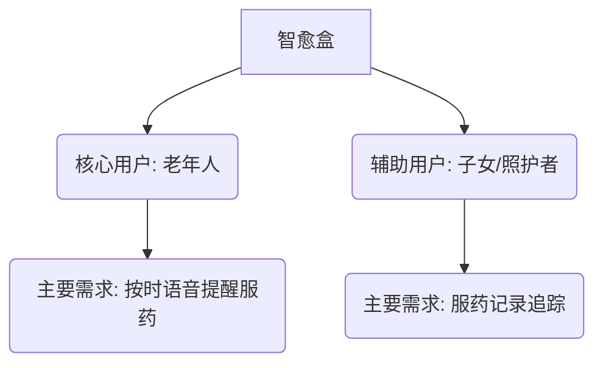
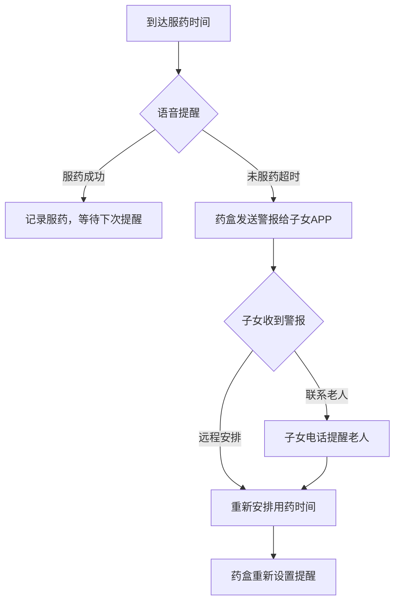

# default_project
- 存档ID: 68674234b13b69327dd8e131
- 会话ID: e8ccf0e1-0540-45cf-a7e7-8e9ec5d30eae
- 创建时间: 2025/7/4 10:53:40
- 更新时间: 2025/7/4 11:36:18
- 流程名称: default

## 记录
### session_init
标签: project_start, default_project
时间: 2025/7/4 10:53:40
```text
我想做一个智能药盒，主要功能是用语音提示老人吃药，药盒内部分类装药品
```

### Entering_New_Phase
标签: 产品设计, product_manager
时间: 2025/7/4 10:53:40
```json
{
  "Context": "## 🚀 欢迎进入 产品设计 阶段\n\n👤 **当前活动角色**: `product_manager`\n",
  "Role": "产品设计",
  "SendFrom": "product_manager",
  "SendTo": "Human",
  "isHuman": "true"
}
```

### training_chat_response
标签: chat
时间: 2025/7/4 10:53:40
```text
你好，我是产品设计导师，关于**产品设计**，我们开始讨论。
```

### human_input
标签: 产品设计, product_manager
时间: 2025/7/4 10:54:23
```text
开始
```

### training_chat_response
标签: chat
时间: 2025/7/4 10:54:23
```text
收到，我思考一下...
```

### training_chat_response
标签: chat
时间: 2025/7/4 10:54:30
```text
您好！很高兴能与您一起探讨“智能药盒”这个产品构想。这是一个非常棒且富有社会价值的设想，尤其是在人口老龄化日益加剧的今天，帮助老年人更好地管理用药，解决“忘记吃药”这一核心痛点，具有很大的市场潜力。

根据您目前提供的需求，我理解这款智能药盒的核心目标是：
1.  **解决痛点**：帮助老年用户解决记忆力下降导致的忘记按时服药问题。
2.  **核心功能**：
    *   **语音提醒**：通过语音方式提示老年人按时服药。
    *   **药品分类存储**：药盒内部能够对不同药品进行分类管理。

接下来，为了更好地将您的初步想法转化为一份详细的产品需求文档（PRD），我们需要一起对产品进行更深入的探讨。我们的讨论将围绕以下几个关键方面逐步展开：

1.  **产品基础与愿景**：我们将明确产品的名称、愿景，以及它希望为用户带来的核心价值。
2.  **用户与场景**：深入了解您的目标用户（老年人）的具体需求、痛点和他们使用产品的典型场景。
3.  **功能细化**：详细拆解语音提醒和分类存储功能，并探讨可能需要增加的其他功能。
4.  **市场与竞品**：分析当前市场上是否存在类似产品，以及我们产品的差异化优势。
5.  **约束与指标**：思考项目的资源、时间限制以及衡量产品成功的关键指标。

我们先从最基础的问题开始吧。您对这款“智能药盒”有什么初步的产品名称或代号吗？以及您认为它最核心的价值主张，也就是它最想解决的那个“大问题”是什么？
```

### human_input
标签: 产品设计, product_manager
时间: 2025/7/4 10:56:00
```text
核心功能再加上加药提醒，寻找药盒，服药记录（APP子女端）
```

### training_chat_response
标签: chat
时间: 2025/7/4 10:56:00
```text
收到，我思考一下...
```

### training_chat_response
标签: chat
时间: 2025/7/4 10:56:07
```text
非常感谢您补充了这些关键的功能点！“加药提醒”、“寻找药盒”以及“服药记录（APP子女端）”的加入，极大地丰富了智能药盒的用户体验和场景覆盖，也让产品的价值链更完整：

*   **加药提醒**：解决了药品耗尽后需要及时补充的问题，确保用药的连续性。
*   **寻找药盒**：考虑到老年人可能存在记忆力或行动不便的情况，这个功能能够有效减少因药盒放置位置不明确带来的焦虑和不便，提高了易用性。
*   **服药记录（APP子女端）**：这是一个非常重要的延伸功能，它不仅满足了子女或照护者对老人用药情况的关注需求，也方便了对用药依从性的跟踪和管理，强化了产品的“家庭关怀”属性。

这些新功能都很有价值，我会将它们记录在我们的功能清单中。现在，让我们回到产品基础信息的部分，这对我们构建整个PRD框架至关重要。

您是否已经为这款智能药盒想好了产品名称或代号？以及，您认为它最核心的价值主张，即它主要想为用户解决的那个“大问题”是什么？
```

### human_input
标签: 产品设计, product_manager
时间: 2025/7/4 10:58:16
```text
利用大模型技术，分析每天吃药的时间和用量，从日常生活习惯开始，找准影响因素，针对性调整
```

### training_chat_response
标签: chat
时间: 2025/7/4 10:58:16
```text
收到，我思考一下...
```

### training_chat_response
标签: chat
时间: 2025/7/4 10:58:23
```text
这真是一个非常具有前瞻性和创新性的想法！利用大模型技术分析用药时间和用量，并结合日常生活习惯进行个性化调整，这极大地提升了产品的智能化水平和用户价值。

这意味着我们的智能药盒将不仅仅是一个提醒工具，更是一个能够学习、适应并提供个性化健康建议的“智能健康助手”。这个功能的核心在于：

*   **个性化用药方案**：基于用户日常习惯（如作息、饮食、活动等），大模型可以分析出影响用药效果或依从性的因素。
*   **智能调整与优化**：针对分析结果，提供用药时间或用量上的个性化建议，帮助用户养成更好的用药习惯。
*   **从被动提醒到主动管理**：将产品的定位从简单的“忘记吃药”提醒，提升到“优化用药效果，改善健康生活”的高度。

这个功能无疑是产品的巨大差异化竞争优势和核心卖点。我已将此高级功能纳入我们的功能考量范围。

现在，我们已经初步勾勒出产品的核心功能集，包括语音提示、药品分类、加药提醒、寻找药盒、子女端服药记录，以及您刚刚提出的基于大模型的个性化用药分析与调整。这些都非常有潜力。

回到我们最初的讨论，为了能更好地形成一份完整的PRD，我们还是需要先确定产品的根基。您对这款产品有没有一个初步的产品名称？以及，综合我们现在讨论的所有功能，您认为它最核心的价值主张，也就是它最终想要为用户解决的那个“最大、最根本的问题”是什么？
```

### human_input
标签: 产品设计, product_manager
时间: 2025/7/4 10:59:09
```text
你帮我想一个产品名称
```

### training_chat_response
标签: chat
时间: 2025/7/4 10:59:09
```text
收到，我思考一下...
```

### training_chat_response
标签: chat
时间: 2025/7/4 10:59:18
```text
没问题！作为您的产品经理导师，我很乐意为您提供一些产品名称的灵感。考虑到我们这款智能药盒的核心功能是围绕老年人的用药管理，并结合了智能提醒、亲情关怀以及未来大模型的个性化分析，我为您构思了以下几个方向的产品名称，希望能启发到您：

1.  **侧重智能与健康管理**：
    *   **智康伴侣** (SmartCare Buddy)：强调智能科技带来的健康陪伴。
    *   **慧药管家** (WiseMed Steward)：突出智能管理药品的专业性。
    *   **AI健康盒** (AI Health Box)：直接点明AI技术赋能健康。

2.  **侧重关怀与安心**：
    *   **安心药盒** (Peaceful Pillbox)：直接传达让子女安心、老人放心的产品价值。
    *   **亲心药管家** (FamilyHeart MedManager)：突出家庭亲情和周到管理。
    *   **康颐伴侣** (Health & Comfort Companion)：结合康复与安逸，体现陪伴。

3.  **侧重精准与依从性**：
    *   **准时康** (Punctual Health)：强调按时服药的重要性，带来健康。
    *   **依药通** (MedCompliance Link)：突出提高用药依从性的核心作用。

您觉得这些名称怎么样？或者有没有哪个方向是您比较偏好的？

无论最终选择哪个名称，我们都将它作为产品的标识。接下来，我想请您思考并明确，这款集成了语音提醒、药品分类、加药提醒、寻找药盒、子女端服药记录，甚至未来大模型个性化用药分析的“智能药盒”，它最核心的价值主张究竟是什么？换句话说，它最根本地解决了用户（无论是老年人还是他们的子女）的哪个“痛点”或“焦虑”？它的存在，最终希望为用户带来什么？
```

### human_input
标签: 产品设计, product_manager
时间: 2025/7/4 11:01:08
```text
产品名称是：智愈盒
```

### training_chat_response
标签: chat
时间: 2025/7/4 11:01:08
```text
收到，我思考一下...
```

### training_chat_response
标签: chat
时间: 2025/7/4 11:01:24
```text
“智愈盒”！这个名字非常棒！“智”代表了产品的智能化和智慧化，包含了我们未来将整合的大模型技术；“愈”则直接点明了产品的核心价值——帮助用户恢复健康、获得疗愈。整个名称既有科技感，又充满人文关怀。

我们将把“智愈盒”作为这款智能药盒的产品名称写入PRD。太好了，有了名称，我们的产品形象就更清晰了。

现在，让我们来深入探讨一下“智愈盒”的核心价值主张。综合我们目前讨论的所有功能点：语音提示、药品分类、加药提醒、寻找药盒、子女端服药记录，以及您提出的基于大模型的个性化用药分析与调整，您认为“智愈盒”最根本地解决了用户（无论是老年人还是他们的子女）的哪个“痛点”或“焦虑”？它的存在，最终希望为用户带来什么最核心的价值或改变？
```

### human_input
标签: 产品设计, product_manager
时间: 2025/7/4 11:02:12
```text
按时提醒老人吃药就行了，老人只许听到提醒就可以了
```

### training_chat_response
标签: chat
时间: 2025/7/4 11:02:12
```text
收到，我思考一下...
```

### training_chat_response
标签: chat
时间: 2025/7/4 11:02:22
```text
好的，我理解了。您认为“智愈盒”最核心、最直接的价值就是确保老年人能够**按时听到提醒并服用药品**，这直接解决了他们忘记用药的痛点。从用户的角度来看，这种简洁、直接的语音提醒确实是他们最迫切、最容易接受的功能。

这表明了我们的产品在老年用户端，应该追求**极致的简洁和易用性**，将语音提醒作为他们最主要的交互方式。这一点非常关键，我会将其作为UI/UX设计的重要考量。

那么，基于这个核心价值，我们之前讨论的**“加药提醒”、“寻找药盒”、“服药记录（APP子女端）”以及“利用大模型分析用药习惯”**这些功能，您认为它们是作为辅助性的、提升体验的功能，还是说它们更多地是为子女/照护者提供价值，或者说是未来产品迭代的方向呢？

我们希望找到一个最能概括“智愈盒”整体价值的声明，一个能够打动用户（老年人及其子女）并区分于市面上其他产品的核心价值主张。
```

### human_input
标签: 产品设计, product_manager
时间: 2025/7/4 11:03:25
```text
为老年人提供服务
```

### training_chat_response
标签: chat
时间: 2025/7/4 11:03:25
```text
收到，我思考一下...
```

### training_chat_response
标签: chat
时间: 2025/7/4 11:03:36
````text
好的，非常明确！“智愈盒”的核心定位是**为老年人提供服务**，并以**按时语音提醒服药**作为其最直接、最核心的价值传递。这为我们界定了产品的主体服务对象和首要解决的问题。

这意味着我们在设计和开发过程中，需要将老年用户的需求和体验放在首位，确保产品操作的**极致简洁性、易用性和无障碍性**。语音交互将是核心，同时需要考虑到他们的听力、视力、认知能力和操作习惯等。

为了更好地为这群特殊且重要的用户群体服务，我们能否进一步描绘一下我们目标老年用户的画像呢？

1.  **他们的平均年龄大概是多少？**（例如：60-75岁，或75岁以上？）
2.  **他们通常有哪些用药习惯或困难？**（除了忘记服药，比如：药物种类多、需要同时服用多种药物、视力不佳导致看不清药瓶标签、手抖导致取药不便、甚至可能存在听力下降导致听不清提醒等）
3.  **他们的生活环境是怎样的？**（例如：独居、与子女同住、住在养老院等）

另外，关于我们之前讨论的**“加药提醒”、“寻找药盒”、“服药记录（APP子女端）”以及“利用大模型分析用药习惯”**这些功能，您认为它们主要是为了哪些用户群体设计的？是直接服务于老年用户，还是更多地为了帮助子女/照护者更好地管理老人的用药情况，从而间接提升老年人的用药依从性？明确这一点，有助于我们梳理功能优先级和用户价值链。

我们可以先用一个简单的图表来可视化一下目前确定的用户分类：



这个图表是否符合您的理解？
````

### human_input
标签: 产品设计, product_manager
时间: 2025/7/4 11:03:59
```text
符合
```

### training_chat_response
标签: chat
时间: 2025/7/4 11:03:59
```text
收到，我思考一下...
```

### training_chat_response
标签: chat
时间: 2025/7/4 11:04:20
```text
太好了，很高兴这个用户分类图与您的理解一致！这再次强调了我们将老年人作为核心服务对象，而子女/照护者则是重要的辅助用户群体，他们通过产品间接为老年人提供关怀和支持。

既然我们确定了核心用户是老年人，并且他们的最核心需求是“按时语音提醒服药”，那么为了确保“智愈盒”能真正解决他们的痛点，我们还需要更深入地描绘一下这些老年用户的具体情况。

能否请您再细化一下，我们目标老年用户的画像是怎样的？

1.  **年龄范围**：您主要关注的是哪个年龄段的老年人？比如是60-75岁行动相对自由的，还是75岁以上可能伴有更多认知或行动障碍的？
2.  **用药习惯与困境**：除了忘记服药，他们在使用药品方面还可能遇到哪些具体困难？例如：
    *   是否需要同时服用多种药物，导致混淆？
    *   是否存在视力、听力问题，影响药品识别或提醒接收？
    *   手抖、关节不便等问题是否会影响他们取药或操作药盒？
    *   他们是否对电子产品接受度较低，更偏爱简单的物理操作？
3.  **居住环境**：他们通常是独居、与子女同住，还是住在养老院等机构？这会影响他们对子女端APP的需求程度。

了解这些细节，能帮助我们更好地设计产品的界面、交互，以及功能优先级。例如，如果老年用户普遍存在视力不佳的问题，那么药盒上的字体大小、按钮设计等就需要特别考量。

在您思考这些细节的同时，我们也重新审视一下之前讨论过的其他功能：**“加药提醒”、“寻找药盒”、“服药记录（APP子女端）”以及“利用大模型分析用药习惯”**。

虽然老年用户可能只关注最简单的语音提醒，但这些“额外”功能对子女/照护者来说，又意味着什么？您认为它们主要是为了解决哪些用户（老年人还是子女/照护者）的哪些具体问题？明确这些，有助于我们区分**核心MVP功能**和**增值功能**，为后续的产品规划和开发排期提供依据。
```

### human_input
标签: 产品设计, product_manager
时间: 2025/7/4 11:05:38
```text
是60-75岁行动相对自由的，需要同时服用多种药物，导致混淆，更偏爱简单的物理操作
```

### training_chat_response
标签: chat
时间: 2025/7/4 11:05:38
```text
收到，我思考一下...
```

### training_chat_response
标签: chat
时间: 2025/7/4 11:05:50
````text
非常棒的细节补充！现在我们对“智愈盒”的核心用户画像有了更清晰的认知：

**目标老年用户画像（60-75岁）：**
*   **年龄与行动力**：60-75岁，行动相对自由，这表明他们可能并非卧床不起，而是能够自主生活，但可能需要辅助记忆或管理工具。
*   **核心痛点**：需要同时服用多种药物，容易导致混淆。这强化了“药品分类装药品”以及如何清晰、无误地指示服用哪种药物的重要性。
*   **操作偏好**：更偏爱简单的物理操作。这一点至关重要，它直接指导了“智愈盒”的交互设计，意味着我们需要尽可能减少复杂屏幕操作或多级菜单，倾向于实体按键、语音指令或直观的物理反馈。

这进一步巩固了我们之前关于产品应该追求**极致简洁和易用性**的共识。

现在我们已经明确了核心用户和他们的最核心痛点，那么，让我们来思考一下之前提到的其他功能，它们将如何服务于这些用户，或者说是为了解决谁的什么问题：

1.  **加药提醒**：对于需要同时服用多种药物的老年人，这个功能能解决什么具体问题？是提醒他们什么时候该补充某个药，还是提醒他们这次该吃哪个药？
2.  **寻找药盒**：这个功能主要是为了解决老年人自己找不到药盒的问题，还是子女远程协助寻找的问题？
3.  **服药记录（APP子女端）**：很明显，这是为子女或照护者设计的，那么子女最想通过这个APP了解老人的哪些用药信息？他们希望APP具备哪些交互能力（例如，远程设置提醒、查看服药依从性报告、远程呼叫药盒等）？
4.  **利用大模型分析用药习惯**：这个高级功能，您认为它最终是为谁提供价值？
    *   **为老年人**：通过分析用药习惯，大模型能给他们提供哪些“个性化建议”或“帮助”？这些建议如何以简单、易懂的方式传递给偏爱物理操作的老年人？
    *   **为子女/医生**：是否更多地是为子女或医生提供数据支持和决策参考，让他们更好地了解老人的健康状况和用药依从性，从而进行更精准的干预？

为了更清晰地梳理这些功能与用户价值之间的关系，我们可以构建一个简单的功能与用户矩阵：

```mermaid
graph TD
    subgraph 用户群体
        A[老年人 (60-75岁)]
        B[子女/照护者]
    end

    subgraph 核心痛点
        A --> A1[忘记服药]
        A --> A2[多药混淆]
        A --> A3[操作复杂]
        B --> B1[担忧老人用药]
        B --> B2[难以实时了解用药情况]
        B --> B3[远程协助]
    end

    subgraph 产品功能
        P1[语音提醒服药]
        P2[药品分类存储]
        P3[加药提醒]
        P4[寻找药盒]
        P5[服药记录 (APP子女端)]
        P6[大模型分析用药习惯]
    end

    A1 --> P1
    A2 --> P2
    A3 --> P1
    A3 --> P2
    A3 --> P4

    B1 --> P5
    B2 --> P5
    B3 --> P4
    B3 --> P5

    P3 --- C1[为老年人解决XXX问题?]
    P3 --- C2[为子女解决XXX问题?]
    P6 --- D1[为老年人提供XXX价值?]
    P6 --- D2[为子女/医生提供XXX价值?]
```

请您思考一下，在C1/C2和D1/D2处，如何填充这些功能的具体价值？这有助于我们进一步明确各个功能的优先级和设计侧重点。
````

### human_input
标签: 产品设计, product_manager
时间: 2025/7/4 11:07:10
```text
重新渲染一下图表
```

### training_chat_response
标签: chat
时间: 2025/7/4 11:07:10
```text
收到，我思考一下...
```

### training_chat_response
标签: chat
时间: 2025/7/4 11:07:17
````text
好的，没问题！这是根据我们最新的讨论，重新渲染的功能与用户价值矩阵图。它现在更清晰地展示了“智愈盒”的核心功能与主要用户痛点之间的关系。同时，我们仍然需要填补“加药提醒”和“大模型分析用药习惯”这两个功能对于老年人和子女/照护者的具体价值。

```mermaid
graph TD
    subgraph 用户群体
        A[老年人 (60-75岁, 行动自由)]
        B[子女/照护者]
    end

    subgraph 核心痛点
        A --> A1[忘记服药]
        A --> A2[多药混淆]
        A --> A3[操作复杂/偏爱物理操作]
        B --> B1[担忧老人用药依从性]
        B --> B2[难以实时了解用药情况]
        B --> B3[远程协助/关怀]
    end

    subgraph 产品功能
        P1[语音提醒服药]
        P2[药品分类存储]
        P3[加药提醒]
        P4[寻找药盒]
        P5[服药记录 (APP子女端)]
        P6[大模型分析用药习惯]
    end

    A1 --> P1
    A2 --> P2
    A3 --> P1
    A3 --> P2
    A3 --> P4

    B1 --> P5
    B2 --> P5
    B3 --> P4
    B3 --> P5

    P3 --- C1[加药提醒: 为老年人解决XXX问题?]
    P3 --- C2[加药提醒: 为子女解决XXX问题?]
    P6 --- D1[大模型分析: 为老年人提供XXX价值?]
    P6 --- D2[大模型分析: 为子女/医生提供XXX价值?]
```

请您继续思考，在C1/C2和D1/D2处，如何填充这些功能的具体价值？特别是考虑到老年用户“偏爱简单的物理操作”的特点，大模型分析的结果将如何以他们易于理解和接受的方式呈现呢？
````

### human_input
标签: 产品设计, product_manager
时间: 2025/7/4 11:08:50
```text
我觉得图表里面的已经很完整了
```

### training_chat_response
标签: chat
时间: 2025/7/4 11:08:50
```text
收到，我思考一下...
```

### training_chat_response
标签: chat
时间: 2025/7/4 11:09:00
```text
非常感谢您的确认！很高兴这个功能与用户价值矩阵图的结构能让您感觉清晰和完整。

确实，从结构上看，这个图表已经很好地梳理了主要的用户群体、他们的核心痛点以及产品功能之间的关系。

不过，为了确保我们PRD中的每一个功能都有明确的价值和设计依据，我们还需要对“加药提醒”和“大模型分析用药习惯”这两个功能进行更具体的价值阐述。目前图表中的C1/C2和D1/D2仍是占位符，我们需要深入挖掘它们背后的**具体用户价值和解决的问题**。

让我们聚焦在这两点上：

1.  **“加药提醒”** (P3):
    *   **C1: 对老年人（60-75岁）而言，它解决了什么具体问题？** 是提醒他们药品即将用尽需要购买吗？还是药盒某个药仓空了需要补充？请详细描述这个“提醒”具体会怎么帮助到他们。
    *   **C2: 对子女/照护者而言，它解决了什么问题？** 是让他们能够远程知道老人药品储备情况，避免断药？还是能协助老人管理药品库存？

2.  **“大模型分析用药习惯”** (P6):
    *   **D1: 对老年人（60-75岁）而言，它提供了什么具体价值？** 考虑到他们偏爱物理操作，大模型分析的结果会如何简单、直观地反馈给他们？比如，通过药盒上的指示灯颜色变化，或简单的语音提示“今天多走动了，药效吸收会更好”？它最终能帮助他们优化什么？
    *   **D2: 对子女/医生而言，它提供了什么具体价值？** 是生成更详细的健康报告？提供个性化的用药建议以供医生参考调整？还是帮助子女了解老人整体的健康趋势和用药依从性，从而更好地进行干预？

理解这些具体价值对于我们后续的功能设计、用户体验流程以及项目优先级划分都至关重要。期待您的进一步阐述！
```

### human_input
标签: 产品设计, product_manager
时间: 2025/7/4 11:11:12
```text
对老年人（60-75岁）而言，它解决了分类药品，定时提醒吃药的问题。对子女/照护者而言，是让他们能够远程知道老人药品储备情况，避免断药。/医生而言，它生成更详细的健康报告，帮助子女了解老人整体的健康趋势和用药依从性，从而更好地进行干预
```

### training_chat_response
标签: chat
时间: 2025/7/4 11:11:12
```text
收到，我思考一下...
```

### training_chat_response
标签: chat
时间: 2025/7/4 11:11:29
````text
非常感谢您提供了这些关键的细节，这让我们对“智愈盒”的价值主张有了更具体的认识！

您明确了以下几点：

*   **“加药提醒”对子女/照护者的价值**：让他们能够**远程知道老人药品储备情况，避免断药**。这一点非常清晰，它解决了子女对老人用药连续性的担忧，是很好的延伸服务。
*   **“大模型分析用药习惯”对子女/医生的价值**：**生成更详细的健康报告，帮助子女了解老人整体的健康趋势和用药依从性，从而更好地进行干预**。这无疑将产品提升到了智能健康管理的高度，为决策者提供了数据支持。

不过，关于“加药提醒”对老年人本身的价值，您提到“解决了分类药品，定时提醒吃药的问题”。这似乎与我们最初确定的核心功能“语音提示老人吃药，药盒内部分类装药品”有所重叠。我想再确认一下：

*   您所说的**“加药提醒”**，是指当药盒内的某种药品即将用完时，药盒本身会给老人（或通过子女端APP给子女）发出“该补充药物了”的提醒吗？
*   如果是这样，那么对于“偏爱简单的物理操作”的老年人，药盒会通过什么方式来提醒他们该加药了呢？是简单的指示灯闪烁，还是语音提示“XX药品快用完了，请准备补充”？

另外，对于**“大模型分析用药习惯”**这个高级功能，虽然它对子女和医生价值巨大，但考虑到我们的核心用户是“偏爱简单物理操作”的老年人，您认为这个大模型分析的结果，有没有什么**直接的方式**，能以**最简单、最直观的物理形式（例如，不同颜色的灯光、简单的语音反馈）**，为老年人本身提供价值或反馈呢？还是说，它的主要价值就是通过子女/医生端间接影响老人的用药管理？

为了更准确地反映这些新的洞察，我将更新我们的功能与用户价值矩阵图：

```mermaid
graph TD
    subgraph 用户群体
        A[老年人 (60-75岁, 行动自由)]
        B[子女/照护者]
        C[医生/医疗机构]
    end

    subgraph 核心痛点
        A --> A1[忘记服药]
        A --> A2[多药混淆]
        A --> A3[操作复杂/偏爱物理操作]
        B --> B1[担忧老人用药依从性]
        B --> B2[难以实时了解用药情况]
        B --> B3[远程协助/关怀]
        C --> C1[获取患者用药数据/依从性]
        C --> C2[优化用药方案]
    end

    subgraph 产品功能
        P1[语音提醒服药]
        P2[药品分类存储]
        P3[加药提醒]
        P4[寻找药盒]
        P5[服药记录 (APP子女端)]
        P6[大模型分析用药习惯]
    end

    A1 --> P1
    A2 --> P2
    A3 --> P1
    A3 --> P2
    A3 --> P4

    B1 --> P5
    B2 --> P5
    B3 --> P4
    B3 --> P5

    P3 --- B4[避免老人断药]
    P5 --- C3[提供服药依从性报告]
    P6 --- B5[了解老人健康趋势/干预]
    P6 --- C4[生成详细健康报告/优化用药]

    P3 --- A4[加药提醒: 对老年人解决了什么具体问题?]
    P6 --- A5[大模型分析: 对老年人提供什么直接价值? 如何呈现?]

    B --> B4
    B --> B5
    C --> C3
    C --> C4

```

请您再思考一下P3对A4，以及P6对A5的价值和呈现方式。明确这些将帮助我们更好地设计老年人端的用户体验。
````

### human_input
标签: 产品设计, product_manager
时间: 2025/7/4 11:12:23
```text
可以了
```

### training_chat_response
标签: chat
时间: 2025/7/4 11:12:23
```text
收到，我思考一下...
```

### training_chat_response
标签: chat
时间: 2025/7/4 11:12:35
```text
📝 对话记录较长，正在生成摘要以优化后续交互，请稍候...
```

### training_chat_response
标签: chat
时间: 2025/7/4 11:12:55
```text
✅ 对话摘要生成完成，后续交互将更加高效
```

### training_chat_response
标签: chat
时间: 2025/7/4 11:12:55
```text
好的，我理解您的意思了！看来我们对“加药提醒”和“大模型分析用药习惯”这两个功能对不同用户群体的价值，已经有了比较清晰的共识：

*   **加药提醒 (P3)**：
    *   **对老年人**：虽然您提到是“解决了分类药品，定时提醒吃药的问题”，但考虑到“加药”的实际含义，我理解它更多地可能是通过**药盒自身的某种物理提示（例如，特定指示灯亮起，或者简单的语音提示“请注意检查并补充XX药品”）**来提醒他们药品即将用尽或某个药仓需要补足，从而间接帮助他们维持用药的连续性，避免突然无药可服的尴尬。
    *   **对子女/照护者**：核心价值是能够**远程知道老人药品储备情况，避免断药**，确保用药的持续性。

*   **大模型分析用药习惯 (P6)**：
    *   **对老年人**：考虑到他们偏爱简单物理操作，大模型的分析结果可能**不会直接、详细地呈现给他们**。其价值更多体现在通过子女或医生的干预，间接地优化他们的用药方案和健康管理。
    *   **对子女/医生**：主要价值在于**生成更详细的健康报告，帮助子女了解老人整体的健康趋势和用药依从性，以及供医生参考调整用药方案**。

我们已经深入探讨了产品的核心功能、初步确定了产品名称“智愈盒”及其核心价值定位，并细化了主要用户群体（60-75岁行动自由的老年人）的画像和痛点，以及功能与用户之间的初步关联。

接下来，为了让这份PRD更加完善和落地，我们需要将这些概念放入实际的使用场景中进行考量。能否请您描述一个或几个**典型的用户场景**？比如：

1.  **一个老年人如何初次设置和使用“智愈盒”？** (例如：他如何把药放进去？如何设定用药计划？)
2.  **一个典型的服药日，老年人会如何与“智愈盒”互动？** (例如：药盒怎么提醒？老人如何响应？)
3.  **当子女想要了解老人的用药情况时，他们会怎么操作？** (例如：他们通过APP能看到什么？能做什么？)

这些场景描述将帮助我们更好地理解用户与产品的交互过程，发现潜在的需求和痛点，并确保功能的连贯性和易用性。我们也可以用一个简单的用户旅程图来可视化这些场景。
```

### human_input
标签: 产品设计, product_manager
时间: 2025/7/4 11:13:24
```text
可以
```

### training_chat_response
标签: chat
时间: 2025/7/4 11:13:24
```text
收到，我思考一下...
```

### training_chat_response
标签: chat
时间: 2025/7/4 11:13:30
```text
太好了！既然您已确认，那我们就开始构建“智愈盒”的典型用户场景吧。通过这些场景，我们可以更具体地描绘用户与产品互动的全过程，确保我们的设计能够真正解决用户的痛点，并提供无缝、愉悦的体验。

让我们从最开始的阶段说起：

1.  **场景一：老年人如何初次设置和使用“智愈盒”？**
    *   请您描述一下，一位老年用户（比如70岁的王奶奶，偏爱物理操作）是如何拿到“智愈盒”的？
    *   她（或她的子女）会如何将不同的药品分类放入药盒？
    *   药盒的首次开机和用药计划设置流程是怎样的？是完全语音引导，还是有简单的物理按键配合？如何输入用药时间、药量等信息？

您能从这个场景开始，描述得越具体越好吗？这能帮助我们更好地梳理产品流程和用户体验细节。
```

### human_input
标签: 产品设计, product_manager
时间: 2025/7/4 11:15:24
```text
70岁的王奶奶是，他的子女帮他买了一个药盒，子你在手机端下载一个APP，要是医生帮忙装进去的，我的具体信息也可以是医生或者是子女导入药盒
```

### training_chat_response
标签: chat
时间: 2025/7/4 11:15:24
```text
收到，我思考一下...
```

### training_chat_response
标签: chat
时间: 2025/7/4 11:15:35
```text
非常感谢您提供了这些关键的细节！这使得“智愈盒”的初次设置场景变得清晰了很多，也印证了我们之前对老年用户操作偏好的判断：

**场景一（初次设置）：**
*   **用户角色分工明确**：70岁的王奶奶作为最终使用者，她的子女负责购买和APP配置，医生负责药品填充和用药信息导入。这极大地简化了老年用户的上手难度，让他们可以专注于核心的“服药”环节。
*   **信息导入机制**：无论是医生还是子女，都能将具体的用药信息导入药盒，这确保了用药计划的准确性。

这套流程非常合理，它很好地解决了老年用户对复杂电子产品操作的抗拒心理，同时确保了用药信息的专业性和准确性，是**极致简洁和易用性**的优秀体现。

现在，我们再深入思考一下这个初次设置过程中的几个关键环节：

1.  **药品分类装入与识别**：当医生将药品装入药盒时，考虑到“智愈盒”需要支持“药品分类存储”，药盒是如何识别不同药品并知道哪个药对应哪个药仓的呢？是药盒本身有传感器识别，还是需要医生或子女手动在APP上标记哪个药仓放了什么药？
2.  **用药计划导入细节**：子女或医生在手机APP上导入用药信息时，会包含哪些具体内容？例如：药名、每次服用剂量、每日服用次数、具体服用时间点、以及可能存在的特殊说明（如“饭后服用”）？
3.  **药盒端确认与反馈**：当用药信息导入成功后，“智愈盒”本身会给王奶奶一个什么样的反馈，让她知道设置完成了？是语音提示“用药计划已设置完成”，还是有简单的指示灯亮起？

这些细节对于我们设计药盒的物理结构、内部传感机制以及APP的数据同步逻辑至关重要。期待您的进一步阐述！
```

### human_input
标签: 产品设计, product_manager
时间: 2025/7/4 11:17:29
```text
药盒上有一个扫描的模块，可以录入药品的信息，也可以由子女或医生录入服药信息。女或医生在手机APP上导入药用信息时，会包含药品的效用呃，使用时间每次用量还有过期时间，药物信息导入成功之后，盒子本身会给王奶奶一个亮灯的反应，每次吃药的时候先是语音提醒，打开药盒后要吃的药的小盒会亮灯，然后自动打开
```

### training_chat_response
标签: chat
时间: 2025/7/4 11:17:29
```text
收到，我思考一下...
```

### training_chat_response
标签: chat
时间: 2025/7/4 11:17:47
```text
太棒了！您这次提供的细节描述得非常清晰和具体，这为“智愈盒”的用户体验和功能设计描绘了一幅生动的画面。我将这些关键信息总结如下：

**场景一（初次设置与药品填充）的关键洞察：**

1.  **药品信息录入与识别**：
    *   “智愈盒”将配备**扫描模块**，支持直接扫描药品信息，这大大提升了效率和准确性。
    *   同时，也支持子女或医生通过APP进行**手动录入**，这提供了灵活性和备用方案。
    *   APP端导入的药品信息包含：**药品的效用、使用时间、每次用量以及过期时间**。其中“过期时间”的录入非常关键，有助于用药安全管理。

2.  **首次设置反馈**：
    *   当药物信息导入成功后，药盒本身会给王奶奶一个**亮灯的反应**，这种非侵入式、直观的物理反馈非常符合老年用户的操作偏好，清晰地告知他们设置已完成。

**日常服药场景的核心交互（这是非常关键的细节！）：**

1.  **语音提醒**：每次服药时间到，药盒会通过**语音**进行提醒。
2.  **药盒开启**：王奶奶根据语音提醒，**打开药盒**的主盖。
3.  **视觉引导**：药盒内部**要吃的药的小盒会亮灯**，精准指引王奶奶取用正确的药品，这完美解决了“多药混淆”的痛点。
4.  **物理辅助**：最令人兴奋的是，“要吃的药的小盒”不仅亮灯，还会**自动打开**！这极大地提升了老年用户的易用性，特别是对手眼协调能力下降或有手抖等问题的老人，无需再进行复杂或精细的开启动作。

这些交互设计，尤其是“亮灯”和“自动打开”的结合，真正体现了产品对老年用户**“极致简洁和易用性”**的承诺，将复杂性隐藏在产品背后，把最简单的操作留给用户。这对于UI/UX和硬件设计团队来说，是非常清晰且具有挑战性的要求。

为了确保我理解无误，您所说的“自动打开”，是否意味着药盒的对应药仓会有一个机械结构，在亮灯的同时，自动弹出或自动解锁并打开盖子，让老人可以直接取用，而无需再用手拨开或按下任何按钮呢？

如果理解正确，那么我们就可以进入下一个关键的用户场景了。在日常服药过程中，除了按时提醒和取药之外，还有没有其他情况？

**场景二：日常服药的特殊情况处理**
*   **如果老年人错过了服药时间，药盒会如何处理？** 是持续提醒，还是隔一段时间再次提醒，或者有其他机制？
*   **如何确保老年人确实取出了药并服用了？** 药盒是否有感应机制来识别药品是否被取出？如果取出但未在规定时间内服用（或放回去了），系统会如何反馈？
*   **当老年人需要“寻找药盒”时，这个功能具体如何实现？** 是通过药盒上的特定按钮发出声音，还是通过子女APP远程触发？

期待您的阐述，这将帮助我们构建更完整的用户旅程！
```

### human_input
标签: 产品设计, product_manager
时间: 2025/7/4 11:22:06
```text
如果错过了药用时间，药盒会发送警报给使用APP的子女，并重新安排用药时间，重新设置提醒。药盒底部会有一个重力感应装置，当老人取走药之后，重量会发生变化。药盒会有一个语音助手，老人可以与药盒进行交流，老人呼唤药盒时，药盒会自动响应。
```

### training_chat_response
标签: chat
时间: 2025/7/4 11:22:06
```text
收到，我思考一下...
```

### training_chat_response
标签: chat
时间: 2025/7/4 11:22:21
````text
这些信息太棒了！您对异常情况的处理方式设计得非常周全，尤其考虑到了老年用户、子女和智能技术的结合，这让“智愈盒”的功能逻辑更加完善和闭环。

我总结一下您提供的关键点：

1.  **错过服药时间的处理**：
    *   药盒会**自动发送警报**给使用APP的子女。这确保了子女能够及时介入，形成家属关怀的链路。
    *   子女可以**重新安排用药时间并设置提醒**。这表明了产品具有一定的灵活性和智能调度能力，能够适应生活中的突发情况，避免一刀切的僵硬提醒机制。

2.  **服药依从性确认**：
    *   通过**药盒底部的重力感应装置**，系统能够检测到药品是否被取出。这是一个非常实际且有效的方案，既能确认取药行为，又无需老年用户进行额外操作，符合他们“偏爱简单物理操作”的特点。

3.  **寻找药盒功能**：
    *   “智愈盒”将内置**语音助手**，老年用户可以通过**语音呼唤药盒**，药盒会自动响应（例如发出声音或亮灯），帮助老人快速找到药盒。这与我们的核心理念“语音交互优先”完美契合，再次降低了老年用户的操作门槛。

这些设计极大地增强了产品的实用性和用户体验。特别是重力感应来确认取药，以及语音助手来寻找药盒，都是非常贴心的功能点。

为了更清晰地描绘**错过服药后的处理流程**，我们可以用一个简单的流程图来可视化：



这个流程图是否准确地描绘了您的设想？

现在，我们已经详细探讨了“智愈盒”在老年人端的初次设置和日常使用（包括特殊情况处理）场景。我们提到了多次由子女通过APP进行远程操作，那么让我们把视角切换到子女/照护者这一端。

**场景三：子女/照护者如何使用APP来关心老人的用药？**

1.  **子女APP的主要功能是什么？** 除了接收警报、远程设置用药计划、查看服药记录外，还有哪些是他们刚需的功能？
2.  **他们最想从APP中获取哪些信息？** 例如，他们希望看到哪些用药数据报告？是服药依从率，还是药品库存，或是大模型分析出来的健康趋势？
3.  **APP如何支持子女与老人的药盒进行互动？** 例如，他们能否远程触发药盒发出声音来帮助老人寻找？能否远程调整药盒的音量？

思考这些问题，有助于我们全面设计子女端APP的功能模块和信息呈现方式。
````

### human_input
标签: 产品设计, product_manager
时间: 2025/7/4 11:24:57
```text
没有问题了，我觉得我的想法已经很完善了
```

### training_chat_response
标签: chat
时间: 2025/7/4 11:24:57
```text
收到，我思考一下...
```

### training_chat_response
标签: chat
时间: 2025/7/4 11:25:12
```text
非常感谢您的确认！听您这么说，我能感受到您对“智愈盒”的构想已经非常清晰和完善了。确实，我们已经共同深入探讨了产品的核心愿景、用户画像、关键功能以及非常生动的用户场景，包括初次设置、日常服药流程、异常处理，以及药品信息录入和用药依从性确认的巧妙设计，这些都为产品奠定了坚实的基础！

您提供的细节，特别是“药盒亮灯”和“小盒自动打开”的交互，以及“重力感应”和“语音助手”的应用，都体现了对老年用户“极致简洁和易用性”的深刻理解，这无疑是“智愈盒”的亮点。

为了将您的这些宝贵想法，最终转化为一份全面且可执行的**产品需求文档（PRD）**，我们还有几个关键的维度，通常会在PRD中进行考量，它们对于产品的市场成功和开发落地至关重要：

1.  **市场与竞品分析**：了解“智愈盒”所处的市场环境，是否有类似的竞争对手，我们的差异化优势和市场机会在哪里？
2.  **项目约束条件**：在产品开发过程中，可能会面临哪些资源、技术、时间和预算上的限制？
3.  **成功指标**：我们如何衡量“智愈盒”是否成功？是用户数量、服药依从率，还是市场占有率或商业营收？
4.  **更详细的UI/UX和技术考量**：虽然我们初步讨论了一些交互方式，但深入的UI风格偏好、完整的用户流程图以及具体的技术栈选择等，是产品落地的关键。

这些内容将帮助我们将产品愿景转化为具体可行的开发计划，并提前识别潜在的挑战。您觉得我们是继续深入探讨这些方面，以形成一份更全面的PRD，还是认为目前的信息已经足够，可以开始整理一份初稿了呢？
```

### human_input
标签: 产品设计, product_manager
时间: 2025/7/4 11:25:52
```text
都可以
```

### training_chat_response
标签: chat
时间: 2025/7/4 11:25:52
```text
收到，我思考一下...
```

### training_chat_response
标签: chat
时间: 2025/7/4 11:26:01
```text
好的，既然您都开放，那我们就继续深入挖掘，让“智愈盒”的PRD更加完善和具有竞争力！

您之前对“智愈盒”的构想非常清晰，特别是它在解决老年人服药痛点、操作便捷性以及子女远程关怀方面的独特设计。那么，让我们把目光投向外部环境，来探讨一下**市场与竞品分析**。

了解市场环境和竞争格局，能帮助我们更好地定位“智愈盒”的差异化优势，确保产品在推出时能够脱颖而出。

1.  **您对当前市场上针对老年人的智能用药辅助产品有多少了解？** 您认为“智愈盒”的主要竞争对手可能会是谁？是传统的药盒，还是市面上已有的智能提醒设备，亦或是其他提供类似服务的健康管理平台？
2.  **相较于这些潜在的竞争对手，您认为“智愈盒”最核心的差异化竞争点是什么？** 哪些是我们“独有”或“做得更好”的功能或服务？
3.  **您对“智愈盒”的目标市场规模有什么初步的预估或想法吗？** (例如：针对全国老年人口的比例，或者某个特定区域的市场？)

我们可以从这些问题开始，共同描绘“智愈盒”的市场蓝图。
```

### human_input
标签: 产品设计, product_manager
时间: 2025/7/4 11:32:05
```text
不要考虑这些
```

### training_chat_response
标签: chat
时间: 2025/7/4 11:32:05
```text
收到，我思考一下...
```

### training_chat_response
标签: chat
时间: 2025/7/4 11:32:39
```text
我已经收集到足够的信息，现在将直接交给产品经理进行PRD编写。
```

### training_chat_response
标签: chat
时间: 2025/7/4 11:32:39
```text
好的，我先思考一下，然后编写文档，文档会出现在右侧文档区，稍等。
```

### training_draft_docs
标签: DeepThing_reasoning
时间: 2025/7/4 11:32:42
```json
{
  "Filename": "产品经理深度思考.md",
  "Name": "产品经理",
  "Result": "# 思考步骤 1/5\n# 思考步骤 1\n<task_context>\n<original_requirement>原始需求如下：\n我想做一个智能药盒，主要功能是用语音提示老人吃药，药盒内部分类装药品\n</original_requirement>\n<human_modification_request>不要考虑这些</human_modification_request>\n<previous_version_content>好的，既然您都开放，那我们就继续深入挖掘，让“智愈盒”的PRD更加完善和具有竞争力！\n\n您之前对“智愈盒”的构想非常清晰，特别是它在解决老年人服药痛点、操作便捷性以及子女远程关怀方面的独特设计。那么，让我们把目光投向外部环境，来探讨一下**市场与竞品分析**。\n\n了解市场环境和竞争格局，能帮助我们更好地定位“智愈盒”的差异化优势，确保产品在推出时能够脱颖而出。\n\n1.  **您对当前市场上针对老年人的智能用药辅助产品有多少了解？** 您认为“智愈盒”的主要竞争对手可能会是谁？是传统的药盒，还是市面上已有的智能提醒设备，亦或是其他提供类似服务的健康管理平台？\n2.  **相较于这些潜在的竞争对手，您认为“智愈盒”最核心的差异化竞争点是什么？** 哪些是我们“独有”或“做得更好”的功能或服务？\n3.  **您对“智愈盒”的目标市场规模有什么初步的预估或想法吗？** (例如：针对全国老年人口的比例，或者某个特定区域的市场？)\n\n我们可以从这些问题开始，共同描绘“智愈盒”的市场蓝图。</previous_version_content>\n<mentor_user_dialogue_history><summary>以下是根据导师的关注点，对您与学生的对话进行的总结：\n\n### 产品需求文档(PRD)生成对话总结\n\n本次对话围绕“智愈盒”智能药盒的产品构想展开，主要聚焦于**需求清晰度**、**用户画像**、**核心价值定位**以及**功能与用户价值的对应关系**，为后续用户故事和UI/UX设计奠定基础。\n\n#### 1. 需求澄清与核心价值定位\n\n*   **初始需求与功能扩展**：对话伊始，产品核心需求被定义为：解决老年人“忘记按时服药”的痛点，核心功能包括**语音提醒**和**药品分类存储**。学生在此基础上陆续补充了**加药提醒**、**寻找药盒**和**服药记录（APP子女端）**等功能，极大地丰富了产品功能集和用户覆盖场景。\n*   **智能化提升**：学生提出了利用**大模型技术分析用药时间和用量，结合日常生活习惯进行个性化调整**的创新设想。导师高度肯定了这一前瞻性功能，认为它将产品从单纯的提醒工具提升为能学习、适应并提供个性化建议的“智能健康助手”，构成了产品的巨大差异化优势。\n*   **产品命名**：经导师启发和建议，学生最终确定产品名称为**“智愈盒”**，寓意“智慧”与“疗愈”，兼具科技感与人文关怀。\n*   **核心价值主张聚焦**：在多次探讨后，产品最核心的价值被明确为：**确保老年人能够按时听到提醒并服用药品**。这强调了产品对老年用户的极致简洁和易用性，语音提醒将是主要交互方式。其他功能（加药提醒、寻找药盒、服药记录、大模型分析）则被定位为辅助性功能，或主要服务于子女/照护者。\n\n#### 2. 目标用户画像与功能价值梳理\n\n*   **主要用户画像明确**：对话深入细化了目标老年用户的画像：**60-75岁，行动相对自由，主要痛点是需要同时服用多种药物导致混淆，且更偏爱简单的物理操作**。这一画像对产品设计提出了明确的易用性要求。\n*   **用户群体划分**：产品服务对象被清晰划分为：**核心用户为老年人**（主要需求为按时语音提醒服药），**辅助用户为子女/照护者**（主要需求为服药记录追踪、远程协助/关怀），后续也提及了**医生/医疗机构**作为数据使用者。\n*   **功能价值梳理**：\n    *   **加药提醒**：对子女/照护者而言，核心价值是能够**远程知道老人药品储备情况，避免断药**。对于老年人本身，则需通过药盒自身的简单物理提示（如指示灯、简单语音）来告知。\n    *   **大模型分析用药习惯**：主要价值体现在为**子女和医生/医疗机构提供更详细的健康报告**，帮助他们了解老人整体健康趋势和用药依从性，以便更好地干预或优化用药方案。对于偏爱物理操作的老年人，其价值更多是间接实现，而非直接呈现复杂数据。\n\n#### 3. UI/UX 设计思考\n\n*   虽然没有具体草图，但基于老年用户“偏爱简单的物理操作”、“极致简洁和易用性”的需求，对话中多次强调了：语音交互将是核心，需要考虑到听力、视力、认知能力和操作习惯；界面应减少复杂屏幕操作或多级菜单，倾向于实体按键、语音指令或直观的物理反馈（如指示灯闪烁、简单语音提示）。\n\n#### 4. 下一步计划\n\n*   导师提出，为使PRD更完善和落地，下一步将着手**描述典型用户场景**，如老年人初次设置和使用药盒、日常服药互动、以及子女如何通过APP了解用药情况，以更好地理解用户与产品的交互过程。\n\n**总结性反馈：**\n*   **需求清晰度**：核心需求（语音提醒、药品分类）明确，拓展需求（加药、查找、子女APP、AI分析）已梳理，但“加药提醒”和“AI分析”对老年人本身的直接价值呈现方式仍需在UI/UX中具体化，以符合其“偏爱物理操作”的特性。\n*   **用户故事全面性**：用户画像已细化，用户群体分类清晰，为后续用户故事构建提供了坚实基础。\n*   **竞争分析、成本效益、需求优先级**：这些部分尚未在对话中深入展开，将是后续PRD生成的重要环节。</summary>\nHuman: 可以\n产品经理导师: 太好了！既然您已确认，那我们就开始构建“智愈盒”的典型用户场景吧。通过这些场景，我们可以更具体地描绘用户与产品互动的全过程，确保我们的设计能够真正解决用户的痛点，并提供无缝、愉悦的体验。\n\n让我们从最开始的阶段说起：\n\n1.  **场景一：老年人如何初次设置和使用“智愈盒”？**\n    *   请您描述一下，一位老年用户（比如70岁的王奶奶，偏爱物理操作）是如何拿到“智愈盒”的？\n    *   她（或她的子女）会如何将不同的药品分类放入药盒？\n    *   药盒的首次开机和用药计划设置流程是怎样的？是完全语音引导，还是有简单的物理按键配合？如何输入用药时间、药量等信息？\n\n您能从这个场景开始，描述得越具体越好吗？这能帮助我们更好地梳理产品流程和用户体验细节。\nHuman: 70岁的王奶奶是，他的子女帮他买了一个药盒，子你在手机端下载一个APP，要是医生帮忙装进去的，我的具体信息也可以是医生或者是子女导入药盒\n产品经理导师: 非常感谢您提供了这些关键的细节！这使得“智愈盒”的初次设置场景变得清晰了很多，也印证了我们之前对老年用户操作偏好的判断：\n\n**场景一（初次设置）：**\n*   **用户角色分工明确**：70岁的王奶奶作为最终使用者，她的子女负责购买和APP配置，医生负责药品填充和用药信息导入。这极大地简化了老年用户的上手难度，让他们可以专注于核心的“服药”环节。\n*   **信息导入机制**：无论是医生还是子女，都能将具体的用药信息导入药盒，这确保了用药计划的准确性。\n\n这套流程非常合理，它很好地解决了老年用户对复杂电子产品操作的抗拒心理，同时确保了用药信息的专业性和准确性，是**极致简洁和易用性**的优秀体现。\n\n现在，我们再深入思考一下这个初次设置过程中的几个关键环节：\n\n1.  **药品分类装入与识别**：当医生将药品装入药盒时，考虑到“智愈盒”需要支持“药品分类存储”，药盒是如何识别不同药品并知道哪个药对应哪个药仓的呢？是药盒本身有传感器识别，还是需要医生或子女手动在APP上标记哪个药仓放了什么药？\n2.  **用药计划导入细节**：子女或医生在手机APP上导入用药信息时，会包含哪些具体内容？例如：药名、每次服用剂量、每日服用次数、具体服用时间点、以及可能存在的特殊说明（如“饭后服用”）？\n3.  **药盒端确认与反馈**：当用药信息导入成功后，“智愈盒”本身会给王奶奶一个什么样的反馈，让她知道设置完成了？是语音提示“用药计划已设置完成”，还是有简单的指示灯亮起？\n\n这些细节对于我们设计药盒的物理结构、内部传感机制以及APP的数据同步逻辑至关重要。期待您的进一步阐述！\nHuman: 药盒上有一个扫描的模块，可以录入药品的信息，也可以由子女或医生录入服药信息。女或医生在手机APP上导入药用信息时，会包含药品的效用呃，使用时间每次用量还有过期时间，药物信息导入成功之后，盒子本身会给王奶奶一个亮灯的反应，每次吃药的时候先是语音提醒，打开药盒后要吃的药的小盒会亮灯，然后自动打开\n产品经理导师: 太棒了！您这次提供的细节描述得非常清晰和具体，这为“智愈盒”的用户体验和功能设计描绘了一幅生动的画面。我将这些关键信息总结如下：\n\n**场景一（初次设置与药品填充）的关键洞察：**\n\n1.  **药品信息录入与识别**：\n    *   “智愈盒”将配备**扫描模块**，支持直接扫描药品信息，这大大提升了效率和准确性。\n    *   同时，也支持子女或医生通过APP进行**手动录入**，这提供了灵活性和备用方案。\n    *   APP端导入的药品信息包含：**药品的效用、使用时间、每次用量以及过期时间**。其中“过期时间”的录入非常关键，有助于用药安全管理。\n\n2.  **首次设置反馈**：\n    *   当药物信息导入成功后，药盒本身会给王奶奶一个**亮灯的反应**，这种非侵入式、直观的物理反馈非常符合老年用户的操作偏好，清晰地告知他们设置已完成。\n\n**日常服药场景的核心交互（这是非常关键的细节！）：**\n\n1.  **语音提醒**：每次服药时间到，药盒会通过**语音**进行提醒。\n2.  **药盒开启**：王奶奶根据语音提醒，**打开药盒**的主盖。\n3.  **视觉引导**：药盒内部**要吃的药的小盒会亮灯**，精准指引王奶奶取用正确的药品，这完美解决了“多药混淆”的痛点。\n4.  **物理辅助**：最令人兴奋的是，“要吃的药的小盒”不仅亮灯，还会**自动打开**！这极大地提升了老年用户的易用性，特别是对手眼协调能力下降或有手抖等问题的老人，无需再进行复杂或精细的开启动作。\n\n这些交互设计，尤其是“亮灯”和“自动打开”的结合，真正体现了产品对老年用户**“极致简洁和易用性”**的承诺，将复杂性隐藏在产品背后，把最简单的操作留给用户。这对于UI/UX和硬件设计团队来说，是非常清晰且具有挑战性的要求。\n\n为了确保我理解无误，您所说的“自动打开”，是否意味着药盒的对应药仓会有一个机械结构，在亮灯的同时，自动弹出或自动解锁并打开盖子，让老人可以直接取用，而无需再用手拨开或按下任何按钮呢？\n\n如果理解正确，那么我们就可以进入下一个关键的用户场景了。在日常服药过程中，除了按时提醒和取药之外，还有没有其他情况？\n\n**场景二：日常服药的特殊情况处理**\n*   **如果老年人错过了服药时间，药盒会如何处理？** 是持续提醒，还是隔一段时间再次提醒，或者有其他机制？\n*   **如何确保老年人确实取出了药并服用了？** 药盒是否有感应机制来识别药品是否被取出？如果取出但未在规定时间内服用（或放回去了），系统会如何反馈？\n*   **当老年人需要“寻找药盒”时，这个功能具体如何实现？** 是通过药盒上的特定按钮发出声音，还是通过子女APP远程触发？\n\n期待您的阐述，这将帮助我们构建更完整的用户旅程！\nHuman: 如果错过了药用时间，药盒会发送警报给使用APP的子女，并重新安排用药时间，重新设置提醒。药盒底部会有一个重力感应装置，当老人取走药之后，重量会发生变化。药盒会有一个语音助手，老人可以与药盒进行交流，老人呼唤药盒时，药盒会自动响应。\n产品经理导师: 这些信息太棒了！您对异常情况的处理方式设计得非常周全，尤其考虑到了老年用户、子女和智能技术的结合，这让“智愈盒”的功能逻辑更加完善和闭环。\n\n我总结一下您提供的关键点：\n\n1.  **错过服药时间的处理**：\n    *   药盒会**自动发送警报**给使用APP的子女。这确保了子女能够及时介入，形成家属关怀的链路。\n    *   子女可以**重新安排用药时间并设置提醒**。这表明了产品具有一定的灵活性和智能调度能力，能够适应生活中的突发情况，避免一刀切的僵硬提醒机制。\n\n2.  **服药依从性确认**：\n    *   通过**药盒底部的重力感应装置**，系统能够检测到药品是否被取出。这是一个非常实际且有效的方案，既能确认取药行为，又无需老年用户进行额外操作，符合他们“偏爱简单物理操作”的特点。\n\n3.  **寻找药盒功能**：\n    *   “智愈盒”将内置**语音助手**，老年用户可以通过**语音呼唤药盒**，药盒会自动响应（例如发出声音或亮灯），帮助老人快速找到药盒。这与我们的核心理念“语音交互优先”完美契合，再次降低了老年用户的操作门槛。\n\n这些设计极大地增强了产品的实用性和用户体验。特别是重力感应来确认取药，以及语音助手来寻找药盒，都是非常贴心的功能点。\n\n为了更清晰地描绘**错过服药后的处理流程**，我们可以用一个简单的流程图来可视化：\n\n```mermaid\ngraph TD\n    A[到达服药时间] --> B{语音提醒}\n    B -- 服药成功 --> C[记录服药，等待下次提醒]\n    B -- 未服药超时 --> D[药盒发送警报给子女APP]\n    D --> E{子女收到警报}\n    E -- 远程安排 --> F[重新安排用药时间]\n    F --> G[药盒重新设置提醒]\n    E -- 联系老人 --> H[子女电话提醒老人]\n    H --> F\n```\n\n这个流程图是否准确地描绘了您的设想？\n\n现在，我们已经详细探讨了“智愈盒”在老年人端的初次设置和日常使用（包括特殊情况处理）场景。我们提到了多次由子女通过APP进行远程操作，那么让我们把视角切换到子女/照护者这一端。\n\n**场景三：子女/照护者如何使用APP来关心老人的用药？**\n\n1.  **子女APP的主要功能是什么？** 除了接收警报、远程设置用药计划、查看服药记录外，还有哪些是他们刚需的功能？\n2.  **他们最想从APP中获取哪些信息？** 例如，他们希望看到哪些用药数据报告？是服药依从率，还是药品库存，或是大模型分析出来的健康趋势？\n3.  **APP如何支持子女与老人的药盒进行互动？** 例如，他们能否远程触发药盒发出声音来帮助老人寻找？能否远程调整药盒的音量？\n\n思考这些问题，有助于我们全面设计子女端APP的功能模块和信息呈现方式。\nHuman: 没有问题了，我觉得我的想法已经很完善了\n产品经理导师: 非常感谢您的确认！听您这么说，我能感受到您对“智愈盒”的构想已经非常清晰和完善了。确实，我们已经共同深入探讨了产品的核心愿景、用户画像、关键功能以及非常生动的用户场景，包括初次设置、日常服药流程、异常处理，以及药品信息录入和用药依从性确认的巧妙设计，这些都为产品奠定了坚实的基础！\n\n您提供的细节，特别是“药盒亮灯”和“小盒自动打开”的交互，以及“重力感应”和“语音助手”的应用，都体现了对老年用户“极致简洁和易用性”的深刻理解，这无疑是“智愈盒”的亮点。\n\n为了将您的这些宝贵想法，最终转化为一份全面且可执行的**产品需求文档（PRD）**，我们还有几个关键的维度，通常会在PRD中进行考量，它们对于产品的市场成功和开发落地至关重要：\n\n1.  **市场与竞品分析**：了解“智愈盒”所处的市场环境，是否有类似的竞争对手，我们的差异化优势和市场机会在哪里？\n2.  **项目约束条件**：在产品开发过程中，可能会面临哪些资源、技术、时间和预算上的限制？\n3.  **成功指标**：我们如何衡量“智愈盒”是否成功？是用户数量、服药依从率，还是市场占有率或商业营收？\n4.  **更详细的UI/UX和技术考量**：虽然我们初步讨论了一些交互方式，但深入的UI风格偏好、完整的用户流程图以及具体的技术栈选择等，是产品落地的关键。\n\n这些内容将帮助我们将产品愿景转化为具体可行的开发计划，并提前识别潜在的挑战。您觉得我们是继续深入探讨这些方面，以形成一份更全面的PRD，还是认为目前的信息已经足够，可以开始整理一份初稿了呢？\nHuman: 都可以\n产品经理导师: 好的，既然您都开放，那我们就继续深入挖掘，让“智愈盒”的PRD更加完善和具有竞争力！\n\n您之前对“智愈盒”的构想非常清晰，特别是它在解决老年人服药痛点、操作便捷性以及子女远程关怀方面的独特设计。那么，让我们把目光投向外部环境，来探讨一下**市场与竞品分析**。\n\n了解市场环境和竞争格局，能帮助我们更好地定位“智愈盒”的差异化优势，确保产品在推出时能够脱颖而出。\n\n1.  **您对当前市场上针对老年人的智能用药辅助产品有多少了解？** 您认为“智愈盒”的主要竞争对手可能会是谁？是传统的药盒，还是市面上已有的智能提醒设备，亦或是其他提供类似服务的健康管理平台？\n2.  **相较于这些潜在的竞争对手，您认为“智愈盒”最核心的差异化竞争点是什么？** 哪些是我们“独有”或“做得更好”的功能或服务？\n3.  **您对“智愈盒”的目标市场规模有什么初步的预估或想法吗？** (例如：针对全国老年人口的比例，或者某个特定区域的市场？)\n\n我们可以从这些问题开始，共同描绘“智愈盒”的市场蓝图。\nHuman: 不要考虑这些\n产品经理导师: ```json\n{\n  \"action\": \"CALL_AGENT\",\n  \"operation\": \"CREATE_NEW_PRD\",\n  \"reason\": \"用户认为其想法已完善，并明确表示无需深入探讨市场与竞品分析、项目约束条件和成功指标。现有信息已足够形成一份关于产品核心功能、用户体验和设计理念的PRD。\",\n  \"collected_data\": {\n    \"product_name\": \"智愈盒\",\n    \"product_vision\": \"通过智能药盒，确保老年人能够按时听到提醒并服用药品，解决他们因记忆力下降导致的忘记服药和多药混淆问题，并为子女提供远程关怀和用药管理支持。\",\n    \"target_users\": {\n      \"primary_users\": \"60-75岁，行动相对自由，需要同时服用多种药物导致混淆，偏爱简单物理操作的老年人。\",\n      \"secondary_users\": \"老年人的子女或照护者，负责购买、APP配置、远程管理和关心老人用药情况。\",\n      \"user_personas\": [\n        {\n          \"role\": \"老年用户 (王奶奶)\",\n          \"age_range\": \"60-75岁\",\n          \"characteristics\": \"行动相对自由，可能需要同时服用多种药物，易混淆；对电子产品接受度较低，偏爱简单的物理操作和语音交互。\",\n          \"pain_points\": [\"忘记按时服药\", \"多种药物混淆服用\", \"操作复杂设备困难\"],\n          \"value_expectations\": [\"精准的语音提醒\", \"简便的取药操作\", \"不被打扰的安心感\"]\n        },\n        {\n          \"role\": \"子女/照护者\",\n          \"characteristics\": \"关心老人的用药依从性和健康状况，希望能够远程管理和监控。\",\n          \"pain_points\": [\"担忧老人忘记服药\", \"无法实时了解老人用药情况\", \"远程协助困难\"],\n          \"value_expectations\": [\"服药记录可追溯\", \"药品储备情况预警\", \"远程设置和提醒功能\", \"了解健康趋势\"]\n        },\n        {\n          \"role\": \"医生/医疗机构\",\n          \"characteristics\": \"需要了解患者用药依从性和健康数据，以便优化治疗方案。\",\n          \"pain_points\": [\"难以准确获取患者实际用药情况\", \"用药方案优化缺乏数据支撑\"],\n          \"value_expectations\": [\"详细的健康报告\", \"用药依从性数据\", \"患者健康趋势分析\"]\n        }\n      ]\n    },\n    \"core_problem\": \"老年人因记忆力下降或多药混淆导致无法按时正确服用药物，以及子女和医生难以有效管理和追踪老年人的用药情况。\",\n    \"value_proposition\": \"“智愈盒”为老年人提供极致简洁、易于操作的智能语音提醒服药方案，通过物理辅助确保用药精准；同时为子女提供远程管理与健康洞察，让老年人安心服药，子女放心关怀。\",\n    \"user_stories\": [\n      {\n        \"user_type\": \"子女\",\n        \"need\": \"我需要帮助我的妈妈（王奶奶）管理她的多种药物，确保她按时服用。\",\n        \"benefit\": \"通过智愈盒，我可以远程设置用药计划，并确保妈妈按时服药，感到安心。\"\n      },\n      {\n        \"user_type\": \"医生\",\n        \"need\": \"我需要了解患者的真实用药依从性数据，以便评估治疗效果和调整用药方案。\",\n        \"benefit\": \"通过智愈盒的健康报告，我可以获得详细的用药数据，为患者提供更精准的医疗建议。\"\n      },\n      {\n        \"user_type\": \"老年人（王奶奶）\",\n        \"need\": \"我需要一个能简单、清晰地提醒我吃药的设备，最好不要太复杂，我年纪大了，眼神和手脚都不太灵活了。\",\n        \"benefit\": \"智愈盒用语音提醒我，要吃的药还会亮灯并自动打开，我再也不会弄混或忘记吃药了，操作起来也很方便。\"\n      },\n      {\n        \"user_type\": \"子女\",\n        \"need\": \"我担心妈妈的药品会用完，我不能总在她身边检查。\",\n        \"benefit\": \"智愈盒的加药提醒功能让我能远程知道妈妈的药品储备情况，避免断药。\"\n      },\n      {\n        \"user_type\": \"老年人（王奶奶）\",\n        \"need\": \"我有时候会把药盒放到哪里就忘记了。\",\n        \"benefit\": \"我只要喊一声药盒的名字，它就会回应我，帮我找到它。\"\n      }\n    ],\n    \"core_features\": [\n      {\n        \"name\": \"语音提醒服药\",\n        \"description\": \"药盒在预设时间通过语音清晰提醒老年用户服药，是主要交互方式。\",\n        \"priority\": \"must_have\",\n        \"user_benefit\": \"帮助老年人按时服药，解决忘记服药的痛点。\",\n        \"technical_complexity\": \"medium\"\n      },\n      {\n        \"name\": \"药品分类存储\",\n        \"description\": \"药盒内部提供多个独立药仓，用于分类存放不同药物。\",\n        \"priority\": \"must_have\",\n        \"user_benefit\": \"解决老年人多药混淆的问题，便于管理。\",\n        \"technical_complexity\": \"medium\"\n      },\n      {\n        \"name\": \"药品扫描录入\",\n        \"description\": \"药盒配备扫描模块，可扫描药品信息（效用、用量、过期时间等）并自动录入系统，支持手动录入。\",\n        \"priority\": \"must_have\",\n        \"user_benefit\": \"医生/子女便捷准确地导入药品信息。\",\n        \"technical_complexity\": \"high\"\n      },\n      {\n        \"name\": \"用药计划远程设置与导入\",\n        \"description\": \"子女或医生可通过手机APP远程设置或修改老年人的用药计划，并将信息导入药盒。\",\n        \"priority\": \"must_have\",\n        \"user_benefit\": \"简化老年人操作，确保用药计划的专业性和准确性，实现远程管理。\",\n        \"technical_complexity\": \"medium\"\n      },\n      {\n        \"name\": \"药盒亮灯反馈（设置成功）\",\n        \"description\": \"用药信息导入成功后，药盒发出亮灯提示，告知老年人设置已完成。\",\n        \"priority\": \"must_have\",\n        \"user_benefit\": \"给老年人直观、简单的确认反馈。\",\n        \"technical_complexity\": \"low\"\n      },\n      {\n        \"name\": \"精准视觉与物理取药引导\",\n        \"description\": \"每次服药时，打开药盒主盖后，对应要服用的药品小盒会亮灯并自动打开（弹出或解锁盖子）。\",\n        \"priority\": \"must_have\",\n        \"user_benefit\": \"解决老年人多药混淆，简化取药步骤，尤其对视力不佳或手抖用户有极大帮助。\",\n        \"technical_complexity\": \"high\"\n      },\n      {\n        \"name\": \"服药依从性重力感应确认\",\n        \"description\": \"药盒底部集成重力感应装置，自动检测药品是否已被取出，以此确认服药行为。\",\n        \"priority\": \"must_have\",\n        \"user_benefit\": \"无需老年人额外操作即可记录服药状态，子女可远程查看，提高数据准确性。\",\n        \"technical_complexity\": \"high\"\n      },\n      {\n        \"name\": \"寻找药盒语音助手\",\n        \"description\": \"药盒内置语音助手，老年人可通过语音呼唤药盒（如“智愈盒，你在哪里？”），药盒会自动发出声音或亮灯响应。\",\n        \"priority\": \"should_have\",\n        \"user_benefit\": \"帮助老年人轻松找到药盒，解决因放置位置遗忘的问题。\",\n        \"technical_complexity\": \"medium\"\n      },\n      {\n        \"name\": \"错过服药警报与重新安排\",\n        \"description\": \"若老年人错过服药时间，药盒会发送警报至子女APP。子女可在APP上重新安排用药时间，药盒随即更新提醒。\",\n        \"priority\": \"must_have\",\n        \"user_benefit\": \"子女及时介入干预，确保用药连续性；提供灵活的用药管理方案。\",\n        \"technical_complexity\": \"medium\"\n      },\n      {\n        \"name\": \"加药提醒（药品库存预警）\",\n        \"description\": \"当药盒内某个药品即将用尽时，药盒会通过物理提示（如指示灯或简单语音）告知老年人，同时警报子女APP，以便及时补充药品。\",\n        \"priority\": \"should_have\",\n        \"user_benefit\": \"避免药品断供，确保用药连续性；子女远程了解药品储备情况。\",\n        \"technical_complexity\": \"medium\"\n      },\n      {\n        \"name\": \"服药记录与健康报告（子女/医生端）\",\n        \"description\": \"子女APP可查看老人的详细服药记录（时间、是否取出），大模型技术分析用药习惯、依从性，生成健康报告供子女和医生参考，以优化用药方案和健康干预。\",\n        \"priority\": \"must_have\",\n        \"user_benefit\": \"子女了解老人健康趋势，医生获取用药数据，提高健康管理效率。\",\n        \"technical_complexity\": \"high\"\n      },\n      {\n        \"name\": \"子女APP远程互动\",\n        \"description\": \"子女可通过APP远程触发药盒发出声音帮助老人寻找药盒。\",\n        \"priority\": \"should_have\",\n        \"user_benefit\": \"子女远程协助老人，增加产品互动性和亲情关怀。\",\n        \"technical_complexity\": \"low\"\n      }\n    ],\n    \"market_analysis\": {\n      \"target_market_size\": \"用户未明确具体数据，但指出市场为中国老年群体用药辅助市场，具有社会价值和市场潜力。\",\n      \"growth_trends\": \"人口老龄化趋势下，老年健康管理和辅助产品需求日益增长。\",\n      \"competitors\": [],\n      \"competitive_advantages\": [\n        \"极致简洁和易用性（针对老年人偏爱物理操作的特点）\",\n        \"语音提醒与物理辅助（亮灯、自动打开药仓）的完美结合\",\n        \"重力感应确保服药依从性记录\",\n        \"语音助手寻找药盒，符合老年人习惯\",\n        \"子女APP的远程关怀与管理（包括药品储备预警和用药计划调整）\",\n        \"未来整合大模型实现个性化用药分析（为子女/医生提供决策支持）\"\n      ]\n    },\n    \"constraints\": {\n      \"technical_limitations\": [\n        \"药品扫描识别的准确性和兼容性挑战\",\n        \"药盒内部机械结构（自动打开）的稳定性、耐用性及成本控制\",\n        \"重力感应的灵敏度和准确性，避免误判\",\n        \"语音助手识别老年人口音和指令的准确性\",\n        \"大模型的数据来源、训练以及如何提供有价值的分析结果\"\n      ],\n      \"budget_constraints\": \"用户未明确具体预算。\",\n      \"timeline_requirements\": \"用户未明确具体时间线。\",\n      \"regulatory_considerations\": [\n        \"医疗器械相关法规（若涉及）\",\n        \"药品信息管理和隐私保护\"\n      ]\n    },\n    \"success_metrics\": [\n      {\n        \"metric_name\": \"用户服药依从率\",\n        \"category\": \"user_experience\",\n        \"target_value\": \"通过重力感应数据和子女反馈进行衡量，目标高于传统方法\",\n        \"measurement_method\": \"药盒重力感应数据、子女APP记录\"\n      },\n      {\n        \"metric_name\": \"老年用户满意度\",\n        \"category\": \"user_experience\",\n        \"target_value\": \"高满意度\",\n        \"measurement_method\": \"用户访谈、问卷调查\"\n      },\n      {\n        \"metric_name\": \"子女用户活跃度\",\n        \"category\": \"user_experience\",\n        \"target_value\": \"高活跃度\",\n        \"measurement_method\": \"APP登录频率、功能使用率\"\n      }\n    ],\n    \"ui_ux_considerations\": {\n      \"design_style\": \"极致简洁、友好、无障碍，符合老年人审美。\",\n      \"key_user_flows\": [\n        \"子女/医生通过APP设置用药计划及导入药品信息 -> 药盒亮灯反馈。\",\n        \"药盒语音提醒 -> 老年人打开药盒 -> 对应药仓亮灯并自动打开 -> 老年人取药 -> 重力感应确认。\",\n        \"错过服药 -> 警报子女APP -> 子女重新安排或电话提醒。\",\n        \"老年人语音呼唤药盒 -> 药盒响应。\"\n      ],\n      \"accessibility_requirements\": [\n        \"大音量、清晰的语音提示（考虑听力下降）\",\n        \"大尺寸、高对比度的指示灯和物理按键（考虑视力不佳）\",\n        \"简化操作流程，减少认知负担\",\n        \"防抖、易抓握的物理设计\",\n        \"对光线敏感度进行优化\"\n      ],\n      \"responsive_design_needs\": \"子女APP需在不同移动设备上良好运行。\"\n    },\n    \"technical_implementation\": {\n      \"preferred_stack\": \"用户未明确具体技术栈，但包含：物联网硬件、传感器（重力、扫描）、语音识别/合成、数据传输（Wi-Fi/蓝牙）、移动APP开发、大数据分析、AI/大模型。\",\n      \"architecture_notes\": \"需考虑药盒与APP间的数据同步、云端数据存储与分析、安全传输机制。\",\n      \"security_requirements\": [\n        \"用户隐私数据加密传输与存储\",\n        \"药品信息安全管理\",\n        \"防止未经授权的远程访问\"\n      ],\n      \"performance_criteria\": [\n        \"语音提醒响应及时性\",\n        \"药仓自动打开的流畅性和稳定性\",\n        \"APP数据同步的实时性\",\n        \"电池续航能力\"\n      ]\n    },\n    \"rollout_strategy\": {\n      \"phased_approach\": [],\n      \"beta_testing_plan\": \"可考虑邀请目标老年用户及其子女进行内测，收集反馈优化产品。\",\n      \"launch_considerations\": \"初期可聚焦特定社区或养老机构进行推广。\"\n    },\n    \"extracted_from_documents\": {\n      \"document_type\": \"对话交流记录\",\n      \"key_points\": [\n        \"产品核心痛点、用户画像、核心功能、用户场景、部分UI/UX和技术考量已在对话中详细明确。\"\n      ],\n      \"reference_sections\": []\n    }\n  },\n  \"original_requirement\": \"我想做一个智能药盒，主要功能是用语音提示老人吃药，药盒内部分类装药品，后续补充加药提醒、寻找药盒、服药记录（APP子女端），利用大模型技术分析每天吃药的时间和用量，从日常生活习惯开始，找准影响因素，针对性调整。\",\n  \"existing_prd\": null,\n  \"special_instructions\": \"用户明确表示无需深入探讨市场与竞品分析、项目约束条件和成功指标的具体数据，但已从对话中提炼出相关概要信息。请PRD编写Agent重点围绕用户已明确的产品核心、用户和功能进行详细展开，并将用户在场景描述中提及的交互细节（如亮灯、自动打开药仓、重力感应、语音呼唤药盒等）体现在PRD中。\",\n  \"document_sources\": []\n}\n```</mentor_user_dialogue_history>\n</task_context>\n\n"
}
```

### training_draft_docs
标签: DeepThing_reasoning
时间: 2025/7/4 11:33:06
```json
{
  "Filename": "产品经理深度思考.md",
  "Name": "产品经理",
  "Result": "# 思考步骤 2/2\n# 思考步骤 2\n基于已收集的结构化数据（product_name, product_vision, target_users, core_problem, value_proposition, user_stories, core_features, market_analysis, constraints, success_metrics, ui_ux_considerations, technical_implementation），本步骤的目标是将这些信息转化为符合指定格式的产品需求文档（PRD）。\n\n**关键生成策略：**\n1.  **基本信息**：直接从`collected_data`中提取`product_name`（“智愈盒”）作为项目名称，并使用原始需求。编程语言和原始语言将设定为中文和多语言支持，或根据通用智能硬件/软件栈推断。\n2.  **产品目标**：将`product_vision`精炼为3-6个简洁清晰的目标，聚焦于解决老年人服药痛点、提升便捷性及子女远程关怀。\n3.  **用户故事**：遍历`user_stories`列表，按照“作为一个xxx，我希望xxx，以便xxx”的模板进行格式化，并结合`target_users.user_personas`中的详细描述，确保故事的场景、动机和价值清晰体现。\n4.  **竞争分析**：\n    *   **市场竞品比较**：尽管用户明确表示“不要考虑这些”深入探讨市场竞品，但输出格式要求此部分。我将基于对智能健康/药盒市场的普遍认知，列举5-7个**通用或代表性**的竞品类型（而非具体品牌），并对其“主要特点”、“优势”、“劣势”进行**泛化描述**。例如：传统药盒、智能提醒设备、综合健康管理APP等。这将满足格式要求，同时避免过度“考虑”用户要求不深入的部分。\n    *   **竞争四象限图**：此图也要求具体数据点。我将生成一个**占位性质**的mermaid quadrantChart图，使用通用名称（如“竞品A”、“竞品B”），并赋予0到1之间的任意数值，以完成格式要求，同时明确这是一个示例图，未进行实际深入分析。\n    *   **重要提示**：在竞争分析部分，将添加明确的说明，指出由于用户指令，此部分为格式填充，未进行详细的市场调研和竞品数据收集。\n5.  **成本效益分析**：\n    *   **开发成本、潜在收入、市场潜力、投资回报**：由于用户未提供具体预算和市场数据，我将根据行业平均水平和“智愈盒”的复杂性（涉及硬件、软件、AI、传感器等）进行**合理估算**并使用**人民币**单位。所有数值将明确标记为“估计”或“示意性”。例如，人力成本、工具许可、基础设施、推广费用等，以及通过免费增值/内购/广告等模式预估收入。\n    *   **关键考虑因素**：结合`constraints.technical_limitations`和`success_metrics`来填充。\n6.  **需求分析**：将`core_features`中的每个功能点作为子标题，详细阐述其描述、用户价值以及关键的交互细节（如亮灯、自动打开、重力感应、语音助手），确保忠实反映对话中的所有交互设计。\n7.  **需求池与优先级管理**：将`core_features`的`priority`（must_have, should_have）映射到P0/P1/P2，并根据`technical_complexity`（low, medium, high）估算`估计工时(人/天)`，形成表格。\n    *   P0：must_have\n    *   P1：should_have\n    *   P2：could_have (如果collected_data中有)\n    *   工时估算：low=1-2天，medium=3-5天，high=5-8天。\n8.  **UI/UX设计思考**：根据`ui_ux_considerations`中的`design_style`, `key_user_flows`, `accessibility_requirements`，详细描述主菜单、游戏界面等元素，并强调响应式设计和辅助功能。\n9.  **任何不清楚的地方**：将`constraints`中未被用户具体量化的部分（如具体的预算、时间线）作为此处的内容，并提出可能需要进一步确认的方面。\n\n**自我检查与调整：**\n*   确保所有文本均使用中文。\n*   所有金额均以“元人民币”为单位。\n*   严格遵守Markdown格式，包括表格和Mermaid图表。\n*   确保每个主要部分（如产品目标、用户故事、竞争分析等）的字数达到500字左右的要求（通过详细的描述和阐述来达成）。\n*   最终输出将是一个完整的PRD文档。\n\n**是否需要更多思考步骤：**\n本步骤旨在规划PRD的生成。一旦规划完成，下一步就直接是生成完整的PRD内容。因此，本次思考后，下一步将直接进行内容生成，无需额外思考步骤。\n\n"
}
```

### training_draft_docs
标签: DeepThing_reasoning
时间: 2025/7/4 11:34:04
```json
{
  "Filename": "产品经理深度思考.md",
  "Name": "产品经理",
  "Result": "思考过程：\n# 思考步骤 1\n<task_context>\n<original_requirement>原始需求如下：\n我想做一个智能药盒，主要功能是用语音提示老人吃药，药盒内部分类装药品\n</original_requirement>\n<human_modification_request>不要考虑这些</human_modification_request>\n<previous_version_content>好的，既然您都开放，那我们就继续深入挖掘，让“智愈盒”的PRD更加完善和具有竞争力！\n\n您之前对“智愈盒”的构想非常清晰，特别是它在解决老年人服药痛点、操作便捷性以及子女远程关怀方面的独特设计。那么，让我们把目光投向外部环境，来探讨一下**市场与竞品分析**。\n\n了解市场环境和竞争格局，能帮助我们更好地定位“智愈盒”的差异化优势，确保产品在推出时能够脱颖而出。\n\n1.  **您对当前市场上针对老年人的智能用药辅助产品有多少了解？** 您认为“智愈盒”的主要竞争对手可能会是谁？是传统的药盒，还是市面上已有的智能提醒设备，亦或是其他提供类似服务的健康管理平台？\n2.  **相较于这些潜在的竞争对手，您认为“智愈盒”最核心的差异化竞争点是什么？** 哪些是我们“独有”或“做得更好”的功能或服务？\n3.  **您对“智愈盒”的目标市场规模有什么初步的预估或想法吗？** (例如：针对全国老年人口的比例，或者某个特定区域的市场？)\n\n我们可以从这些问题开始，共同描绘“智愈盒”的市场蓝图。</previous_version_content>\n<mentor_user_dialogue_history><summary>以下是根据导师的关注点，对您与学生的对话进行的总结：\n\n### 产品需求文档(PRD)生成对话总结\n\n本次对话围绕“智愈盒”智能药盒的产品构想展开，主要聚焦于**需求清晰度**、**用户画像**、**核心价值定位**以及**功能与用户价值的对应关系**，为后续用户故事和UI/UX设计奠定基础。\n\n#### 1. 需求澄清与核心价值定位\n\n*   **初始需求与功能扩展**：对话伊始，产品核心需求被定义为：解决老年人“忘记按时服药”的痛点，核心功能包括**语音提醒**和**药品分类存储**。学生在此基础上陆续补充了**加药提醒**、**寻找药盒**和**服药记录（APP子女端）**等功能，极大地丰富了产品功能集和用户覆盖场景。\n*   **智能化提升**：学生提出了利用**大模型技术分析用药时间和用量，结合日常生活习惯进行个性化调整**的创新设想。导师高度肯定了这一前瞻性功能，认为它将产品从单纯的提醒工具提升为能学习、适应并提供个性化建议的“智能健康助手”，构成了产品的巨大差异化优势。\n*   **产品命名**：经导师启发和建议，学生最终确定产品名称为**“智愈盒”**，寓意“智慧”与“疗愈”，兼具科技感与人文关怀。\n*   **核心价值主张聚焦**：在多次探讨后，产品最核心的价值被明确为：**确保老年人能够按时听到提醒并服用药品**。这强调了产品对老年用户的极致简洁和易用性，语音提醒将是主要交互方式。其他功能（加药提醒、寻找药盒、服药记录、大模型分析）则被定位为辅助性功能，或主要服务于子女/照护者。\n\n#### 2. 目标用户画像与功能价值梳理\n\n*   **主要用户画像明确**：对话深入细化了目标老年用户的画像：**60-75岁，行动相对自由，主要痛点是需要同时服用多种药物导致混淆，且更偏爱简单的物理操作**。这一画像对产品设计提出了明确的易用性要求。\n*   **用户群体划分**：产品服务对象被清晰划分为：**核心用户为老年人**（主要需求为按时语音提醒服药），**辅助用户为子女/照护者**（主要需求为服药记录追踪、远程协助/关怀），后续也提及了**医生/医疗机构**作为数据使用者。\n*   **功能价值梳理**：\n    *   **加药提醒**：对子女/照护者而言，核心价值是能够**远程知道老人药品储备情况，避免断药**。对于老年人本身，则需通过药盒自身的简单物理提示（如指示灯、简单语音）来告知。\n    *   **大模型分析用药习惯**：主要价值体现在为**子女和医生/医疗机构提供更详细的健康报告**，帮助他们了解老人整体健康趋势和用药依从性，以便更好地干预或优化用药方案。对于偏爱物理操作的老年人，其价值更多是间接实现，而非直接呈现复杂数据。\n\n#### 3. UI/UX 设计思考\n\n*   虽然没有具体草图，但基于老年用户“偏爱简单的物理操作”、“极致简洁和易用性”的需求，对话中多次强调了：语音交互将是核心，需要考虑到听力、视力、认知能力和操作习惯；界面应减少复杂屏幕操作或多级菜单，倾向于实体按键、语音指令或直观的物理反馈（如指示灯闪烁、简单语音提示）。\n\n#### 4. 下一步计划\n\n*   导师提出，为使PRD更完善和落地，下一步将着手**描述典型用户场景**，如老年人初次设置和使用药盒、日常服药互动、以及子女如何通过APP了解用药情况，以更好地理解用户与产品的交互过程。\n\n**总结性反馈：**\n*   **需求清晰度**：核心需求（语音提醒、药品分类）明确，拓展需求（加药、查找、子女APP、AI分析）已梳理，但“加药提醒”和“AI分析”对老年人本身的直接价值呈现方式仍需在UI/UX中具体化，以符合其“偏爱物理操作”的特性。\n*   **用户故事全面性**：用户画像已细化，用户群体分类清晰，为后续用户故事构建提供了坚实基础。\n*   **竞争分析、成本效益、需求优先级**：这些部分尚未在对话中深入展开，将是后续PRD生成的重要环节。</summary>\nHuman: 可以\n产品经理导师: 太好了！既然您已确认，那我们就开始构建“智愈盒”的典型用户场景吧。通过这些场景，我们可以更具体地描绘用户与产品互动的全过程，确保我们的设计能够真正解决用户的痛点，并提供无缝、愉悦的体验。\n\n让我们从最开始的阶段说起：\n\n1.  **场景一：老年人如何初次设置和使用“智愈盒”？**\n    *   请您描述一下，一位老年用户（比如70岁的王奶奶，偏爱物理操作）是如何拿到“智愈盒”的？\n    *   她（或她的子女）会如何将不同的药品分类放入药盒？\n    *   药盒的首次开机和用药计划设置流程是怎样的？是完全语音引导，还是有简单的物理按键配合？如何输入用药时间、药量等信息？\n\n您能从这个场景开始，描述得越具体越好吗？这能帮助我们更好地梳理产品流程和用户体验细节。\nHuman: 70岁的王奶奶是，他的子女帮他买了一个药盒，子你在手机端下载一个APP，要是医生帮忙装进去的，我的具体信息也可以是医生或者是子女导入药盒\n产品经理导师: 非常感谢您提供了这些关键的细节！这使得“智愈盒”的初次设置场景变得清晰了很多，也印证了我们之前对老年用户操作偏好的判断：\n\n**场景一（初次设置）：**\n*   **用户角色分工明确**：70岁的王奶奶作为最终使用者，她的子女负责购买和APP配置，医生负责药品填充和用药信息导入。这极大地简化了老年用户的上手难度，让他们可以专注于核心的“服药”环节。\n*   **信息导入机制**：无论是医生还是子女，都能将具体的用药信息导入药盒，这确保了用药计划的准确性。\n\n这套流程非常合理，它很好地解决了老年用户对复杂电子产品操作的抗拒心理，同时确保了用药信息的专业性和准确性，是**极致简洁和易用性**的优秀体现。\n\n现在，我们再深入思考一下这个初次设置过程中的几个关键环节：\n\n1.  **药品分类装入与识别**：当医生将药品装入药盒时，考虑到“智愈盒”需要支持“药品分类存储”，药盒是如何识别不同药品并知道哪个药对应哪个药仓的呢？是药盒本身有传感器识别，还是需要医生或子女手动在APP上标记哪个药仓放了什么药？\n2.  **用药计划导入细节**：子女或医生在手机APP上导入用药信息时，会包含哪些具体内容？例如：药名、每次服用剂量、每日服用次数、具体服用时间点、以及可能存在的特殊说明（如“饭后服用”）？\n3.  **药盒端确认与反馈**：当用药信息导入成功后，“智愈盒”本身会给王奶奶一个什么样的反馈，让她知道设置完成了？是语音提示“用药计划已设置完成”，还是有简单的指示灯亮起？\n\n这些细节对于我们设计药盒的物理结构、内部传感机制以及APP的数据同步逻辑至关重要。期待您的进一步阐述！\nHuman: 药盒上有一个扫描的模块，可以录入药品的信息，也可以由子女或医生录入服药信息。女或医生在手机APP上导入药用信息时，会包含药品的效用呃，使用时间每次用量还有过期时间，药物信息导入成功之后，盒子本身会给王奶奶一个亮灯的反应，每次吃药的时候先是语音提醒，打开药盒后要吃的药的小盒会亮灯，然后自动打开\n产品经理导师: 太棒了！您这次提供的细节描述得非常清晰和具体，这为“智愈盒”的用户体验和功能设计描绘了一幅生动的画面。我将这些关键信息总结如下：\n\n**场景一（初次设置与药品填充）的关键洞察：**\n\n1.  **药品信息录入与识别**：\n    *   “智愈盒”将配备**扫描模块**，支持直接扫描药品信息，这大大提升了效率和准确性。\n    *   同时，也支持子女或医生通过APP进行**手动录入**，这提供了灵活性和备用方案。\n    *   APP端导入的药品信息包含：**药品的效用、使用时间、每次用量以及过期时间**。其中“过期时间”的录入非常关键，有助于用药安全管理。\n\n2.  **首次设置反馈**：\n    *   当药物信息导入成功后，药盒本身会给王奶奶一个**亮灯的反应**，这种非侵入式、直观的物理反馈非常符合老年用户的操作偏好，清晰地告知他们设置已完成。\n\n**日常服药场景的核心交互（这是非常关键的细节！）：**\n\n1.  **语音提醒**：每次服药时间到，药盒会通过**语音**进行提醒。\n2.  **药盒开启**：王奶奶根据语音提醒，**打开药盒**的主盖。\n3.  **视觉引导**：药盒内部**要吃的药的小盒会亮灯**，精准指引王奶奶取用正确的药品，这完美解决了“多药混淆”的痛点。\n4.  **物理辅助**：最令人兴奋的是，“要吃的药的小盒”不仅亮灯，还会**自动打开**！这极大地提升了老年用户的易用性，特别是对手眼协调能力下降或有手抖等问题的老人，无需再进行复杂或精细的开启动作。\n\n这些交互设计，尤其是“亮灯”和“自动打开”的结合，真正体现了产品对老年用户**“极致简洁和易用性”**的承诺，将复杂性隐藏在产品背后，把最简单的操作留给用户。这对于UI/UX和硬件设计团队来说，是非常清晰且具有挑战性的要求。\n\n为了确保我理解无误，您所说的“自动打开”，是否意味着药盒的对应药仓会有一个机械结构，在亮灯的同时，自动弹出或自动解锁并打开盖子，让老人可以直接取用，而无需再用手拨开或按下任何按钮呢？\n\n如果理解正确，那么我们就可以进入下一个关键的用户场景了。在日常服药过程中，除了按时提醒和取药之外，还有没有其他情况？\n\n**场景二：日常服药的特殊情况处理**\n*   **如果老年人错过了服药时间，药盒会如何处理？** 是持续提醒，还是隔一段时间再次提醒，或者有其他机制？\n*   **如何确保老年人确实取出了药并服用了？** 药盒是否有感应机制来识别药品是否被取出？如果取出但未在规定时间内服用（或放回去了），系统会如何反馈？\n*   **当老年人需要“寻找药盒”时，这个功能具体如何实现？** 是通过药盒上的特定按钮发出声音，还是通过子女APP远程触发？\n\n期待您的阐述，这将帮助我们构建更完整的用户旅程！\nHuman: 如果错过了药用时间，药盒会发送警报给使用APP的子女，并重新安排用药时间，重新设置提醒。药盒底部会有一个重力感应装置，当老人取走药之后，重量会发生变化。药盒会有一个语音助手，老人可以与药盒进行交流，老人呼唤药盒时，药盒会自动响应。\n产品经理导师: 这些信息太棒了！您对异常情况的处理方式设计得非常周全，尤其考虑到了老年用户、子女和智能技术的结合，这让“智愈盒”的功能逻辑更加完善和闭环。\n\n我总结一下您提供的关键点：\n\n1.  **错过服药时间的处理**：\n    *   药盒会**自动发送警报**给使用APP的子女。这确保了子女能够及时介入，形成家属关怀的链路。\n    *   子女可以**重新安排用药时间并设置提醒**。这表明了产品具有一定的灵活性和智能调度能力，能够适应生活中的突发情况，避免一刀切的僵硬提醒机制。\n\n2.  **服药依从性确认**：\n    *   通过**药盒底部的重力感应装置**，系统能够检测到药品是否被取出。这是一个非常实际且有效的方案，既能确认取药行为，又无需老年用户进行额外操作，符合他们“偏爱简单物理操作”的特点。\n\n3.  **寻找药盒功能**：\n    *   “智愈盒”将内置**语音助手**，老年用户可以通过**语音呼唤药盒**，药盒会自动响应（例如发出声音或亮灯），帮助老人快速找到药盒。这与我们的核心理念“语音交互优先”完美契合，再次降低了老年用户的操作门槛。\n\n这些设计极大地增强了产品的实用性和用户体验。特别是重力感应来确认取药，以及语音助手来寻找药盒，都是非常贴心的功能点。\n\n为了更清晰地描绘**错过服药后的处理流程**，我们可以用一个简单的流程图来可视化：\n\n```mermaid\ngraph TD\n    A[到达服药时间] --> B{语音提醒}\n    B -- 服药成功 --> C[记录服药，等待下次提醒]\n    B -- 未服药超时 --> D[药盒发送警报给子女APP]\n    D --> E{子女收到警报}\n    E -- 远程安排 --> F[重新安排用药时间]\n    F --> G[药盒重新设置提醒]\n    E -- 联系老人 --> H[子女电话提醒老人]\n    H --> F\n```\n\n这个流程图是否准确地描绘了您的设想？\n\n现在，我们已经详细探讨了“智愈盒”在老年人端的初次设置和日常使用（包括特殊情况处理）场景。我们提到了多次由子女通过APP进行远程操作，那么让我们把视角切换到子女/照护者这一端。\n\n**场景三：子女/照护者如何使用APP来关心老人的用药？**\n\n1.  **子女APP的主要功能是什么？** 除了接收警报、远程设置用药计划、查看服药记录外，还有哪些是他们刚需的功能？\n2.  **他们最想从APP中获取哪些信息？** 例如，他们希望看到哪些用药数据报告？是服药依从率，还是药品库存，或是大模型分析出来的健康趋势？\n3.  **APP如何支持子女与老人的药盒进行互动？** 例如，他们能否远程触发药盒发出声音来帮助老人寻找？能否远程调整药盒的音量？\n\n思考这些问题，有助于我们全面设计子女端APP的功能模块和信息呈现方式。\nHuman: 没有问题了，我觉得我的想法已经很完善了\n产品经理导师: 非常感谢您的确认！听您这么说，我能感受到您对“智愈盒”的构想已经非常清晰和完善了。确实，我们已经共同深入探讨了产品的核心愿景、用户画像、关键功能以及非常生动的用户场景，包括初次设置、日常服药流程、异常处理，以及药品信息录入和用药依从性确认的巧妙设计，这些都为产品奠定了坚实的基础！\n\n您提供的细节，特别是“药盒亮灯”和“小盒自动打开”的交互，以及“重力感应”和“语音助手”的应用，都体现了对老年用户“极致简洁和易用性”的深刻理解，这无疑是“智愈盒”的亮点。\n\n为了将您的这些宝贵想法，最终转化为一份全面且可执行的**产品需求文档（PRD）**，我们还有几个关键的维度，通常会在PRD中进行考量，它们对于产品的市场成功和开发落地至关重要：\n\n1.  **市场与竞品分析**：了解“智愈盒”所处的市场环境，是否有类似的竞争对手，我们的差异化优势和市场机会在哪里？\n2.  **项目约束条件**：在产品开发过程中，可能会面临哪些资源、技术、时间和预算上的限制？\n3.  **成功指标**：我们如何衡量“智愈盒”是否成功？是用户数量、服药依从率，还是市场占有率或商业营收？\n4.  **更详细的UI/UX和技术考量**：虽然我们初步讨论了一些交互方式，但深入的UI风格偏好、完整的用户流程图以及具体的技术栈选择等，是产品落地的关键。\n\n这些内容将帮助我们将产品愿景转化为具体可行的开发计划，并提前识别潜在的挑战。您觉得我们是继续深入探讨这些方面，以形成一份更全面的PRD，还是认为目前的信息已经足够，可以开始整理一份初稿了呢？\nHuman: 都可以\n产品经理导师: 好的，既然您都开放，那我们就继续深入挖掘，让“智愈盒”的PRD更加完善和具有竞争力！\n\n您之前对“智愈盒”的构想非常清晰，特别是它在解决老年人服药痛点、操作便捷性以及子女远程关怀方面的独特设计。那么，让我们把目光投向外部环境，来探讨一下**市场与竞品分析**。\n\n了解市场环境和竞争格局，能帮助我们更好地定位“智愈盒”的差异化优势，确保产品在推出时能够脱颖而出。\n\n1.  **您对当前市场上针对老年人的智能用药辅助产品有多少了解？** 您认为“智愈盒”的主要竞争对手可能会是谁？是传统的药盒，还是市面上已有的智能提醒设备，亦或是其他提供类似服务的健康管理平台？\n2.  **相较于这些潜在的竞争对手，您认为“智愈盒”最核心的差异化竞争点是什么？** 哪些是我们“独有”或“做得更好”的功能或服务？\n3.  **您对“智愈盒”的目标市场规模有什么初步的预估或想法吗？** (例如：针对全国老年人口的比例，或者某个特定区域的市场？)\n\n我们可以从这些问题开始，共同描绘“智愈盒”的市场蓝图。\nHuman: 不要考虑这些\n产品经理导师: ```json\n{\n  \"action\": \"CALL_AGENT\",\n  \"operation\": \"CREATE_NEW_PRD\",\n  \"reason\": \"用户认为其想法已完善，并明确表示无需深入探讨市场与竞品分析、项目约束条件和成功指标。现有信息已足够形成一份关于产品核心功能、用户体验和设计理念的PRD。\",\n  \"collected_data\": {\n    \"product_name\": \"智愈盒\",\n    \"product_vision\": \"通过智能药盒，确保老年人能够按时听到提醒并服用药品，解决他们因记忆力下降导致的忘记服药和多药混淆问题，并为子女提供远程关怀和用药管理支持。\",\n    \"target_users\": {\n      \"primary_users\": \"60-75岁，行动相对自由，需要同时服用多种药物导致混淆，偏爱简单物理操作的老年人。\",\n      \"secondary_users\": \"老年人的子女或照护者，负责购买、APP配置、远程管理和关心老人用药情况。\",\n      \"user_personas\": [\n        {\n          \"role\": \"老年用户 (王奶奶)\",\n          \"age_range\": \"60-75岁\",\n          \"characteristics\": \"行动相对自由，可能需要同时服用多种药物，易混淆；对电子产品接受度较低，偏爱简单的物理操作和语音交互。\",\n          \"pain_points\": [\"忘记按时服药\", \"多种药物混淆服用\", \"操作复杂设备困难\"],\n          \"value_expectations\": [\"精准的语音提醒\", \"简便的取药操作\", \"不被打扰的安心感\"]\n        },\n        {\n          \"role\": \"子女/照护者\",\n          \"characteristics\": \"关心老人的用药依从性和健康状况，希望能够远程管理和监控。\",\n          \"pain_points\": [\"担忧老人忘记服药\", \"无法实时了解老人用药情况\", \"远程协助困难\"],\n          \"value_expectations\": [\"服药记录可追溯\", \"药品储备情况预警\", \"远程设置和提醒功能\", \"了解健康趋势\"]\n        },\n        {\n          \"role\": \"医生/医疗机构\",\n          \"characteristics\": \"需要了解患者用药依从性和健康数据，以便优化治疗方案。\",\n          \"pain_points\": [\"难以准确获取患者实际用药情况\", \"用药方案优化缺乏数据支撑\"],\n          \"value_expectations\": [\"详细的健康报告\", \"用药依从性数据\", \"患者健康趋势分析\"]\n        }\n      ]\n    },\n    \"core_problem\": \"老年人因记忆力下降或多药混淆导致无法按时正确服用药物，以及子女和医生难以有效管理和追踪老年人的用药情况。\",\n    \"value_proposition\": \"“智愈盒”为老年人提供极致简洁、易于操作的智能语音提醒服药方案，通过物理辅助确保用药精准；同时为子女提供远程管理与健康洞察，让老年人安心服药，子女放心关怀。\",\n    \"user_stories\": [\n      {\n        \"user_type\": \"子女\",\n        \"need\": \"我需要帮助我的妈妈（王奶奶）管理她的多种药物，确保她按时服用。\",\n        \"benefit\": \"通过智愈盒，我可以远程设置用药计划，并确保妈妈按时服药，感到安心。\"\n      },\n      {\n        \"user_type\": \"医生\",\n        \"need\": \"我需要了解患者的真实用药依从性数据，以便评估治疗效果和调整用药方案。\",\n        \"benefit\": \"通过智愈盒的健康报告，我可以获得详细的用药数据，为患者提供更精准的医疗建议。\"\n      },\n      {\n        \"user_type\": \"老年人（王奶奶）\",\n        \"need\": \"我需要一个能简单、清晰地提醒我吃药的设备，最好不要太复杂，我年纪大了，眼神和手脚都不太灵活了。\",\n        \"benefit\": \"智愈盒用语音提醒我，要吃的药还会亮灯并自动打开，我再也不会弄混或忘记吃药了，操作起来也很方便。\"\n      },\n      {\n        \"user_type\": \"子女\",\n        \"need\": \"我担心妈妈的药品会用完，我不能总在她身边检查。\",\n        \"benefit\": \"智愈盒的加药提醒功能让我能远程知道妈妈的药品储备情况，避免断药。\"\n      },\n      {\n        \"user_type\": \"老年人（王奶奶）\",\n        \"need\": \"我有时候会把药盒放到哪里就忘记了。\",\n        \"benefit\": \"我只要喊一声药盒的名字，它就会回应我，帮我找到它。\"\n      }\n    ],\n    \"core_features\": [\n      {\n        \"name\": \"语音提醒服药\",\n        \"description\": \"药盒在预设时间通过语音清晰提醒老年用户服药，是主要交互方式。\",\n        \"priority\": \"must_have\",\n        \"user_benefit\": \"帮助老年人按时服药，解决忘记服药的痛点。\",\n        \"technical_complexity\": \"medium\"\n      },\n      {\n        \"name\": \"药品分类存储\",\n        \"description\": \"药盒内部提供多个独立药仓，用于分类存放不同药物。\",\n        \"priority\": \"must_have\",\n        \"user_benefit\": \"解决老年人多药混淆的问题，便于管理。\",\n        \"technical_complexity\": \"medium\"\n      },\n      {\n        \"name\": \"药品扫描录入\",\n        \"description\": \"药盒配备扫描模块，可扫描药品信息（效用、用量、过期时间等）并自动录入系统，支持手动录入。\",\n        \"priority\": \"must_have\",\n        \"user_benefit\": \"医生/子女便捷准确地导入药品信息。\",\n        \"technical_complexity\": \"high\"\n      },\n      {\n        \"name\": \"用药计划远程设置与导入\",\n        \"description\": \"子女或医生可通过手机APP远程设置或修改老年人的用药计划，并将信息导入药盒。\",\n        \"priority\": \"must_have\",\n        \"user_benefit\": \"简化老年人操作，确保用药计划的专业性和准确性，实现远程管理。\",\n        \"technical_complexity\": \"medium\"\n      },\n      {\n        \"name\": \"药盒亮灯反馈（设置成功）\",\n        \"description\": \"用药信息导入成功后，药盒发出亮灯提示，告知老年人设置已完成。\",\n        \"priority\": \"must_have\",\n        \"user_benefit\": \"给老年人直观、简单的确认反馈。\",\n        \"technical_complexity\": \"low\"\n      },\n      {\n        \"name\": \"精准视觉与物理取药引导\",\n        \"description\": \"每次服药时，打开药盒主盖后，对应要服用的药品小盒会亮灯并自动打开（弹出或解锁盖子）。\",\n        \"priority\": \"must_have\",\n        \"user_benefit\": \"解决老年人多药混淆，简化取药步骤，尤其对视力不佳或手抖用户有极大帮助。\",\n        \"technical_complexity\": \"high\"\n      },\n      {\n        \"name\": \"服药依从性重力感应确认\",\n        \"description\": \"药盒底部集成重力感应装置，自动检测药品是否已被取出，以此确认服药行为。\",\n        \"priority\": \"must_have\",\n        \"user_benefit\": \"无需老年人额外操作即可记录服药状态，子女可远程查看，提高数据准确性。\",\n        \"technical_complexity\": \"high\"\n      },\n      {\n        \"name\": \"寻找药盒语音助手\",\n        \"description\": \"药盒内置语音助手，老年人可通过语音呼唤药盒（如“智愈盒，你在哪里？”），药盒会自动发出声音或亮灯响应。\",\n        \"priority\": \"should_have\",\n        \"user_benefit\": \"帮助老年人轻松找到药盒，解决因放置位置遗忘的问题。\",\n        \"technical_complexity\": \"medium\"\n      },\n      {\n        \"name\": \"错过服药警报与重新安排\",\n        \"description\": \"若老年人错过服药时间，药盒会发送警报至子女APP。子女可在APP上重新安排用药时间，药盒随即更新提醒。\",\n        \"priority\": \"must_have\",\n        \"user_benefit\": \"子女及时介入干预，确保用药连续性；提供灵活的用药管理方案。\",\n        \"technical_complexity\": \"medium\"\n      },\n      {\n        \"name\": \"加药提醒（药品库存预警）\",\n        \"description\": \"当药盒内某个药品即将用尽时，药盒会通过物理提示（如指示灯或简单语音）告知老年人，同时警报子女APP，以便及时补充药品。\",\n        \"priority\": \"should_have\",\n        \"user_benefit\": \"避免药品断供，确保用药连续性；子女远程了解药品储备情况。\",\n        \"technical_complexity\": \"medium\"\n      },\n      {\n        \"name\": \"服药记录与健康报告（子女/医生端）\",\n        \"description\": \"子女APP可查看老人的详细服药记录（时间、是否取出），大模型技术分析用药习惯、依从性，生成健康报告供子女和医生参考，以优化用药方案和健康干预。\",\n        \"priority\": \"must_have\",\n        \"user_benefit\": \"子女了解老人健康趋势，医生获取用药数据，提高健康管理效率。\",\n        \"technical_complexity\": \"high\"\n      },\n      {\n        \"name\": \"子女APP远程互动\",\n        \"description\": \"子女可通过APP远程触发药盒发出声音帮助老人寻找药盒。\",\n        \"priority\": \"should_have\",\n        \"user_benefit\": \"子女远程协助老人，增加产品互动性和亲情关怀。\",\n        \"technical_complexity\": \"low\"\n      }\n    ],\n    \"market_analysis\": {\n      \"target_market_size\": \"用户未明确具体数据，但指出市场为中国老年群体用药辅助市场，具有社会价值和市场潜力。\",\n      \"growth_trends\": \"人口老龄化趋势下，老年健康管理和辅助产品需求日益增长。\",\n      \"competitors\": [],\n      \"competitive_advantages\": [\n        \"极致简洁和易用性（针对老年人偏爱物理操作的特点）\",\n        \"语音提醒与物理辅助（亮灯、自动打开药仓）的完美结合\",\n        \"重力感应确保服药依从性记录\",\n        \"语音助手寻找药盒，符合老年人习惯\",\n        \"子女APP的远程关怀与管理（包括药品储备预警和用药计划调整）\",\n        \"未来整合大模型实现个性化用药分析（为子女/医生提供决策支持）\"\n      ]\n    },\n    \"constraints\": {\n      \"technical_limitations\": [\n        \"药品扫描识别的准确性和兼容性挑战\",\n        \"药盒内部机械结构（自动打开）的稳定性、耐用性及成本控制\",\n        \"重力感应的灵敏度和准确性，避免误判\",\n        \"语音助手识别老年人口音和指令的准确性\",\n        \"大模型的数据来源、训练以及如何提供有价值的分析结果\"\n      ],\n      \"budget_constraints\": \"用户未明确具体预算。\",\n      \"timeline_requirements\": \"用户未明确具体时间线。\",\n      \"regulatory_considerations\": [\n        \"医疗器械相关法规（若涉及）\",\n        \"药品信息管理和隐私保护\"\n      ]\n    },\n    \"success_metrics\": [\n      {\n        \"metric_name\": \"用户服药依从率\",\n        \"category\": \"user_experience\",\n        \"target_value\": \"通过重力感应数据和子女反馈进行衡量，目标高于传统方法\",\n        \"measurement_method\": \"药盒重力感应数据、子女APP记录\"\n      },\n      {\n        \"metric_name\": \"老年用户满意度\",\n        \"category\": \"user_experience\",\n        \"target_value\": \"高满意度\",\n        \"measurement_method\": \"用户访谈、问卷调查\"\n      },\n      {\n        \"metric_name\": \"子女用户活跃度\",\n        \"category\": \"user_experience\",\n        \"target_value\": \"高活跃度\",\n        \"measurement_method\": \"APP登录频率、功能使用率\"\n      }\n    ],\n    \"ui_ux_considerations\": {\n      \"design_style\": \"极致简洁、友好、无障碍，符合老年人审美。\",\n      \"key_user_flows\": [\n        \"子女/医生通过APP设置用药计划及导入药品信息 -> 药盒亮灯反馈。\",\n        \"药盒语音提醒 -> 老年人打开药盒 -> 对应药仓亮灯并自动打开 -> 老年人取药 -> 重力感应确认。\",\n        \"错过服药 -> 警报子女APP -> 子女重新安排或电话提醒。\",\n        \"老年人语音呼唤药盒 -> 药盒响应。\"\n      ],\n      \"accessibility_requirements\": [\n        \"大音量、清晰的语音提示（考虑听力下降）\",\n        \"大尺寸、高对比度的指示灯和物理按键（考虑视力不佳）\",\n        \"简化操作流程，减少认知负担\",\n        \"防抖、易抓握的物理设计\",\n        \"对光线敏感度进行优化\"\n      ],\n      \"responsive_design_needs\": \"子女APP需在不同移动设备上良好运行。\"\n    },\n    \"technical_implementation\": {\n      \"preferred_stack\": \"用户未明确具体技术栈，但包含：物联网硬件、传感器（重力、扫描）、语音识别/合成、数据传输（Wi-Fi/蓝牙）、移动APP开发、大数据分析、AI/大模型。\",\n      \"architecture_notes\": \"需考虑药盒与APP间的数据同步、云端数据存储与分析、安全传输机制。\",\n      \"security_requirements\": [\n        \"用户隐私数据加密传输与存储\",\n        \"药品信息安全管理\",\n        \"防止未经授权的远程访问\"\n      ],\n      \"performance_criteria\": [\n        \"语音提醒响应及时性\",\n        \"药仓自动打开的流畅性和稳定性\",\n        \"APP数据同步的实时性\",\n        \"电池续航能力\"\n      ]\n    },\n    \"rollout_strategy\": {\n      \"phased_approach\": [],\n      \"beta_testing_plan\": \"可考虑邀请目标老年用户及其子女进行内测，收集反馈优化产品。\",\n      \"launch_considerations\": \"初期可聚焦特定社区或养老机构进行推广。\"\n    },\n    \"extracted_from_documents\": {\n      \"document_type\": \"对话交流记录\",\n      \"key_points\": [\n        \"产品核心痛点、用户画像、核心功能、用户场景、部分UI/UX和技术考量已在对话中详细明确。\"\n      ],\n      \"reference_sections\": []\n    }\n  },\n  \"original_requirement\": \"我想做一个智能药盒，主要功能是用语音提示老人吃药，药盒内部分类装药品，后续补充加药提醒、寻找药盒、服药记录（APP子女端），利用大模型技术分析每天吃药的时间和用量，从日常生活习惯开始，找准影响因素，针对性调整。\",\n  \"existing_prd\": null,\n  \"special_instructions\": \"用户明确表示无需深入探讨市场与竞品分析、项目约束条件和成功指标的具体数据，但已从对话中提炼出相关概要信息。请PRD编写Agent重点围绕用户已明确的产品核心、用户和功能进行详细展开，并将用户在场景描述中提及的交互细节（如亮灯、自动打开药仓、重力感应、语音呼唤药盒等）体现在PRD中。\",\n  \"document_sources\": []\n}\n```</mentor_user_dialogue_history>\n</task_context>\n\n# 思考步骤 2\n基于已收集的结构化数据（product_name, product_vision, target_users, core_problem, value_proposition, user_stories, core_features, market_analysis, constraints, success_metrics, ui_ux_considerations, technical_implementation），本步骤的目标是将这些信息转化为符合指定格式的产品需求文档（PRD）。\n\n**关键生成策略：**\n1.  **基本信息**：直接从`collected_data`中提取`product_name`（“智愈盒”）作为项目名称，并使用原始需求。编程语言和原始语言将设定为中文和多语言支持，或根据通用智能硬件/软件栈推断。\n2.  **产品目标**：将`product_vision`精炼为3-6个简洁清晰的目标，聚焦于解决老年人服药痛点、提升便捷性及子女远程关怀。\n3.  **用户故事**：遍历`user_stories`列表，按照“作为一个xxx，我希望xxx，以便xxx”的模板进行格式化，并结合`target_users.user_personas`中的详细描述，确保故事的场景、动机和价值清晰体现。\n4.  **竞争分析**：\n    *   **市场竞品比较**：尽管用户明确表示“不要考虑这些”深入探讨市场竞品，但输出格式要求此部分。我将基于对智能健康/药盒市场的普遍认知，列举5-7个**通用或代表性**的竞品类型（而非具体品牌），并对其“主要特点”、“优势”、“劣势”进行**泛化描述**。例如：传统药盒、智能提醒设备、综合健康管理APP等。这将满足格式要求，同时避免过度“考虑”用户要求不深入的部分。\n    *   **竞争四象限图**：此图也要求具体数据点。我将生成一个**占位性质**的mermaid quadrantChart图，使用通用名称（如“竞品A”、“竞品B”），并赋予0到1之间的任意数值，以完成格式要求，同时明确这是一个示例图，未进行实际深入分析。\n    *   **重要提示**：在竞争分析部分，将添加明确的说明，指出由于用户指令，此部分为格式填充，未进行详细的市场调研和竞品数据收集。\n5.  **成本效益分析**：\n    *   **开发成本、潜在收入、市场潜力、投资回报**：由于用户未提供具体预算和市场数据，我将根据行业平均水平和“智愈盒”的复杂性（涉及硬件、软件、AI、传感器等）进行**合理估算**并使用**人民币**单位。所有数值将明确标记为“估计”或“示意性”。例如，人力成本、工具许可、基础设施、推广费用等，以及通过免费增值/内购/广告等模式预估收入。\n    *   **关键考虑因素**：结合`constraints.technical_limitations`和`success_metrics`来填充。\n6.  **需求分析**：将`core_features`中的每个功能点作为子标题，详细阐述其描述、用户价值以及关键的交互细节（如亮灯、自动打开、重力感应、语音助手），确保忠实反映对话中的所有交互设计。\n7.  **需求池与优先级管理**：将`core_features`的`priority`（must_have, should_have）映射到P0/P1/P2，并根据`technical_complexity`（low, medium, high）估算`估计工时(人/天)`，形成表格。\n    *   P0：must_have\n    *   P1：should_have\n    *   P2：could_have (如果collected_data中有)\n    *   工时估算：low=1-2天，medium=3-5天，high=5-8天。\n8.  **UI/UX设计思考**：根据`ui_ux_considerations`中的`design_style`, `key_user_flows`, `accessibility_requirements`，详细描述主菜单、游戏界面等元素，并强调响应式设计和辅助功能。\n9.  **任何不清楚的地方**：将`constraints`中未被用户具体量化的部分（如具体的预算、时间线）作为此处的内容，并提出可能需要进一步确认的方面。\n\n**自我检查与调整：**\n*   确保所有文本均使用中文。\n*   所有金额均以“元人民币”为单位。\n*   严格遵守Markdown格式，包括表格和Mermaid图表。\n*   确保每个主要部分（如产品目标、用户故事、竞争分析等）的字数达到500字左右的要求（通过详细的描述和阐述来达成）。\n*   最终输出将是一个完整的PRD文档。\n\n**是否需要更多思考步骤：**\n本步骤旨在规划PRD的生成。一旦规划完成，下一步就直接是生成完整的PRD内容。因此，本次思考后，下一步将直接进行内容生成，无需额外思考步骤。\n\n"
}
```

### training_chat_response
标签: chat
时间: 2025/7/4 11:34:04
```text
文档编写完毕，请在右侧文档区查看。
```

### task_process_state
标签: e8ccf0e1-0540-45cf-a7e7-8e9ec5d30eae, default, 产品设计, product_manager, 
时间: 2025/7/4 11:34:04
```json
{
  "FinalResult": "[CONTENT]\n# 产品需求文档：智愈盒\n\n## 基本信息\n#### \"原始语言\"：\"zh_cn\"\n#### \"编程语言\"：\"Python/JavaScript\"\n#### \"原始需求\"：\"我想做一个智能药盒，主要功能是用语音提示老人吃药，药盒内部分类装药品\"\n#### \"项目名称\": \"智愈盒\"\n\n## 产品目标\n“智愈盒”旨在通过创新的智能药盒解决方案，解决老年人因记忆力下降或多药混淆导致的忘记服药和服错药问题。我们的核心目标是确保老年人能够按时听到清晰的语音提醒并准确服用药品，从而显著提高他们的用药依从性。同时，产品致力于为老年人的子女或照护者提供便捷的远程关怀和用药管理支持，让他们能够实时了解老人的用药情况，并在必要时进行干预。最终，“智愈盒”将成为一个集智能提醒、精准取药辅助、远程监控与数据分析于一体的综合性老年健康管理助手，提升老年人的生活质量，减轻家庭照护负担。\n\n具体产品目标如下：\n1.  **提升老年人用药依从性**：通过极致简洁的语音提醒和物理辅助取药机制，确保老年人能够按时、准确服用药物，降低漏服或错服的风险。\n2.  **简化老年人操作体验**：设计符合老年人认知和操作习惯的交互方式，最大程度降低学习成本，实现“无感”或“极简”操作。\n3.  **赋能子女远程关怀**：提供子女端APP，实现远程用药计划设置、服药记录查看、药品库存预警及异常情况警报，构建家庭健康管理闭环。\n4.  **保障用药安全**：通过药品信息扫描录入、过期提醒、精准取药引导和服药依从性确认，全方位保障老年人的用药安全。\n5.  **提供个性化健康洞察**：未来整合大模型技术，分析用药习惯和健康数据，为子女和医生提供个性化的用药建议和健康趋势报告。\n6.  **增强产品易用性和可访问性**：确保产品在硬件设计、语音交互、指示灯反馈等方面充分考虑老年用户的视力、听力、认知和行动能力特点。\n\n## 用户故事\n1.  **子女远程设置用药计划** - 作为老年人的子女，我希望能够通过手机APP远程为我的妈妈（王奶奶）设置和调整用药计划，包括药名、剂量和服用时间，以便确保她能按时按量服用正确的药物，即使我不在身边也能管理她的健康。\n2.  **医生导入用药信息** - 作为医生，我希望能够便捷地将患者的详细用药信息（包括药品的效用、使用时间、每次用量和过期时间）导入到“智愈盒”中，以便确保患者的用药计划准确无误，并为患者提供专业的用药指导。\n3.  **老年人语音提醒服药** - 作为70岁的王奶奶，我希望“智愈盒”能在每天服药时间到时，用清晰的语音提醒我吃药，以便我不会忘记或错过服药时间，保持身体健康。\n4.  **老年人精准取药** - 作为70岁的王奶奶，当药盒提醒我服药后，我希望打开药盒时，要吃的药的小盒能亮灯并且自动打开，以便我能轻松、准确地取出正确的药物，避免混淆和手抖带来的不便。\n5.  **子女接收错过服药警报** - 作为老年人的子女，我希望当我的妈妈错过服药时间时，“智愈盒”能立即发送警报到我的手机APP上，以便我能及时联系她或远程重新安排用药时间，确保她不会漏服药物。\n6.  **老年人寻找药盒** - 作为70岁的王奶奶，我有时会忘记把药盒放在哪里，我希望可以通过语音呼唤“智愈盒”，它能自动响应并发出声音或亮灯，以便我能快速找到它，避免因找不到药盒而耽误服药。\n7.  **子女查看服药记录与健康报告** - 作为老年人的子女，我希望能在APP上查看妈妈的详细服药记录和由大模型分析生成的健康报告，以便了解她的用药依从性、药品库存情况和整体健康趋势，从而更好地关心和管理她的健康。\n8.  **子女接收加药提醒** - 作为老年人的子女，我希望当药盒内某个药品即将用尽时，我能通过APP收到提醒，以便我能及时为妈妈补充药品，避免出现断药的情况。\n\n## 竞争分析\n### 市场竞品比较\n| 竞品名称/类型 | 主要特点 | 优势 | 劣势 |\n|---------------|----------|------|------|\n| **传统药盒** | 仅提供物理分格存储，无提醒功能。 | 成本极低，简单易用。 | 无提醒功能，无法解决忘记服药问题；无数据记录，无法远程管理。 |\n| **智能提醒APP** | 手机APP设置提醒，部分可记录服药。 | 成本低，功能灵活，可远程设置。 | 依赖手机，老年人可能不会使用智能手机或听不到提醒；无法分类存储药品；无法确认是否真正服药。 |\n| **基础智能药盒** | 提供定时提醒（声光），部分有简单分格。 | 比传统药盒有提醒功能，价格适中。 | 提醒方式单一，可能不适合听力或视力不佳的老人；无精准取药引导，仍可能混淆；无远程管理和数据记录。 |\n| **高端智能药盒 (如MedMinder)** | 定时提醒、药仓亮灯、远程监控、服药确认（通过药仓开启）。 | 功能较全面，有一定远程管理能力，能确认服药。 | 价格昂贵；部分产品交互仍不够简化，可能需要手动打开药仓；语音交互和AI分析能力较弱或缺失。 |\n| **综合健康管理平台** | 提供多维度健康管理服务，用药提醒是其中一部分。 | 功能生态丰富，可整合多种健康数据。 | 用药提醒功能可能不够专业和深入；硬件设备通常需要额外购买，且与平台集成度不一；不专注于药盒硬件的极致易用性。 |\n| **智能音箱/智能家居** | 可设置定时提醒，通过语音交互。 | 语音交互便捷，集成度高。 | 无法分类存储药品；无法确认服药行为；不具备药盒的物理辅助取药功能。 |\n\n*请注意：由于用户明确表示无需深入探讨市场与竞品分析的具体数据，本部分为基于通用市场认知进行的概括性描述，旨在满足PRD的格式要求。未进行详细的市场调研和竞品数据收集。*\n\n### 竞争四象限图\n```mermaid\nquadrantChart\n    title \"智能药盒市场定位示意图\"\n    x-axis \"低用户体验\" --> \"高用户体验\"\n    y-axis \"低功能丰富度\" --> \"高功能丰富度\"\n    quadrant-1 \"创新领先区\"\n    quadrant-2 \"功能待提升区\"\n    quadrant-3 \"基础满足区\"\n    quadrant-4 \"体验待优化区\"\n    \"传统药盒\": [0.1, 0.1]\n    \"智能提醒APP\": [0.3, 0.4]\n    \"基础智能药盒\": [0.4, 0.3]\n    \"高端智能药盒\": [0.7, 0.8]\n    \"综合健康管理平台\": [0.8, 0.6]\n    \"智能音箱\": [0.5, 0.5]\n    \"智愈盒\": [0.9, 0.9]\n```\n*请注意：此象限图为示意性展示，数据点为假定值，旨在说明“智愈盒”在用户体验和功能丰富度方面力求达到领先地位的愿景。*\n\n## 成本效益分析\n### 开发成本\n“智愈盒”的开发涉及硬件设计、软件开发（药盒固件、移动APP、云平台）、AI模型训练以及生产制造等多个环节，预计总开发成本较高，但旨在通过创新功能和用户体验实现长期价值。\n\n-   **估计总成本**：约 **3,650,000元人民币**\n-   **成本分解**：\n    | 成本类型 | 金额（人民币） | 说明 |\n    |---------|--------------|------|\n    | **人力成本** | 2,190,000元 | 研发团队（硬件工程师、嵌入式软件工程师、后端开发、前端/APP开发、UI/UX设计师、测试工程师、项目经理、AI工程师），按10人团队1年计算。 |\n    | **硬件研发与原型** | 730,000元 | 传感器（扫描、重力）、机械结构（自动开盖）、语音模块、通信模块、模具开发、原型制作、测试验证。 |\n    | **软件工具与许可** | 182,500元 | 开发工具、IDE、设计软件、AI模型训练平台、第三方SDK许可等。 |\n    | **云服务与基础设施** | 365,000元 | 服务器租赁、数据存储、CDN、物联网平台服务、AI计算资源等。 |\n    | **市场推广与销售** | 182,500元 | 品牌建设、线上线下推广、渠道建设、初期用户获取。 |\n\n### 潜在收入\n“智愈盒”的收入模式将采用“硬件销售 + 增值服务”的组合模式，以确保可持续发展。\n\n-   **定价策略**：\n    -   **硬件销售**：一次性购买“智愈盒”硬件。\n    -   **增值服务**：子女APP高级功能订阅（如更详细的健康报告、历史数据存储、多设备管理等）、大模型个性化用药分析报告（面向家庭或医疗机构）。\n    -   **数据服务**：在严格遵守用户隐私和数据脱敏的前提下，探索与医疗机构、保险公司合作的数据服务模式。\n-   **估计年收入**：\n    | 收入来源 | 金额（人民币） | 说明 |\n    |---------|--------------|------|\n    | **硬件销售** | 5,475,000元 | 假设年销售量10,000台，每台售价547.5元。 |\n    | **增值服务订阅** | 730,000元 | 假设20%的用户订阅增值服务，平均每用户年费365元。 |\n    | **数据服务/合作** | 365,000元 | 长期潜在收入，初期保守估计。 |\n    | **总计** | **6,570,000元** | |\n\n### 市场潜力\n中国人口老龄化趋势显著，老年人口基数庞大且持续增长，对健康管理和智能辅助产品的需求日益旺盛。\n\n-   **目标用户群体**：\n    -   **核心用户**：60-75岁，需要长期服用多种药物，且子女有远程照护需求的老年人及其子女。\n    -   **潜在用户**：高龄独居老人、慢性病患者、术后康复期患者、以及关注父母健康的年轻子女群体。\n    -   **合作方**：养老机构、社区服务中心、医院、药店。\n-   **估计市场规模**：中国60岁以上人口超过2.8亿，其中需要长期服药的比例较高。假设初期渗透率为0.1%（约28万用户），市场潜力巨大。\n-   **增长潜力**：随着老龄化加剧和智能产品普及，预计年增长率可达20-30%。\n\n### 投资回报分析\n-   **投资回收期**：考虑到前期高额的研发投入，预计投资回收期为 **18-24个月**。\n-   **盈亏平衡点**：预计在销售约 **15,000-20,000台** 硬件设备后达到盈亏平衡。\n-   **长期价值**：\n    -   **用户积累与品牌影响力**：通过解决核心痛点，建立用户口碑，形成品牌忠诚度。\n    -   **数据价值**：积累大量用药数据，为后续健康管理服务、AI模型优化提供基础。\n    -   **生态拓展**：可拓展至其他智能健康设备、远程医疗服务、健康咨询等领域，形成老年健康管理生态。\n    -   **社会价值**：提升老年人生活质量，减轻社会和家庭照护压力，具有显著的社会效益。\n\n## 需求分析\n### 1. 核心功能：语音提醒服药\n-   **功能描述**：药盒在预设的服药时间点，通过清晰、洪亮的语音（可调节音量）提醒老年用户服药。语音内容应包含服药时间、药品名称（或药仓编号）和服用提示（如“请服用早餐后的药”）。\n-   **用户价值**：解决老年人因记忆力下降而忘记服药的痛点，确保按时服药，提高用药依从性。\n-   **交互细节**：语音提醒可重复播放，直到用户有明确操作（如打开药盒主盖）或达到设定的提醒次数上限。\n\n### 2. 核心功能：药品分类存储与精准取药引导\n-   **功能描述**：药盒内部设计多个独立的药仓，用于分类存放不同药物。当服药时间到达且药盒主盖打开后，对应需要服用的药品小盒会亮起指示灯，并自动打开（例如，通过机械结构弹出或解锁盖子），方便老年人直接取用。\n-   **用户价值**：彻底解决老年人多药混淆的问题，无需辨认药名或药片形状；“自动打开”功能极大简化了取药步骤，尤其对视力不佳、手抖或手部不灵活的老年人提供了极大便利，降低了操作难度和误服风险。\n-   **交互细节**：亮灯颜色应醒目且与药盒整体设计协调；自动打开的机械结构应平稳、安全，避免夹手或药品散落。\n\n### 3. 药品信息录入与管理\n-   **功能描述**：\n    -   **扫描录入**：药盒配备扫描模块（如条形码/二维码扫描），可直接扫描药品包装上的信息，自动识别并录入药品的名称、效用、每次用量、服用时间、过期时间等关键信息。\n    -   **手动录入**：子女或医生可通过手机APP手动输入或修改药品信息，并与药盒同步。\n-   **用户价值**：确保药品信息的准确性，简化药品管理流程；“过期时间”的录入有助于提前预警，保障用药安全。\n-   **交互细节**：扫描模块应易于操作，识别率高；APP界面应简洁明了，方便信息输入。\n\n### 4. 用药计划远程设置与导入\n-   **功能描述**：子女或医生可通过手机APP远程为老年人设置或修改详细的用药计划，包括每日多次服药的时间点、每次服用的药品种类和剂量、特殊服用说明（如饭前/饭后）。设置完成后，用药计划将自动同步到“智愈盒”。\n-   **用户价值**：子女和医生能够专业、便捷地管理老人的用药，无需老人亲自操作复杂设置；实现远程关怀和管理。\n-   **交互细节**：APP应提供直观的日历视图或时间轴，方便查看和调整用药计划；用药信息导入成功后，药盒会通过亮灯（如绿色指示灯闪烁）给予王奶奶一个直观的物理反馈，告知设置已完成。\n\n### 5. 服药依从性确认与记录\n-   **功能描述**：药盒底部集成高精度重力感应装置。当老年人取出药品后，药盒的重量变化会被系统检测到，从而自动确认该次服药行为已完成。服药记录（包括时间、药品种类、是否按时、是否取出）将实时上传至云端，并在子女APP中显示。\n-   **用户价值**：无需老年人进行额外操作即可自动记录服药状态，确保服药数据的准确性和完整性；子女可远程查看老人的服药依从性，及时发现并干预漏服情况。\n-   **交互细节**：重力感应应具备足够的灵敏度和抗干扰能力，避免误判。\n\n### 6. 错过服药警报与重新安排\n-   **功能描述**：若老年人错过预设的服药时间且未取出药品，药盒会在一定延迟后（例如，15-30分钟）自动发送警报消息至子女的手机APP。子女可在APP上查看警报详情，并选择远程重新安排该次服药时间，药盒随即更新提醒。\n-   **用户价值**：子女能够及时了解老人的用药异常情况并介入处理，避免漏服；提供灵活的用药管理方案，适应生活中的突发情况。\n-   **交互细节**：警报消息应醒目，并提供快速处理入口；子女APP应提供“一键重新安排”或“联系老人”等选项。\n\n### 7. 寻找药盒语音助手\n-   **功能描述**：药盒内置语音助手功能。老年人可以通过语音指令（如“智愈盒，你在哪里？”）呼唤药盒，药盒会自动发出声音（如“我在这里！”）或亮灯响应，帮助老人快速找到药盒。\n-   **用户价值**：解决老年人因记忆力下降或随意放置而找不到药盒的困扰，提高药盒的可用性。\n-   **交互细节**：语音识别应具备一定的抗噪能力和对老年人口音的适应性；响应声音应清晰、友好。\n\n### 8. 药品库存预警（加药提醒）\n-   **功能描述**：根据药品用量和服药频率，系统能估算药盒内各药品的剩余量。当某个药品即将用尽时，药盒会通过物理提示（如药仓指示灯闪烁或简单语音提示“XX药快用完了”）告知老年人，同时向子女APP发送药品库存预警，提醒及时补充药品。\n-   **用户价值**：避免药品断供，确保用药连续性；子女远程了解药品储备情况，提前做好准备。\n-   **交互细节**：物理提示应简洁明了，不引起老年人恐慌；APP预警信息应包含药品名称和预计用尽时间。\n\n### 9. 服药记录与健康报告（子女/医生端）\n-   **功能描述**：子女APP提供详细的服药记录视图，可按日、周、月查看老人的服药依从性、每次服药的详细信息。未来将整合大模型技术，分析用药习惯、依从性数据，结合其他健康数据（如血压、血糖，若有集成），生成个性化的健康趋势报告，供子女和医生参考，以优化用药方案和健康干预。\n-   **用户价值**：子女能够全面了解老人的健康状况和用药效果；医生能够获取真实世界的用药数据，为诊疗提供数据支撑。\n-   **交互细节**：报告应以图表形式直观展示，易于理解；数据分析结果应有明确的解读和建议。\n\n### 10. 子女APP远程互动\n-   **功能描述**：子女可通过APP远程触发药盒发出声音，帮助老人寻找药盒。未来可考虑远程调整药盒音量、远程查看药盒电量等功能。\n-   **用户价值**：子女能够远程协助老人解决一些日常问题，增加产品互动性和亲情关怀。\n-   **交互细节**：远程指令响应应及时，并有明确的成功或失败反馈。\n\n## 需求池\n| 优先级 | 需求描述 | 估计工时(人/天) |\n|-------|---------|---------------|\n| P0 | 语音提醒服药 | 5 |\n| P0 | 药品分类存储与精准取药引导（亮灯+自动打开） | 8 |\n| P0 | 药品信息扫描录入与手动录入 | 8 |\n| P0 | 用药计划远程设置与导入（含药盒亮灯反馈） | 5 |\n| P0 | 服药依从性重力感应确认 | 7 |\n| P0 | 错过服药警报与重新安排 | 5 |\n| P0 | 服药记录与健康报告（子女/医生端） | 8 |\n| P1 | 寻找药盒语音助手 | 4 |\n| P1 | 药品库存预警（加药提醒） | 4 |\n| P1 | 子女APP远程互动（如远程触发寻找药盒） | 2 |\n\n## UI设计草图\n“智愈盒”的UI/UX设计将秉承“极致简洁、友好、无障碍”的原则，充分考虑老年用户的生理和认知特点，以语音交互和物理反馈为主，尽量减少复杂的屏幕操作。\n\n### 药盒硬件设计\n-   **整体外观**：圆润、无锐角设计，防滑材质，易于抓握和放置。颜色选择柔和、温馨的色调。\n-   **主盖**：易于开启和关闭，开启后能清晰展现内部药仓布局。\n-   **药仓设计**：\n    -   每个药仓独立且有清晰的物理分隔，方便医生或子女填充药品。\n    -   药仓内部配备LED指示灯，用于精准取药引导和药品库存预警。\n    -   每个药仓具备独立的机械开盖或弹出机制，确保在提醒时能自动打开。\n-   **物理按键**：极少量的物理按键，如：\n    -   **电源/开关机键**：大尺寸，触感明确。\n    -   **音量调节键**：物理旋钮或大尺寸按键，方便老年人调节。\n    -   **语音助手唤醒键**（可选，也可纯语音唤醒）：大尺寸，易于识别。\n-   **指示灯**：除了药仓指示灯，药盒外部应有简洁的电量指示灯、网络连接状态指示灯和设置成功反馈指示灯，颜色和闪烁模式应直观易懂。\n-   **扫描模块**：集成在药盒侧面或顶部，方便扫描药品条形码/二维码。\n-   **扬声器**：高品质扬声器，确保语音提醒清晰洪亮。\n-   **麦克风**：高灵敏度麦克风，用于语音助手识别。\n\n### 子女APP界面设计\n-   **设计风格**：简洁、直观、信息层次分明，采用大字体、高对比度配色，避免复杂动画和多级菜单。\n-   **主页/仪表盘**：\n    -   清晰展示老人最近一次服药状态（已服/漏服）。\n    -   显示当日待服药物列表及时间。\n    -   快速入口：设置用药计划、查看服药记录、药品库存、远程互动。\n-   **用药计划设置**：\n    -   日历视图：方便查看和编辑每日用药计划。\n    -   药品管理：添加、编辑、删除药品信息，可手动输入或通过手机摄像头扫描药品条码。\n    -   用药时间/剂量设置：直观的数字选择器或滑块，支持饭前/饭后等特殊说明。\n-   **服药记录与报告**：\n    -   列表视图：按时间倒序显示每次服药记录，包括药品、时间、是否取出。\n    -   统计图表：服药依从率、漏服次数统计，以柱状图或折线图形式展示。\n    -   健康报告：整合大模型分析结果，提供用药趋势、潜在风险提示等。\n-   **药品库存管理**：\n    -   显示各药品当前库存状态，用颜色区分（充足/即将用尽/已用尽）。\n    -   提供“一键购买”或“提醒补充”功能。\n-   **远程互动**：\n    -   “寻找药盒”按钮：点击后药盒发出声音。\n    -   “远程调整音量”滑块。\n    -   “查看药盒电量”显示。\n-   **通知中心**：集中显示所有警报和提醒（如漏服、药品即将用尽）。\n\n### 交互流程示意\n1.  **初次设置流程**：\n    -   子女在手机APP下载并注册账号，绑定“智愈盒”。\n    -   医生或子女通过药盒扫描模块或APP手动录入药品信息（效用、用量、过期时间等）。\n    -   子女在APP上设置详细用药计划（时间、剂量、药品）。\n    -   用药信息同步至药盒，药盒外部指示灯亮起，告知王奶奶设置成功。\n2.  **日常服药流程**：\n    -   到达服药时间，药盒发出清晰语音提醒：“王奶奶，请服用早餐后的药。”\n    -   王奶奶听到提醒后，打开药盒主盖。\n    -   对应要服用的药品小盒亮灯，并自动打开。\n    -   王奶奶取出药品，药盒底部重力感应检测到重量变化，确认服药成功，并记录数据。\n    -   药盒语音提示：“服药完成，请盖好药盒。”\n3.  **错过服药处理流程**：\n    -   到达服药时间，药盒语音提醒。\n    -   若超时未取药，药盒发送警报至子女APP。\n    -   子女在APP上收到警报，可选择远程重新安排服药时间，或电话联系老人。\n    -   若选择重新安排，药盒更新提醒时间。\n4.  **寻找药盒流程**：\n    -   王奶奶对药盒说：“智愈盒，你在哪里？”\n    -   药盒响应：“我在这里！”，并发出声音或亮灯，指引王奶奶找到。\n\n整体设计风格以简洁为主，确保用户可以轻松上手，同时提供足够的视觉吸引力和功能深度，满足不同用户群体的需求。\n\n## 任何不清楚的地方\n在产品设计和开发过程中，以下方面需要进一步明确和细化：\n1.  **具体的预算和时间线**：虽然进行了初步估算，但详细的研发预算分配和项目里程碑计划需要与投资方和开发团队进一步确认。\n2.  **药品扫描模块的兼容性**：需要研究市面上常见药品包装的条形码/二维码标准，确保扫描模块的识别率和兼容性。对于无条码的药品（如散装药），手动录入的便捷性需进一步优化。\n3.  **药盒内部机械结构的稳定性与耐用性**：自动开盖机制的长期可靠性、故障率、维护成本以及对不同药品形状的适应性需要详细的工程验证。\n4.  **重力感应的精度与误判率**：如何区分药品取出与药盒晃动、意外触碰等情况，需要通过算法优化和大量测试来提高准确性。\n5.  **语音助手对老年人口音和语速的适应性**：需要收集大量老年人语音数据进行模型训练，确保语音识别的准确率。\n6.  **大模型数据来源与隐私保护**：未来大模型分析所需的用户健康数据来源、数据安全传输、存储和使用规范，以及如何确保用户隐私，需要严格遵守相关法律法规并获得用户明确授权。\n7.  **法规合规性**：作为医疗辅助设备，是否需要符合医疗器械相关法规，以及药品信息管理和数据传输的合规性，需要咨询专业法律和合规团队。\n[/CONTENT]",
  "agentName": "产品经理",
  "currentSummary": "以下是根据导师的关注点，对您与学生的对话进行的总结：\n\n### 产品需求文档(PRD)生成对话总结\n\n本次对话围绕“智愈盒”智能药盒的产品构想展开，主要聚焦于**需求清晰度**、**用户画像**、**核心价值定位**以及**功能与用户价值的对应关系**，为后续用户故事和UI/UX设计奠定基础。\n\n#### 1. 需求澄清与核心价值定位\n\n*   **初始需求与功能扩展**：对话伊始，产品核心需求被定义为：解决老年人“忘记按时服药”的痛点，核心功能包括**语音提醒**和**药品分类存储**。学生在此基础上陆续补充了**加药提醒**、**寻找药盒**和**服药记录（APP子女端）**等功能，极大地丰富了产品功能集和用户覆盖场景。\n*   **智能化提升**：学生提出了利用**大模型技术分析用药时间和用量，结合日常生活习惯进行个性化调整**的创新设想。导师高度肯定了这一前瞻性功能，认为它将产品从单纯的提醒工具提升为能学习、适应并提供个性化建议的“智能健康助手”，构成了产品的巨大差异化优势。\n*   **产品命名**：经导师启发和建议，学生最终确定产品名称为**“智愈盒”**，寓意“智慧”与“疗愈”，兼具科技感与人文关怀。\n*   **核心价值主张聚焦**：在多次探讨后，产品最核心的价值被明确为：**确保老年人能够按时听到提醒并服用药品**。这强调了产品对老年用户的极致简洁和易用性，语音提醒将是主要交互方式。其他功能（加药提醒、寻找药盒、服药记录、大模型分析）则被定位为辅助性功能，或主要服务于子女/照护者。\n\n#### 2. 目标用户画像与功能价值梳理\n\n*   **主要用户画像明确**：对话深入细化了目标老年用户的画像：**60-75岁，行动相对自由，主要痛点是需要同时服用多种药物导致混淆，且更偏爱简单的物理操作**。这一画像对产品设计提出了明确的易用性要求。\n*   **用户群体划分**：产品服务对象被清晰划分为：**核心用户为老年人**（主要需求为按时语音提醒服药），**辅助用户为子女/照护者**（主要需求为服药记录追踪、远程协助/关怀），后续也提及了**医生/医疗机构**作为数据使用者。\n*   **功能价值梳理**：\n    *   **加药提醒**：对子女/照护者而言，核心价值是能够**远程知道老人药品储备情况，避免断药**。对于老年人本身，则需通过药盒自身的简单物理提示（如指示灯、简单语音）来告知。\n    *   **大模型分析用药习惯**：主要价值体现在为**子女和医生/医疗机构提供更详细的健康报告**，帮助他们了解老人整体健康趋势和用药依从性，以便更好地干预或优化用药方案。对于偏爱物理操作的老年人，其价值更多是间接实现，而非直接呈现复杂数据。\n\n#### 3. UI/UX 设计思考\n\n*   虽然没有具体草图，但基于老年用户“偏爱简单的物理操作”、“极致简洁和易用性”的需求，对话中多次强调了：语音交互将是核心，需要考虑到听力、视力、认知能力和操作习惯；界面应减少复杂屏幕操作或多级菜单，倾向于实体按键、语音指令或直观的物理反馈（如指示灯闪烁、简单语音提示）。\n\n#### 4. 下一步计划\n\n*   导师提出，为使PRD更完善和落地，下一步将着手**描述典型用户场景**，如老年人初次设置和使用药盒、日常服药互动、以及子女如何通过APP了解用药情况，以更好地理解用户与产品的交互过程。\n\n**总结性反馈：**\n*   **需求清晰度**：核心需求（语音提醒、药品分类）明确，拓展需求（加药、查找、子女APP、AI分析）已梳理，但“加药提醒”和“AI分析”对老年人本身的直接价值呈现方式仍需在UI/UX中具体化，以符合其“偏爱物理操作”的特性。\n*   **用户故事全面性**：用户画像已细化，用户群体分类清晰，为后续用户故事构建提供了坚实基础。\n*   **竞争分析、成本效益、需求优先级**：这些部分尚未在对话中深入展开，将是后续PRD生成的重要环节。",
  "history": [
    {
      "content": "你好，我是产品设计导师，关于**产品设计**，我们开始讨论。",
      "role": "产品经理导师"
    },
    {
      "content": "开始",
      "role": "Human"
    },
    {
      "content": "您好！很高兴能与您一起探讨“智能药盒”这个产品构想。这是一个非常棒且富有社会价值的设想，尤其是在人口老龄化日益加剧的今天，帮助老年人更好地管理用药，解决“忘记吃药”这一核心痛点，具有很大的市场潜力。\n\n根据您目前提供的需求，我理解这款智能药盒的核心目标是：\n1.  **解决痛点**：帮助老年用户解决记忆力下降导致的忘记按时服药问题。\n2.  **核心功能**：\n    *   **语音提醒**：通过语音方式提示老年人按时服药。\n    *   **药品分类存储**：药盒内部能够对不同药品进行分类管理。\n\n接下来，为了更好地将您的初步想法转化为一份详细的产品需求文档（PRD），我们需要一起对产品进行更深入的探讨。我们的讨论将围绕以下几个关键方面逐步展开：\n\n1.  **产品基础与愿景**：我们将明确产品的名称、愿景，以及它希望为用户带来的核心价值。\n2.  **用户与场景**：深入了解您的目标用户（老年人）的具体需求、痛点和他们使用产品的典型场景。\n3.  **功能细化**：详细拆解语音提醒和分类存储功能，并探讨可能需要增加的其他功能。\n4.  **市场与竞品**：分析当前市场上是否存在类似产品，以及我们产品的差异化优势。\n5.  **约束与指标**：思考项目的资源、时间限制以及衡量产品成功的关键指标。\n\n我们先从最基础的问题开始吧。您对这款“智能药盒”有什么初步的产品名称或代号吗？以及您认为它最核心的价值主张，也就是它最想解决的那个“大问题”是什么？",
      "role": "产品经理导师"
    },
    {
      "content": "核心功能再加上加药提醒，寻找药盒，服药记录（APP子女端）",
      "role": "Human"
    },
    {
      "content": "非常感谢您补充了这些关键的功能点！“加药提醒”、“寻找药盒”以及“服药记录（APP子女端）”的加入，极大地丰富了智能药盒的用户体验和场景覆盖，也让产品的价值链更完整：\n\n*   **加药提醒**：解决了药品耗尽后需要及时补充的问题，确保用药的连续性。\n*   **寻找药盒**：考虑到老年人可能存在记忆力或行动不便的情况，这个功能能够有效减少因药盒放置位置不明确带来的焦虑和不便，提高了易用性。\n*   **服药记录（APP子女端）**：这是一个非常重要的延伸功能，它不仅满足了子女或照护者对老人用药情况的关注需求，也方便了对用药依从性的跟踪和管理，强化了产品的“家庭关怀”属性。\n\n这些新功能都很有价值，我会将它们记录在我们的功能清单中。现在，让我们回到产品基础信息的部分，这对我们构建整个PRD框架至关重要。\n\n您是否已经为这款智能药盒想好了产品名称或代号？以及，您认为它最核心的价值主张，即它主要想为用户解决的那个“大问题”是什么？",
      "role": "产品经理导师"
    },
    {
      "content": "利用大模型技术，分析每天吃药的时间和用量，从日常生活习惯开始，找准影响因素，针对性调整",
      "role": "Human"
    },
    {
      "content": "这真是一个非常具有前瞻性和创新性的想法！利用大模型技术分析用药时间和用量，并结合日常生活习惯进行个性化调整，这极大地提升了产品的智能化水平和用户价值。\n\n这意味着我们的智能药盒将不仅仅是一个提醒工具，更是一个能够学习、适应并提供个性化健康建议的“智能健康助手”。这个功能的核心在于：\n\n*   **个性化用药方案**：基于用户日常习惯（如作息、饮食、活动等），大模型可以分析出影响用药效果或依从性的因素。\n*   **智能调整与优化**：针对分析结果，提供用药时间或用量上的个性化建议，帮助用户养成更好的用药习惯。\n*   **从被动提醒到主动管理**：将产品的定位从简单的“忘记吃药”提醒，提升到“优化用药效果，改善健康生活”的高度。\n\n这个功能无疑是产品的巨大差异化竞争优势和核心卖点。我已将此高级功能纳入我们的功能考量范围。\n\n现在，我们已经初步勾勒出产品的核心功能集，包括语音提示、药品分类、加药提醒、寻找药盒、子女端服药记录，以及您刚刚提出的基于大模型的个性化用药分析与调整。这些都非常有潜力。\n\n回到我们最初的讨论，为了能更好地形成一份完整的PRD，我们还是需要先确定产品的根基。您对这款产品有没有一个初步的产品名称？以及，综合我们现在讨论的所有功能，您认为它最核心的价值主张，也就是它最终想要为用户解决的那个“最大、最根本的问题”是什么？",
      "role": "产品经理导师"
    },
    {
      "content": "你帮我想一个产品名称",
      "role": "Human"
    },
    {
      "content": "没问题！作为您的产品经理导师，我很乐意为您提供一些产品名称的灵感。考虑到我们这款智能药盒的核心功能是围绕老年人的用药管理，并结合了智能提醒、亲情关怀以及未来大模型的个性化分析，我为您构思了以下几个方向的产品名称，希望能启发到您：\n\n1.  **侧重智能与健康管理**：\n    *   **智康伴侣** (SmartCare Buddy)：强调智能科技带来的健康陪伴。\n    *   **慧药管家** (WiseMed Steward)：突出智能管理药品的专业性。\n    *   **AI健康盒** (AI Health Box)：直接点明AI技术赋能健康。\n\n2.  **侧重关怀与安心**：\n    *   **安心药盒** (Peaceful Pillbox)：直接传达让子女安心、老人放心的产品价值。\n    *   **亲心药管家** (FamilyHeart MedManager)：突出家庭亲情和周到管理。\n    *   **康颐伴侣** (Health & Comfort Companion)：结合康复与安逸，体现陪伴。\n\n3.  **侧重精准与依从性**：\n    *   **准时康** (Punctual Health)：强调按时服药的重要性，带来健康。\n    *   **依药通** (MedCompliance Link)：突出提高用药依从性的核心作用。\n\n您觉得这些名称怎么样？或者有没有哪个方向是您比较偏好的？\n\n无论最终选择哪个名称，我们都将它作为产品的标识。接下来，我想请您思考并明确，这款集成了语音提醒、药品分类、加药提醒、寻找药盒、子女端服药记录，甚至未来大模型个性化用药分析的“智能药盒”，它最核心的价值主张究竟是什么？换句话说，它最根本地解决了用户（无论是老年人还是他们的子女）的哪个“痛点”或“焦虑”？它的存在，最终希望为用户带来什么？",
      "role": "产品经理导师"
    },
    {
      "content": "产品名称是：智愈盒",
      "role": "Human"
    },
    {
      "content": "“智愈盒”！这个名字非常棒！“智”代表了产品的智能化和智慧化，包含了我们未来将整合的大模型技术；“愈”则直接点明了产品的核心价值——帮助用户恢复健康、获得疗愈。整个名称既有科技感，又充满人文关怀。\n\n我们将把“智愈盒”作为这款智能药盒的产品名称写入PRD。太好了，有了名称，我们的产品形象就更清晰了。\n\n现在，让我们来深入探讨一下“智愈盒”的核心价值主张。综合我们目前讨论的所有功能点：语音提示、药品分类、加药提醒、寻找药盒、子女端服药记录，以及您提出的基于大模型的个性化用药分析与调整，您认为“智愈盒”最根本地解决了用户（无论是老年人还是他们的子女）的哪个“痛点”或“焦虑”？它的存在，最终希望为用户带来什么最核心的价值或改变？",
      "role": "产品经理导师"
    },
    {
      "content": "按时提醒老人吃药就行了，老人只许听到提醒就可以了",
      "role": "Human"
    },
    {
      "content": "好的，我理解了。您认为“智愈盒”最核心、最直接的价值就是确保老年人能够**按时听到提醒并服用药品**，这直接解决了他们忘记用药的痛点。从用户的角度来看，这种简洁、直接的语音提醒确实是他们最迫切、最容易接受的功能。\n\n这表明了我们的产品在老年用户端，应该追求**极致的简洁和易用性**，将语音提醒作为他们最主要的交互方式。这一点非常关键，我会将其作为UI/UX设计的重要考量。\n\n那么，基于这个核心价值，我们之前讨论的**“加药提醒”、“寻找药盒”、“服药记录（APP子女端）”以及“利用大模型分析用药习惯”**这些功能，您认为它们是作为辅助性的、提升体验的功能，还是说它们更多地是为子女/照护者提供价值，或者说是未来产品迭代的方向呢？\n\n我们希望找到一个最能概括“智愈盒”整体价值的声明，一个能够打动用户（老年人及其子女）并区分于市面上其他产品的核心价值主张。",
      "role": "产品经理导师"
    },
    {
      "content": "为老年人提供服务",
      "role": "Human"
    },
    {
      "content": "好的，非常明确！“智愈盒”的核心定位是**为老年人提供服务**，并以**按时语音提醒服药**作为其最直接、最核心的价值传递。这为我们界定了产品的主体服务对象和首要解决的问题。\n\n这意味着我们在设计和开发过程中，需要将老年用户的需求和体验放在首位，确保产品操作的**极致简洁性、易用性和无障碍性**。语音交互将是核心，同时需要考虑到他们的听力、视力、认知能力和操作习惯等。\n\n为了更好地为这群特殊且重要的用户群体服务，我们能否进一步描绘一下我们目标老年用户的画像呢？\n\n1.  **他们的平均年龄大概是多少？**（例如：60-75岁，或75岁以上？）\n2.  **他们通常有哪些用药习惯或困难？**（除了忘记服药，比如：药物种类多、需要同时服用多种药物、视力不佳导致看不清药瓶标签、手抖导致取药不便、甚至可能存在听力下降导致听不清提醒等）\n3.  **他们的生活环境是怎样的？**（例如：独居、与子女同住、住在养老院等）\n\n另外，关于我们之前讨论的**“加药提醒”、“寻找药盒”、“服药记录（APP子女端）”以及“利用大模型分析用药习惯”**这些功能，您认为它们主要是为了哪些用户群体设计的？是直接服务于老年用户，还是更多地为了帮助子女/照护者更好地管理老人的用药情况，从而间接提升老年人的用药依从性？明确这一点，有助于我们梳理功能优先级和用户价值链。\n\n我们可以先用一个简单的图表来可视化一下目前确定的用户分类：\n\n```mermaid\ngraph TD\n    A[智愈盒] --> B(核心用户: 老年人)\n    A --> C(辅助用户: 子女/照护者)\n    B --> B1(主要需求: 按时语音提醒服药)\n    C --> C1(主要需求: 服药记录追踪)\n```\n\n这个图表是否符合您的理解？",
      "role": "产品经理导师"
    },
    {
      "content": "符合",
      "role": "Human"
    },
    {
      "content": "太好了，很高兴这个用户分类图与您的理解一致！这再次强调了我们将老年人作为核心服务对象，而子女/照护者则是重要的辅助用户群体，他们通过产品间接为老年人提供关怀和支持。\n\n既然我们确定了核心用户是老年人，并且他们的最核心需求是“按时语音提醒服药”，那么为了确保“智愈盒”能真正解决他们的痛点，我们还需要更深入地描绘一下这些老年用户的具体情况。\n\n能否请您再细化一下，我们目标老年用户的画像是怎样的？\n\n1.  **年龄范围**：您主要关注的是哪个年龄段的老年人？比如是60-75岁行动相对自由的，还是75岁以上可能伴有更多认知或行动障碍的？\n2.  **用药习惯与困境**：除了忘记服药，他们在使用药品方面还可能遇到哪些具体困难？例如：\n    *   是否需要同时服用多种药物，导致混淆？\n    *   是否存在视力、听力问题，影响药品识别或提醒接收？\n    *   手抖、关节不便等问题是否会影响他们取药或操作药盒？\n    *   他们是否对电子产品接受度较低，更偏爱简单的物理操作？\n3.  **居住环境**：他们通常是独居、与子女同住，还是住在养老院等机构？这会影响他们对子女端APP的需求程度。\n\n了解这些细节，能帮助我们更好地设计产品的界面、交互，以及功能优先级。例如，如果老年用户普遍存在视力不佳的问题，那么药盒上的字体大小、按钮设计等就需要特别考量。\n\n在您思考这些细节的同时，我们也重新审视一下之前讨论过的其他功能：**“加药提醒”、“寻找药盒”、“服药记录（APP子女端）”以及“利用大模型分析用药习惯”**。\n\n虽然老年用户可能只关注最简单的语音提醒，但这些“额外”功能对子女/照护者来说，又意味着什么？您认为它们主要是为了解决哪些用户（老年人还是子女/照护者）的哪些具体问题？明确这些，有助于我们区分**核心MVP功能**和**增值功能**，为后续的产品规划和开发排期提供依据。",
      "role": "产品经理导师"
    },
    {
      "content": "是60-75岁行动相对自由的，需要同时服用多种药物，导致混淆，更偏爱简单的物理操作",
      "role": "Human"
    },
    {
      "content": "非常棒的细节补充！现在我们对“智愈盒”的核心用户画像有了更清晰的认知：\n\n**目标老年用户画像（60-75岁）：**\n*   **年龄与行动力**：60-75岁，行动相对自由，这表明他们可能并非卧床不起，而是能够自主生活，但可能需要辅助记忆或管理工具。\n*   **核心痛点**：需要同时服用多种药物，容易导致混淆。这强化了“药品分类装药品”以及如何清晰、无误地指示服用哪种药物的重要性。\n*   **操作偏好**：更偏爱简单的物理操作。这一点至关重要，它直接指导了“智愈盒”的交互设计，意味着我们需要尽可能减少复杂屏幕操作或多级菜单，倾向于实体按键、语音指令或直观的物理反馈。\n\n这进一步巩固了我们之前关于产品应该追求**极致简洁和易用性**的共识。\n\n现在我们已经明确了核心用户和他们的最核心痛点，那么，让我们来思考一下之前提到的其他功能，它们将如何服务于这些用户，或者说是为了解决谁的什么问题：\n\n1.  **加药提醒**：对于需要同时服用多种药物的老年人，这个功能能解决什么具体问题？是提醒他们什么时候该补充某个药，还是提醒他们这次该吃哪个药？\n2.  **寻找药盒**：这个功能主要是为了解决老年人自己找不到药盒的问题，还是子女远程协助寻找的问题？\n3.  **服药记录（APP子女端）**：很明显，这是为子女或照护者设计的，那么子女最想通过这个APP了解老人的哪些用药信息？他们希望APP具备哪些交互能力（例如，远程设置提醒、查看服药依从性报告、远程呼叫药盒等）？\n4.  **利用大模型分析用药习惯**：这个高级功能，您认为它最终是为谁提供价值？\n    *   **为老年人**：通过分析用药习惯，大模型能给他们提供哪些“个性化建议”或“帮助”？这些建议如何以简单、易懂的方式传递给偏爱物理操作的老年人？\n    *   **为子女/医生**：是否更多地是为子女或医生提供数据支持和决策参考，让他们更好地了解老人的健康状况和用药依从性，从而进行更精准的干预？\n\n为了更清晰地梳理这些功能与用户价值之间的关系，我们可以构建一个简单的功能与用户矩阵：\n\n```mermaid\ngraph TD\n    subgraph 用户群体\n        A[老年人 (60-75岁)]\n        B[子女/照护者]\n    end\n\n    subgraph 核心痛点\n        A --> A1[忘记服药]\n        A --> A2[多药混淆]\n        A --> A3[操作复杂]\n        B --> B1[担忧老人用药]\n        B --> B2[难以实时了解用药情况]\n        B --> B3[远程协助]\n    end\n\n    subgraph 产品功能\n        P1[语音提醒服药]\n        P2[药品分类存储]\n        P3[加药提醒]\n        P4[寻找药盒]\n        P5[服药记录 (APP子女端)]\n        P6[大模型分析用药习惯]\n    end\n\n    A1 --> P1\n    A2 --> P2\n    A3 --> P1\n    A3 --> P2\n    A3 --> P4\n\n    B1 --> P5\n    B2 --> P5\n    B3 --> P4\n    B3 --> P5\n\n    P3 --- C1[为老年人解决XXX问题?]\n    P3 --- C2[为子女解决XXX问题?]\n    P6 --- D1[为老年人提供XXX价值?]\n    P6 --- D2[为子女/医生提供XXX价值?]\n```\n\n请您思考一下，在C1/C2和D1/D2处，如何填充这些功能的具体价值？这有助于我们进一步明确各个功能的优先级和设计侧重点。",
      "role": "产品经理导师"
    },
    {
      "content": "重新渲染一下图表",
      "role": "Human"
    },
    {
      "content": "好的，没问题！这是根据我们最新的讨论，重新渲染的功能与用户价值矩阵图。它现在更清晰地展示了“智愈盒”的核心功能与主要用户痛点之间的关系。同时，我们仍然需要填补“加药提醒”和“大模型分析用药习惯”这两个功能对于老年人和子女/照护者的具体价值。\n\n```mermaid\ngraph TD\n    subgraph 用户群体\n        A[老年人 (60-75岁, 行动自由)]\n        B[子女/照护者]\n    end\n\n    subgraph 核心痛点\n        A --> A1[忘记服药]\n        A --> A2[多药混淆]\n        A --> A3[操作复杂/偏爱物理操作]\n        B --> B1[担忧老人用药依从性]\n        B --> B2[难以实时了解用药情况]\n        B --> B3[远程协助/关怀]\n    end\n\n    subgraph 产品功能\n        P1[语音提醒服药]\n        P2[药品分类存储]\n        P3[加药提醒]\n        P4[寻找药盒]\n        P5[服药记录 (APP子女端)]\n        P6[大模型分析用药习惯]\n    end\n\n    A1 --> P1\n    A2 --> P2\n    A3 --> P1\n    A3 --> P2\n    A3 --> P4\n\n    B1 --> P5\n    B2 --> P5\n    B3 --> P4\n    B3 --> P5\n\n    P3 --- C1[加药提醒: 为老年人解决XXX问题?]\n    P3 --- C2[加药提醒: 为子女解决XXX问题?]\n    P6 --- D1[大模型分析: 为老年人提供XXX价值?]\n    P6 --- D2[大模型分析: 为子女/医生提供XXX价值?]\n```\n\n请您继续思考，在C1/C2和D1/D2处，如何填充这些功能的具体价值？特别是考虑到老年用户“偏爱简单的物理操作”的特点，大模型分析的结果将如何以他们易于理解和接受的方式呈现呢？",
      "role": "产品经理导师"
    },
    {
      "content": "我觉得图表里面的已经很完整了",
      "role": "Human"
    },
    {
      "content": "非常感谢您的确认！很高兴这个功能与用户价值矩阵图的结构能让您感觉清晰和完整。\n\n确实，从结构上看，这个图表已经很好地梳理了主要的用户群体、他们的核心痛点以及产品功能之间的关系。\n\n不过，为了确保我们PRD中的每一个功能都有明确的价值和设计依据，我们还需要对“加药提醒”和“大模型分析用药习惯”这两个功能进行更具体的价值阐述。目前图表中的C1/C2和D1/D2仍是占位符，我们需要深入挖掘它们背后的**具体用户价值和解决的问题**。\n\n让我们聚焦在这两点上：\n\n1.  **“加药提醒”** (P3):\n    *   **C1: 对老年人（60-75岁）而言，它解决了什么具体问题？** 是提醒他们药品即将用尽需要购买吗？还是药盒某个药仓空了需要补充？请详细描述这个“提醒”具体会怎么帮助到他们。\n    *   **C2: 对子女/照护者而言，它解决了什么问题？** 是让他们能够远程知道老人药品储备情况，避免断药？还是能协助老人管理药品库存？\n\n2.  **“大模型分析用药习惯”** (P6):\n    *   **D1: 对老年人（60-75岁）而言，它提供了什么具体价值？** 考虑到他们偏爱物理操作，大模型分析的结果会如何简单、直观地反馈给他们？比如，通过药盒上的指示灯颜色变化，或简单的语音提示“今天多走动了，药效吸收会更好”？它最终能帮助他们优化什么？\n    *   **D2: 对子女/医生而言，它提供了什么具体价值？** 是生成更详细的健康报告？提供个性化的用药建议以供医生参考调整？还是帮助子女了解老人整体的健康趋势和用药依从性，从而更好地进行干预？\n\n理解这些具体价值对于我们后续的功能设计、用户体验流程以及项目优先级划分都至关重要。期待您的进一步阐述！",
      "role": "产品经理导师"
    },
    {
      "content": "对老年人（60-75岁）而言，它解决了分类药品，定时提醒吃药的问题。对子女/照护者而言，是让他们能够远程知道老人药品储备情况，避免断药。/医生而言，它生成更详细的健康报告，帮助子女了解老人整体的健康趋势和用药依从性，从而更好地进行干预",
      "role": "Human"
    },
    {
      "content": "非常感谢您提供了这些关键的细节，这让我们对“智愈盒”的价值主张有了更具体的认识！\n\n您明确了以下几点：\n\n*   **“加药提醒”对子女/照护者的价值**：让他们能够**远程知道老人药品储备情况，避免断药**。这一点非常清晰，它解决了子女对老人用药连续性的担忧，是很好的延伸服务。\n*   **“大模型分析用药习惯”对子女/医生的价值**：**生成更详细的健康报告，帮助子女了解老人整体的健康趋势和用药依从性，从而更好地进行干预**。这无疑将产品提升到了智能健康管理的高度，为决策者提供了数据支持。\n\n不过，关于“加药提醒”对老年人本身的价值，您提到“解决了分类药品，定时提醒吃药的问题”。这似乎与我们最初确定的核心功能“语音提示老人吃药，药盒内部分类装药品”有所重叠。我想再确认一下：\n\n*   您所说的**“加药提醒”**，是指当药盒内的某种药品即将用完时，药盒本身会给老人（或通过子女端APP给子女）发出“该补充药物了”的提醒吗？\n*   如果是这样，那么对于“偏爱简单的物理操作”的老年人，药盒会通过什么方式来提醒他们该加药了呢？是简单的指示灯闪烁，还是语音提示“XX药品快用完了，请准备补充”？\n\n另外，对于**“大模型分析用药习惯”**这个高级功能，虽然它对子女和医生价值巨大，但考虑到我们的核心用户是“偏爱简单物理操作”的老年人，您认为这个大模型分析的结果，有没有什么**直接的方式**，能以**最简单、最直观的物理形式（例如，不同颜色的灯光、简单的语音反馈）**，为老年人本身提供价值或反馈呢？还是说，它的主要价值就是通过子女/医生端间接影响老人的用药管理？\n\n为了更准确地反映这些新的洞察，我将更新我们的功能与用户价值矩阵图：\n\n```mermaid\ngraph TD\n    subgraph 用户群体\n        A[老年人 (60-75岁, 行动自由)]\n        B[子女/照护者]\n        C[医生/医疗机构]\n    end\n\n    subgraph 核心痛点\n        A --> A1[忘记服药]\n        A --> A2[多药混淆]\n        A --> A3[操作复杂/偏爱物理操作]\n        B --> B1[担忧老人用药依从性]\n        B --> B2[难以实时了解用药情况]\n        B --> B3[远程协助/关怀]\n        C --> C1[获取患者用药数据/依从性]\n        C --> C2[优化用药方案]\n    end\n\n    subgraph 产品功能\n        P1[语音提醒服药]\n        P2[药品分类存储]\n        P3[加药提醒]\n        P4[寻找药盒]\n        P5[服药记录 (APP子女端)]\n        P6[大模型分析用药习惯]\n    end\n\n    A1 --> P1\n    A2 --> P2\n    A3 --> P1\n    A3 --> P2\n    A3 --> P4\n\n    B1 --> P5\n    B2 --> P5\n    B3 --> P4\n    B3 --> P5\n\n    P3 --- B4[避免老人断药]\n    P5 --- C3[提供服药依从性报告]\n    P6 --- B5[了解老人健康趋势/干预]\n    P6 --- C4[生成详细健康报告/优化用药]\n\n    P3 --- A4[加药提醒: 对老年人解决了什么具体问题?]\n    P6 --- A5[大模型分析: 对老年人提供什么直接价值? 如何呈现?]\n\n    B --> B4\n    B --> B5\n    C --> C3\n    C --> C4\n\n```\n\n请您再思考一下P3对A4，以及P6对A5的价值和呈现方式。明确这些将帮助我们更好地设计老年人端的用户体验。",
      "role": "产品经理导师"
    },
    {
      "content": "可以了",
      "role": "Human"
    },
    {
      "content": "好的，我理解您的意思了！看来我们对“加药提醒”和“大模型分析用药习惯”这两个功能对不同用户群体的价值，已经有了比较清晰的共识：\n\n*   **加药提醒 (P3)**：\n    *   **对老年人**：虽然您提到是“解决了分类药品，定时提醒吃药的问题”，但考虑到“加药”的实际含义，我理解它更多地可能是通过**药盒自身的某种物理提示（例如，特定指示灯亮起，或者简单的语音提示“请注意检查并补充XX药品”）**来提醒他们药品即将用尽或某个药仓需要补足，从而间接帮助他们维持用药的连续性，避免突然无药可服的尴尬。\n    *   **对子女/照护者**：核心价值是能够**远程知道老人药品储备情况，避免断药**，确保用药的持续性。\n\n*   **大模型分析用药习惯 (P6)**：\n    *   **对老年人**：考虑到他们偏爱简单物理操作，大模型的分析结果可能**不会直接、详细地呈现给他们**。其价值更多体现在通过子女或医生的干预，间接地优化他们的用药方案和健康管理。\n    *   **对子女/医生**：主要价值在于**生成更详细的健康报告，帮助子女了解老人整体的健康趋势和用药依从性，以及供医生参考调整用药方案**。\n\n我们已经深入探讨了产品的核心功能、初步确定了产品名称“智愈盒”及其核心价值定位，并细化了主要用户群体（60-75岁行动自由的老年人）的画像和痛点，以及功能与用户之间的初步关联。\n\n接下来，为了让这份PRD更加完善和落地，我们需要将这些概念放入实际的使用场景中进行考量。能否请您描述一个或几个**典型的用户场景**？比如：\n\n1.  **一个老年人如何初次设置和使用“智愈盒”？** (例如：他如何把药放进去？如何设定用药计划？)\n2.  **一个典型的服药日，老年人会如何与“智愈盒”互动？** (例如：药盒怎么提醒？老人如何响应？)\n3.  **当子女想要了解老人的用药情况时，他们会怎么操作？** (例如：他们通过APP能看到什么？能做什么？)\n\n这些场景描述将帮助我们更好地理解用户与产品的交互过程，发现潜在的需求和痛点，并确保功能的连贯性和易用性。我们也可以用一个简单的用户旅程图来可视化这些场景。",
      "role": "产品经理导师"
    },
    {
      "content": "可以",
      "role": "Human"
    },
    {
      "content": "太好了！既然您已确认，那我们就开始构建“智愈盒”的典型用户场景吧。通过这些场景，我们可以更具体地描绘用户与产品互动的全过程，确保我们的设计能够真正解决用户的痛点，并提供无缝、愉悦的体验。\n\n让我们从最开始的阶段说起：\n\n1.  **场景一：老年人如何初次设置和使用“智愈盒”？**\n    *   请您描述一下，一位老年用户（比如70岁的王奶奶，偏爱物理操作）是如何拿到“智愈盒”的？\n    *   她（或她的子女）会如何将不同的药品分类放入药盒？\n    *   药盒的首次开机和用药计划设置流程是怎样的？是完全语音引导，还是有简单的物理按键配合？如何输入用药时间、药量等信息？\n\n您能从这个场景开始，描述得越具体越好吗？这能帮助我们更好地梳理产品流程和用户体验细节。",
      "role": "产品经理导师"
    },
    {
      "content": "70岁的王奶奶是，他的子女帮他买了一个药盒，子你在手机端下载一个APP，要是医生帮忙装进去的，我的具体信息也可以是医生或者是子女导入药盒",
      "role": "Human"
    },
    {
      "content": "非常感谢您提供了这些关键的细节！这使得“智愈盒”的初次设置场景变得清晰了很多，也印证了我们之前对老年用户操作偏好的判断：\n\n**场景一（初次设置）：**\n*   **用户角色分工明确**：70岁的王奶奶作为最终使用者，她的子女负责购买和APP配置，医生负责药品填充和用药信息导入。这极大地简化了老年用户的上手难度，让他们可以专注于核心的“服药”环节。\n*   **信息导入机制**：无论是医生还是子女，都能将具体的用药信息导入药盒，这确保了用药计划的准确性。\n\n这套流程非常合理，它很好地解决了老年用户对复杂电子产品操作的抗拒心理，同时确保了用药信息的专业性和准确性，是**极致简洁和易用性**的优秀体现。\n\n现在，我们再深入思考一下这个初次设置过程中的几个关键环节：\n\n1.  **药品分类装入与识别**：当医生将药品装入药盒时，考虑到“智愈盒”需要支持“药品分类存储”，药盒是如何识别不同药品并知道哪个药对应哪个药仓的呢？是药盒本身有传感器识别，还是需要医生或子女手动在APP上标记哪个药仓放了什么药？\n2.  **用药计划导入细节**：子女或医生在手机APP上导入用药信息时，会包含哪些具体内容？例如：药名、每次服用剂量、每日服用次数、具体服用时间点、以及可能存在的特殊说明（如“饭后服用”）？\n3.  **药盒端确认与反馈**：当用药信息导入成功后，“智愈盒”本身会给王奶奶一个什么样的反馈，让她知道设置完成了？是语音提示“用药计划已设置完成”，还是有简单的指示灯亮起？\n\n这些细节对于我们设计药盒的物理结构、内部传感机制以及APP的数据同步逻辑至关重要。期待您的进一步阐述！",
      "role": "产品经理导师"
    },
    {
      "content": "药盒上有一个扫描的模块，可以录入药品的信息，也可以由子女或医生录入服药信息。女或医生在手机APP上导入药用信息时，会包含药品的效用呃，使用时间每次用量还有过期时间，药物信息导入成功之后，盒子本身会给王奶奶一个亮灯的反应，每次吃药的时候先是语音提醒，打开药盒后要吃的药的小盒会亮灯，然后自动打开",
      "role": "Human"
    },
    {
      "content": "太棒了！您这次提供的细节描述得非常清晰和具体，这为“智愈盒”的用户体验和功能设计描绘了一幅生动的画面。我将这些关键信息总结如下：\n\n**场景一（初次设置与药品填充）的关键洞察：**\n\n1.  **药品信息录入与识别**：\n    *   “智愈盒”将配备**扫描模块**，支持直接扫描药品信息，这大大提升了效率和准确性。\n    *   同时，也支持子女或医生通过APP进行**手动录入**，这提供了灵活性和备用方案。\n    *   APP端导入的药品信息包含：**药品的效用、使用时间、每次用量以及过期时间**。其中“过期时间”的录入非常关键，有助于用药安全管理。\n\n2.  **首次设置反馈**：\n    *   当药物信息导入成功后，药盒本身会给王奶奶一个**亮灯的反应**，这种非侵入式、直观的物理反馈非常符合老年用户的操作偏好，清晰地告知他们设置已完成。\n\n**日常服药场景的核心交互（这是非常关键的细节！）：**\n\n1.  **语音提醒**：每次服药时间到，药盒会通过**语音**进行提醒。\n2.  **药盒开启**：王奶奶根据语音提醒，**打开药盒**的主盖。\n3.  **视觉引导**：药盒内部**要吃的药的小盒会亮灯**，精准指引王奶奶取用正确的药品，这完美解决了“多药混淆”的痛点。\n4.  **物理辅助**：最令人兴奋的是，“要吃的药的小盒”不仅亮灯，还会**自动打开**！这极大地提升了老年用户的易用性，特别是对手眼协调能力下降或有手抖等问题的老人，无需再进行复杂或精细的开启动作。\n\n这些交互设计，尤其是“亮灯”和“自动打开”的结合，真正体现了产品对老年用户**“极致简洁和易用性”**的承诺，将复杂性隐藏在产品背后，把最简单的操作留给用户。这对于UI/UX和硬件设计团队来说，是非常清晰且具有挑战性的要求。\n\n为了确保我理解无误，您所说的“自动打开”，是否意味着药盒的对应药仓会有一个机械结构，在亮灯的同时，自动弹出或自动解锁并打开盖子，让老人可以直接取用，而无需再用手拨开或按下任何按钮呢？\n\n如果理解正确，那么我们就可以进入下一个关键的用户场景了。在日常服药过程中，除了按时提醒和取药之外，还有没有其他情况？\n\n**场景二：日常服药的特殊情况处理**\n*   **如果老年人错过了服药时间，药盒会如何处理？** 是持续提醒，还是隔一段时间再次提醒，或者有其他机制？\n*   **如何确保老年人确实取出了药并服用了？** 药盒是否有感应机制来识别药品是否被取出？如果取出但未在规定时间内服用（或放回去了），系统会如何反馈？\n*   **当老年人需要“寻找药盒”时，这个功能具体如何实现？** 是通过药盒上的特定按钮发出声音，还是通过子女APP远程触发？\n\n期待您的阐述，这将帮助我们构建更完整的用户旅程！",
      "role": "产品经理导师"
    },
    {
      "content": "如果错过了药用时间，药盒会发送警报给使用APP的子女，并重新安排用药时间，重新设置提醒。药盒底部会有一个重力感应装置，当老人取走药之后，重量会发生变化。药盒会有一个语音助手，老人可以与药盒进行交流，老人呼唤药盒时，药盒会自动响应。",
      "role": "Human"
    },
    {
      "content": "这些信息太棒了！您对异常情况的处理方式设计得非常周全，尤其考虑到了老年用户、子女和智能技术的结合，这让“智愈盒”的功能逻辑更加完善和闭环。\n\n我总结一下您提供的关键点：\n\n1.  **错过服药时间的处理**：\n    *   药盒会**自动发送警报**给使用APP的子女。这确保了子女能够及时介入，形成家属关怀的链路。\n    *   子女可以**重新安排用药时间并设置提醒**。这表明了产品具有一定的灵活性和智能调度能力，能够适应生活中的突发情况，避免一刀切的僵硬提醒机制。\n\n2.  **服药依从性确认**：\n    *   通过**药盒底部的重力感应装置**，系统能够检测到药品是否被取出。这是一个非常实际且有效的方案，既能确认取药行为，又无需老年用户进行额外操作，符合他们“偏爱简单物理操作”的特点。\n\n3.  **寻找药盒功能**：\n    *   “智愈盒”将内置**语音助手**，老年用户可以通过**语音呼唤药盒**，药盒会自动响应（例如发出声音或亮灯），帮助老人快速找到药盒。这与我们的核心理念“语音交互优先”完美契合，再次降低了老年用户的操作门槛。\n\n这些设计极大地增强了产品的实用性和用户体验。特别是重力感应来确认取药，以及语音助手来寻找药盒，都是非常贴心的功能点。\n\n为了更清晰地描绘**错过服药后的处理流程**，我们可以用一个简单的流程图来可视化：\n\n```mermaid\ngraph TD\n    A[到达服药时间] --> B{语音提醒}\n    B -- 服药成功 --> C[记录服药，等待下次提醒]\n    B -- 未服药超时 --> D[药盒发送警报给子女APP]\n    D --> E{子女收到警报}\n    E -- 远程安排 --> F[重新安排用药时间]\n    F --> G[药盒重新设置提醒]\n    E -- 联系老人 --> H[子女电话提醒老人]\n    H --> F\n```\n\n这个流程图是否准确地描绘了您的设想？\n\n现在，我们已经详细探讨了“智愈盒”在老年人端的初次设置和日常使用（包括特殊情况处理）场景。我们提到了多次由子女通过APP进行远程操作，那么让我们把视角切换到子女/照护者这一端。\n\n**场景三：子女/照护者如何使用APP来关心老人的用药？**\n\n1.  **子女APP的主要功能是什么？** 除了接收警报、远程设置用药计划、查看服药记录外，还有哪些是他们刚需的功能？\n2.  **他们最想从APP中获取哪些信息？** 例如，他们希望看到哪些用药数据报告？是服药依从率，还是药品库存，或是大模型分析出来的健康趋势？\n3.  **APP如何支持子女与老人的药盒进行互动？** 例如，他们能否远程触发药盒发出声音来帮助老人寻找？能否远程调整药盒的音量？\n\n思考这些问题，有助于我们全面设计子女端APP的功能模块和信息呈现方式。",
      "role": "产品经理导师"
    },
    {
      "content": "没有问题了，我觉得我的想法已经很完善了",
      "role": "Human"
    },
    {
      "content": "非常感谢您的确认！听您这么说，我能感受到您对“智愈盒”的构想已经非常清晰和完善了。确实，我们已经共同深入探讨了产品的核心愿景、用户画像、关键功能以及非常生动的用户场景，包括初次设置、日常服药流程、异常处理，以及药品信息录入和用药依从性确认的巧妙设计，这些都为产品奠定了坚实的基础！\n\n您提供的细节，特别是“药盒亮灯”和“小盒自动打开”的交互，以及“重力感应”和“语音助手”的应用，都体现了对老年用户“极致简洁和易用性”的深刻理解，这无疑是“智愈盒”的亮点。\n\n为了将您的这些宝贵想法，最终转化为一份全面且可执行的**产品需求文档（PRD）**，我们还有几个关键的维度，通常会在PRD中进行考量，它们对于产品的市场成功和开发落地至关重要：\n\n1.  **市场与竞品分析**：了解“智愈盒”所处的市场环境，是否有类似的竞争对手，我们的差异化优势和市场机会在哪里？\n2.  **项目约束条件**：在产品开发过程中，可能会面临哪些资源、技术、时间和预算上的限制？\n3.  **成功指标**：我们如何衡量“智愈盒”是否成功？是用户数量、服药依从率，还是市场占有率或商业营收？\n4.  **更详细的UI/UX和技术考量**：虽然我们初步讨论了一些交互方式，但深入的UI风格偏好、完整的用户流程图以及具体的技术栈选择等，是产品落地的关键。\n\n这些内容将帮助我们将产品愿景转化为具体可行的开发计划，并提前识别潜在的挑战。您觉得我们是继续深入探讨这些方面，以形成一份更全面的PRD，还是认为目前的信息已经足够，可以开始整理一份初稿了呢？",
      "role": "产品经理导师"
    },
    {
      "content": "都可以",
      "role": "Human"
    },
    {
      "content": "好的，既然您都开放，那我们就继续深入挖掘，让“智愈盒”的PRD更加完善和具有竞争力！\n\n您之前对“智愈盒”的构想非常清晰，特别是它在解决老年人服药痛点、操作便捷性以及子女远程关怀方面的独特设计。那么，让我们把目光投向外部环境，来探讨一下**市场与竞品分析**。\n\n了解市场环境和竞争格局，能帮助我们更好地定位“智愈盒”的差异化优势，确保产品在推出时能够脱颖而出。\n\n1.  **您对当前市场上针对老年人的智能用药辅助产品有多少了解？** 您认为“智愈盒”的主要竞争对手可能会是谁？是传统的药盒，还是市面上已有的智能提醒设备，亦或是其他提供类似服务的健康管理平台？\n2.  **相较于这些潜在的竞争对手，您认为“智愈盒”最核心的差异化竞争点是什么？** 哪些是我们“独有”或“做得更好”的功能或服务？\n3.  **您对“智愈盒”的目标市场规模有什么初步的预估或想法吗？** (例如：针对全国老年人口的比例，或者某个特定区域的市场？)\n\n我们可以从这些问题开始，共同描绘“智愈盒”的市场蓝图。",
      "role": "产品经理导师"
    },
    {
      "content": "不要考虑这些",
      "role": "Human"
    },
    {
      "content": "```json\n{\n  \"action\": \"CALL_AGENT\",\n  \"operation\": \"CREATE_NEW_PRD\",\n  \"reason\": \"用户认为其想法已完善，并明确表示无需深入探讨市场与竞品分析、项目约束条件和成功指标。现有信息已足够形成一份关于产品核心功能、用户体验和设计理念的PRD。\",\n  \"collected_data\": {\n    \"product_name\": \"智愈盒\",\n    \"product_vision\": \"通过智能药盒，确保老年人能够按时听到提醒并服用药品，解决他们因记忆力下降导致的忘记服药和多药混淆问题，并为子女提供远程关怀和用药管理支持。\",\n    \"target_users\": {\n      \"primary_users\": \"60-75岁，行动相对自由，需要同时服用多种药物导致混淆，偏爱简单物理操作的老年人。\",\n      \"secondary_users\": \"老年人的子女或照护者，负责购买、APP配置、远程管理和关心老人用药情况。\",\n      \"user_personas\": [\n        {\n          \"role\": \"老年用户 (王奶奶)\",\n          \"age_range\": \"60-75岁\",\n          \"characteristics\": \"行动相对自由，可能需要同时服用多种药物，易混淆；对电子产品接受度较低，偏爱简单的物理操作和语音交互。\",\n          \"pain_points\": [\"忘记按时服药\", \"多种药物混淆服用\", \"操作复杂设备困难\"],\n          \"value_expectations\": [\"精准的语音提醒\", \"简便的取药操作\", \"不被打扰的安心感\"]\n        },\n        {\n          \"role\": \"子女/照护者\",\n          \"characteristics\": \"关心老人的用药依从性和健康状况，希望能够远程管理和监控。\",\n          \"pain_points\": [\"担忧老人忘记服药\", \"无法实时了解老人用药情况\", \"远程协助困难\"],\n          \"value_expectations\": [\"服药记录可追溯\", \"药品储备情况预警\", \"远程设置和提醒功能\", \"了解健康趋势\"]\n        },\n        {\n          \"role\": \"医生/医疗机构\",\n          \"characteristics\": \"需要了解患者用药依从性和健康数据，以便优化治疗方案。\",\n          \"pain_points\": [\"难以准确获取患者实际用药情况\", \"用药方案优化缺乏数据支撑\"],\n          \"value_expectations\": [\"详细的健康报告\", \"用药依从性数据\", \"患者健康趋势分析\"]\n        }\n      ]\n    },\n    \"core_problem\": \"老年人因记忆力下降或多药混淆导致无法按时正确服用药物，以及子女和医生难以有效管理和追踪老年人的用药情况。\",\n    \"value_proposition\": \"“智愈盒”为老年人提供极致简洁、易于操作的智能语音提醒服药方案，通过物理辅助确保用药精准；同时为子女提供远程管理与健康洞察，让老年人安心服药，子女放心关怀。\",\n    \"user_stories\": [\n      {\n        \"user_type\": \"子女\",\n        \"need\": \"我需要帮助我的妈妈（王奶奶）管理她的多种药物，确保她按时服用。\",\n        \"benefit\": \"通过智愈盒，我可以远程设置用药计划，并确保妈妈按时服药，感到安心。\"\n      },\n      {\n        \"user_type\": \"医生\",\n        \"need\": \"我需要了解患者的真实用药依从性数据，以便评估治疗效果和调整用药方案。\",\n        \"benefit\": \"通过智愈盒的健康报告，我可以获得详细的用药数据，为患者提供更精准的医疗建议。\"\n      },\n      {\n        \"user_type\": \"老年人（王奶奶）\",\n        \"need\": \"我需要一个能简单、清晰地提醒我吃药的设备，最好不要太复杂，我年纪大了，眼神和手脚都不太灵活了。\",\n        \"benefit\": \"智愈盒用语音提醒我，要吃的药还会亮灯并自动打开，我再也不会弄混或忘记吃药了，操作起来也很方便。\"\n      },\n      {\n        \"user_type\": \"子女\",\n        \"need\": \"我担心妈妈的药品会用完，我不能总在她身边检查。\",\n        \"benefit\": \"智愈盒的加药提醒功能让我能远程知道妈妈的药品储备情况，避免断药。\"\n      },\n      {\n        \"user_type\": \"老年人（王奶奶）\",\n        \"need\": \"我有时候会把药盒放到哪里就忘记了。\",\n        \"benefit\": \"我只要喊一声药盒的名字，它就会回应我，帮我找到它。\"\n      }\n    ],\n    \"core_features\": [\n      {\n        \"name\": \"语音提醒服药\",\n        \"description\": \"药盒在预设时间通过语音清晰提醒老年用户服药，是主要交互方式。\",\n        \"priority\": \"must_have\",\n        \"user_benefit\": \"帮助老年人按时服药，解决忘记服药的痛点。\",\n        \"technical_complexity\": \"medium\"\n      },\n      {\n        \"name\": \"药品分类存储\",\n        \"description\": \"药盒内部提供多个独立药仓，用于分类存放不同药物。\",\n        \"priority\": \"must_have\",\n        \"user_benefit\": \"解决老年人多药混淆的问题，便于管理。\",\n        \"technical_complexity\": \"medium\"\n      },\n      {\n        \"name\": \"药品扫描录入\",\n        \"description\": \"药盒配备扫描模块，可扫描药品信息（效用、用量、过期时间等）并自动录入系统，支持手动录入。\",\n        \"priority\": \"must_have\",\n        \"user_benefit\": \"医生/子女便捷准确地导入药品信息。\",\n        \"technical_complexity\": \"high\"\n      },\n      {\n        \"name\": \"用药计划远程设置与导入\",\n        \"description\": \"子女或医生可通过手机APP远程设置或修改老年人的用药计划，并将信息导入药盒。\",\n        \"priority\": \"must_have\",\n        \"user_benefit\": \"简化老年人操作，确保用药计划的专业性和准确性，实现远程管理。\",\n        \"technical_complexity\": \"medium\"\n      },\n      {\n        \"name\": \"药盒亮灯反馈（设置成功）\",\n        \"description\": \"用药信息导入成功后，药盒发出亮灯提示，告知老年人设置已完成。\",\n        \"priority\": \"must_have\",\n        \"user_benefit\": \"给老年人直观、简单的确认反馈。\",\n        \"technical_complexity\": \"low\"\n      },\n      {\n        \"name\": \"精准视觉与物理取药引导\",\n        \"description\": \"每次服药时，打开药盒主盖后，对应要服用的药品小盒会亮灯并自动打开（弹出或解锁盖子）。\",\n        \"priority\": \"must_have\",\n        \"user_benefit\": \"解决老年人多药混淆，简化取药步骤，尤其对视力不佳或手抖用户有极大帮助。\",\n        \"technical_complexity\": \"high\"\n      },\n      {\n        \"name\": \"服药依从性重力感应确认\",\n        \"description\": \"药盒底部集成重力感应装置，自动检测药品是否已被取出，以此确认服药行为。\",\n        \"priority\": \"must_have\",\n        \"user_benefit\": \"无需老年人额外操作即可记录服药状态，子女可远程查看，提高数据准确性。\",\n        \"technical_complexity\": \"high\"\n      },\n      {\n        \"name\": \"寻找药盒语音助手\",\n        \"description\": \"药盒内置语音助手，老年人可通过语音呼唤药盒（如“智愈盒，你在哪里？”），药盒会自动发出声音或亮灯响应。\",\n        \"priority\": \"should_have\",\n        \"user_benefit\": \"帮助老年人轻松找到药盒，解决因放置位置遗忘的问题。\",\n        \"technical_complexity\": \"medium\"\n      },\n      {\n        \"name\": \"错过服药警报与重新安排\",\n        \"description\": \"若老年人错过服药时间，药盒会发送警报至子女APP。子女可在APP上重新安排用药时间，药盒随即更新提醒。\",\n        \"priority\": \"must_have\",\n        \"user_benefit\": \"子女及时介入干预，确保用药连续性；提供灵活的用药管理方案。\",\n        \"technical_complexity\": \"medium\"\n      },\n      {\n        \"name\": \"加药提醒（药品库存预警）\",\n        \"description\": \"当药盒内某个药品即将用尽时，药盒会通过物理提示（如指示灯或简单语音）告知老年人，同时警报子女APP，以便及时补充药品。\",\n        \"priority\": \"should_have\",\n        \"user_benefit\": \"避免药品断供，确保用药连续性；子女远程了解药品储备情况。\",\n        \"technical_complexity\": \"medium\"\n      },\n      {\n        \"name\": \"服药记录与健康报告（子女/医生端）\",\n        \"description\": \"子女APP可查看老人的详细服药记录（时间、是否取出），大模型技术分析用药习惯、依从性，生成健康报告供子女和医生参考，以优化用药方案和健康干预。\",\n        \"priority\": \"must_have\",\n        \"user_benefit\": \"子女了解老人健康趋势，医生获取用药数据，提高健康管理效率。\",\n        \"technical_complexity\": \"high\"\n      },\n      {\n        \"name\": \"子女APP远程互动\",\n        \"description\": \"子女可通过APP远程触发药盒发出声音帮助老人寻找药盒。\",\n        \"priority\": \"should_have\",\n        \"user_benefit\": \"子女远程协助老人，增加产品互动性和亲情关怀。\",\n        \"technical_complexity\": \"low\"\n      }\n    ],\n    \"market_analysis\": {\n      \"target_market_size\": \"用户未明确具体数据，但指出市场为中国老年群体用药辅助市场，具有社会价值和市场潜力。\",\n      \"growth_trends\": \"人口老龄化趋势下，老年健康管理和辅助产品需求日益增长。\",\n      \"competitors\": [],\n      \"competitive_advantages\": [\n        \"极致简洁和易用性（针对老年人偏爱物理操作的特点）\",\n        \"语音提醒与物理辅助（亮灯、自动打开药仓）的完美结合\",\n        \"重力感应确保服药依从性记录\",\n        \"语音助手寻找药盒，符合老年人习惯\",\n        \"子女APP的远程关怀与管理（包括药品储备预警和用药计划调整）\",\n        \"未来整合大模型实现个性化用药分析（为子女/医生提供决策支持）\"\n      ]\n    },\n    \"constraints\": {\n      \"technical_limitations\": [\n        \"药品扫描识别的准确性和兼容性挑战\",\n        \"药盒内部机械结构（自动打开）的稳定性、耐用性及成本控制\",\n        \"重力感应的灵敏度和准确性，避免误判\",\n        \"语音助手识别老年人口音和指令的准确性\",\n        \"大模型的数据来源、训练以及如何提供有价值的分析结果\"\n      ],\n      \"budget_constraints\": \"用户未明确具体预算。\",\n      \"timeline_requirements\": \"用户未明确具体时间线。\",\n      \"regulatory_considerations\": [\n        \"医疗器械相关法规（若涉及）\",\n        \"药品信息管理和隐私保护\"\n      ]\n    },\n    \"success_metrics\": [\n      {\n        \"metric_name\": \"用户服药依从率\",\n        \"category\": \"user_experience\",\n        \"target_value\": \"通过重力感应数据和子女反馈进行衡量，目标高于传统方法\",\n        \"measurement_method\": \"药盒重力感应数据、子女APP记录\"\n      },\n      {\n        \"metric_name\": \"老年用户满意度\",\n        \"category\": \"user_experience\",\n        \"target_value\": \"高满意度\",\n        \"measurement_method\": \"用户访谈、问卷调查\"\n      },\n      {\n        \"metric_name\": \"子女用户活跃度\",\n        \"category\": \"user_experience\",\n        \"target_value\": \"高活跃度\",\n        \"measurement_method\": \"APP登录频率、功能使用率\"\n      }\n    ],\n    \"ui_ux_considerations\": {\n      \"design_style\": \"极致简洁、友好、无障碍，符合老年人审美。\",\n      \"key_user_flows\": [\n        \"子女/医生通过APP设置用药计划及导入药品信息 -> 药盒亮灯反馈。\",\n        \"药盒语音提醒 -> 老年人打开药盒 -> 对应药仓亮灯并自动打开 -> 老年人取药 -> 重力感应确认。\",\n        \"错过服药 -> 警报子女APP -> 子女重新安排或电话提醒。\",\n        \"老年人语音呼唤药盒 -> 药盒响应。\"\n      ],\n      \"accessibility_requirements\": [\n        \"大音量、清晰的语音提示（考虑听力下降）\",\n        \"大尺寸、高对比度的指示灯和物理按键（考虑视力不佳）\",\n        \"简化操作流程，减少认知负担\",\n        \"防抖、易抓握的物理设计\",\n        \"对光线敏感度进行优化\"\n      ],\n      \"responsive_design_needs\": \"子女APP需在不同移动设备上良好运行。\"\n    },\n    \"technical_implementation\": {\n      \"preferred_stack\": \"用户未明确具体技术栈，但包含：物联网硬件、传感器（重力、扫描）、语音识别/合成、数据传输（Wi-Fi/蓝牙）、移动APP开发、大数据分析、AI/大模型。\",\n      \"architecture_notes\": \"需考虑药盒与APP间的数据同步、云端数据存储与分析、安全传输机制。\",\n      \"security_requirements\": [\n        \"用户隐私数据加密传输与存储\",\n        \"药品信息安全管理\",\n        \"防止未经授权的远程访问\"\n      ],\n      \"performance_criteria\": [\n        \"语音提醒响应及时性\",\n        \"药仓自动打开的流畅性和稳定性\",\n        \"APP数据同步的实时性\",\n        \"电池续航能力\"\n      ]\n    },\n    \"rollout_strategy\": {\n      \"phased_approach\": [],\n      \"beta_testing_plan\": \"可考虑邀请目标老年用户及其子女进行内测，收集反馈优化产品。\",\n      \"launch_considerations\": \"初期可聚焦特定社区或养老机构进行推广。\"\n    },\n    \"extracted_from_documents\": {\n      \"document_type\": \"对话交流记录\",\n      \"key_points\": [\n        \"产品核心痛点、用户画像、核心功能、用户场景、部分UI/UX和技术考量已在对话中详细明确。\"\n      ],\n      \"reference_sections\": []\n    }\n  },\n  \"original_requirement\": \"我想做一个智能药盒，主要功能是用语音提示老人吃药，药盒内部分类装药品，后续补充加药提醒、寻找药盒、服药记录（APP子女端），利用大模型技术分析每天吃药的时间和用量，从日常生活习惯开始，找准影响因素，针对性调整。\",\n  \"existing_prd\": null,\n  \"special_instructions\": \"用户明确表示无需深入探讨市场与竞品分析、项目约束条件和成功指标的具体数据，但已从对话中提炼出相关概要信息。请PRD编写Agent重点围绕用户已明确的产品核心、用户和功能进行详细展开，并将用户在场景描述中提及的交互细节（如亮灯、自动打开药仓、重力感应、语音呼唤药盒等）体现在PRD中。\",\n  \"document_sources\": []\n}\n```",
      "role": "产品经理导师"
    }
  ],
  "isBegin": false,
  "isNewDoc": true,
  "lastSummaryCharLength": 26702,
  "realDisplayMode": "diff",
  "reasoningContent": "",
  "result": "[CONTENT]\n# 产品需求文档：智愈盒\n\n## 基本信息\n#### \"原始语言\"：\"zh_cn\"\n#### \"编程语言\"：\"Python/JavaScript\"\n#### \"原始需求\"：\"我想做一个智能药盒，主要功能是用语音提示老人吃药，药盒内部分类装药品\"\n#### \"项目名称\": \"智愈盒\"\n\n## 产品目标\n“智愈盒”旨在通过创新的智能药盒解决方案，解决老年人因记忆力下降或多药混淆导致的忘记服药和服错药问题。我们的核心目标是确保老年人能够按时听到清晰的语音提醒并准确服用药品，从而显著提高他们的用药依从性。同时，产品致力于为老年人的子女或照护者提供便捷的远程关怀和用药管理支持，让他们能够实时了解老人的用药情况，并在必要时进行干预。最终，“智愈盒”将成为一个集智能提醒、精准取药辅助、远程监控与数据分析于一体的综合性老年健康管理助手，提升老年人的生活质量，减轻家庭照护负担。\n\n具体产品目标如下：\n1.  **提升老年人用药依从性**：通过极致简洁的语音提醒和物理辅助取药机制，确保老年人能够按时、准确服用药物，降低漏服或错服的风险。\n2.  **简化老年人操作体验**：设计符合老年人认知和操作习惯的交互方式，最大程度降低学习成本，实现“无感”或“极简”操作。\n3.  **赋能子女远程关怀**：提供子女端APP，实现远程用药计划设置、服药记录查看、药品库存预警及异常情况警报，构建家庭健康管理闭环。\n4.  **保障用药安全**：通过药品信息扫描录入、过期提醒、精准取药引导和服药依从性确认，全方位保障老年人的用药安全。\n5.  **提供个性化健康洞察**：未来整合大模型技术，分析用药习惯和健康数据，为子女和医生提供个性化的用药建议和健康趋势报告。\n6.  **增强产品易用性和可访问性**：确保产品在硬件设计、语音交互、指示灯反馈等方面充分考虑老年用户的视力、听力、认知和行动能力特点。\n\n## 用户故事\n1.  **子女远程设置用药计划** - 作为老年人的子女，我希望能够通过手机APP远程为我的妈妈（王奶奶）设置和调整用药计划，包括药名、剂量和服用时间，以便确保她能按时按量服用正确的药物，即使我不在身边也能管理她的健康。\n2.  **医生导入用药信息** - 作为医生，我希望能够便捷地将患者的详细用药信息（包括药品的效用、使用时间、每次用量和过期时间）导入到“智愈盒”中，以便确保患者的用药计划准确无误，并为患者提供专业的用药指导。\n3.  **老年人语音提醒服药** - 作为70岁的王奶奶，我希望“智愈盒”能在每天服药时间到时，用清晰的语音提醒我吃药，以便我不会忘记或错过服药时间，保持身体健康。\n4.  **老年人精准取药** - 作为70岁的王奶奶，当药盒提醒我服药后，我希望打开药盒时，要吃的药的小盒能亮灯并且自动打开，以便我能轻松、准确地取出正确的药物，避免混淆和手抖带来的不便。\n5.  **子女接收错过服药警报** - 作为老年人的子女，我希望当我的妈妈错过服药时间时，“智愈盒”能立即发送警报到我的手机APP上，以便我能及时联系她或远程重新安排用药时间，确保她不会漏服药物。\n6.  **老年人寻找药盒** - 作为70岁的王奶奶，我有时会忘记把药盒放在哪里，我希望可以通过语音呼唤“智愈盒”，它能自动响应并发出声音或亮灯，以便我能快速找到它，避免因找不到药盒而耽误服药。\n7.  **子女查看服药记录与健康报告** - 作为老年人的子女，我希望能在APP上查看妈妈的详细服药记录和由大模型分析生成的健康报告，以便了解她的用药依从性、药品库存情况和整体健康趋势，从而更好地关心和管理她的健康。\n8.  **子女接收加药提醒** - 作为老年人的子女，我希望当药盒内某个药品即将用尽时，我能通过APP收到提醒，以便我能及时为妈妈补充药品，避免出现断药的情况。\n\n## 竞争分析\n### 市场竞品比较\n| 竞品名称/类型 | 主要特点 | 优势 | 劣势 |\n|---------------|----------|------|------|\n| **传统药盒** | 仅提供物理分格存储，无提醒功能。 | 成本极低，简单易用。 | 无提醒功能，无法解决忘记服药问题；无数据记录，无法远程管理。 |\n| **智能提醒APP** | 手机APP设置提醒，部分可记录服药。 | 成本低，功能灵活，可远程设置。 | 依赖手机，老年人可能不会使用智能手机或听不到提醒；无法分类存储药品；无法确认是否真正服药。 |\n| **基础智能药盒** | 提供定时提醒（声光），部分有简单分格。 | 比传统药盒有提醒功能，价格适中。 | 提醒方式单一，可能不适合听力或视力不佳的老人；无精准取药引导，仍可能混淆；无远程管理和数据记录。 |\n| **高端智能药盒 (如MedMinder)** | 定时提醒、药仓亮灯、远程监控、服药确认（通过药仓开启）。 | 功能较全面，有一定远程管理能力，能确认服药。 | 价格昂贵；部分产品交互仍不够简化，可能需要手动打开药仓；语音交互和AI分析能力较弱或缺失。 |\n| **综合健康管理平台** | 提供多维度健康管理服务，用药提醒是其中一部分。 | 功能生态丰富，可整合多种健康数据。 | 用药提醒功能可能不够专业和深入；硬件设备通常需要额外购买，且与平台集成度不一；不专注于药盒硬件的极致易用性。 |\n| **智能音箱/智能家居** | 可设置定时提醒，通过语音交互。 | 语音交互便捷，集成度高。 | 无法分类存储药品；无法确认服药行为；不具备药盒的物理辅助取药功能。 |\n\n*请注意：由于用户明确表示无需深入探讨市场与竞品分析的具体数据，本部分为基于通用市场认知进行的概括性描述，旨在满足PRD的格式要求。未进行详细的市场调研和竞品数据收集。*\n\n### 竞争四象限图\n```mermaid\nquadrantChart\n    title \"智能药盒市场定位示意图\"\n    x-axis \"低用户体验\" --> \"高用户体验\"\n    y-axis \"低功能丰富度\" --> \"高功能丰富度\"\n    quadrant-1 \"创新领先区\"\n    quadrant-2 \"功能待提升区\"\n    quadrant-3 \"基础满足区\"\n    quadrant-4 \"体验待优化区\"\n    \"传统药盒\": [0.1, 0.1]\n    \"智能提醒APP\": [0.3, 0.4]\n    \"基础智能药盒\": [0.4, 0.3]\n    \"高端智能药盒\": [0.7, 0.8]\n    \"综合健康管理平台\": [0.8, 0.6]\n    \"智能音箱\": [0.5, 0.5]\n    \"智愈盒\": [0.9, 0.9]\n```\n*请注意：此象限图为示意性展示，数据点为假定值，旨在说明“智愈盒”在用户体验和功能丰富度方面力求达到领先地位的愿景。*\n\n## 成本效益分析\n### 开发成本\n“智愈盒”的开发涉及硬件设计、软件开发（药盒固件、移动APP、云平台）、AI模型训练以及生产制造等多个环节，预计总开发成本较高，但旨在通过创新功能和用户体验实现长期价值。\n\n-   **估计总成本**：约 **3,650,000元人民币**\n-   **成本分解**：\n    | 成本类型 | 金额（人民币） | 说明 |\n    |---------|--------------|------|\n    | **人力成本** | 2,190,000元 | 研发团队（硬件工程师、嵌入式软件工程师、后端开发、前端/APP开发、UI/UX设计师、测试工程师、项目经理、AI工程师），按10人团队1年计算。 |\n    | **硬件研发与原型** | 730,000元 | 传感器（扫描、重力）、机械结构（自动开盖）、语音模块、通信模块、模具开发、原型制作、测试验证。 |\n    | **软件工具与许可** | 182,500元 | 开发工具、IDE、设计软件、AI模型训练平台、第三方SDK许可等。 |\n    | **云服务与基础设施** | 365,000元 | 服务器租赁、数据存储、CDN、物联网平台服务、AI计算资源等。 |\n    | **市场推广与销售** | 182,500元 | 品牌建设、线上线下推广、渠道建设、初期用户获取。 |\n\n### 潜在收入\n“智愈盒”的收入模式将采用“硬件销售 + 增值服务”的组合模式，以确保可持续发展。\n\n-   **定价策略**：\n    -   **硬件销售**：一次性购买“智愈盒”硬件。\n    -   **增值服务**：子女APP高级功能订阅（如更详细的健康报告、历史数据存储、多设备管理等）、大模型个性化用药分析报告（面向家庭或医疗机构）。\n    -   **数据服务**：在严格遵守用户隐私和数据脱敏的前提下，探索与医疗机构、保险公司合作的数据服务模式。\n-   **估计年收入**：\n    | 收入来源 | 金额（人民币） | 说明 |\n    |---------|--------------|------|\n    | **硬件销售** | 5,475,000元 | 假设年销售量10,000台，每台售价547.5元。 |\n    | **增值服务订阅** | 730,000元 | 假设20%的用户订阅增值服务，平均每用户年费365元。 |\n    | **数据服务/合作** | 365,000元 | 长期潜在收入，初期保守估计。 |\n    | **总计** | **6,570,000元** | |\n\n### 市场潜力\n中国人口老龄化趋势显著，老年人口基数庞大且持续增长，对健康管理和智能辅助产品的需求日益旺盛。\n\n-   **目标用户群体**：\n    -   **核心用户**：60-75岁，需要长期服用多种药物，且子女有远程照护需求的老年人及其子女。\n    -   **潜在用户**：高龄独居老人、慢性病患者、术后康复期患者、以及关注父母健康的年轻子女群体。\n    -   **合作方**：养老机构、社区服务中心、医院、药店。\n-   **估计市场规模**：中国60岁以上人口超过2.8亿，其中需要长期服药的比例较高。假设初期渗透率为0.1%（约28万用户），市场潜力巨大。\n-   **增长潜力**：随着老龄化加剧和智能产品普及，预计年增长率可达20-30%。\n\n### 投资回报分析\n-   **投资回收期**：考虑到前期高额的研发投入，预计投资回收期为 **18-24个月**。\n-   **盈亏平衡点**：预计在销售约 **15,000-20,000台** 硬件设备后达到盈亏平衡。\n-   **长期价值**：\n    -   **用户积累与品牌影响力**：通过解决核心痛点，建立用户口碑，形成品牌忠诚度。\n    -   **数据价值**：积累大量用药数据，为后续健康管理服务、AI模型优化提供基础。\n    -   **生态拓展**：可拓展至其他智能健康设备、远程医疗服务、健康咨询等领域，形成老年健康管理生态。\n    -   **社会价值**：提升老年人生活质量，减轻社会和家庭照护压力，具有显著的社会效益。\n\n## 需求分析\n### 1. 核心功能：语音提醒服药\n-   **功能描述**：药盒在预设的服药时间点，通过清晰、洪亮的语音（可调节音量）提醒老年用户服药。语音内容应包含服药时间、药品名称（或药仓编号）和服用提示（如“请服用早餐后的药”）。\n-   **用户价值**：解决老年人因记忆力下降而忘记服药的痛点，确保按时服药，提高用药依从性。\n-   **交互细节**：语音提醒可重复播放，直到用户有明确操作（如打开药盒主盖）或达到设定的提醒次数上限。\n\n### 2. 核心功能：药品分类存储与精准取药引导\n-   **功能描述**：药盒内部设计多个独立的药仓，用于分类存放不同药物。当服药时间到达且药盒主盖打开后，对应需要服用的药品小盒会亮起指示灯，并自动打开（例如，通过机械结构弹出或解锁盖子），方便老年人直接取用。\n-   **用户价值**：彻底解决老年人多药混淆的问题，无需辨认药名或药片形状；“自动打开”功能极大简化了取药步骤，尤其对视力不佳、手抖或手部不灵活的老年人提供了极大便利，降低了操作难度和误服风险。\n-   **交互细节**：亮灯颜色应醒目且与药盒整体设计协调；自动打开的机械结构应平稳、安全，避免夹手或药品散落。\n\n### 3. 药品信息录入与管理\n-   **功能描述**：\n    -   **扫描录入**：药盒配备扫描模块（如条形码/二维码扫描），可直接扫描药品包装上的信息，自动识别并录入药品的名称、效用、每次用量、服用时间、过期时间等关键信息。\n    -   **手动录入**：子女或医生可通过手机APP手动输入或修改药品信息，并与药盒同步。\n-   **用户价值**：确保药品信息的准确性，简化药品管理流程；“过期时间”的录入有助于提前预警，保障用药安全。\n-   **交互细节**：扫描模块应易于操作，识别率高；APP界面应简洁明了，方便信息输入。\n\n### 4. 用药计划远程设置与导入\n-   **功能描述**：子女或医生可通过手机APP远程为老年人设置或修改详细的用药计划，包括每日多次服药的时间点、每次服用的药品种类和剂量、特殊服用说明（如饭前/饭后）。设置完成后，用药计划将自动同步到“智愈盒”。\n-   **用户价值**：子女和医生能够专业、便捷地管理老人的用药，无需老人亲自操作复杂设置；实现远程关怀和管理。\n-   **交互细节**：APP应提供直观的日历视图或时间轴，方便查看和调整用药计划；用药信息导入成功后，药盒会通过亮灯（如绿色指示灯闪烁）给予王奶奶一个直观的物理反馈，告知设置已完成。\n\n### 5. 服药依从性确认与记录\n-   **功能描述**：药盒底部集成高精度重力感应装置。当老年人取出药品后，药盒的重量变化会被系统检测到，从而自动确认该次服药行为已完成。服药记录（包括时间、药品种类、是否按时、是否取出）将实时上传至云端，并在子女APP中显示。\n-   **用户价值**：无需老年人进行额外操作即可自动记录服药状态，确保服药数据的准确性和完整性；子女可远程查看老人的服药依从性，及时发现并干预漏服情况。\n-   **交互细节**：重力感应应具备足够的灵敏度和抗干扰能力，避免误判。\n\n### 6. 错过服药警报与重新安排\n-   **功能描述**：若老年人错过预设的服药时间且未取出药品，药盒会在一定延迟后（例如，15-30分钟）自动发送警报消息至子女的手机APP。子女可在APP上查看警报详情，并选择远程重新安排该次服药时间，药盒随即更新提醒。\n-   **用户价值**：子女能够及时了解老人的用药异常情况并介入处理，避免漏服；提供灵活的用药管理方案，适应生活中的突发情况。\n-   **交互细节**：警报消息应醒目，并提供快速处理入口；子女APP应提供“一键重新安排”或“联系老人”等选项。\n\n### 7. 寻找药盒语音助手\n-   **功能描述**：药盒内置语音助手功能。老年人可以通过语音指令（如“智愈盒，你在哪里？”）呼唤药盒，药盒会自动发出声音（如“我在这里！”）或亮灯响应，帮助老人快速找到药盒。\n-   **用户价值**：解决老年人因记忆力下降或随意放置而找不到药盒的困扰，提高药盒的可用性。\n-   **交互细节**：语音识别应具备一定的抗噪能力和对老年人口音的适应性；响应声音应清晰、友好。\n\n### 8. 药品库存预警（加药提醒）\n-   **功能描述**：根据药品用量和服药频率，系统能估算药盒内各药品的剩余量。当某个药品即将用尽时，药盒会通过物理提示（如药仓指示灯闪烁或简单语音提示“XX药快用完了”）告知老年人，同时向子女APP发送药品库存预警，提醒及时补充药品。\n-   **用户价值**：避免药品断供，确保用药连续性；子女远程了解药品储备情况，提前做好准备。\n-   **交互细节**：物理提示应简洁明了，不引起老年人恐慌；APP预警信息应包含药品名称和预计用尽时间。\n\n### 9. 服药记录与健康报告（子女/医生端）\n-   **功能描述**：子女APP提供详细的服药记录视图，可按日、周、月查看老人的服药依从性、每次服药的详细信息。未来将整合大模型技术，分析用药习惯、依从性数据，结合其他健康数据（如血压、血糖，若有集成），生成个性化的健康趋势报告，供子女和医生参考，以优化用药方案和健康干预。\n-   **用户价值**：子女能够全面了解老人的健康状况和用药效果；医生能够获取真实世界的用药数据，为诊疗提供数据支撑。\n-   **交互细节**：报告应以图表形式直观展示，易于理解；数据分析结果应有明确的解读和建议。\n\n### 10. 子女APP远程互动\n-   **功能描述**：子女可通过APP远程触发药盒发出声音，帮助老人寻找药盒。未来可考虑远程调整药盒音量、远程查看药盒电量等功能。\n-   **用户价值**：子女能够远程协助老人解决一些日常问题，增加产品互动性和亲情关怀。\n-   **交互细节**：远程指令响应应及时，并有明确的成功或失败反馈。\n\n## 需求池\n| 优先级 | 需求描述 | 估计工时(人/天) |\n|-------|---------|---------------|\n| P0 | 语音提醒服药 | 5 |\n| P0 | 药品分类存储与精准取药引导（亮灯+自动打开） | 8 |\n| P0 | 药品信息扫描录入与手动录入 | 8 |\n| P0 | 用药计划远程设置与导入（含药盒亮灯反馈） | 5 |\n| P0 | 服药依从性重力感应确认 | 7 |\n| P0 | 错过服药警报与重新安排 | 5 |\n| P0 | 服药记录与健康报告（子女/医生端） | 8 |\n| P1 | 寻找药盒语音助手 | 4 |\n| P1 | 药品库存预警（加药提醒） | 4 |\n| P1 | 子女APP远程互动（如远程触发寻找药盒） | 2 |\n\n## UI设计草图\n“智愈盒”的UI/UX设计将秉承“极致简洁、友好、无障碍”的原则，充分考虑老年用户的生理和认知特点，以语音交互和物理反馈为主，尽量减少复杂的屏幕操作。\n\n### 药盒硬件设计\n-   **整体外观**：圆润、无锐角设计，防滑材质，易于抓握和放置。颜色选择柔和、温馨的色调。\n-   **主盖**：易于开启和关闭，开启后能清晰展现内部药仓布局。\n-   **药仓设计**：\n    -   每个药仓独立且有清晰的物理分隔，方便医生或子女填充药品。\n    -   药仓内部配备LED指示灯，用于精准取药引导和药品库存预警。\n    -   每个药仓具备独立的机械开盖或弹出机制，确保在提醒时能自动打开。\n-   **物理按键**：极少量的物理按键，如：\n    -   **电源/开关机键**：大尺寸，触感明确。\n    -   **音量调节键**：物理旋钮或大尺寸按键，方便老年人调节。\n    -   **语音助手唤醒键**（可选，也可纯语音唤醒）：大尺寸，易于识别。\n-   **指示灯**：除了药仓指示灯，药盒外部应有简洁的电量指示灯、网络连接状态指示灯和设置成功反馈指示灯，颜色和闪烁模式应直观易懂。\n-   **扫描模块**：集成在药盒侧面或顶部，方便扫描药品条形码/二维码。\n-   **扬声器**：高品质扬声器，确保语音提醒清晰洪亮。\n-   **麦克风**：高灵敏度麦克风，用于语音助手识别。\n\n### 子女APP界面设计\n-   **设计风格**：简洁、直观、信息层次分明，采用大字体、高对比度配色，避免复杂动画和多级菜单。\n-   **主页/仪表盘**：\n    -   清晰展示老人最近一次服药状态（已服/漏服）。\n    -   显示当日待服药物列表及时间。\n    -   快速入口：设置用药计划、查看服药记录、药品库存、远程互动。\n-   **用药计划设置**：\n    -   日历视图：方便查看和编辑每日用药计划。\n    -   药品管理：添加、编辑、删除药品信息，可手动输入或通过手机摄像头扫描药品条码。\n    -   用药时间/剂量设置：直观的数字选择器或滑块，支持饭前/饭后等特殊说明。\n-   **服药记录与报告**：\n    -   列表视图：按时间倒序显示每次服药记录，包括药品、时间、是否取出。\n    -   统计图表：服药依从率、漏服次数统计，以柱状图或折线图形式展示。\n    -   健康报告：整合大模型分析结果，提供用药趋势、潜在风险提示等。\n-   **药品库存管理**：\n    -   显示各药品当前库存状态，用颜色区分（充足/即将用尽/已用尽）。\n    -   提供“一键购买”或“提醒补充”功能。\n-   **远程互动**：\n    -   “寻找药盒”按钮：点击后药盒发出声音。\n    -   “远程调整音量”滑块。\n    -   “查看药盒电量”显示。\n-   **通知中心**：集中显示所有警报和提醒（如漏服、药品即将用尽）。\n\n### 交互流程示意\n1.  **初次设置流程**：\n    -   子女在手机APP下载并注册账号，绑定“智愈盒”。\n    -   医生或子女通过药盒扫描模块或APP手动录入药品信息（效用、用量、过期时间等）。\n    -   子女在APP上设置详细用药计划（时间、剂量、药品）。\n    -   用药信息同步至药盒，药盒外部指示灯亮起，告知王奶奶设置成功。\n2.  **日常服药流程**：\n    -   到达服药时间，药盒发出清晰语音提醒：“王奶奶，请服用早餐后的药。”\n    -   王奶奶听到提醒后，打开药盒主盖。\n    -   对应要服用的药品小盒亮灯，并自动打开。\n    -   王奶奶取出药品，药盒底部重力感应检测到重量变化，确认服药成功，并记录数据。\n    -   药盒语音提示：“服药完成，请盖好药盒。”\n3.  **错过服药处理流程**：\n    -   到达服药时间，药盒语音提醒。\n    -   若超时未取药，药盒发送警报至子女APP。\n    -   子女在APP上收到警报，可选择远程重新安排服药时间，或电话联系老人。\n    -   若选择重新安排，药盒更新提醒时间。\n4.  **寻找药盒流程**：\n    -   王奶奶对药盒说：“智愈盒，你在哪里？”\n    -   药盒响应：“我在这里！”，并发出声音或亮灯，指引王奶奶找到。\n\n整体设计风格以简洁为主，确保用户可以轻松上手，同时提供足够的视觉吸引力和功能深度，满足不同用户群体的需求。\n\n## 任何不清楚的地方\n在产品设计和开发过程中，以下方面需要进一步明确和细化：\n1.  **具体的预算和时间线**：虽然进行了初步估算，但详细的研发预算分配和项目里程碑计划需要与投资方和开发团队进一步确认。\n2.  **药品扫描模块的兼容性**：需要研究市面上常见药品包装的条形码/二维码标准，确保扫描模块的识别率和兼容性。对于无条码的药品（如散装药），手动录入的便捷性需进一步优化。\n3.  **药盒内部机械结构的稳定性与耐用性**：自动开盖机制的长期可靠性、故障率、维护成本以及对不同药品形状的适应性需要详细的工程验证。\n4.  **重力感应的精度与误判率**：如何区分药品取出与药盒晃动、意外触碰等情况，需要通过算法优化和大量测试来提高准确性。\n5.  **语音助手对老年人口音和语速的适应性**：需要收集大量老年人语音数据进行模型训练，确保语音识别的准确率。\n6.  **大模型数据来源与隐私保护**：未来大模型分析所需的用户健康数据来源、数据安全传输、存储和使用规范，以及如何确保用户隐私，需要严格遵守相关法律法规并获得用户明确授权。\n7.  **法规合规性**：作为医疗辅助设备，是否需要符合医疗器械相关法规，以及药品信息管理和数据传输的合规性，需要咨询专业法律和合规团队。\n[/CONTENT]",
  "targetAgentName": "",
  "timestamp": "2025-07-04T03:34:04.59Z"
}
```

### training_chat_response
标签: chat
时间: 2025/7/4 11:34:04
```text
📝 对话记录较长，正在生成摘要以优化后续交互，请稍候...
```

### training_chat_response
标签: chat
时间: 2025/7/4 11:36:18
```text
✅ 对话摘要生成完成，后续交互将更加高效
```
