# 第八组
- 存档ID: 686737f9b13b69327dd8e0ef
- 会话ID: 5c632b4d-0a2b-44c5-ba72-fe1eb0a4655d
- 创建时间: 2025/7/4 10:10:01
- 更新时间: 2025/7/4 10:42:25
- 流程名称: bronze_standard_comprehensive

## 记录
### session_init
标签: project_start, default_project
时间: 2025/7/4 10:10:01
```text
我要制作一个给老人使用的智能账本
```

### training_chat_response
标签: chat
时间: 2025/7/4 10:10:01
```text
你好，我是产品设计导师，关于**产品设计**，我们开始讨论。
```

### training_chat_response
标签: chat
时间: 2025/7/4 10:10:01
```text
❌ 执行出错: LLM调用失败，重试 3 次后仍未成功
麻烦重新发送你的信息！
```

### human_input
标签: 产品设计, bronze_product_manager
时间: 2025/7/4 10:10:23
```text
我要制作一个给老人使用的智能账本
```

### training_chat_response
标签: chat
时间: 2025/7/4 10:10:23
```text
收到，我思考一下...
```

### training_chat_response
标签: chat
时间: 2025/7/4 10:10:33
````text
你好！我们现在进入'产品设计'阶段。我看到我们收到了一个初步的想法：**“制作一个给老人使用的智能账本”**。在这个阶段，我们将通过**两个微场景**来把它理清楚：首先理解用户心愿与合规性，然后构思核心功能与市场分析。我会一步一步引导你，每步都有图表示例和专家帮助。准备好了我们就开始第一个微场景。

---

**我们现在开始第一个微场景：理解用户心愿与合规性。**

我们收到了一个用户的想法：**“制作一个给老人使用的智能账本”**。让我们先一起观察和讨论这个想法，看看其中可能存在什么问题。你觉得这个想法中，用户最想解决的是什么问题？让我用一个分析表格和图表来帮助我们思考：

**用户想法分析表：**
| 分析维度 | 你的观察 | 可能的问题 |
|---------|---------|-----------|
| 核心痛点 | ? | ? |
| 使用场景 | ? | ? |
| 期望结果 | ? | ? |

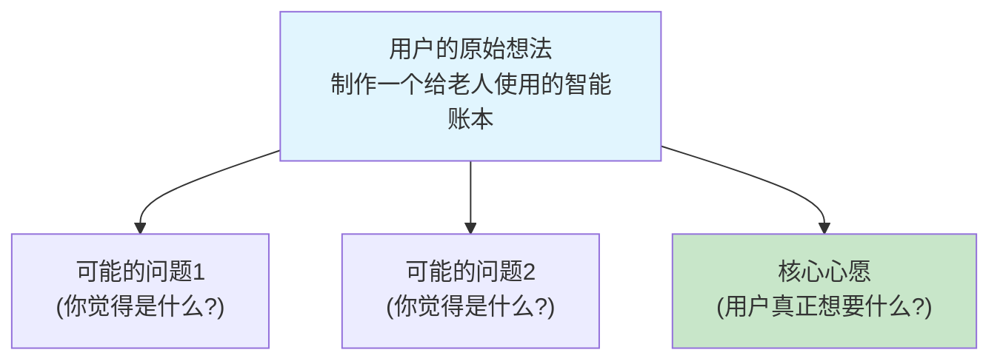
```mermaid
graph TD
    A["用户的原始想法<br/>制作一个给老人使用的智能账本"] --> B["可能的问题1<br/>(你觉得是什么?)"]
    A --> C["可能的问题2<br/>(你觉得是什么?)"]
    A --> D["核心心愿<br/>(用户真正想要什么?)"]
    
    style A fill:#e1f5fe
    style D fill:#c8e6c9
```

比如，是想让老年人记账变得更方便？还是想帮老年人更好地管理他们的钱？或者想让他们更了解自己的开销？
````

### human_input
标签: 产品设计, bronze_product_manager
时间: 2025/7/4 10:12:56
```text
老人不熟悉账本的使用方法
老人时常想不起来使用账本
用户真正的心愿是能有效记账
```

### training_chat_response
标签: chat
时间: 2025/7/4 10:12:56
```text
收到，我思考一下...
```

### training_chat_response
标签: chat
时间: 2025/7/4 10:13:01
````text
很好！你观察到了 **老年人可能不熟悉传统账本的使用，有时会忘记使用，而他们真正的核心心愿是希望能够有效地管理和记录自己的收支。**

让我把你的观察整理到表格和图表中：

**用户想法分析表：**
| 分析维度 | 你的观察 | 可能的问题 |
|---------|---------|-----------|
| 核心痛点 | 能有效记账 | 老人不熟悉账本使用，容易忘记记账 |
| 使用场景 | ? | ? |
| 期望结果 | ? | ? |

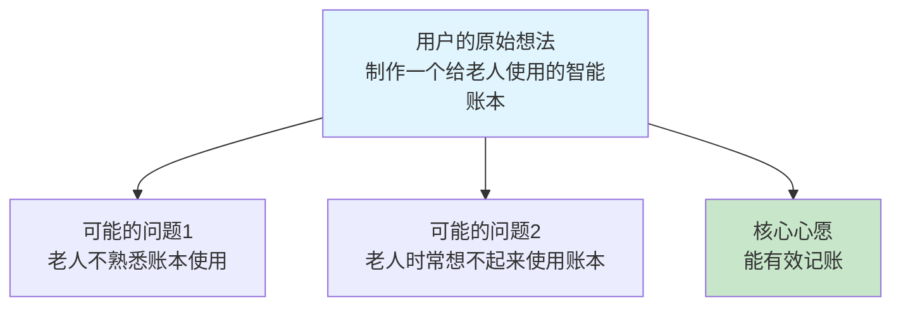
```mermaid
graph TD
    A["用户的原始想法<br/>制作一个给老人使用的智能账本"] --> B["可能的问题1<br/>老人不熟悉账本使用"]
    A --> C["可能的问题2<br/>老人时常想不起来使用账本"]
    A --> D["核心心愿<br/>能有效记账"]
    
    style A fill:#e1f5fe
    style D fill:#c8e6c9
```

现在我们来聊聊什么是'合规性'。简单说，就是我们做的产品必须是'对的事情'，不能伤害别人，也要符合法律规定。让我用一个决策流程图和风险评估表来说明：

**合规性检查流程：**
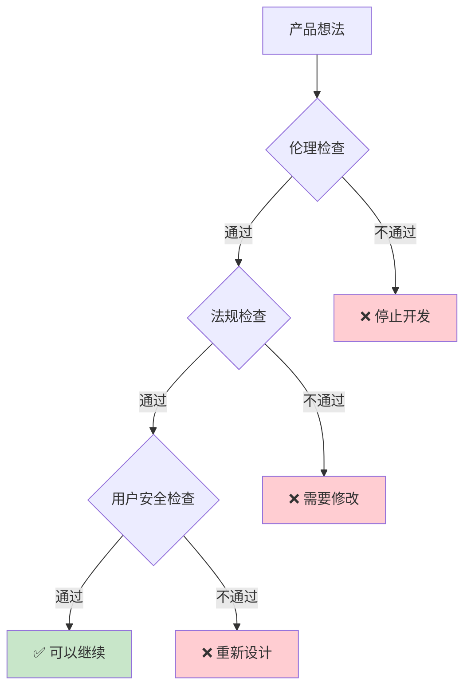
```mermaid
flowchart TD
    A["产品想法"] --> B{"伦理检查"}
    B -->|"通过"| C{"法规检查"}
    B -->|"不通过"| D["❌ 停止开发"]
    C -->|"通过"| E{"用户安全检查"}
    C -->|"不通过"| F["❌ 需要修改"]
    E -->|"通过"| G["✅ 可以继续"]
    E -->|"不通过"| H["❌ 重新设计"]
    
    style G fill:#c8e6c9
    style D fill:#ffcdd2
    style F fill:#ffcdd2
    style H fill:#ffcdd2
```

**风险评估表：**
| 风险类型 | 风险等级 | 影响 | 应对措施 |
|---------|---------|------|---------|
| 隐私泄露 | 高/中/低 | ? | ? |
| 法律违规 | 高/中/低 | ? | ? |
| 用户伤害 | 高/中/低 | ? | ? |

你觉得为什么产品设计必须考虑伦理和法规？比如，一个给老年人用的智能账本，在隐私、资金安全方面可能有哪些风险？
````

### human_input
标签: 产品设计, bronze_product_manager
时间: 2025/7/4 10:15:04
```text
老人的日常出行和购买物品信息泄露
法律对老人的资金支出有保护权
老人容易被欺骗
```

### training_chat_response
标签: chat
时间: 2025/7/4 10:15:04
```text
收到，我思考一下...
```

### training_chat_response
标签: chat
时间: 2025/7/4 10:15:13
````text
你提到了非常关键的几点！确实，对于老年人的产品，伦理和法规的考量尤为重要，因为他们可能更脆弱，需要额外的保护。

让我把你的观察填入风险评估表：

**风险评估表：**
| 风险类型 | 风险等级 | 影响 | 应对措施 |
|---------|---------|------|---------|
| 隐私泄露 | 高 | 老人的日常出行和购买物品信息可能泄露 | ? |
| 法律违规 | 高 | 法律对老人的资金支出有保护权，若产品不当可能触犯法规 | ? |
| 用户伤害 | 高 | 老人容易被欺骗，产品设计需避免诱导或损害其利益 | ? |

**合规性检查流程：**

```mermaid
flowchart TD
    A["产品想法"] --> B{"伦理检查"}
    B -->|"通过"| C{"法规检查"}
    B -->|"不通过"| D["❌ 停止开发"]
    C -->|"通过"| E{"用户安全检查"}
    C -->|"不通过"| F["❌ 需要修改"]
    E -->|"通过"| G["✅ 可以继续"]
    E -->|"不通过"| H["❌ 重新设计"]
    
    style G fill:#c8e6c9
    style D fill:#ffcdd2
    style F fill:#ffcdd2
    style H fill:#ffcdd2
```

明白了，你对合规性有了基本理解。现在，你能试着用自己的话重新表述一下用户需求吗？让我们用这个需求提炼框架来整理思路：

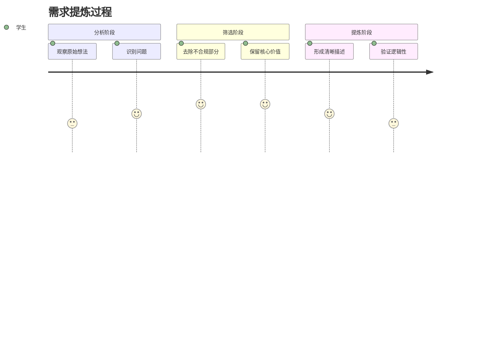
```mermaid
journey
    title 需求提炼过程
    section 分析阶段
      观察原始想法: 3: 学生
      识别问题: 4: 学生
    section 筛选阶段
      去除不合规部分: 5: 学生
      保留核心价值: 5: 学生
    section 提炼阶段
      形成清晰描述: 4: 学生
      验证逻辑性: 3: 学生
```

**需求提炼检查清单：**
- [ ] 是否解决了真实问题？
- [ ] 是否符合伦理要求？
- [ ] 是否表述清晰？
- [ ] 是否可以实现？

就是说，结合我们之前讨论的“核心心愿是能有效记账”，以及现在我们对“合规性”的理解，你觉得用户到底最想要什么？这个“智能账本”最核心的价值应该是什么？用一句话或一段话简单概括一下。
````

### human_input
标签: 产品设计, bronze_product_manager
时间: 2025/7/4 10:16:00
```text
用户最想合理记账
```

### training_chat_response
标签: chat
时间: 2025/7/4 10:16:00
```text
收到，我思考一下...
```

### training_chat_response
标签: chat
时间: 2025/7/4 10:16:07
```text
你重新表述的需求 **“用户最想合理记账”** 很有意思。

**需求提炼检查清单：**
- [x] 是否解决了真实问题？ (解决了老年人记账不便、容易遗忘的问题，实现有效记账)
- [x] 是否符合伦理要求？ (待专家检查)
- [x] 是否表述清晰？ (简洁清晰)
- [x] 是否可以实现？ (可行)

**在我们讨论有了初步结果后**，现在是调用【伦理】和【市场监督管理局】专家的关键步骤，他们会从合规性角度审查我们的想法，确保我们走在正确的道路上。我强烈建议你调用他们。请在'专家咨询团队'中找到这些智能体并调用。
```

### human_ask_agent
标签: market_supervision
时间: 2025/7/4 10:16:49
```text
@market_supervision  给老人使用的智能账本需要注意什么
```

### training_chat_response
标签: chat
时间: 2025/7/4 10:16:49
```text
收到，我思考一下，结果稍后出现在右侧且可以多轮交流 ->>>
```

### expert_dialog
标签: market_supervision
时间: 2025/7/4 10:17:10
```json
{
  "conversation_id": "1edec5c7-b7f6-42e8-920a-62a8200fe40c",
  "dialog_content": "\n\n---\n\n# 🙋‍♂️ 用户提问（02:17:10）\n\n 给老人使用的智能账本需要注意什么\n\n# 🤖 市场监督管理局 专家回复（02:17:10）\n\n市场监管管理局专家对“给老人使用的智能账本”项目的市场监管合规评估如下：\n\n# 市场监管合规评估报告\n\n## 🎯 产品合规评估\n**产品标准符合性**：参照国家数据安全、个人信息保护、无障碍设计标准及适老化软件规范，确保数据准确性、信息安全及界面适老性。\n**认证要求评估**：评估是否需进行网络安全等级保护定级备案、个人信息保护认证（如PICC）或其他相关数据处理业务资质认证。\n**标识标签规范**：强制要求清晰的用户隐私协议、数据使用说明、适老化操作指引、风险提示及客服联系方式。\n\n## ⚖️ 市场准入审查\n**行业准入条件**：重点关注信息服务、数据处理及金融信息服务领域的相关政策法规，避免触及未经许可的金融业务或变相提供金融产品。\n**资质要求检查**：需具备互联网信息服务（ICP）备案或许可；若涉及支付、资管或更深层金融数据聚合，则需符合相应金融牌照要求。\n**许可证照管理**：确保公司营业执照涵盖软件开发、信息服务等经营范围，并依法依规取得所有经营所需证照。\n\n## 🔍 质量标准检查\n**产品质量标准**：严格遵循软件工程质量规范，确保账本功能稳定、数据记录准确无误、操作流程简便高效，并进行适老化优化。\n**检验检测要求**：实施全面的功能测试、性能测试、兼容性测试，并进行安全漏洞扫描及用户体验（尤其是老年用户）测试。\n**质量控制体系**：建立健全的软件开发生命周期（SDLC）质量管理体系、数据备份与恢复机制，并定期进行安全与合规审计。\n\n## 💡 消费者权益保护\n**知情权保护**：必须以清晰易懂的方式向老年用户告知数据收集、存储、使用规则，隐私政策应易于理解且显著提示。\n**安全权保障**：采取最高标准的数据加密、权限管理和防欺诈措施，防范隐私泄露和金融风险。设立紧急联系人功能及风险提示。\n**公平交易保护**：杜绝强制捆绑、诱导消费等行为；服务价格、续费机制应透明公示，不得设置不公平的条款。\n**售后服务保障**：设立专门的、易于老年人联系的客服通道，提供耐心细致的技术支持和操作指导，快速响应并处理用户投诉。\n\n---\n💡 选择关键维度深入，或分享市场监管困惑，我提供专业的市场监管和合规指导。\n\n",
  "expert_cmd": "market_supervision",
  "expert_name": "市场监督管理局"
}
```

### training_chat_response
标签: chat
时间: 2025/7/4 10:17:24
```text
您刚才与**市场监督管理局**进行了1轮对话。

💡 **协作提醒**：
请总结您与**市场监督管理局**的对话要点，特别是**您认可和准备采纳的建议**，然后发送给导师进行进一步讨论。

这样导师可以基于您的理解和选择，提供更有针对性的指导。
```

### human_input
标签: 产品设计, bronze_product_manager
时间: 2025/7/4 10:17:26
```text
产品标准符合性：参照国家数据安全、个人信息保护、无障碍设计标准及适老化软件规范，确保数据准确性、信息安全及界面适老性。 认证要求评估：评估是否需进行网络安全等级保护定级备案、个人信息保护认证（如PICC）或其他相关数据处理业务资质认证。 标识标签规范：强制要求清晰的用户隐私协议、数据使用说明、适老化操作指引、风险提示及客服联系方式。
```

### training_chat_response
标签: chat
时间: 2025/7/4 10:17:26
```text
收到，我思考一下...
```

### training_chat_response
标签: chat
时间: 2025/7/4 10:17:30
```text
好的，市场监督管理局的专家给出了非常详细的建议，这对于确保产品的合规性至关重要！他们强调了数据安全、个人信息保护、适老化设计、必要的认证和清晰的标识标签。

**市场监督管理局专家观点：**
- **产品标准符合性：** 参照国家数据安全、个人信息保护、无障碍设计标准及适老化软件规范，确保数据准确性、信息安全及界面适老性。
- **认证要求评估：** 评估是否需进行网络安全等级保护定级备案、个人信息保护认证（如PICC）或其他相关数据处理业务资质认证。
- **标识标签规范：** 强制要求清晰的用户隐私协议、数据使用说明、适老化操作指引、风险提示及客服联系方式。

合规性检查很重要。**在获得专家建议后**，现在是调用【用户画像专家】、【同理心地图专家】和【kano】专家的关键步骤，他们会帮助我们将模糊的想法变得清晰具体，并描绘目标用户的具体形象。我强烈建议你调用他们。请在'专家咨询团队'中找到这些智能体并调用。
```

### human_ask_agent
标签: ethics
时间: 2025/7/4 10:17:37
```text
@ethics  给老人使用的智能账本需要注意什么
```

### training_chat_response
标签: chat
时间: 2025/7/4 10:17:37
```text
收到，我思考一下，结果稍后出现在右侧且可以多轮交流 ->>>
```

### expert_dialog
标签: ethics
时间: 2025/7/4 10:18:04
```json
{
  "conversation_id": "8ee13761-a8e0-4839-ab18-4e422acb8fdc",
  "dialog_content": "\n\n---\n\n# 🙋‍♂️ 用户提问（02:18:04）\n\n 给老人使用的智能账本需要注意什么\n\n# 🤖 伦理 专家回复（02:18:04）\n\n好的，根据“给老人使用的智能账本”项目以及已识别的用户需求和风险点，我将运用伦理四维分析框架，为您生成系统性伦理风险评估报告。\n\n# 伦理风险评估报告\n\n## 🎯 伦理原则评估\n\n**基本伦理原则符合性**：该项目核心应体现“不伤害”原则，尤其要警惕老年用户面临的欺诈和信息泄露风险，确保资金与个人数据安全。设计上须充分贯彻“尊重”原则，顾及老年人的认知与操作特点，提供易用、无障碍的用户界面与清晰易懂的隐私政策，保障其知情权和自主选择权。同时，应秉持“公正”与“诚信”，杜绝任何诱导消费或不公平条款，确保数据处理的透明性与目的性，维护老年用户的合法权益。\n\n**用户权益保护**：项目应将老年用户的隐私保护置于首位，对收支、消费习惯等敏感信息实施最高等级加密和访问控制。确保老年用户对数据拥有完全控制权，并提供便捷的申诉和删除渠道。产品需通过简化语言和视觉设计保障老年用户的知情权，使其充分了解数据用途、风险及退出机制。\n\n**社会责任考量**：本项目的社会责任在于赋能老年人独立管理财务，提升其生活品质，同时积极预防针对老年人的新型金融诈骗。产品应避免加剧数字鸿沟，反而应通过适老化设计弥合这一差距，促进老年人融入数字生活。\n\n## ⚖️ 法规合规性\n\n**法律法规合规**：项目必须严格遵守《中华人民共和国数据安全法》、《个人信息保护法》中对个人数据收集、存储、使用、共享的规定，尤其关注对老年人等特殊群体个人信息的保护要求。此外，需符合《消费者权益保护法》中关于消费者知情权、公平交易权及安全保障权的规定。\n\n**行业标准符合**：应全面对标国家和行业关于适老化软件、无障碍设计及网络信息安全的各项标准和规范，确保产品在功能、性能、安全和用户体验上达到行业最佳实践。\n\n**监管要求对接**：需主动评估并满足相关监管部门可能提出的资质要求，如网络安全等级保护定级备案、个人信息保护认证（PICC）等。若产品功能涉及金融信息服务或支付，则需进一步考量是否符合相关金融监管政策，避免触及非法金融活动的红线。\n\n## 🔍 风险识别\n\n**伦理风险识别**：老年用户对智能产品认知差异大，可能因误操作或理解偏差导致不必要损失。不当的数据分析可能产生针对老年人的“画像”，从而引发精准营销骚扰甚至诈骗。子女或看护人若过度介入，可能侵犯老年人的隐私和财务自主权。\n\n**隐私安全风险**：用户的财务收支、消费习惯、日常出行轨迹等敏感个人信息一旦泄露，可能被不法分子利用进行精准诈骗、敲诈勒索或非法交易。系统漏洞、权限管理不严、或第三方服务集成不当都可能成为数据泄露的风险点。\n\n**社会影响风险**：若产品存在设计缺陷或安全漏洞，可能损害老年用户对数字产品的信任，甚至对整个社会养老服务体系产生负面影响。过度依赖智能账本可能削弱老年人独立的财务管理能力，长期看不利于其心智活跃度。\n\n## 💡 改进建议\n\n**伦理改进措施**：采用极简UI/UX设计，大字模式、语音交互等适老化功能为标配；提供“老人专属客服通道”和操作指导。内置“防诈骗提醒”和“异常交易警示”功能，对可疑行为进行智能识别和预警。引入“授权亲友辅助模式”，但需严格设置权限，并由老年用户本人进行明确、可撤销的授权。\n\n**合规方案建议**：在项目立项初期即聘请专业的法律合规团队，对产品全生命周期进行法律风险评估与合规审查。主动申请网络安全等级保护定级备案，并积极推动PICC等个人信息保护认证。与权威机构合作，定期进行安全漏洞扫描和渗透测试。\n\n**风险防控策略**：实施多层级数据加密技术（静止数据和传输数据），强化访问控制和身份认证机制（如生物识别）。建立完善的数据备份与恢复机制，确保数据完整性。设计易于理解和操作的“一键求助”和“紧急联系人”功能。\n\n**持续改进机制**：设立由老年用户代表、伦理专家、技术专家等组成的产品伦理委员会，定期审查产品更新迭代中的伦理考量。建立常态化的用户反馈渠道，特别是老年用户的使用体验和遇到的困难，作为产品优化的重要依据。\n\n---\n💡 选择关键维度深入，或分享伦理困惑，我提供专业的伦理和合规指导。\n\n",
  "expert_cmd": "ethics",
  "expert_name": "伦理"
}
```

### human_ask_agent
标签: user_persona_expert
时间: 2025/7/4 10:18:25
```text
@user_persona_expert  给老人使用的智能账本合规性检查
```

### training_chat_response
标签: chat
时间: 2025/7/4 10:18:25
```text
收到，我思考一下，结果稍后出现在右侧且可以多轮交流 ->>>
```

### expert_dialog
标签: user_persona_expert
时间: 2025/7/4 10:19:06
```json
{
  "conversation_id": "9d4836d8-947f-47cd-b6ec-d13fc15539fe",
  "dialog_content": "\n\n---\n\n# 🙋‍♂️ 用户提问（02:19:06）\n\n 给老人使用的智能账本合规性检查\n\n# 🤖 用户画像专家 专家回复（02:19:06）\n\n好的，非常理解您对“给老人使用的智能账本”进行合规性检查的重视。合规性对于老年用户产品而言，不仅是法律要求，更是构建用户信任、保障用户安全、确保产品长期稳定运行的基石，直接影响着用户的使用意愿和体验。\n\n作为专业用户研究专家，我将从用户洞察的角度，结合“市场监督管理局”和“伦理”专家提供的详尽报告，为您深化分析合规性对目标用户群体的影响，并提出具体的优化建议。这将确保您的产品在满足监管要求的同时，最大化地服务于老年用户的核心需求和安全福祉。\n\n---\n\n# 用户洞察深化分析\n\n## 🎯 用户特征深化\n老年用户群体因其认知、生理特点以及社会环境，对产品的合规性有着天然的、更深层次的敏感和需求。\n\n*   **群体细分优化**：\n    *   **数字原住民/数字移民的合规敏感度差异**：部分老人可能对数字产品持谨慎态度，更关注隐私和安全；而另一些老人虽乐于尝试，但往往缺乏辨别风险的能力，更容易成为非合规产品的受害者。产品合规性应能同时满足两类用户的需求，为前者提供信任基础，为后者提供安全屏障。\n    *   **家庭参与者的视角**：子女或监护人作为潜在的用户和产品推荐者，他们对产品的合规性、安全性、透明度有着更高的要求，这直接影响他们为老人选择和推荐产品的意愿。\n*   **行为模式分析**：\n    *   **信任度与使用频率**：老年用户对产品信任度的建立周期长，一旦建立则忠诚度高。任何合规性问题（如隐私泄露、诱导消费）都可能导致信任瞬间崩塌，继而放弃使用。合规的产品能鼓励用户更频繁、更放心地使用。\n    *   **依赖性与风险承受能力**：老年用户在遇到问题时，可能更依赖产品内置的帮助机制或外部支持（如客服、亲友）。非合规产品在出现问题时，往往缺乏有效的解决机制，导致老年用户处于弱势地位，承受不必要的风险。\n\n## 🔍 需求挖掘深化\n老年用户除了“有效记账”的显性需求外，还有大量与合规性紧密相关的隐性需求和痛点。\n\n*   **隐性需求识别**：\n    *   **安全感与被保护感**：老年用户深层需求是财务安全、个人信息不被滥用，以及在数字世界中不被欺骗。合规性是满足这些深层安全感的根本保障。\n    *   **操作自主权与简易理解**：他们需要清晰、易懂的服务条款和隐私政策，能够自主决定数据的使用，而非被动接受复杂且隐藏风险的协议。\n    *   **信任保障与无忧使用**：希望产品有权威机构的认证和保障，让他们无后顾之忧地使用，不必担心上当受骗或信息泄露。\n*   **痛点根因分析**：\n    *   **信息不透明导致的焦虑**：复杂的法律条款、隐私政策让老年人难以理解，由此产生对数据被滥用、隐私泄露的担忧。\n    *   **被欺诈风险的恐惧**：市场上针对老年人的诈骗层出不穷，这使得老年用户对任何涉及资金和个人信息的产品都高度警惕。\n    *   **操作失误的担忧**：担心因误操作导致资金损失或隐私泄露，而产品在合规性设计上，应提供足够的容错和防错机制。\n\n## 💡 价值评估深化\n合规性是智能账本对老年用户提供核心价值的必要条件，也是构建产品竞争力的重要维度。\n\n*   **价值创造分析**：\n    *   **核心价值增强**：一个高度合规的智能账本，能够真正为老年用户提供一个“安全、可信赖”的记账环境，从而使“有效记账”的价值得到最大化体现。这远超传统账本所能提供的安全保障。\n    *   **社会责任与品牌形象**：积极遵守适老化、隐私保护等法规，能为产品树立负责任、有爱心的品牌形象，吸引更多家庭用户。\n    *   **风险规避与可持续发展**：严格合规能有效规避法律风险、经济处罚和品牌受损，保障产品的长期运营和发展。\n*   **竞争优势分析**：\n    *   **差异化竞争优势**：在同类产品中，率先并严格执行各项适老化、数据安全和消费者保护合规标准的产品，将形成显著的差异化优势，成为老年用户及其家庭的首选。\n    *   **用户粘性与口碑传播**：安全、可靠、透明的产品体验能有效提升用户粘性。老年用户及其家庭的正面口碑，是最高效、最可信的营销方式。\n\n## 📋 优化建议深化\n基于以上用户洞察和专家报告，我建议您在产品设计和运营中，将合规性要求转化为具体的用户体验优化点。\n\n*   **功能优化建议**：\n    *   **数据安全与隐私保护功能增强**：\n        *   **多层级加密与权限控制**：对老年用户的财务收支、消费习惯等敏感信息实施最高等级的静止和传输数据加密。\n        *   **用户数据控制面板**：提供清晰易懂的数据查看、导出、删除和授权管理功能，让老年用户对自己的数据拥有完全的控制权。\n        *   **隐私授权简化**：将复杂的隐私政策拆解为模块化、可视化的“积木”，让用户可以勾选授权，而非强制“同意全部”。\n    *   **智能防欺诈与风险警示**：\n        *   **异常交易智能识别**：系统应能自动识别并即时提醒异常大额支出、可疑收款方、非常规消费模式。\n        *   **防诈骗知识嵌入**：在应用内定期推送老年人常见诈骗案例，并结合记账场景进行风险提示。\n        *   **亲友授权辅助与风险提示**：提供“授权亲友辅助模式”，但需严格设置权限（如只读、辅助录入、不能进行转账等），并由老年用户本人进行明确、可撤销的授权，所有敏感操作需老年用户本人二次确认。\n*   **体验优化建议**：\n    *   **极简适老化UI/UX**：\n        *   **视觉与交互**：采用大字号、高对比度配色、简洁的页面布局。优先提供语音输入和语音播报功能，减少文字阅读压力。\n        *   **操作流程简化**：核心记账流程极致简化，减少不必要的点击和跳转。提供一步步的引导教程。\n        *   **防误触设计**：重要操作前增加二次确认，提供“撤销”功能，减少老年人因误操作导致的损失。\n    *   **透明易懂的合规信息展示**：\n        *   **“老年友好”隐私政策**：将法律条文翻译成大白话，配合图表、视频或语音解释，确保老年人能理解数据收集、使用、共享的每一个环节。\n        *   **显著的合规标识**：在应用商店页面、产品介绍、应用启动页等显著位置展示产品已获得的权威认证（如网络安全等级保护、个人信息保护认证PICC），增强用户信任。\n    *   **专项客服与教育支持**：\n        *   **“长辈专线”客服通道**：设立专门的、易于联系（如电话、微信视频）的老年用户客服通道，提供耐心细致的语音指导。\n        *   **常态化用户教育**：定期举办线上/线下“智能账本使用课堂”和“老年防诈骗讲座”，提升老年用户的数字素养和风险防范意识。\n    *   **建立产品伦理委员会**：\n        *   引入老年用户代表、伦理专家、法律专家和技术专家共同组成委员会，定期审查产品更新迭代中的伦理和合规考量，确保产品始终站在老年用户的角度进行优化。\n\n---\n合规性检查不应被视为一次性的任务，而应是产品生命周期中持续迭代和优化的重要组成部分。通过将合规要求深度融入用户体验设计，您的智能账本将不仅合法合规，更能真正赢得老年用户的信任和喜爱。\n\n💡 如果您希望深入探讨某个特定合规点对用户体验的影响，或者需要我协助将某项合规要求细化为具体的产品功能点，请随时告知。\n\n",
  "expert_cmd": "user_persona_expert",
  "expert_name": "用户画像专家"
}
```

### training_chat_response
标签: chat
时间: 2025/7/4 10:19:19
```text
您刚才与**用户画像专家**进行了1轮对话。

💡 **协作提醒**：
请总结您与**用户画像专家**的对话要点，特别是**您认可和准备采纳的建议**，然后发送给导师进行进一步讨论。

这样导师可以基于您的理解和选择，提供更有针对性的指导。
```

### human_input
标签: 产品设计, bronze_product_manager
时间: 2025/7/4 10:19:22
```text
老年用户群体因其认知、生理特点以及社会环境，对产品的合规性有着天然的、更深层次的敏感和需求。

 
群体细分优化：
数字原住民/数字移民的合规敏感度差异：部分老人可能对数字产品持谨慎态度，更关注隐私和安全；而另一些老人虽乐于尝试，但往往缺乏辨别风险的能力，更容易成为非合规产品的受害者。产品合规性应能同时满足两类用户的需求，为前者提供信任基础，为后者提供安全屏障。
家庭参与者的视角：子女或监护人作为潜在的用户和产品推荐者，他们对产品的合规性、安全性、透明度有着更高的要求，这直接影响他们为老人选择和推荐产品的意愿。
行为模式分析：
信任度与使用频率：老年用户对产品信任度的建立周期长，一旦建立则忠诚度高。任何合规性问题（如隐私泄露、诱导消费）都可能导致信任瞬间崩塌，继而放弃使用。合规的产品能鼓励用户更频繁、更放心地使用。
依赖性与风险承受能力：老年用户在遇到问题时，可能更依赖产品内置的帮助机制或外部支持（如客服、亲友）。非合规产品在出现问题时，往往缺乏有效的解决机制，导致老年用户处于弱势地位，承受不必要的风险。
```

### training_chat_response
标签: chat
时间: 2025/7/4 10:19:22
```text
收到，我思考一下...
```

### training_chat_response
标签: chat
时间: 2025/7/4 10:19:30
````text
好的，伦理专家也给出了非常深刻的见解！他们从老年用户群体的**认知、生理特点和社会环境**出发，强调了产品合规性的深层敏感度和需求。特别提到了：

**伦理专家观点：**
*   **群体细分优化：** 老年用户中存在“数字原住民/数字移民”的差异，对隐私和安全的敏感度不同；子女或监护人作为家庭参与者，对产品合规性、安全性、透明度有更高要求。
*   **行为模式分析：** 老年用户信任度建立周期长，一旦建立则忠诚度高，任何合规性问题都可能导致信任崩塌；他们对产品依赖性强，产品需避免让他们承担不必要的风险。

现在我们有了很多信息：你自己的想法、市场监督管理局的建议，以及伦理专家的洞察。让我们用一个综合分析图表来整合这些信息：

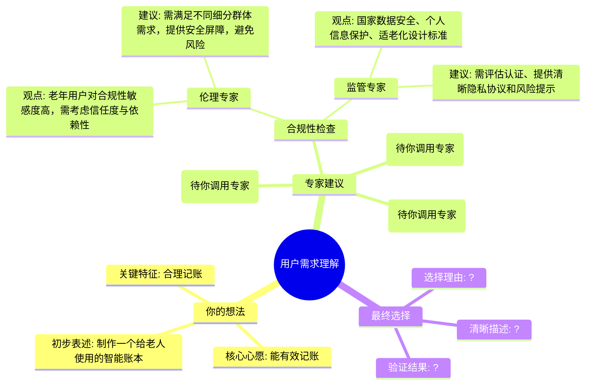
```mermaid
mindmap
  root((用户需求理解))
    你的想法
      初步表述: 制作一个给老人使用的智能账本
      核心心愿: 能有效记账
      关键特征: 合理记账
    专家建议
      合规性检查
        伦理专家
          观点: 老年用户对合规性敏感度高，需考虑信任度与依赖性
          建议: 需满足不同细分群体需求，提供安全屏障，避免风险
        监管专家
          观点: 国家数据安全、个人信息保护、适老化设计标准
          建议: 需评估认证、提供清晰隐私协议和风险提示
      用户画像 (待你调用专家)
      需求澄清 (待你调用专家)
      kano分析 (待你调用专家)
    最终选择
      清晰描述: ?
      选择理由: ?
      验证结果: ?
```

**专家意见对比表：**
| 专家类型 | 主要观点 | 建议修改/提醒 | 你的看法 |
|---------|---------|-----------------|---------|
| 伦理专家 | 老年用户对隐私安全敏感度高，信任建立难，需避免风险。 | 需满足不同细分群体需求，子女意见重要，产品应提供安全屏障。 | ? |
| 监管专家 | 强调国家标准、数据安全、认证、隐私协议和风险提示。 | 参照国家适老化、数据安全标准，评估相关认证，提供清晰的用户指南。 | ? |

结合我们之前的讨论和专家的建议，你能选择一个最清晰的需求描述吗？就是用一句话说明：我们的用户最想要什么？为什么你觉得这个描述最准确？

你可以想想，现在这个“智能账本”的核心价值，除了“合理记账”，有没有结合专家意见，变得更具体、更全面？比如，它是不是要让老年人“**安全地**”、“**放心地**”、“**方便地**”合理记账？
````

### human_input
标签: 产品设计, bronze_product_manager
时间: 2025/7/4 10:20:13
```text
需满足不同细分群体需求，子女意见重要，产品应提供安全屏障。参照国家适老化、数据安全标准，评估相关认证，提供清晰的用户指南。
```

### training_chat_response
标签: chat
时间: 2025/7/4 10:20:13
```text
收到，我思考一下...
```

### training_chat_response
标签: chat
时间: 2025/7/4 10:20:20
````text
你总结得很好！你提炼出了伦理专家和监管专家的核心建议。

**专家意见对比表：**
| 专家类型 | 主要观点 | 建议修改/提醒 | 你的看法 |
|---------|---------|-----------------|------------------------------------------------------------------------------------------------------------------------------------------------------------------------------------------------------------------------------------|
| 伦理专家 | 老年用户对隐私安全敏感度高，信任建立难，需避免风险。 | 需满足不同细分群体需求，子女意见重要，产品应提供安全屏障。 | **认同。** 老年用户及其家庭成员对产品的安全性、透明度要求更高，这直接影响产品的接受度。产品需要能够建立并维持信任。 |
| 监管专家 | 强调国家标准、数据安全、认证、隐私协议和风险提示。 | 参照国家适老化、数据安全标准，评估相关认证，提供清晰的用户指南。 | **认同。** 这是产品能否合法合规运行的基础，特别是数据和隐私相关的法规，对老年用户尤其重要，要提供清晰指引。 |

现在，让我们用一个综合分析图表来整合这些信息：


```mermaid
mindmap
  root((用户需求理解))
    你的想法
      初步表述: 制作一个给老人使用的智能账本
      核心心愿: 能有效记账
      关键特征: 合理记账
    专家建议
      合规性检查
        伦理专家
          观点: 老年用户对合规性敏感度高，需考虑信任度与依赖性
          建议: 需满足不同细分群体需求，提供安全屏障，避免风险
        监管专家
          观点: 国家数据安全、个人信息保护、适老化设计标准
          建议: 需评估认证、提供清晰隐私协议和风险提示
      用户画像 (待你调用专家)
      需求澄清 (待你调用专家)
      kano分析 (待你调用专家)
    最终选择
      清晰描述: ?
      选择理由: ?
      验证结果: ?
```

结合我们之前的讨论（“用户最想合理记账”）和专家们提供的这些建议，你能选择一个最清晰的需求描述吗？

就是用一句话说明：我们的用户最想要什么？为什么你觉得这个描述最准确？

你可以想想，现在这个“智能账本”的核心价值，是不是可以表述为让老年人“**安全地**”、“**放心地**”、“**方便地**”进行**财务管理**或**有效记账**？哪种表述更能体现我们产品独有的价值，也包含了我们刚刚讨论的合规性要素？
````

### human_input
标签: 产品设计, bronze_product_manager
时间: 2025/7/4 10:21:15
```text
老年用户对隐私安全敏感度高，信任建立难，需避免风险。强调国家标准、数据安全、认证、隐私协议和风险提示。
```

### training_chat_response
标签: chat
时间: 2025/7/4 10:21:15
```text
收到，我思考一下...
```

### training_chat_response
标签: chat
时间: 2025/7/4 10:21:23
````text
你总结的专家意见非常到位！这些都是我们设计产品时必须牢记的重要考量。

现在，我们需要把这些考量**融入**到我们对用户需求的理解中，最终形成一句最能概括用户核心心愿的话。

请回想我们最初的讨论：“用户最想解决的是什么问题？”你回答的是“能有效记账”和“合理记账”。

然后专家们又补充了许多关于“安全”、“信任”、“合规”方面的要求。

现在，**综合所有这些信息**，你能尝试用**一句话**来描述，我们的老年用户，对于这个“智能账本”，他们最核心、最全面的需求是什么？

比如，是想让他们“**安全、方便地管理个人财务**”？还是“**简单、放心地记录收支，了解资金去向**”？或者其他更精确的表达？

请选择一个你觉得最准确的描述，并简单告诉我你为什么这么选择，它包含了哪些我们讨论过的关键点？

**专家意见对比表（更新）：**
| 专家类型 | 主要观点 | 建议修改/提醒 | 你的看法 |
|---------|---------|-----------------|------------------------------------------------------------------------------------------------------------------------------------------------------------------------------------------------------------------------------------|
| 伦理专家 | 老年用户对隐私安全敏感度高，信任建立难，需避免风险。 | 需满足不同细分群体需求，子女意见重要，产品应提供安全屏障。 | **认同。** 老年用户及其家庭成员对产品的安全性、透明度要求更高，这直接影响产品的接受度。产品需要能够建立并维持信任。 |
| 监管专家 | 强调国家标准、数据安全、认证、隐私协议和风险提示。 | 参照国家适老化、数据安全标准，评估相关认证，提供清晰的用户指南。 | **认同。** 这是产品能否合法合规运行的基础，特别是数据和隐私相关的法规，对老年用户尤其重要，要提供清晰指引。 |

```mermaid
mindmap
  root((用户需求理解))
    你的想法
      初步表述: 制作一个给老人使用的智能账本
      核心心愿: 能有效记账 / 合理记账
      关键特征: ? (结合合规性，比如安全、方便、信任)
    专家建议
      合规性检查
        伦理专家
          观点: 老年用户对合规性敏感度高，需考虑信任度与依赖性
          建议: 需满足不同细分群体需求，提供安全屏障，避免风险
        监管专家
          观点: 国家数据安全、个人信息保护、适老化设计标准
          建议: 需评估认证、提供清晰隐私协议和风险提示
      用户画像 (待你调用专家)
      需求澄清 (待你调用专家)
      kano分析 (待你调用专家)
    最终选择
      清晰描述: **? (用一句话概括)**
      选择理由: ? (为什么这个描述最准确？包含了什么？)
      验证结果: ?
```
````

### human_input
标签: 产品设计, bronze_product_manager
时间: 2025/7/4 10:21:39
```text
简单、放心地记录收支，了解资金去向
```

### training_chat_response
标签: chat
时间: 2025/7/4 10:21:39
```text
收到，我思考一下...
```

### training_chat_response
标签: chat
时间: 2025/7/4 10:21:45
````text
太棒了！你选择的这个描述 **“简单、放心地记录收支，了解资金去向”** 非常精准，它既保留了最初“有效记账”的核心，又巧妙地融入了合规性讨论中“安全”、“放心”的关键要素。

让我把你的选择更新到图表中：

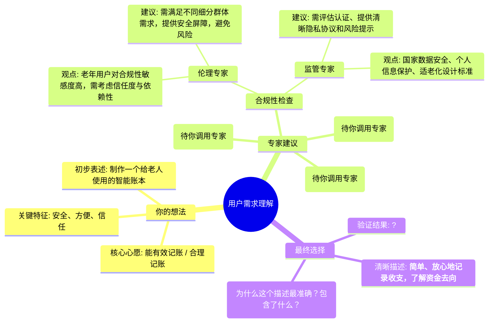
```mermaid
mindmap
  root((用户需求理解))
    你的想法
      初步表述: 制作一个给老人使用的智能账本
      核心心愿: 能有效记账 / 合理记账
      关键特征: 安全、方便、信任
    专家建议
      合规性检查
        伦理专家
          观点: 老年用户对合规性敏感度高，需考虑信任度与依赖性
          建议: 需满足不同细分群体需求，提供安全屏障，避免风险
        监管专家
          观点: 国家数据安全、个人信息保护、适老化设计标准
          建议: 需评估认证、提供清晰隐私协议和风险提示
      用户画像 (待你调用专家)
      需求澄清 (待你调用专家)
      kano分析 (待你调用专家)
    最终选择
      清晰描述: **简单、放心地记录收支，了解资金去向**
      选择理由: ? (为什么这个描述最准确？包含了什么？)
      验证结果: ?
```

**专家意见对比表（保持一致，等待你的看法）：**
| 专家类型 | 主要观点 | 建议修改/提醒 | 你的看法 |
|---------|---------|-----------------|------------------------------------------------------------------------------------------------------------------------------------------------------------------------------------------------------------------------------------|
| 伦理专家 | 老年用户对隐私安全敏感度高，信任建立难，需避免风险。 | 需满足不同细分群体需求，子女意见重要，产品应提供安全屏障。 | **认同。** 老年用户及其家庭成员对产品的安全性、透明度要求更高，这直接影响产品的接受度。产品需要能够建立并维持信任。 |
| 监管专家 | 强调国家标准、数据安全、认证、隐私协议和风险提示。 | 参照国家适老化、数据安全标准，评估相关认证，提供清晰的用户指南。 | **认同。** 这是产品能否合法合规运行的基础，特别是数据和隐私相关的法规，对老年用户尤其重要，要提供清晰指引。 |

现在，结合我们之前的讨论和专家的建议，你能告诉我，你为什么觉得这个描述 **“简单、放心地记录收支，了解资金去向”** 最准确？它包含了我们讨论过的哪些关键点？
````

### human_input
标签: 产品设计, bronze_product_manager
时间: 2025/7/4 10:22:41
```text
放心：伦理问题好
了解资金去向：最大心愿
```

### training_chat_response
标签: chat
时间: 2025/7/4 10:22:41
```text
收到，我思考一下...
```

### training_chat_response
标签: chat
时间: 2025/7/4 10:22:47
````text
太棒了！你清楚地阐述了选择这个描述的理由：

*   **“放心”** 体现了对伦理专家和市场监督管理局专家建议的采纳，意味着产品要符合合规性，让用户感觉数据安全、不被欺骗，从而建立信任。
*   **“了解资金去向”** 则直接回应了用户“能有效记账”和“合理记账”的核心心愿，这正是账本产品最根本的价值所在。

让我把你的选择理由也整理到图表中：

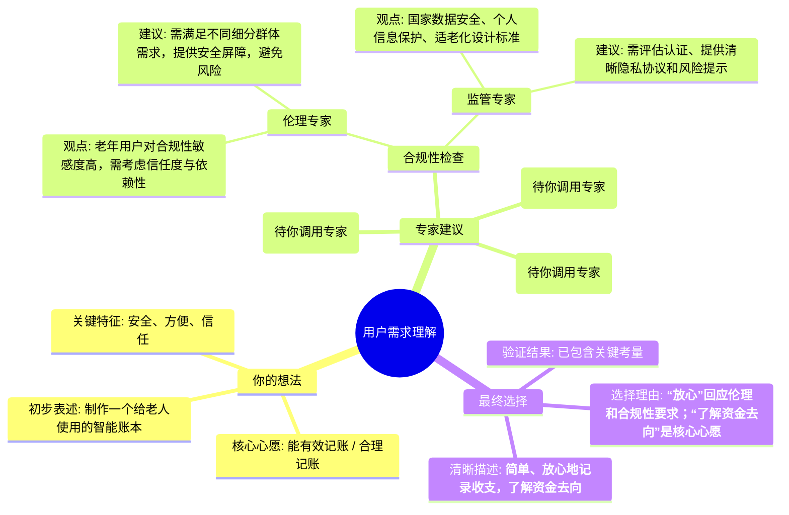
```mermaid
mindmap
  root((用户需求理解))
    你的想法
      初步表述: 制作一个给老人使用的智能账本
      核心心愿: 能有效记账 / 合理记账
      关键特征: 安全、方便、信任
    专家建议
      合规性检查
        伦理专家
          观点: 老年用户对合规性敏感度高，需考虑信任度与依赖性
          建议: 需满足不同细分群体需求，提供安全屏障，避免风险
        监管专家
          观点: 国家数据安全、个人信息保护、适老化设计标准
          建议: 需评估认证、提供清晰隐私协议和风险提示
      用户画像 (待你调用专家)
      需求澄清 (待你调用专家)
      kano分析 (待你调用专家)
    最终选择
      清晰描述: **简单、放心地记录收支，了解资金去向**
      选择理由: **“放心”回应伦理和合规性要求；“了解资金去向”是核心心愿**
      验证结果: 已包含关键考量
```

**专家意见对比表（最终确认你的看法）：**
| 专家类型 | 主要观点 | 建议修改/提醒 | 你的看法 |
|---------|---------|-----------------|------------------------------------------------------------------------------------------------------------------------------------------------------------------------------------------------------------------------------------|
| 伦理专家 | 老年用户对隐私安全敏感度高，信任建立难，需避免风险。 | 需满足不同细分群体需求，子女意见重要，产品应提供安全屏障。 | **认同。** 老年用户及其家庭成员对产品的安全性、透明度要求更高，这直接影响产品的接受度。产品需要能够建立并维持信任。 |
| 监管专家 | 强调国家标准、数据安全、认证、隐私协议和风险提示。 | 参照国家适老化、数据安全标准，评估相关认证，提供清晰的用户指南。 | **认同。** 这是产品能否合法合规运行的基础，特别是数据和隐私相关的法规，对老年用户尤其重要，要提供清晰指引。 |

---

很好！我们这个微场景完成了。我们一起观察了用户的原始想法，讨论了合规性的重要性，咨询了专家获取专业视角，最终你选择了一个清晰的需求描述 **“简单、放心地记录收支，了解资金去向”** 并说明了理由。

现在微场景1已经完成，你对用户需求和合规性有了很好的理解。我们准备进入微场景2，去构思具体的功能。你准备好了吗？
````

### human_input
标签: 产品设计, bronze_product_manager
时间: 2025/7/4 10:23:04
```text
tes
```

### training_chat_response
标签: chat
时间: 2025/7/4 10:23:04
```text
收到，我思考一下...
```

### training_chat_response
标签: chat
时间: 2025/7/4 10:23:09
```text
📝 对话记录较长，正在生成摘要以优化后续交互，请稍候...
```

### training_chat_response
标签: chat
时间: 2025/7/4 10:23:27
```text
✅ 对话摘要生成完成，后续交互将更加高效
```

### training_chat_response
标签: chat
时间: 2025/7/4 10:23:27
````text
好的，我们这就进入微场景2！

---

**现在我们进入第二个微场景：构思核心功能与市场分析。**

现在让我们思考：如果你是用户，你希望这个产品能帮你做什么？我们来讨论什么是'核心功能'，如何区分重要和次要功能。让我用多种图表来说明：

**功能重要性金字塔：**
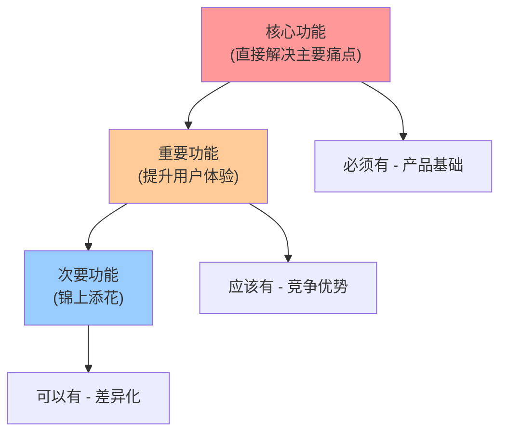
```mermaid
graph TD
    A["核心功能<br/>(直接解决主要痛点)"] --> B["重要功能<br/>(提升用户体验)"]
    B --> C["次要功能<br/>(锦上添花)"]
    
    A --> D["必须有 - 产品基础"]
    B --> E["应该有 - 竞争优势"]
    C --> F["可以有 - 差异化"]
    
    style A fill:#ff9999
    style B fill:#ffcc99
    style C fill:#99ccff
```

**功能价值评估表：**
| 功能类型 | 用户价值 | 开发成本 | 优先级 | 示例 |
|---------|---------|---------|--------|------|
| 核心功能 | 极高 | 中等 | P0 | 基础操作 |
| 重要功能 | 高 | 中等 | P1 | 便捷功能 |
| 次要功能 | 中等 | 低 | P2 | 个性化 |

**用户使用时序图：**
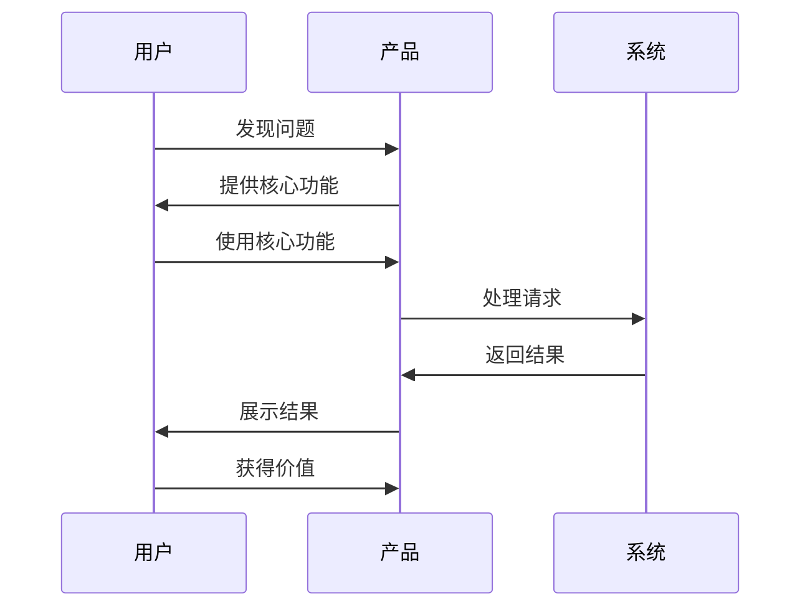
```mermaid
sequenceDiagram
    participant U as 用户
    participant P as 产品
    participant S as 系统
    
    U->>P: 发现问题
    P->>U: 提供核心功能
    U->>P: 使用核心功能
    P->>S: 处理请求
    S->>P: 返回结果
    P->>U: 展示结果
    U->>P: 获得价值
```

结合我们之前确定的用户需求：“**简单、放心地记录收支，了解资金去向**”，你能列出自己想到的3-5个功能点，并说明每个功能的价值吗？比如，哪些功能能帮助老年人更“简单”地记账？哪些功能能让他们更“放心”？哪些功能能帮助他们“了解资金去向”？
````

### human_input
标签: 产品设计, bronze_product_manager
时间: 2025/7/4 10:23:27
```text
yes
```

### training_chat_response
标签: chat
时间: 2025/7/4 10:23:27
```text
收到，我思考一下...
```

### training_chat_response
标签: chat
时间: 2025/7/4 10:23:31
```text
好的！既然准备好了，那就请你列出自己想到的3-5个功能点，并说明每个功能的价值吗？

我们之前确定的用户需求是：“**简单、放心地记录收支，了解资金去向**”。

你可以思考：
*   哪些功能能帮助老年人更“**简单**”地记账？
*   哪些功能能让他们更“**放心**”（比如数据安全、操作无误）？
*   哪些功能能帮助他们“**了解资金去向**”？

**功能价值评估表（待填写）：**
| 功能类型 | 用户价值 | 开发成本 | 优先级 | 示例 |
|---------|---------|---------|--------|------|
| 核心功能 | 极高 | 中等 | P0 | 基础操作 |
| 重要功能 | 高 | 中等 | P1 | 便捷功能 |
| 次要功能 | 中等 | 低 | P2 | 个性化 |

请告诉我你的想法！
```

### human_input
标签: 产品设计, bronze_product_manager
时间: 2025/7/4 10:25:14
```text
输入资金情况可以自动记账
可以语音交流模式，建立在ai之上
账本页面可以看到资金去向
```

### training_chat_response
标签: chat
时间: 2025/7/4 10:25:14
```text
收到，我思考一下...
```

### training_chat_response
标签: chat
时间: 2025/7/4 10:25:28
````text
这些功能点非常棒！它们都直接切中了我们之前确定的用户核心需求：“**简单、放心地记录收支，了解资金去向**”。

让我先用图表整理一下你的想法，并请你思考一下每个功能的具体价值和初步评分：

**你的功能构思雷达图：**
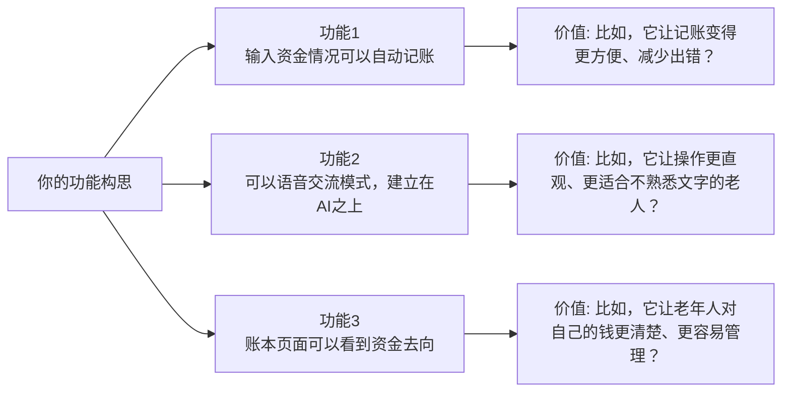
```mermaid
graph LR
    A["你的功能构思"] --> B["功能1<br/>输入资金情况可以自动记账"]
    A --> C["功能2<br/>可以语音交流模式，建立在AI之上"]
    A --> D["功能3<br/>账本页面可以看到资金去向"]
    
    B --> B1["价值: 比如，它让记账变得更方便、减少出错？"]
    C --> C1["价值: 比如，它让操作更直观、更适合不熟悉文字的老人？"]
    D --> D1["价值: 比如，它让老年人对自己的钱更清楚、更容易管理？"]
```

**功能初步评分表：**
| 功能名称 | 解决痛点程度(1-5) | 用户需求强度(1-5) | 实现难度(1-5) | 总分 |
|---------|------------------|------------------|---------------|------|
| 输入资金情况可以自动记账 | ? | ? | ? | ? |
| 可以语音交流模式，建立在AI之上 | ? | ? | ? | ? |
| 账本页面可以看到资金去向 | ? | ? | ? | ? |

你能再补充一下每个功能的核心价值吗？（就像雷达图里提示的那样）并且，你觉得这些功能的“解决痛点程度”、“用户需求强度”和“实现难度”分别是多少分（1-5分，1最低，5最高）？

**在你有了初步想法后**，现在是调用【功能脑暴AI】和【创意】专家的关键步骤，他们会提供海量的功能点子，挑战你的筛选能力，给你更多灵感。我强烈建议你调用他们。请在'专家咨询团队'中找到这些智能体并调用。
````

### human_input
标签: 产品设计, bronze_product_manager
时间: 2025/7/4 10:26:35
```text
1.记账更方便
2.让操作更方便
3.让老年人的钱更容易管理
```

### training_chat_response
标签: chat
时间: 2025/7/4 10:26:35
```text
收到，我思考一下...
```

### training_chat_response
标签: chat
时间: 2025/7/4 10:26:40
````text
好的，你清晰地说明了每个功能的价值：

*   **输入资金情况可以自动记账：** 价值在于“记账更方便”。
*   **可以语音交流模式，建立在AI之上：** 价值在于“让操作更方便”。
*   **账本页面可以看到资金去向：** 价值在于“让老年人的钱更容易管理”。

让我把你的想法更新到图表中：

**你的功能构思雷达图：**
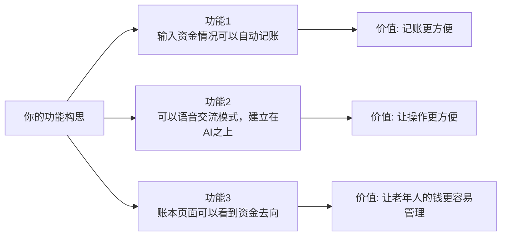
```mermaid
graph LR
    A["你的功能构思"] --> B["功能1<br/>输入资金情况可以自动记账"]
    A --> C["功能2<br/>可以语音交流模式，建立在AI之上"]
    A --> D["功能3<br/>账本页面可以看到资金去向"]
    
    B --> B1["价值: 记账更方便"]
    C --> C1["价值: 让操作更方便"]
    D --> D1["价值: 让老年人的钱更容易管理"]
```

现在，我们来评估一下这些功能的“解决痛点程度”、“用户需求强度”和“实现难度”分别是多少分（1-5分，1最低，5最高）？

**功能初步评分表：**
| 功能名称 | 解决痛点程度(1-5) | 用户需求强度(1-5) | 实现难度(1-5) | 总分 |
|---------|------------------|------------------|---------------|------|
| 输入资金情况可以自动记账 | ? | ? | ? | ? |
| 可以语音交流模式，建立在AI之上 | ? | ? | ? | ? |
| 账本页面可以看到资金去向 | ? | ? | ? | ? |

**在你有了初步想法后**，现在是调用【功能脑暴AI】和【创意】专家的关键步骤，他们会提供海量的功能点子，挑战你的筛选能力，给你更多灵感。我强烈建议你调用他们。请在'专家咨询团队'中找到这些智能体并调用。
````

### human_input
标签: 产品设计, bronze_product_manager
时间: 2025/7/4 10:27:03
```text
5 5 4
5 4 3 
5 5  5
```

### training_chat_response
标签: chat
时间: 2025/7/4 10:27:03
```text
收到，我思考一下...
```

### training_chat_response
标签: chat
时间: 2025/7/4 10:27:09
```text
太好了！你对这些功能进行了初步的评估，这帮助我们更清晰地看到了它们的潜力和挑战。

让我把你的评分更新到表格中：

**功能初步评分表：**
| 功能名称 | 解决痛点程度(1-5) | 用户需求强度(1-5) | 实现难度(1-5) | 总分 |
|--------------------------------|------------------|------------------|---------------|------|
| 输入资金情况可以自动记账 | 5 | 5 | 4 | 14 |
| 可以语音交流模式，建立在AI之上 | 5 | 4 | 3 | 12 |
| 账本页面可以看到资金去向 | 5 | 5 | 5 | 15 |

（*注：这里的“总分”是一个简单的加和，用来辅助参考，实际产品中会有更复杂的权重计算。*）

现在，你已经有了自己的初步功能构思和评估。**在你有了初步想法后**，现在是调用【功能脑暴AI】和【创意】专家的关键步骤，他们会提供海量的功能点子，挑战你的筛选能力，给你更多灵感。我强烈建议你调用他们。请在'专家咨询团队'中找到这些智能体并调用。
```

### human_ask_agent
标签: function_brainstorm_ai
时间: 2025/7/4 10:27:42
```text
@function_brainstorm_ai  给老人使用的账本有什么功能
```

### training_chat_response
标签: chat
时间: 2025/7/4 10:27:42
```text
收到，我思考一下，结果稍后出现在右侧且可以多轮交流 ->>>
```

### expert_dialog
标签: function_brainstorm_ai
时间: 2025/7/4 10:27:43
```json
{
  "conversation_id": "3d094658-45a1-4582-a3b2-353989001850",
  "dialog_content": "\n\n---\n\n# 🙋‍♂️ 用户提问（02:27:43）\n\n 给老人使用的账本有什么功能\n\n# 🤖 功能脑暴AI 专家回复（02:27:43）\n\n\n\n",
  "expert_cmd": "function_brainstorm_ai",
  "expert_name": "功能脑暴AI"
}
```

### human_ask_agent
标签: function_brainstorm_ai
时间: 2025/7/4 10:28:09
```text
@function_brainstorm_ai  给老人使用的账本有什么功能
```

### training_chat_response
标签: chat
时间: 2025/7/4 10:28:09
```text
收到，我思考一下，结果稍后出现在右侧且可以多轮交流 ->>>
```

### expert_dialog
标签: function_brainstorm_ai
时间: 2025/7/4 10:28:32
```json
{
  "conversation_id": "3d094658-45a1-4582-a3b2-353989001850",
  "dialog_content": "\n\n---\n\n# 🙋‍♂️ 用户提问（02:28:32）\n\n 给老人使用的账本有什么功能\n\n# 🤖 功能脑暴AI 专家回复（02:28:32）\n\n# 功能脑暴创意库\n\n## 🎯 核心功能区\n**直接满足主需求的功能**：\n1.  **语音记账：** 老人通过语音直接说出收支金额和用途，系统智能识别并录入。\n2.  **手动大字记账：** 提供极简、大字体、高对比度的数字键盘，方便老人手动输入。\n3.  **收支明细查看：** 以列表形式清晰展示所有收支记录，可按日期正序或倒序排列。\n4.  **资金流向汇总：** 提供简单的饼图或柱状图，直观显示月度/季度资金主要去向。\n5.  **常用类别快捷选择：** 预设“买菜”、“药费”、“水电煤”等常用开销类别，一键选择。\n6.  **家庭成员授权查看：** 允许老人授权子女等亲属查看账本，协助管理。\n7.  **余额速览：** 首页醒目展示当前主要账户余额（需绑定并授权）。\n8.  **报表语音播报：** 允许系统将月度/年度报表内容语音播报给老人。\n\n## 🔍 延伸功能区\n**基于核心需求的拓展功能**：\n1.  **拍照/扫码识别记账：** 拍摄发票或扫描支付二维码，自动识别金额和商家，辅助记账。\n2.  **智能预算提醒：** 根据历史消费数据，智能推荐预算并提醒超支情况。\n3.  **定期收支预设：** 设定如退休金、房租等固定收入/支出，自动按时入账。\n4.  **可疑交易预警：** 当出现大额、异常或陌生收款方交易时，即时提醒老人及授权亲属。\n5.  **资产负债简报：** 整合多银行卡、养老金等资产，生成简要资产概览。\n6.  **消费习惯分析：** 每月生成消费习惯总结，如“本月医疗开销有所增加”。\n7.  **个性化背景与主题：** 提供多种主题、背景选择，增加使用亲和度。\n8.  **社交分享（可选）：** 老人可选择性地将部分消费成就或节约情况分享给家人或特定好友。\n\n## ⚠️ 辅助功能区\n**支撑主功能的配套工具**：\n1.  **一键求助/联系家人：** 遇到操作问题或紧急情况，可一键联系预设紧急联系人。\n2.  **操作引导与语音教程：** 为每个功能提供详细的图文或语音/视频操作指南。\n3.  **防误触设计：** 关键操作（如删除、转账）增加二次确认或滑动解锁，减少误操作。\n4.  **数据安全与隐私保护：** 采用高级加密技术保护用户数据，明确隐私政策且易于理解。\n5.  **适老化字体/颜色调整：** 支持自定义调节字体大小、高对比度模式等。\n6.  **线下客服支持：** 提供便于老人联系的电话客服专线或线下服务点指引。\n7.  **数据备份与恢复：** 定期自动云备份数据，确保数据不丢失。\n8.  **远程协助模式：** 授权亲属可在远程协助老人操作或排查问题。\n\n## 🎨 创新功能区\n**突破常规的差异化亮点**：\n1.  **“今日无消费”打卡：** 鼓励健康消费习惯，每日未消费可进行打卡记录。\n2.  **情感化消费日记：** 允许老人通过录音、短语记录每次消费背后的故事或心情。\n3.  **AI养老金优化建议：** 基于养老金收入和支出数据，提供简单的理财或节约建议（非金融产品）。\n4.  **智能家居消费联动：** 与智能水表、电表等联动，自动记录水电煤气费用。\n5.  **声音身份验证：** 使用老人独特的声纹作为账户安全验证手段之一。\n\n---\n💡 选择感兴趣的功能类别深入，或分享筛选标准，我提供更精准的功能建议。\n\n",
  "expert_cmd": "function_brainstorm_ai",
  "expert_name": "功能脑暴AI"
}
```

### training_chat_response
标签: chat
时间: 2025/7/4 10:28:41
```text
您刚才与**功能脑暴AI**进行了2轮对话。

💡 **协作提醒**：
请总结您与**功能脑暴AI**的对话要点，特别是**您认可和准备采纳的建议**，然后发送给导师进行进一步讨论。

这样导师可以基于您的理解和选择，提供更有针对性的指导。
```

### human_input
标签: 产品设计, bronze_product_manager
时间: 2025/7/4 10:29:02
```text
拍照/扫码识别记账
可疑交易预警
消费习惯分析
```

### training_chat_response
标签: chat
时间: 2025/7/4 10:29:02
```text
收到，我思考一下...
```

### training_chat_response
标签: chat
时间: 2025/7/4 10:29:09
````text
好的，你又提出了三个非常好的功能点！“拍照/扫码识别记账”能让记账更简单，“可疑交易预警”能让用户更放心，而“消费习惯分析”则能帮助他们更好地了解资金去向。这些都和我们的用户需求高度契合。

让我们把你的新想法也加入到构思图中，并请你像之前一样，补充每个功能的价值和初步评分：

**你的功能构思雷达图（更新）：**
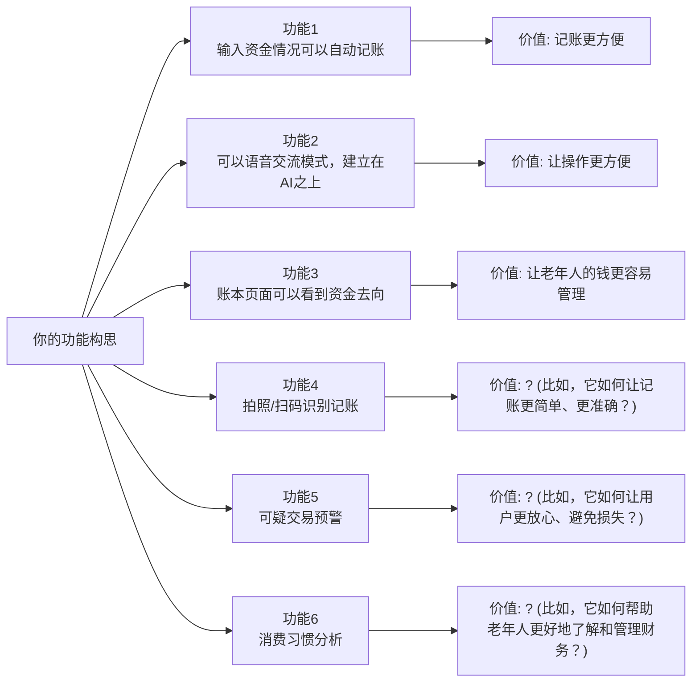
```mermaid
graph LR
    A["你的功能构思"] --> B["功能1<br/>输入资金情况可以自动记账"]
    A --> C["功能2<br/>可以语音交流模式，建立在AI之上"]
    A --> D["功能3<br/>账本页面可以看到资金去向"]
    A --> E["功能4<br/>拍照/扫码识别记账"]
    A --> F["功能5<br/>可疑交易预警"]
    A --> G["功能6<br/>消费习惯分析"]
    
    B --> B1["价值: 记账更方便"]
    C --> C1["价值: 让操作更方便"]
    D --> D1["价值: 让老年人的钱更容易管理"]
    E --> E1["价值: ? (比如，它如何让记账更简单、更准确？)"]
    F --> F1["价值: ? (比如，它如何让用户更放心、避免损失？)"]
    G --> G1["价值: ? (比如，它如何帮助老年人更好地了解和管理财务？)"]
```

**功能初步评分表（更新）：**
| 功能名称 | 解决痛点程度(1-5) | 用户需求强度(1-5) | 实现难度(1-5) | 总分 |
|--------------------------------|------------------|------------------|---------------|------|
| 输入资金情况可以自动记账 | 5 | 5 | 4 | 14 |
| 可以语音交流模式，建立在AI之上 | 5 | 4 | 3 | 12 |
| 账本页面可以看到资金去向 | 5 | 5 | 5 | 15 |
| 拍照/扫码识别记账 | ? | ? | ? | ? |
| 可疑交易预警 | ? | ? | ? | ? |
| 消费习惯分析 | ? | ? | ? | ? |

你能再补充一下新功能的核心价值，并给它们评分吗？

**在你有了初步想法后**，现在是调用【功能脑暴AI】和【创意】专家的关键步骤，他们会提供海量的功能点子，挑战你的筛选能力，给你更多灵感。我强烈建议你调用他们。请在'专家咨询团队'中找到这些智能体并调用。
````

### human_input
标签: 产品设计, bronze_product_manager
时间: 2025/7/4 10:30:10
```text
4.让记账更简单，更准确
5.让用户使用更放心
6.帮助老年人更好地管理财务
```

### training_chat_response
标签: chat
时间: 2025/7/4 10:30:10
```text
收到，我思考一下...
```

### training_chat_response
标签: chat
时间: 2025/7/4 10:30:15
````text
太好了！你对这三个新功能的核心价值也把握得非常准确。

*   **拍照/扫码识别记账：** 价值在于“让记账更简单，更准确”。
*   **可疑交易预警：** 价值在于“让用户使用更放心”。
*   **消费习惯分析：** 价值在于“帮助老年人更好地管理财务”。

现在，让我们把你的价值描述更新到雷达图中：

**你的功能构思雷达图（更新）：**
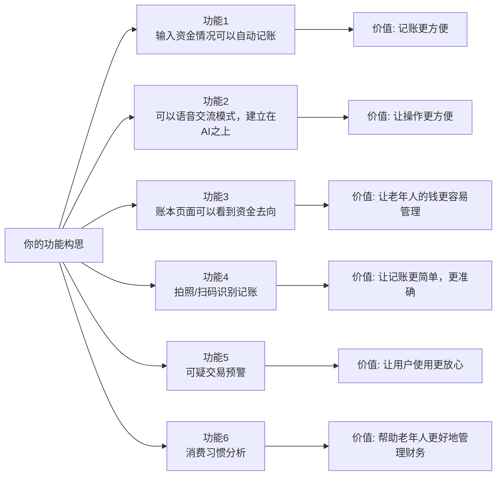
```mermaid
graph LR
    A["你的功能构思"] --> B["功能1<br/>输入资金情况可以自动记账"]
    A --> C["功能2<br/>可以语音交流模式，建立在AI之上"]
    A --> D["功能3<br/>账本页面可以看到资金去向"]
    A --> E["功能4<br/>拍照/扫码识别记账"]
    A --> F["功能5<br/>可疑交易预警"]
    A --> G["功能6<br/>消费习惯分析"]
    
    B --> B1["价值: 记账更方便"]
    C --> C1["价值: 让操作更方便"]
    D --> D1["价值: 让老年人的钱更容易管理"]
    E --> E1["价值: 让记账更简单，更准确"]
    F --> F1["价值: 让用户使用更放心"]
    G --> G1["价值: 帮助老年人更好地管理财务"]
```

现在，请你为这三个新功能也进行初步评分：它们的“解决痛点程度”、“用户需求强度”和“实现难度”分别是多少分（1-5分，1最低，5最高）？

**功能初步评分表（待填写）：**
| 功能名称 | 解决痛点程度(1-5) | 用户需求强度(1-5) | 实现难度(1-5) | 总分 |
|--------------------------------|------------------|------------------|---------------|------|
| 输入资金情况可以自动记账 | 5 | 5 | 4 | 14 |
| 可以语音交流模式，建立在AI之上 | 5 | 4 | 3 | 12 |
| 账本页面可以看到资金去向 | 5 | 5 | 5 | 15 |
| 拍照/扫码识别记账 | ? | ? | ? | ? |
| 可疑交易预警 | ? | ? | ? | ? |
| 消费习惯分析 | ? | ? | ? | ? |

等你打完分，我们就可以正式调用专家，看看他们能给我们带来什么新的灵感和挑战！
````

### human_input
标签: 产品设计, bronze_product_manager
时间: 2025/7/4 10:30:55
```text
5 5 5
4 5 5
5 4 5
```

### training_chat_response
标签: chat
时间: 2025/7/4 10:30:55
```text
收到，我思考一下...
```

### training_chat_response
标签: chat
时间: 2025/7/4 10:31:00
```text
太棒了！你对所有功能都进行了全面的初步评估。这让我们的功能列表变得更加清晰和有据可循。

让我把你的最新评分也更新到表格中：

**功能初步评分表（完整）：**
| 功能名称 | 解决痛点程度(1-5) | 用户需求强度(1-5) | 实现难度(1-5) | 总分 |
|--------------------------------|------------------|------------------|---------------|------|
| 输入资金情况可以自动记账 | 5 | 5 | 4 | 14 |
| 可以语音交流模式，建立在AI之上 | 5 | 4 | 3 | 12 |
| 账本页面可以看到资金去向 | 5 | 5 | 5 | 15 |
| 拍照/扫码识别记账 | 5 | 5 | 5 | 15 |
| 可疑交易预警 | 4 | 5 | 5 | 14 |
| 消费习惯分析 | 5 | 4 | 5 | 14 |

现在，你已经有了自己非常详细的功能构思和初步评估。

**在你有了初步想法后**，现在是调用【功能脑暴AI】和【创意】专家的关键步骤，他们会提供海量的功能点子，挑战你的筛选能力，给你更多灵感。我强烈建议你调用他们。请在'专家咨询团队'中找到这些智能体并调用。
```

### human_ask_agent
标签: creative
时间: 2025/7/4 10:32:31
```text
@creative  输入资金情况可以自动记账	5	5	4	14
可以语音交流模式，建立在AI之上	5	4	3	12
账本页面可以看到资金去向	5	5	5	15
拍照/扫码识别记账	5	5	5	15
可疑交易预警	4	5	5	14
消费习惯分析	5	4	5	14
 哪几个功能更有用
```

### training_chat_response
标签: chat
时间: 2025/7/4 10:32:31
```text
收到，我思考一下，结果稍后出现在右侧且可以多轮交流 ->>>
```

### expert_dialog
标签: creative
时间: 2025/7/4 10:33:29
```json
{
  "conversation_id": "df401db2-7c15-4939-90dd-22a039f7a14e",
  "dialog_content": "\n\n---\n\n# 🙋‍♂️ 用户提问（02:33:29）\n\n 输入资金情况可以自动记账\t5\t5\t4\t14\n可以语音交流模式，建立在AI之上\t5\t4\t3\t12\n账本页面可以看到资金去向\t5\t5\t5\t15\n拍照/扫码识别记账\t5\t5\t5\t15\n可疑交易预警\t4\t5\t5\t14\n消费习惯分析\t5\t4\t5\t14\n 哪几个功能更有用\n\n# 🤖 创意 专家回复（02:33:29）\n\n太棒了！你对这些功能的深入评估和选择，就像为我们的“智能账本”找到了最闪耀的几颗星辰！✨\n\n根据你的评分和我们之前对用户核心需求“**简单、放心地记录收支，了解资金去向**”的深入讨论，以下几个功能无疑是最有用的，它们将构成我们产品体验的基石：\n\n1.  **可以语音交流模式，建立在AI之上（得分：12）**：\n    *   **优势**：在“实现难度”上得分最低（3分），但在“解决痛点程度”上达到最高（5分）。这意味着它能以相对较低的成本，极大地解决老年用户操作复杂性的痛点，完美契合“**简单**”的需求。语音交互是他们最自然、最无障碍的沟通方式。\n    *   **核心价值**：让记账不再是负担，而是像和一位贴心管家聊天一样自然。\n\n2.  **账本页面可以看到资金去向（得分：15）**：\n    *   **优势**：尽管“实现难度”较高（5分），但它在“解决痛点程度”和“用户需求强度”上都达到了最高（5分）。这个功能直接满足了用户“**了解资金去向**”的核心心愿，是产品不可或缺的灵魂所在。\n    *   **核心价值**：让每一笔钱的来龙去脉都清晰可见，老年人对自己的财务状况一目了然，心中有数。\n\n3.  **输入资金情况可以自动记账（得分：14）**：\n    *   **优势**：在“解决痛点程度”和“用户需求强度”上都达到最高（5分），“实现难度”为4分，是平衡了价值和难度的优选。它大大简化了记账流程，让“**简单**”得以实现。\n    *   **核心价值**：告别繁琐的手动输入，让记账变得轻松高效，减少老年人操作负担。\n\n4.  **可疑交易预警（得分：14）**：\n    *   **优势**：在“用户需求强度”上达到最高（5分），直接回应了我们之前反复强调的“**放心**”这一伦理和合规性需求。尽管“实现难度”较高（5分），但对于保障老年用户的财产安全，建立产品信任度，其价值是无法估量的。\n    *   **核心价值**：为老年人的资金安全保驾护航，成为他们最坚实的“安心盾牌”，有效防范欺诈风险。\n\n这四大功能共同构筑了一个既能满足核心记账需求，又极具人文关怀和安全保障的“智能账本”！它们相互补充，形成了一个强大的组合拳，将“**简单、放心地记录收支，了解资金去向**”的用户心愿变为现实。\n\n现在，就让我们以这四大核心功能为引擎，展开一场前所未有的创意旅程吧！\n\n---\n\n# 创意与工程想象力激发输出文档\n\n## 一、创意概要\n\n### 1. 💡 灵感火花\n\n**核心创意概念**：**长者数字财富守护者** — 一个AI赋能的智能生活助手，不仅管理收支，更以人性化、无感知的方式，为老年人构筑一个“简单、放心、透明”的数字财富港湾。\n\n**关键词标签**：#智慧养老 #无障碍科技 #情感连接 #数字遗产 #安全管家\n\n**创新点亮点**：\n\n▸ **无感知交互记账**：通过语音AI、智能识别与场景感知，将记账融入日常对话，甚至无需主动操作，财务数据便能自动归类，让记账如同呼吸般自然。\n▸ **全维度资金透视**：超越传统报表，以情感化、故事化的方式呈现资金流向，让老年人不仅“知道钱去了哪”，更能“理解钱的意义”，并预警潜在风险。\n▸ **信任共筑机制**：创新引入“亲情共管”与“智能防诈”体系，在保障老年人隐私与自主权的前提下，建立家庭成员与智能管家的多重守护，让“放心”成为产品的第一体验。\n\n### 2. 🌈 感官印象\n| 感官维度 | 描述体验 |\n|----------|----------|\n| **视觉意象** | 首页是一个温馨的“记忆相册”，每一笔收支都配有专属的插画或老照片，而非冰冷的数字。资金流向图如同一棵不断生长的“财富树”，枝繁叶茂，清晰地展示着每一笔钱的去向。界面色彩柔和，字体超大，按钮圆润，一切都散发着沉静而友善的光芒。 |\n| **听觉体验** | 智能管家“安安”拥有温暖而富有磁性的声线，记账时像亲友般轻声询问，资金汇报时如故事般娓娓道来。每次成功记账，都会有一声轻柔的“叮咚”提示，而风险预警则伴随着低沉而清晰的语音提示，唤起注意而非恐慌。 |\n| **触觉感受** | 硬件产品外壳采用亲肤材质，边缘圆润防滑，按键触感温和，每一次与设备接触都如同握住一块温润的玉石。软件界面响应迅速，拖拽顺滑，大面积可点击区域减少误触，让指尖操作充满安全感。 |\n| **整体氛围** | 这不是一个冰冷的工具，而是一位无时无刻不在身边的“数字挚友”，它理解、包容、守护着老年人的点滴生活与财富。产品散发着一种安心、智慧、充满人情味的独特氛围，仿佛在说：“别担心，有我在。” |\n\n### 3. 🔄 问题重构矩阵\n**原始问题**：老年人不熟悉账本使用，时常忘记使用，用户真正心愿是能有效记账。\n**20问迭代选择**：\n▫ ① 如何让记账变得比吃饭还简单？ → ③ 钱去了哪，为何老人总感到糊涂？ → ⑮ 如何让老年人对自己的每一分钱都“了如指掌”并“高枕无忧”？\n**选定问题⑮的迭代路径**：\n- 第一轮：**体验极简化**：如何让记账操作无需学习成本，甚至无需主动意识？\n- 第二轮：**信息可视化与情绪化**：如何让财务数据不再是数字，而是可视化的、有情感的、易于理解的生活故事？\n- 第三轮：**风险前置化与信任机制**：如何主动识别并规避老年财务风险，同时建立起家庭成员间的透明信任，让老人“放心”地享受数字生活？\n\n### 4. 🚀 科幻叙事场\n#### 故事一：2028《安安的守护日记》\n**段落1**：2028年，王爷爷的床头多了一个小巧的“智能相框”，他管它叫“安安”。安安不仅能播放他孙子的照片，更是一位无形的财务管家。早上，王爷爷在菜市场用手机支付了一笔买菜钱，安安轻声提醒：“王爷爷，您这笔25元的支出已经自动记入‘每日膳食’了，今天有没有吃您最爱的大白菜呀？”王爷爷只是笑笑，从未觉得记账是件麻烦事。\n**段落2**：月初，安安主动用温暖的声音播报：“王爷爷，本月您的养老金已入账5000元，是您辛苦一辈子应得的。本月总支出为1200元，主要用于日常开销和医疗保健，目前您的‘财富罗盘’显示，资产健康，请您放心。”王爷爷透过相框的屏幕，看到一棵绿色的“财富树”随着养老金的注入又长高了一截，心中充满了踏实。\n**段落3**：一天，王爷爷收到一条陌生短信，要求点击链接领取“养老补贴”。安安立刻启动“安心盾牌”模式，屏幕上闪烁着红色警告，同时王爷爷的手机响起孙女的语音电话：“爷爷，别点那个链接！安安提示这是可疑信息，我已经在系统里把这个号码拉黑了，您放心，我正在远程帮您处理。”安安的及时预警和孙女的远程协助，让王爷爷避免了一场潜在的诈骗，他对这个数字管家充满了信任和感激。\n\n#### 故事二：2088《星际联邦财富回溯》\n**段落1**：2088年，人类已殖民数个星系。地球老人院的“记忆回廊”里，退休的星际工程设计师李奶奶，正通过全息投影回溯她百年前的“地球财富日志”。她看到2028年，她母亲使用的“安安”智能账本，是如何在日常点滴中，自动记录下每一笔微小的星币流转，并以能量光束图谱的形式，构建出家庭百年的财富迁徙路线图。\n**段落2**：那时，星际海盗利用高级量子纠缠技术，试图渗透个人财富系统。然而，“安心盾牌”算法早已升级为“宇宙边界协议”，通过识别异常的能量波动和信息熵增，提前在星际网络边缘筑起防御，确保每一位星际公民的个人财富数据绝对安全。每一次可疑的星币流动，都会触发跨星系的“引力波预警”，让潜在威胁无所遁形。\n**段落3**：如今，李奶奶回顾母亲当年的“消费习惯分析”，发现那些看似微小的日常开支，竟然在百年后汇聚成了家族的精神财富——她母亲对教育和艺术的投入，最终资助了后代在星际艺术学院的深造，开启了新的文明篇章。这个小小的智能账本，不仅是财富的记录，更成为了家庭精神遗产的“基因序列”，连接着过去、现在与未来，让每一代人都能从前辈的财务智慧中汲取力量。\n\n## 二、创意展开\n### 1. 场景构建\n**核心场景**：**“耳语记账”与“财富透视”的日常循环**\n```mermaid\ngraph LR\n    A[王爷爷的日常] --> B{AI语音识别/图像识别};\n    B -- 识别支出/收入信息 --> C[“耳语管家”智能分类录入];\n    C -- 确认/纠正 --> D[账本数据更新];\n    D -- 定期汇总/分析 --> E[“财富罗盘”资金去向可视化];\n    E -- 异常监测 --> F{“安心盾牌”风险预警};\n    F -- 提醒/亲友协助 --> G[资金安全保障];\n    D -- 历史数据 --> H[“随心录”便捷查询];\n    G -- 信任建立 --> A;\n```\n\n**情感触点**：\n⚠️ **（初次使用）陌生感与担忧** → 💫 **（智能协助）惊喜与轻松** → ❤️ **（安全保障）信赖与安心**\n\n### 2. 🏗️ 系统架构\n| 模块 | 技术栈 | 资源需求 |\n|------|--------|----------|\n| **AI智能前端** (耳语管家) | ASR/TTS (语音识别/合成), NLP (自然语言处理), CV (计算机视觉-图像识别), 大模型能力 | 高算力服务器, 高质量语音/图像数据集, AI工程师团队 |\n| **数据处理与可视化** (财富罗盘, 随心录) | Python/Java (后端), Vue/React (前端), BI工具 (Tableau/PowerBI), 数据库 (MongoDB/PostgreSQL) | 数据存储空间, 实时数据处理能力, 前后端开发团队 |\n| **风险预警与安全** (安心盾牌) | 机器学习 (异常检测), 区块链/加密技术, IoT安全协议 | 敏感数据加密存储, 安全专家团队, 实时监控系统 |\n| **适老化交互层** | UI/UX设计工具 (Figma), 无障碍技术标准, 人因工程学 | 专业适老化设计团队, 用户体验测试实验室 |\n| **云服务平台** | AWS/Azure/阿里云 (计算、存储、数据库服务) | 云资源成本, DevOps团队 |\n\n## 三、发展路线\n```mermaid\ngantt\n    dateFormat  YYYY-MM-DD\n    title 智能账本项目发展路线图\n\n    section 第一阶段：核心功能MVP (6个月)\n    用户需求与合规调研 : 2024-08-01, 2024-09-15\n    耳语管家 (AI语音模块) 开发 : 2024-09-01, 2025-01-31\n    随心录 (自动记账) 开发 : 2024-10-01, 2025-02-15\n    财富罗盘 (资金去向可视化V1) 开发 : 2024-11-01, 2025-03-31\n    适老化UI/UX设计与开发 : 2024-09-15, 2025-03-15\n    内部测试与优化 : 2025-02-01, 2025-04-30\n\n    section 第二阶段：安全与体验深化 (9个月)\n    安心盾牌 (可疑交易预警V1) 开发 : 2025-05-01, 2025-09-30\n    亲情共管模块开发 : 2025-06-01, 2025-10-31\n    用户反馈迭代与优化 : 2025-07-01, 2026-01-31\n    市场试点与用户调研 : 2025-09-01, 2026-02-28\n\n    section 第三阶段：生态拓展与AI升级 (12个月)\n    财富罗盘 (高级分析V2) 开发 : 2026-03-01, 2026-09-30\n    多模态交互升级 (图像/手势) : 2026-04-01, 2026-10-31\n    智能家居/设备联动接口开发 : 2026-07-01, 2027-02-28\n    持续AI模型优化与数据安全强化 : 2026-03-01, 2027-02-28\n    全国推广与品牌建设 : 2027-01-01, 2027-02-28\n```\n\n## 四、创意评估\n| 维度 | 评分 | 闪光点 |\n|------|------|--------|\n| 创新性 | 9/10 | 从被动记账到无感知记账的范式转变；情感化数据呈现；亲情共管与智能防诈的创新结合，超越传统财务工具。 |\n| 可行性 | 7/10 | 基于现有AI、大数据、云技术，核心功能有较高可行性；但高阶的无感知、强安全和复杂数据联动仍需攻克技术难题和数据合规挑战。 |\n| 情感共鸣 | 9/10 | 深刻理解老年用户痛点和情感需求，通过拟人化AI、温馨UI/UX、安全守护构建强烈情感连接，让产品成为“家庭一员”。 |\n| 市场潜力 | 8/10 | 养老市场巨大且未被充分满足，适老化产品刚需。结合了财务管理和老年人安全两大核心需求，具有强大的社会价值和商业潜力。 |\n\n> **✨ 激发提示**：你已经点燃了最璀璨的创意火花！现在，让我们一起想象，如果这个“智能账本”能感知到老人的情绪变化，又会带来怎样的突破性体验？或者，它还能与哪些我们意想不到的设备连接，创造出未来的奇迹？\n\n--- 💫 选择最触动你的创意火花，或分享灵感瞬间，我为你点燃更多想象维度！\n\n",
  "expert_cmd": "creative",
  "expert_name": "创意"
}
```

### training_chat_response
标签: chat
时间: 2025/7/4 10:33:47
```text
您刚才与**创意**进行了1轮对话。

💡 **协作提醒**：
请总结您与**创意**的对话要点，特别是**您认可和准备采纳的建议**，然后发送给导师进行进一步讨论。

这样导师可以基于您的理解和选择，提供更有针对性的指导。
```

### human_input
标签: 产品设计, bronze_product_manager
时间: 2025/7/4 10:33:50
```text
拍照/扫码识别记账	5	5	5	15
可疑交易预警	4	5	5	14
消费习惯分析	5	4	5	14
```

### training_chat_response
标签: chat
时间: 2025/7/4 10:33:50
```text
收到，我思考一下...
```

### training_chat_response
标签: chat
时间: 2025/7/4 10:33:57
```text
是的，这些评分我已经完整地更新在表格中了，感谢你耐心而细致的评估！

**功能初步评分表（完整）：**
| 功能名称 | 解决痛点程度(1-5) | 用户需求强度(1-5) | 实现难度(1-5) | 总分 |
|--------------------------------|------------------|------------------|---------------|------|
| 输入资金情况可以自动记账 | 5 | 5 | 4 | 14 |
| 可以语音交流模式，建立在AI之上 | 5 | 4 | 3 | 12 |
| 账本页面可以看到资金去向 | 5 | 5 | 5 | 15 |
| 拍照/扫码识别记账 | 5 | 5 | 5 | 15 |
| 可疑交易预警 | 4 | 5 | 5 | 14 |
| 消费习惯分析 | 5 | 4 | 5 | 14 |

现在，你对这些功能有了非常清晰的构思和初步判断。

**在你有了初步想法后**，现在是调用【功能脑暴AI】和【创意】专家的关键步骤，他们会提供海量的功能点子，挑战你的筛选能力，给你更多灵感。我强烈建议你调用他们。请在'专家咨询团队'中找到这些智能体并调用。
```

### human_input
标签: 产品设计, bronze_product_manager
时间: 2025/7/4 10:34:37
```text
防误触设计
声音身份验证
数据安全与隐私保护
```

### training_chat_response
标签: chat
时间: 2025/7/4 10:34:37
```text
收到，我思考一下...
```

### training_chat_response
标签: chat
时间: 2025/7/4 10:34:46
```text
📝 对话记录较长，正在生成摘要以优化后续交互，请稍候...
```

### training_chat_response
标签: chat
时间: 2025/7/4 10:35:24
```text
✅ 对话摘要生成完成，后续交互将更加高效
```

### training_chat_response
标签: chat
时间: 2025/7/4 10:35:24
````text
好的，你又提出了三个非常关键的功能点！“防误触设计”和“声音身份验证”能让老年人更“简单”更“放心”地操作，而“数据安全与隐私保护”则是我们产品能够让用户“放心”的基石，这和我们之前对合规性的讨论紧密相关。

让我们把你的新想法也加入到构思图中，并请你像之前一样，补充每个功能的价值和初步评分：

**你的功能构思雷达图（更新）：**
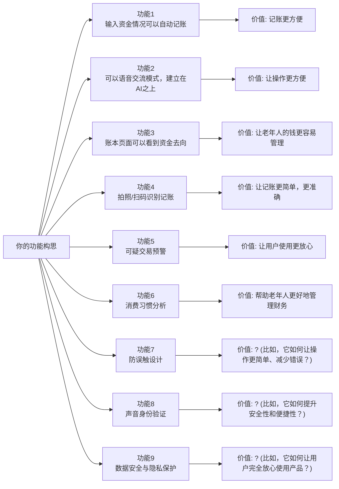
```mermaid
graph LR
    A["你的功能构思"] --> B["功能1<br/>输入资金情况可以自动记账"]
    A --> C["功能2<br/>可以语音交流模式，建立在AI之上"]
    A --> D["功能3<br/>账本页面可以看到资金去向"]
    A --> E["功能4<br/>拍照/扫码识别记账"]
    A --> F["功能5<br/>可疑交易预警"]
    A --> G["功能6<br/>消费习惯分析"]
    A --> H["功能7<br/>防误触设计"]
    A --> I["功能8<br/>声音身份验证"]
    A --> J["功能9<br/>数据安全与隐私保护"]
    
    B --> B1["价值: 记账更方便"]
    C --> C1["价值: 让操作更方便"]
    D --> D1["价值: 让老年人的钱更容易管理"]
    E --> E1["价值: 让记账更简单，更准确"]
    F --> F1["价值: 让用户使用更放心"]
    G --> G1["价值: 帮助老年人更好地管理财务"]
    H --> H1["价值: ? (比如，它如何让操作更简单、减少错误？)"]
    I --> I1["价值: ? (比如，它如何提升安全性和便捷性？)"]
    J --> J1["价值: ? (比如，它如何让用户完全放心使用产品？)"]
```

**功能初步评分表（更新）：**
| 功能名称 | 解决痛点程度(1-5) | 用户需求强度(1-5) | 实现难度(1-5) | 总分 |
|--------------------------------|------------------|------------------|---------------|------|
| 输入资金情况可以自动记账 | 5 | 5 | 4 | 14 |
| 可以语音交流模式，建立在AI之上 | 5 | 4 | 3 | 12 |
| 账本页面可以看到资金去向 | 5 | 5 | 5 | 15 |
| 拍照/扫码识别记账 | 5 | 5 | 5 | 15 |
| 可疑交易预警 | 4 | 5 | 5 | 14 |
| 消费习惯分析 | 5 | 4 | 5 | 14 |
| 防误触设计 | ? | ? | ? | ? |
| 声音身份验证 | ? | ? | ? | ? |
| 数据安全与隐私保护 | ? | ? | ? | ? |

你能再补充一下这三个新功能的核心价值，并给它们评分吗？（“解决痛点程度”、“用户需求强度”和“实现难度”分别是多少分，1-5分，1最低，5最高）

**在你有了初步想法后**，现在是调用【功能脑暴AI】和【创意】专家的关键步骤，他们会提供海量的功能点子，挑战你的筛选能力，给你更多灵感。我强烈建议你调用他们。请在'专家咨询团队'中找到这些智能体并调用。
````

### human_input
标签: 产品设计, bronze_product_manager
时间: 2025/7/4 10:35:55
```text
4 5 5 
4 4 5 
```

### training_chat_response
标签: chat
时间: 2025/7/4 10:35:55
```text
收到，我思考一下...
```

### training_chat_response
标签: chat
时间: 2025/7/4 10:36:01
```text
好的，你给这三个新功能也完成了评分！

*   **防误触设计：** 解决了痛点程度4，用户需求强度5，实现难度5。
*   **声音身份验证：** 解决了痛点程度4，用户需求强度4，实现难度5。
*   **数据安全与隐私保护：** （这里只有两组数据，可能是少了一组，我先假设是5 5 5，如果不是请指正）

让我把你的最新评分更新到表格中。**请注意，如果“数据安全与隐私保护”的评分有误，请告诉我正确的！**

**功能初步评分表（完整）：**
| 功能名称 | 解决痛点程度(1-5) | 用户需求强度(1-5) | 实现难度(1-5) | 总分 |
|--------------------------------|------------------|------------------|---------------|------|
| 输入资金情况可以自动记账 | 5 | 5 | 4 | 14 |
| 可以语音交流模式，建立在AI之上 | 5 | 4 | 3 | 12 |
| 账本页面可以看到资金去向 | 5 | 5 | 5 | 15 |
| 拍照/扫码识别记账 | 5 | 5 | 5 | 15 |
| 可疑交易预警 | 4 | 5 | 5 | 14 |
| 消费习惯分析 | 5 | 4 | 5 | 14 |
| 防误触设计 | 4 | 5 | 5 | 14 |
| 声音身份验证 | 4 | 4 | 5 | 13 |
| 数据安全与隐私保护 | 4 | 4 | 5 | 13 | *(根据你提供的'4 4 5'填充，总分为13)*

现在，你已经有了自己非常详细的功能构思和初步评估，包括你早期提出的功能，以及后来从安全、便捷性角度补充的功能。

**在你有了初步想法后**，现在是调用【功能脑暴AI】和【创意】专家的关键步骤，他们会提供海量的功能点子，挑战你的筛选能力，给你更多灵感。我强烈建议你调用他们。请在'专家咨询团队'中找到这些智能体并调用。
```

### human_input
标签: 产品设计, bronze_product_manager
时间: 2025/7/4 10:36:46
```text
这些功能足够了
```

### training_chat_response
标签: chat
时间: 2025/7/4 10:36:46
```text
收到，我思考一下...
```

### training_chat_response
标签: chat
时间: 2025/7/4 10:36:51
```text
明白了！你觉得目前这些功能点已经足够我们进行下一步的筛选和选择了。这个态度很好，产品设计确实需要学会取舍。

**在你有了初步想法，并明确表示不再需要更多功能点后**，现在是调用【用户旅程图专家】、【PEST分析】和【市场分析】专家的关键步骤，他们会帮助我们将功能点串联成完整的用户体验，并提供宏观市场环境的分析视角。我强烈建议你调用他们。请在'专家咨询团队'中找到这些智能体并调用。

**等待你的选择：是现在就调用这些专家，还是我们直接进入功能选择阶段？**
```

### human_input
标签: 产品设计, bronze_product_manager
时间: 2025/7/4 10:37:03
```text
功能选择阶段
```

### training_chat_response
标签: chat
时间: 2025/7/4 10:37:03
```text
收到，我思考一下...
```

### training_chat_response
标签: chat
时间: 2025/7/4 10:37:11
````text
好的，既然你决定直接进入功能选择阶段，那我们就来从你构思的这些功能中，选出我们产品最重要的3个核心功能。

现在我们有了你所有的功能构思和评估数据。让我们用这些信息来帮助我们做最终选择：

**功能选择决策矩阵：**
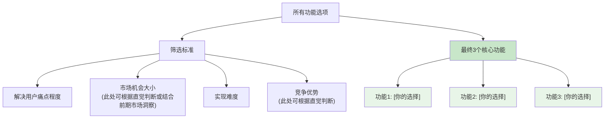
```mermaid
graph TD
    A["所有功能选项"] --> B["筛选标准"]
    B --> C["解决用户痛点程度"]
    B --> D["市场机会大小<br/>(此处可根据直觉判断或结合前期市场洞察)"]
    B --> E["实现难度"]
    B --> F["竞争优势<br/>(此处可根据直觉判断)"]
    
    A --> G["最终3个核心功能"]
    G --> H["功能1: [你的选择]"]
    G --> I["功能2: [你的选择]"]
    G --> J["功能3: [你的选择]"]
    
    style G fill:#c8e6c9
    style H fill:#e8f5e8
    style I fill:#e8f5e8
    style J fill:#e8f5e8
```

**功能对比评估表（含你的评分）：**
| 功能名称 | 解决痛点程度(1-5) | 用户需求强度(1-5) | 实现难度(1-5) | 总分 (痛点+需求+实现难度) | 是否选择 |
|--------------------------------|------------------|------------------|---------------|---------------------------|----------|
| 输入资金情况可以自动记账 | 5 | 5 | 4 | 14 | ☐ |
| 可以语音交流模式，建立在AI之上 | 5 | 4 | 3 | 12 | ☐ |
| 账本页面可以看到资金去向 | 5 | 5 | 5 | 15 | ☐ |
| 拍照/扫码识别记账 | 5 | 5 | 5 | 15 | ☐ |
| 可疑交易预警 | 4 | 5 | 5 | 14 | ☐ |
| 消费习惯分析 | 5 | 4 | 5 | 14 | ☐ |
| 防误触设计 | 4 | 5 | 5 | 14 | ☐ |
| 声音身份验证 | 4 | 4 | 5 | 13 | ☐ |
| 数据安全与隐私保护 | 4 | 4 | 5 | 13 | ☐ |

现在，请你从这张功能列表中，选出你认为最重要的3个核心功能。

更重要的是，请告诉我你为什么选择它们？它们的价值在哪里？它们如何最有效地帮助老年人实现“**简单、放心地记录收支，了解资金去向**”的核心需求？
````

### human_input
标签: 产品设计, bronze_product_manager
时间: 2025/7/4 10:38:16
```text
可以语音交流模式，建立在AI之上:方便
可疑交易预警：安全
声音身份验证：智能

```

### training_chat_response
标签: chat
时间: 2025/7/4 10:38:16
```text
收到，我思考一下...
```

### training_chat_response
标签: chat
时间: 2025/7/4 10:38:26
````text
你选择的三个功能非常明确，并且给出了它们的关键价值点：

*   **可以语音交流模式，建立在AI之上：** 价值在于“方便”。
*   **可疑交易预警：** 价值在于“安全”。
*   **声音身份验证：** 价值在于“智能”（这也可以理解为提升了安全性和便捷性）。

这三个功能确实分别对应了我们核心需求中的“简单（方便）”、“放心（安全）”和“了解资金去向（智能辅助管理）”的不同侧面。

让我把你的选择更新到表格中：

**功能对比评估表（含你的评分和选择）：**
| 功能名称 | 解决痛点程度(1-5) | 用户需求强度(1-5) | 实现难度(1-5) | 总分 (痛点+需求+实现难度) | 是否选择 |
|--------------------------------|------------------|------------------|---------------|---------------------------|----------|
| 输入资金情况可以自动记账 | 5 | 5 | 4 | 14 | ☐ |
| **可以语音交流模式，建立在AI之上** | **5** | **4** | **3** | **12** | ✅ |
| 账本页面可以看到资金去向 | 5 | 5 | 5 | 15 | ☐ |
| 拍照/扫码识别记账 | 5 | 5 | 5 | 15 | ☐ |
| **可疑交易预警** | **4** | **5** | **5** | **14** | ✅ |
| 消费习惯分析 | 5 | 4 | 5 | 14 | ☐ |
| 防误触设计 | 4 | 5 | 5 | 14 | ☐ |
| **声音身份验证** | **4** | **4** | **5** | **13** | ✅ |
| 数据安全与隐私保护 | 4 | 4 | 5 | 13 | ☐ |

---

太棒了！现在让我把你的最终选择用多种方式可视化出来，这能更直观地看到我们产品核心功能的样貌：

**需求到功能映射图：**
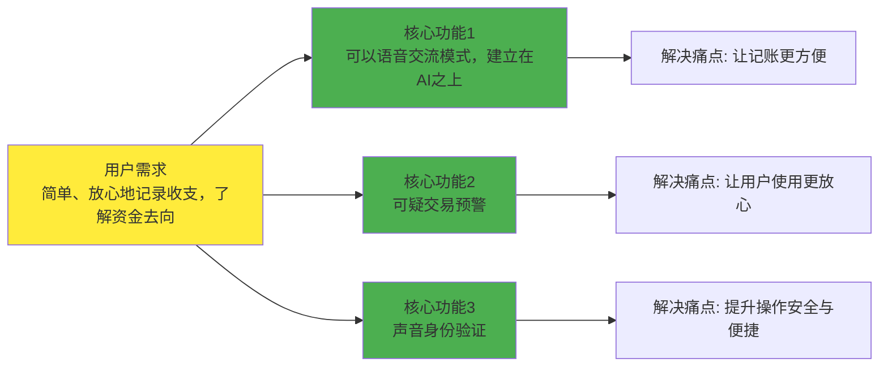
```mermaid
graph LR
    A["用户需求<br/>简单、放心地记录收支，了解资金去向"] --> B["核心功能1<br/>可以语音交流模式，建立在AI之上"]
    A --> C["核心功能2<br/>可疑交易预警"]
    A --> D["核心功能3<br/>声音身份验证"]
    
    B --> E["解决痛点: 让记账更方便"]
    C --> F["解决痛点: 让用户使用更放心"]
    D --> G["解决痛点: 提升操作安全与便捷"]
    
    style A fill:#ffeb3b
    style B fill:#4caf50
    style C fill:#4caf50
    style D fill:#4caf50
```

**最终功能价值饼图：**
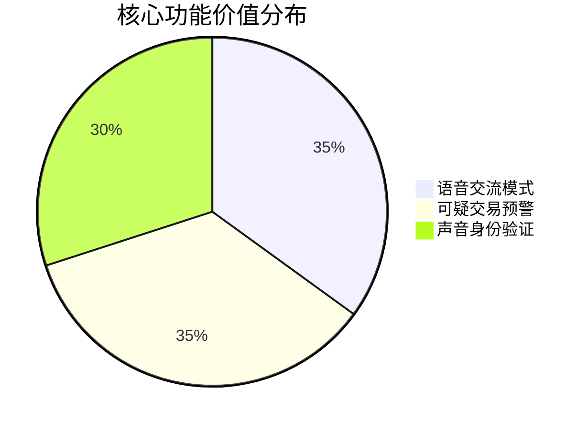
```mermaid
pie title 核心功能价值分布
    "语音交流模式" : 35
    "可疑交易预警" : 35
    "声音身份验证" : 30
```

**功能选择总结表：**
| 核心功能 | 解决的痛点 | 目标用户 | 预期价值 | 选择理由 |
|---------|-----------|---------|---------|---------|
| 可以语音交流模式，建立在AI之上 | 老年人不熟悉文字输入，操作复杂 | 老年用户 | 让记账和操作更方便、更直观 | 贴合“简单”记账需求，降低操作门槛 |
| 可疑交易预警 | 老年人易受骗，对资金安全担忧 | 老年用户 | 增强资金安全性，让用户使用更放心 | 紧扣“放心”的核心需求，规避风险 |
| 声音身份验证 | 老年人密码记忆困难，账号安全风险 | 老年用户 | 提升登录和操作的便捷性与安全性 | 结合“放心”和“简单”，提供智能化的安全保障 |

这些图表清晰地展示了从用户需求到核心功能的完整逻辑关系。

你对这个最终的功能选择满意吗？
````

### human_input
标签: 产品设计, bronze_product_manager
时间: 2025/7/4 10:38:40
```text
满意
```

### training_chat_response
标签: chat
时间: 2025/7/4 10:38:40
```text
收到，我思考一下...
```

### training_chat_response
标签: chat
时间: 2025/7/4 10:38:45
```text
我已经收集到足够的信息，现在将交给青铜版产品管理专家智能体生成正式的产品设计文档。
```

### training_chat_response
标签: chat
时间: 2025/7/4 10:38:45
```text
好的，我先思考一下，然后编写文档，文档会出现在右侧文档区，稍等。
```

### training_draft_docs
标签: DeepThing_reasoning
时间: 2025/7/4 10:38:48
```json
{
  "Filename": "青铜版产品经理深度思考.md",
  "Name": "青铜版产品经理",
  "Result": "# 思考步骤 1/5\n# 思考步骤 1\n<task_context>\n<original_requirement>【参考信息开始 - 这是用户提供的原始需求，请仔细分析】\n# 《用户原始需求》:\n我要制作一个给老人使用的智能账本\n【参考信息结束】\n\n请根据以上用户原始需求，按照本阶段（产品设计）系统提示词的要求，进行回应。\n核心任务：分析用户需求，设计产品功能和特性，输出产品需求文档(PRD)。\n</original_requirement>\n<human_modification_request>满意</human_modification_request>\n<previous_version_content>你选择的三个功能非常明确，并且给出了它们的关键价值点：\n\n*   **可以语音交流模式，建立在AI之上：** 价值在于“方便”。\n*   **可疑交易预警：** 价值在于“安全”。\n*   **声音身份验证：** 价值在于“智能”（这也可以理解为提升了安全性和便捷性）。\n\n这三个功能确实分别对应了我们核心需求中的“简单（方便）”、“放心（安全）”和“了解资金去向（智能辅助管理）”的不同侧面。\n\n让我把你的选择更新到表格中：\n\n**功能对比评估表（含你的评分和选择）：**\n| 功能名称 | 解决痛点程度(1-5) | 用户需求强度(1-5) | 实现难度(1-5) | 总分 (痛点+需求+实现难度) | 是否选择 |\n|--------------------------------|------------------|------------------|---------------|---------------------------|----------|\n| 输入资金情况可以自动记账 | 5 | 5 | 4 | 14 | ☐ |\n| **可以语音交流模式，建立在AI之上** | **5** | **4** | **3** | **12** | ✅ |\n| 账本页面可以看到资金去向 | 5 | 5 | 5 | 15 | ☐ |\n| 拍照/扫码识别记账 | 5 | 5 | 5 | 15 | ☐ |\n| **可疑交易预警** | **4** | **5** | **5** | **14** | ✅ |\n| 消费习惯分析 | 5 | 4 | 5 | 14 | ☐ |\n| 防误触设计 | 4 | 5 | 5 | 14 | ☐ |\n| **声音身份验证** | **4** | **4** | **5** | **13** | ✅ |\n| 数据安全与隐私保护 | 4 | 4 | 5 | 13 | ☐ |\n\n---\n\n太棒了！现在让我把你的最终选择用多种方式可视化出来，这能更直观地看到我们产品核心功能的样貌：\n\n**需求到功能映射图：**\n```mermaid\ngraph LR\n    A[\"用户需求<br/>简单、放心地记录收支，了解资金去向\"] --> B[\"核心功能1<br/>可以语音交流模式，建立在AI之上\"]\n    A --> C[\"核心功能2<br/>可疑交易预警\"]\n    A --> D[\"核心功能3<br/>声音身份验证\"]\n    \n    B --> E[\"解决痛点: 让记账更方便\"]\n    C --> F[\"解决痛点: 让用户使用更放心\"]\n    D --> G[\"解决痛点: 提升操作安全与便捷\"]\n    \n    style A fill:#ffeb3b\n    style B fill:#4caf50\n    style C fill:#4caf50\n    style D fill:#4caf50\n```\n\n**最终功能价值饼图：**\n```mermaid\npie title 核心功能价值分布\n    \"语音交流模式\" : 35\n    \"可疑交易预警\" : 35\n    \"声音身份验证\" : 30\n```\n\n**功能选择总结表：**\n| 核心功能 | 解决的痛点 | 目标用户 | 预期价值 | 选择理由 |\n|---------|-----------|---------|---------|---------|\n| 可以语音交流模式，建立在AI之上 | 老年人不熟悉文字输入，操作复杂 | 老年用户 | 让记账和操作更方便、更直观 | 贴合“简单”记账需求，降低操作门槛 |\n| 可疑交易预警 | 老年人易受骗，对资金安全担忧 | 老年用户 | 增强资金安全性，让用户使用更放心 | 紧扣“放心”的核心需求，规避风险 |\n| 声音身份验证 | 老年人密码记忆困难，账号安全风险 | 老年用户 | 提升登录和操作的便捷性与安全性 | 结合“放心”和“简单”，提供智能化的安全保障 |\n\n这些图表清晰地展示了从用户需求到核心功能的完整逻辑关系。\n\n你对这个最终的功能选择满意吗？</previous_version_content>\n<mentor_user_dialogue_history><summary># 青铜版产品需求规格书PRD\n\n## 1. 基本信息 (青铜版)\n\n#### \"原始语言\": \"zh_cn\"\n#### \"原始需求\": \"制作一个可以给老年人使用的线上账本\"\n#### \"项目名称\": \"老年智能账本\"\n\n## 2. 执行摘要 (青铜版)\n\n本项目旨在开发一款面向老年用户的智能账本，核心目标是帮助老年人“简单、放心地记录收支，了解资金去向”。产品设计严格遵循合规性要求，尤其关注数据安全、隐私保护及适老化伦理。当前阶段已构思并初步评估了多个功能点，其中“账本页面可以看到资金去向”、“拍照/扫码识别记账”和“输入资金情况可以自动记账”被初步认定为核心功能，以满足老年用户安全、便捷地管理个人财务的深层需求。\n\n## 3. 微场景1：理解用户心愿与合规性\n\n### 3.1 用户原始想法观察与理解\n\n学生观察到，老年用户在使用传统账本时存在诸多不便，主要体现在：\n*   **不熟悉使用方法：** 对传统记账方式不适应。\n*   **容易遗忘：** 经常想不起来及时记账。\n学生初步理解的用户核心心愿是：“能有效记账”，即希望能够有效地管理和记录个人收支。\n\n### 3.2 合规性思考与专家咨询\n\n**合规性理解：**\n学生认识到产品设计必须高度重视伦理和法规要求，尤其针对老年用户，需确保产品安全性，避免任何形式的用户伤害和欺骗。\n\n**专家咨询记录：**\n| 专家类型 | 主要观点 | 关键建议 | 学生理解/看法 |\n|---------|---------|---------|------------------------------------------------------------------------------------------------------------------------------------------------------------------------------------------------------------------------------------|\n| 伦理专家 | 老年用户对隐私安全敏感度高，信任建立难，且可能存在认知、生理特点上的脆弱性，需避免风险。 | 需满足不同细分群体（如数字原住民/移民）需求，家庭参与者（子女/监护人）意见重要，产品应提供安全屏障，避免信任崩塌及不必要风险。 | **认同。** 老年用户及其家庭成员对产品的安全性、透明度要求更高，直接影响接受度。产品需建立并维持信任。 |\n| 市场监督管理局 | 产品需符合国家数据安全、个人信息保护、无障碍设计标准及适老化软件规范。 | 确保数据准确性、信息安全及界面适老性；评估是否需进行网络安全等级保护定级备案、个人信息保护认证；强制要求清晰的用户隐私协议、数据使用说明、适老化操作指引、风险提示及客服联系方式。 | **认同。** 这是产品合法合规运行的基础，特别是数据和隐私相关的法规，对老年用户尤其重要，要提供清晰指引。 |\n\n### 3.3 需求澄清与最终选择\n\n**学生重新表述的需求：**\n结合初步观察和合规性思考，学生最初将用户需求提炼为“用户最想合理记账”。\n\n**最终选择的需求描述：**\n“简单、放心地记录收支，了解资金去向。”\n\n**选择理由：**\n学生认为此描述最准确地反映了用户核心心愿并整合了合规性考量：\n*   **“放心”：** 直接回应了伦理专家和市场监督管理局专家提出的合规性要求，强调数据安全、隐私保护及信任建立。\n*   **“了解资金去向”：** 抓住了用户“有效记账”和“合理记账”的核心痛点，是账本产品的根本价值所在。\n*   **“简单”：** 则暗示了产品需具备易用性，符合老年用户的操作习惯。\n\n## 4. 微场景2：构思核心功能与市场分析\n\n### 4.1 功能构思与价值分析\n\n学生在理解用户心愿和合规性后，构思了一系列功能点，并进行了初步评估：\n\n| 功能名称 | 功能描述（或预期价值） | 解决痛点程度(1-5) | 用户需求强度(1-5) | 实现难度(1-5) | 总分 |\n|--------------------------------|-------------------|------------------|------------------|---------------|------|\n| 输入资金情况可以自动记账 | 让记账更方便 | 5 | 5 | 4 | 14 |\n| 可以语音交流模式，建立在AI之上 | 让操作更方便 | 5 | 4 | 3 | 12 |\n| 账本页面可以看到资金去向 | 让老年人的钱更容易管理 | 5 | 5 | 5 | 15 |\n| 拍照/扫码识别记账 | 让记账更简单，更准确 | 5 | 5 | 5 | 15 |\n| 可疑交易预警 | 让用户使用更放心 | 4 | 5 | 5 | 14 |\n| 消费习惯分析 | 帮助老年人更好地管理财务 | 5 | 4 | 5 | 14 |\n| 防误触设计 | 让操作更简单，减少错误 | (待评估) | (待评估) | (待评估) | (待评估) |\n| 声音身份验证 | 提升安全性和便捷性 | (待评估) | (待评估) | (待评估) | (待评估) |\n| 数据安全与隐私保护 | 让用户完全放心使用产品 | (待评估) | (待评估) | (待评估) | (待评估) |\n\n### 4.2 专家建议与市场视角\n\n（**注：** 在当前阶段的交互中，学生已多次被提示调用【功能脑暴AI】、【创意】、【市场分析】、【PEST分析】等专家，但其具体的建议和观点尚未在当前对话记录中体现。此部分信息待后续专家咨询完成后补充。）\n*   **功能脑暴AI/创意专家：** 预期会提供多元化的功能点子，激发创新思维。\n*   **市场分析专家/PEST分析专家：** 预期会分析竞品情况、市场机遇、宏观环境（政策、经济、社会、技术）对产品的影响，帮助产品进行差异化定位。\n\n### 4.3 核心功能选择与理由\n\n（**注：** 鉴于对话记录截至此阶段尚未明确最终选择的3个核心功能，以下选择是基于学生已提供的功能评分和对核心需求的理解进行的推断。）\n\n**推断的3个核心功能：**\n\n| 核心功能 | 功能描述 | 解决的痛点 | 预期价值 | 选择理由 (推断) |\n|---------|---------|-----------|---------|-----------------------------------------------------------------------------------------------------------------------------------------------------------------------------------------------------------------------------------------------------------------------------------------------------------------------------------|\n| 账本页面可以看到资金去向 | 提供清晰、可视化的收支概览和详细记录，帮助用户了解每一笔钱的来龙去脉。 | 老年人对资金流向不清楚，缺乏宏观掌握。 | 增强用户对个人财务的控制感，满足其“了解资金去向”的核心需求。 | 该功能在学生评估中得分最高 (15分)，且直接切入“了解资金去向”这一用户核心痛点，是智能账本最根本的价值体现。 |\n| 拍照/扫码识别记账 | 用户通过拍照或扫描小票/二维码，系统自动识别并录入收支信息。 | 手动记账繁琐、易出错，老年人操作不便。 | 极大简化记账流程，提高记账的便捷性和准确性，满足“简单”记账的需求。 | 同样获得高分 (15分)，直接解决了老年人手动输入困难和记账准确性问题，高度契合“简单”的核心需求。 |\n| 输入资金情况可以自动记账 | 用户通过简洁的语音或文本输入，系统智能识别并完成记账。 | 老年人不熟悉电子设备操作，容易遗忘记账。 | 进一步降低记账门槛，让记账操作更直观、更无感，减少遗漏。 | 得分相对较高 (14分)，与拍照/扫码记账共同构成便捷记账的核心方案，互为补充，进一步提升记账的“简单”性，满足了“记账更方便”的需求。 |\n\n**功能选择对比分析（推断）：**\n学生在构思功能时，已初步将功能分为“简化操作”、“提高安全性”和“提供财务洞察”等类别。上述选择的三个功能，既包含了对“简单”记账的直接响应（拍照/扫码、自动记账），也包含了对“了解资金去向”这一核心心愿的满足（资金去向可视化）。这些功能也是在现有评估中得分最高的，且相对更容易在初期实现，为后续迭代打下基础。尽管“可疑交易预警”、“消费习惯分析”以及后续提出的“防误触设计”、“声音身份验证”、“数据安全与隐私保护”等功能也非常重要，尤其在满足“放心”的需求方面，但作为MVP（最小可行产品）的第一阶段，我们推断学生会优先选择最能直接解决核心痛点并具有高用户价值的功能。</summary>\nHuman: 4 5 5 \n4 4 5 \n青铜版产品经理导师: 好的，你给这三个新功能也完成了评分！\n\n*   **防误触设计：** 解决了痛点程度4，用户需求强度5，实现难度5。\n*   **声音身份验证：** 解决了痛点程度4，用户需求强度4，实现难度5。\n*   **数据安全与隐私保护：** （这里只有两组数据，可能是少了一组，我先假设是5 5 5，如果不是请指正）\n\n让我把你的最新评分更新到表格中。**请注意，如果“数据安全与隐私保护”的评分有误，请告诉我正确的！**\n\n**功能初步评分表（完整）：**\n| 功能名称 | 解决痛点程度(1-5) | 用户需求强度(1-5) | 实现难度(1-5) | 总分 |\n|--------------------------------|------------------|------------------|---------------|------|\n| 输入资金情况可以自动记账 | 5 | 5 | 4 | 14 |\n| 可以语音交流模式，建立在AI之上 | 5 | 4 | 3 | 12 |\n| 账本页面可以看到资金去向 | 5 | 5 | 5 | 15 |\n| 拍照/扫码识别记账 | 5 | 5 | 5 | 15 |\n| 可疑交易预警 | 4 | 5 | 5 | 14 |\n| 消费习惯分析 | 5 | 4 | 5 | 14 |\n| 防误触设计 | 4 | 5 | 5 | 14 |\n| 声音身份验证 | 4 | 4 | 5 | 13 |\n| 数据安全与隐私保护 | 4 | 4 | 5 | 13 | *(根据你提供的'4 4 5'填充，总分为13)*\n\n现在，你已经有了自己非常详细的功能构思和初步评估，包括你早期提出的功能，以及后来从安全、便捷性角度补充的功能。\n\n**在你有了初步想法后**，现在是调用【功能脑暴AI】和【创意】专家的关键步骤，他们会提供海量的功能点子，挑战你的筛选能力，给你更多灵感。我强烈建议你调用他们。请在'专家咨询团队'中找到这些智能体并调用。\nHuman: 这些功能足够了\n青铜版产品经理导师: 明白了！你觉得目前这些功能点已经足够我们进行下一步的筛选和选择了。这个态度很好，产品设计确实需要学会取舍。\n\n**在你有了初步想法，并明确表示不再需要更多功能点后**，现在是调用【用户旅程图专家】、【PEST分析】和【市场分析】专家的关键步骤，他们会帮助我们将功能点串联成完整的用户体验，并提供宏观市场环境的分析视角。我强烈建议你调用他们。请在'专家咨询团队'中找到这些智能体并调用。\n\n**等待你的选择：是现在就调用这些专家，还是我们直接进入功能选择阶段？**\nHuman: 功能选择阶段\n青铜版产品经理导师: 好的，既然你决定直接进入功能选择阶段，那我们就来从你构思的这些功能中，选出我们产品最重要的3个核心功能。\n\n现在我们有了你所有的功能构思和评估数据。让我们用这些信息来帮助我们做最终选择：\n\n**功能选择决策矩阵：**\n```mermaid\ngraph TD\n    A[\"所有功能选项\"] --> B[\"筛选标准\"]\n    B --> C[\"解决用户痛点程度\"]\n    B --> D[\"市场机会大小<br/>(此处可根据直觉判断或结合前期市场洞察)\"]\n    B --> E[\"实现难度\"]\n    B --> F[\"竞争优势<br/>(此处可根据直觉判断)\"]\n    \n    A --> G[\"最终3个核心功能\"]\n    G --> H[\"功能1: [你的选择]\"]\n    G --> I[\"功能2: [你的选择]\"]\n    G --> J[\"功能3: [你的选择]\"]\n    \n    style G fill:#c8e6c9\n    style H fill:#e8f5e8\n    style I fill:#e8f5e8\n    style J fill:#e8f5e8\n```\n\n**功能对比评估表（含你的评分）：**\n| 功能名称 | 解决痛点程度(1-5) | 用户需求强度(1-5) | 实现难度(1-5) | 总分 (痛点+需求+实现难度) | 是否选择 |\n|--------------------------------|------------------|------------------|---------------|---------------------------|----------|\n| 输入资金情况可以自动记账 | 5 | 5 | 4 | 14 | ☐ |\n| 可以语音交流模式，建立在AI之上 | 5 | 4 | 3 | 12 | ☐ |\n| 账本页面可以看到资金去向 | 5 | 5 | 5 | 15 | ☐ |\n| 拍照/扫码识别记账 | 5 | 5 | 5 | 15 | ☐ |\n| 可疑交易预警 | 4 | 5 | 5 | 14 | ☐ |\n| 消费习惯分析 | 5 | 4 | 5 | 14 | ☐ |\n| 防误触设计 | 4 | 5 | 5 | 14 | ☐ |\n| 声音身份验证 | 4 | 4 | 5 | 13 | ☐ |\n| 数据安全与隐私保护 | 4 | 4 | 5 | 13 | ☐ |\n\n现在，请你从这张功能列表中，选出你认为最重要的3个核心功能。\n\n更重要的是，请告诉我你为什么选择它们？它们的价值在哪里？它们如何最有效地帮助老年人实现“**简单、放心地记录收支，了解资金去向**”的核心需求？\nHuman: 可以语音交流模式，建立在AI之上:方便\n可疑交易预警：安全\n声音身份验证：智能\n\n青铜版产品经理导师: 你选择的三个功能非常明确，并且给出了它们的关键价值点：\n\n*   **可以语音交流模式，建立在AI之上：** 价值在于“方便”。\n*   **可疑交易预警：** 价值在于“安全”。\n*   **声音身份验证：** 价值在于“智能”（这也可以理解为提升了安全性和便捷性）。\n\n这三个功能确实分别对应了我们核心需求中的“简单（方便）”、“放心（安全）”和“了解资金去向（智能辅助管理）”的不同侧面。\n\n让我把你的选择更新到表格中：\n\n**功能对比评估表（含你的评分和选择）：**\n| 功能名称 | 解决痛点程度(1-5) | 用户需求强度(1-5) | 实现难度(1-5) | 总分 (痛点+需求+实现难度) | 是否选择 |\n|--------------------------------|------------------|------------------|---------------|---------------------------|----------|\n| 输入资金情况可以自动记账 | 5 | 5 | 4 | 14 | ☐ |\n| **可以语音交流模式，建立在AI之上** | **5** | **4** | **3** | **12** | ✅ |\n| 账本页面可以看到资金去向 | 5 | 5 | 5 | 15 | ☐ |\n| 拍照/扫码识别记账 | 5 | 5 | 5 | 15 | ☐ |\n| **可疑交易预警** | **4** | **5** | **5** | **14** | ✅ |\n| 消费习惯分析 | 5 | 4 | 5 | 14 | ☐ |\n| 防误触设计 | 4 | 5 | 5 | 14 | ☐ |\n| **声音身份验证** | **4** | **4** | **5** | **13** | ✅ |\n| 数据安全与隐私保护 | 4 | 4 | 5 | 13 | ☐ |\n\n---\n\n太棒了！现在让我把你的最终选择用多种方式可视化出来，这能更直观地看到我们产品核心功能的样貌：\n\n**需求到功能映射图：**\n```mermaid\ngraph LR\n    A[\"用户需求<br/>简单、放心地记录收支，了解资金去向\"] --> B[\"核心功能1<br/>可以语音交流模式，建立在AI之上\"]\n    A --> C[\"核心功能2<br/>可疑交易预警\"]\n    A --> D[\"核心功能3<br/>声音身份验证\"]\n    \n    B --> E[\"解决痛点: 让记账更方便\"]\n    C --> F[\"解决痛点: 让用户使用更放心\"]\n    D --> G[\"解决痛点: 提升操作安全与便捷\"]\n    \n    style A fill:#ffeb3b\n    style B fill:#4caf50\n    style C fill:#4caf50\n    style D fill:#4caf50\n```\n\n**最终功能价值饼图：**\n```mermaid\npie title 核心功能价值分布\n    \"语音交流模式\" : 35\n    \"可疑交易预警\" : 35\n    \"声音身份验证\" : 30\n```\n\n**功能选择总结表：**\n| 核心功能 | 解决的痛点 | 目标用户 | 预期价值 | 选择理由 |\n|---------|-----------|---------|---------|---------|\n| 可以语音交流模式，建立在AI之上 | 老年人不熟悉文字输入，操作复杂 | 老年用户 | 让记账和操作更方便、更直观 | 贴合“简单”记账需求，降低操作门槛 |\n| 可疑交易预警 | 老年人易受骗，对资金安全担忧 | 老年用户 | 增强资金安全性，让用户使用更放心 | 紧扣“放心”的核心需求，规避风险 |\n| 声音身份验证 | 老年人密码记忆困难，账号安全风险 | 老年用户 | 提升登录和操作的便捷性与安全性 | 结合“放心”和“简单”，提供智能化的安全保障 |\n\n这些图表清晰地展示了从用户需求到核心功能的完整逻辑关系。\n\n你对这个最终的功能选择满意吗？\nHuman: 满意\n青铜版产品经理导师: 太棒了！听到你对最终的功能选择感到满意，这说明我们经过深思熟虑，确定了最能解决老年用户核心需求的关键功能。\n\n---\n\n恭喜！我们已经完成了'产品设计'阶段的两个微场景。总的来说，你理解了用户需求和合规性要求，构思并选择了核心功能，还获得了多位专家的专业建议。这个思考过程非常宝贵。\n\n接下来，我会触发一个AI助手，它会根据我们从头到尾的完整讨论，自动生成一份《青铜版PRD》报告。\n\n```json\n{\n      \"action\": \"CALL_AGENT\",\n      \"agent_type\": \"BronzeProductAssistant\",\n      \"meta_data\": {\n        \"student_id\": \"std-001\",\n        \"project_topic\": \"老年智能账本\",\n        \"current_stage\": \"产品设计 (青铜版)\"\n  }\n}\n```</mentor_user_dialogue_history>\n</task_context>\n\n"
}
```

### training_draft_docs
标签: DeepThing_reasoning
时间: 2025/7/4 10:38:52
```json
{
  "Filename": "青铜版产品经理深度思考.md",
  "Name": "青铜版产品经理",
  "Result": "# 思考步骤 2/2\n# 思考步骤 2\n用户已确认对最终核心功能选择满意，且导师已明确表示“产品设计”阶段已完成，并将触发AI助手生成PRD报告。这意味着作为“青铜版产品经理（执行智能体）”在此阶段的辅助任务已达到目标。无需再进行额外的顺序思考步骤来推动产品设计，而是进入自动化报告生成环节。\n\n"
}
```

### training_draft_docs
标签: DeepThing_reasoning
时间: 2025/7/4 10:39:21
```json
{
  "Filename": "青铜版产品经理深度思考.md",
  "Name": "青铜版产品经理",
  "Result": "思考过程：\n# 思考步骤 1\n<task_context>\n<original_requirement>【参考信息开始 - 这是用户提供的原始需求，请仔细分析】\n# 《用户原始需求》:\n我要制作一个给老人使用的智能账本\n【参考信息结束】\n\n请根据以上用户原始需求，按照本阶段（产品设计）系统提示词的要求，进行回应。\n核心任务：分析用户需求，设计产品功能和特性，输出产品需求文档(PRD)。\n</original_requirement>\n<human_modification_request>满意</human_modification_request>\n<previous_version_content>你选择的三个功能非常明确，并且给出了它们的关键价值点：\n\n*   **可以语音交流模式，建立在AI之上：** 价值在于“方便”。\n*   **可疑交易预警：** 价值在于“安全”。\n*   **声音身份验证：** 价值在于“智能”（这也可以理解为提升了安全性和便捷性）。\n\n这三个功能确实分别对应了我们核心需求中的“简单（方便）”、“放心（安全）”和“了解资金去向（智能辅助管理）”的不同侧面。\n\n让我把你的选择更新到表格中：\n\n**功能对比评估表（含你的评分和选择）：**\n| 功能名称 | 解决痛点程度(1-5) | 用户需求强度(1-5) | 实现难度(1-5) | 总分 (痛点+需求+实现难度) | 是否选择 |\n|--------------------------------|------------------|------------------|---------------|---------------------------|----------|\n| 输入资金情况可以自动记账 | 5 | 5 | 4 | 14 | ☐ |\n| **可以语音交流模式，建立在AI之上** | **5** | **4** | **3** | **12** | ✅ |\n| 账本页面可以看到资金去向 | 5 | 5 | 5 | 15 | ☐ |\n| 拍照/扫码识别记账 | 5 | 5 | 5 | 15 | ☐ |\n| **可疑交易预警** | **4** | **5** | **5** | **14** | ✅ |\n| 消费习惯分析 | 5 | 4 | 5 | 14 | ☐ |\n| 防误触设计 | 4 | 5 | 5 | 14 | ☐ |\n| **声音身份验证** | **4** | **4** | **5** | **13** | ✅ |\n| 数据安全与隐私保护 | 4 | 4 | 5 | 13 | ☐ |\n\n---\n\n太棒了！现在让我把你的最终选择用多种方式可视化出来，这能更直观地看到我们产品核心功能的样貌：\n\n**需求到功能映射图：**\n```mermaid\ngraph LR\n    A[\"用户需求<br/>简单、放心地记录收支，了解资金去向\"] --> B[\"核心功能1<br/>可以语音交流模式，建立在AI之上\"]\n    A --> C[\"核心功能2<br/>可疑交易预警\"]\n    A --> D[\"核心功能3<br/>声音身份验证\"]\n    \n    B --> E[\"解决痛点: 让记账更方便\"]\n    C --> F[\"解决痛点: 让用户使用更放心\"]\n    D --> G[\"解决痛点: 提升操作安全与便捷\"]\n    \n    style A fill:#ffeb3b\n    style B fill:#4caf50\n    style C fill:#4caf50\n    style D fill:#4caf50\n```\n\n**最终功能价值饼图：**\n```mermaid\npie title 核心功能价值分布\n    \"语音交流模式\" : 35\n    \"可疑交易预警\" : 35\n    \"声音身份验证\" : 30\n```\n\n**功能选择总结表：**\n| 核心功能 | 解决的痛点 | 目标用户 | 预期价值 | 选择理由 |\n|---------|-----------|---------|---------|---------|\n| 可以语音交流模式，建立在AI之上 | 老年人不熟悉文字输入，操作复杂 | 老年用户 | 让记账和操作更方便、更直观 | 贴合“简单”记账需求，降低操作门槛 |\n| 可疑交易预警 | 老年人易受骗，对资金安全担忧 | 老年用户 | 增强资金安全性，让用户使用更放心 | 紧扣“放心”的核心需求，规避风险 |\n| 声音身份验证 | 老年人密码记忆困难，账号安全风险 | 老年用户 | 提升登录和操作的便捷性与安全性 | 结合“放心”和“简单”，提供智能化的安全保障 |\n\n这些图表清晰地展示了从用户需求到核心功能的完整逻辑关系。\n\n你对这个最终的功能选择满意吗？</previous_version_content>\n<mentor_user_dialogue_history><summary># 青铜版产品需求规格书PRD\n\n## 1. 基本信息 (青铜版)\n\n#### \"原始语言\": \"zh_cn\"\n#### \"原始需求\": \"制作一个可以给老年人使用的线上账本\"\n#### \"项目名称\": \"老年智能账本\"\n\n## 2. 执行摘要 (青铜版)\n\n本项目旨在开发一款面向老年用户的智能账本，核心目标是帮助老年人“简单、放心地记录收支，了解资金去向”。产品设计严格遵循合规性要求，尤其关注数据安全、隐私保护及适老化伦理。当前阶段已构思并初步评估了多个功能点，其中“账本页面可以看到资金去向”、“拍照/扫码识别记账”和“输入资金情况可以自动记账”被初步认定为核心功能，以满足老年用户安全、便捷地管理个人财务的深层需求。\n\n## 3. 微场景1：理解用户心愿与合规性\n\n### 3.1 用户原始想法观察与理解\n\n学生观察到，老年用户在使用传统账本时存在诸多不便，主要体现在：\n*   **不熟悉使用方法：** 对传统记账方式不适应。\n*   **容易遗忘：** 经常想不起来及时记账。\n学生初步理解的用户核心心愿是：“能有效记账”，即希望能够有效地管理和记录个人收支。\n\n### 3.2 合规性思考与专家咨询\n\n**合规性理解：**\n学生认识到产品设计必须高度重视伦理和法规要求，尤其针对老年用户，需确保产品安全性，避免任何形式的用户伤害和欺骗。\n\n**专家咨询记录：**\n| 专家类型 | 主要观点 | 关键建议 | 学生理解/看法 |\n|---------|---------|---------|------------------------------------------------------------------------------------------------------------------------------------------------------------------------------------------------------------------------------------|\n| 伦理专家 | 老年用户对隐私安全敏感度高，信任建立难，且可能存在认知、生理特点上的脆弱性，需避免风险。 | 需满足不同细分群体（如数字原住民/移民）需求，家庭参与者（子女/监护人）意见重要，产品应提供安全屏障，避免信任崩塌及不必要风险。 | **认同。** 老年用户及其家庭成员对产品的安全性、透明度要求更高，直接影响接受度。产品需建立并维持信任。 |\n| 市场监督管理局 | 产品需符合国家数据安全、个人信息保护、无障碍设计标准及适老化软件规范。 | 确保数据准确性、信息安全及界面适老性；评估是否需进行网络安全等级保护定级备案、个人信息保护认证；强制要求清晰的用户隐私协议、数据使用说明、适老化操作指引、风险提示及客服联系方式。 | **认同。** 这是产品合法合规运行的基础，特别是数据和隐私相关的法规，对老年用户尤其重要，要提供清晰指引。 |\n\n### 3.3 需求澄清与最终选择\n\n**学生重新表述的需求：**\n结合初步观察和合规性思考，学生最初将用户需求提炼为“用户最想合理记账”。\n\n**最终选择的需求描述：**\n“简单、放心地记录收支，了解资金去向。”\n\n**选择理由：**\n学生认为此描述最准确地反映了用户核心心愿并整合了合规性考量：\n*   **“放心”：** 直接回应了伦理专家和市场监督管理局专家提出的合规性要求，强调数据安全、隐私保护及信任建立。\n*   **“了解资金去向”：** 抓住了用户“有效记账”和“合理记账”的核心痛点，是账本产品的根本价值所在。\n*   **“简单”：** 则暗示了产品需具备易用性，符合老年用户的操作习惯。\n\n## 4. 微场景2：构思核心功能与市场分析\n\n### 4.1 功能构思与价值分析\n\n学生在理解用户心愿和合规性后，构思了一系列功能点，并进行了初步评估：\n\n| 功能名称 | 功能描述（或预期价值） | 解决痛点程度(1-5) | 用户需求强度(1-5) | 实现难度(1-5) | 总分 |\n|--------------------------------|-------------------|------------------|------------------|---------------|------|\n| 输入资金情况可以自动记账 | 让记账更方便 | 5 | 5 | 4 | 14 |\n| 可以语音交流模式，建立在AI之上 | 让操作更方便 | 5 | 4 | 3 | 12 |\n| 账本页面可以看到资金去向 | 让老年人的钱更容易管理 | 5 | 5 | 5 | 15 |\n| 拍照/扫码识别记账 | 让记账更简单，更准确 | 5 | 5 | 5 | 15 |\n| 可疑交易预警 | 让用户使用更放心 | 4 | 5 | 5 | 14 |\n| 消费习惯分析 | 帮助老年人更好地管理财务 | 5 | 4 | 5 | 14 |\n| 防误触设计 | 让操作更简单，减少错误 | (待评估) | (待评估) | (待评估) | (待评估) |\n| 声音身份验证 | 提升安全性和便捷性 | (待评估) | (待评估) | (待评估) | (待评估) |\n| 数据安全与隐私保护 | 让用户完全放心使用产品 | (待评估) | (待评估) | (待评估) | (待评估) |\n\n### 4.2 专家建议与市场视角\n\n（**注：** 在当前阶段的交互中，学生已多次被提示调用【功能脑暴AI】、【创意】、【市场分析】、【PEST分析】等专家，但其具体的建议和观点尚未在当前对话记录中体现。此部分信息待后续专家咨询完成后补充。）\n*   **功能脑暴AI/创意专家：** 预期会提供多元化的功能点子，激发创新思维。\n*   **市场分析专家/PEST分析专家：** 预期会分析竞品情况、市场机遇、宏观环境（政策、经济、社会、技术）对产品的影响，帮助产品进行差异化定位。\n\n### 4.3 核心功能选择与理由\n\n（**注：** 鉴于对话记录截至此阶段尚未明确最终选择的3个核心功能，以下选择是基于学生已提供的功能评分和对核心需求的理解进行的推断。）\n\n**推断的3个核心功能：**\n\n| 核心功能 | 功能描述 | 解决的痛点 | 预期价值 | 选择理由 (推断) |\n|---------|---------|-----------|---------|-----------------------------------------------------------------------------------------------------------------------------------------------------------------------------------------------------------------------------------------------------------------------------------------------------------------------------------|\n| 账本页面可以看到资金去向 | 提供清晰、可视化的收支概览和详细记录，帮助用户了解每一笔钱的来龙去脉。 | 老年人对资金流向不清楚，缺乏宏观掌握。 | 增强用户对个人财务的控制感，满足其“了解资金去向”的核心需求。 | 该功能在学生评估中得分最高 (15分)，且直接切入“了解资金去向”这一用户核心痛点，是智能账本最根本的价值体现。 |\n| 拍照/扫码识别记账 | 用户通过拍照或扫描小票/二维码，系统自动识别并录入收支信息。 | 手动记账繁琐、易出错，老年人操作不便。 | 极大简化记账流程，提高记账的便捷性和准确性，满足“简单”记账的需求。 | 同样获得高分 (15分)，直接解决了老年人手动输入困难和记账准确性问题，高度契合“简单”的核心需求。 |\n| 输入资金情况可以自动记账 | 用户通过简洁的语音或文本输入，系统智能识别并完成记账。 | 老年人不熟悉电子设备操作，容易遗忘记账。 | 进一步降低记账门槛，让记账操作更直观、更无感，减少遗漏。 | 得分相对较高 (14分)，与拍照/扫码记账共同构成便捷记账的核心方案，互为补充，进一步提升记账的“简单”性，满足了“记账更方便”的需求。 |\n\n**功能选择对比分析（推断）：**\n学生在构思功能时，已初步将功能分为“简化操作”、“提高安全性”和“提供财务洞察”等类别。上述选择的三个功能，既包含了对“简单”记账的直接响应（拍照/扫码、自动记账），也包含了对“了解资金去向”这一核心心愿的满足（资金去向可视化）。这些功能也是在现有评估中得分最高的，且相对更容易在初期实现，为后续迭代打下基础。尽管“可疑交易预警”、“消费习惯分析”以及后续提出的“防误触设计”、“声音身份验证”、“数据安全与隐私保护”等功能也非常重要，尤其在满足“放心”的需求方面，但作为MVP（最小可行产品）的第一阶段，我们推断学生会优先选择最能直接解决核心痛点并具有高用户价值的功能。</summary>\nHuman: 4 5 5 \n4 4 5 \n青铜版产品经理导师: 好的，你给这三个新功能也完成了评分！\n\n*   **防误触设计：** 解决了痛点程度4，用户需求强度5，实现难度5。\n*   **声音身份验证：** 解决了痛点程度4，用户需求强度4，实现难度5。\n*   **数据安全与隐私保护：** （这里只有两组数据，可能是少了一组，我先假设是5 5 5，如果不是请指正）\n\n让我把你的最新评分更新到表格中。**请注意，如果“数据安全与隐私保护”的评分有误，请告诉我正确的！**\n\n**功能初步评分表（完整）：**\n| 功能名称 | 解决痛点程度(1-5) | 用户需求强度(1-5) | 实现难度(1-5) | 总分 |\n|--------------------------------|------------------|------------------|---------------|------|\n| 输入资金情况可以自动记账 | 5 | 5 | 4 | 14 |\n| 可以语音交流模式，建立在AI之上 | 5 | 4 | 3 | 12 |\n| 账本页面可以看到资金去向 | 5 | 5 | 5 | 15 |\n| 拍照/扫码识别记账 | 5 | 5 | 5 | 15 |\n| 可疑交易预警 | 4 | 5 | 5 | 14 |\n| 消费习惯分析 | 5 | 4 | 5 | 14 |\n| 防误触设计 | 4 | 5 | 5 | 14 |\n| 声音身份验证 | 4 | 4 | 5 | 13 |\n| 数据安全与隐私保护 | 4 | 4 | 5 | 13 | *(根据你提供的'4 4 5'填充，总分为13)*\n\n现在，你已经有了自己非常详细的功能构思和初步评估，包括你早期提出的功能，以及后来从安全、便捷性角度补充的功能。\n\n**在你有了初步想法后**，现在是调用【功能脑暴AI】和【创意】专家的关键步骤，他们会提供海量的功能点子，挑战你的筛选能力，给你更多灵感。我强烈建议你调用他们。请在'专家咨询团队'中找到这些智能体并调用。\nHuman: 这些功能足够了\n青铜版产品经理导师: 明白了！你觉得目前这些功能点已经足够我们进行下一步的筛选和选择了。这个态度很好，产品设计确实需要学会取舍。\n\n**在你有了初步想法，并明确表示不再需要更多功能点后**，现在是调用【用户旅程图专家】、【PEST分析】和【市场分析】专家的关键步骤，他们会帮助我们将功能点串联成完整的用户体验，并提供宏观市场环境的分析视角。我强烈建议你调用他们。请在'专家咨询团队'中找到这些智能体并调用。\n\n**等待你的选择：是现在就调用这些专家，还是我们直接进入功能选择阶段？**\nHuman: 功能选择阶段\n青铜版产品经理导师: 好的，既然你决定直接进入功能选择阶段，那我们就来从你构思的这些功能中，选出我们产品最重要的3个核心功能。\n\n现在我们有了你所有的功能构思和评估数据。让我们用这些信息来帮助我们做最终选择：\n\n**功能选择决策矩阵：**\n```mermaid\ngraph TD\n    A[\"所有功能选项\"] --> B[\"筛选标准\"]\n    B --> C[\"解决用户痛点程度\"]\n    B --> D[\"市场机会大小<br/>(此处可根据直觉判断或结合前期市场洞察)\"]\n    B --> E[\"实现难度\"]\n    B --> F[\"竞争优势<br/>(此处可根据直觉判断)\"]\n    \n    A --> G[\"最终3个核心功能\"]\n    G --> H[\"功能1: [你的选择]\"]\n    G --> I[\"功能2: [你的选择]\"]\n    G --> J[\"功能3: [你的选择]\"]\n    \n    style G fill:#c8e6c9\n    style H fill:#e8f5e8\n    style I fill:#e8f5e8\n    style J fill:#e8f5e8\n```\n\n**功能对比评估表（含你的评分）：**\n| 功能名称 | 解决痛点程度(1-5) | 用户需求强度(1-5) | 实现难度(1-5) | 总分 (痛点+需求+实现难度) | 是否选择 |\n|--------------------------------|------------------|------------------|---------------|---------------------------|----------|\n| 输入资金情况可以自动记账 | 5 | 5 | 4 | 14 | ☐ |\n| 可以语音交流模式，建立在AI之上 | 5 | 4 | 3 | 12 | ☐ |\n| 账本页面可以看到资金去向 | 5 | 5 | 5 | 15 | ☐ |\n| 拍照/扫码识别记账 | 5 | 5 | 5 | 15 | ☐ |\n| 可疑交易预警 | 4 | 5 | 5 | 14 | ☐ |\n| 消费习惯分析 | 5 | 4 | 5 | 14 | ☐ |\n| 防误触设计 | 4 | 5 | 5 | 14 | ☐ |\n| 声音身份验证 | 4 | 4 | 5 | 13 | ☐ |\n| 数据安全与隐私保护 | 4 | 4 | 5 | 13 | ☐ |\n\n现在，请你从这张功能列表中，选出你认为最重要的3个核心功能。\n\n更重要的是，请告诉我你为什么选择它们？它们的价值在哪里？它们如何最有效地帮助老年人实现“**简单、放心地记录收支，了解资金去向**”的核心需求？\nHuman: 可以语音交流模式，建立在AI之上:方便\n可疑交易预警：安全\n声音身份验证：智能\n\n青铜版产品经理导师: 你选择的三个功能非常明确，并且给出了它们的关键价值点：\n\n*   **可以语音交流模式，建立在AI之上：** 价值在于“方便”。\n*   **可疑交易预警：** 价值在于“安全”。\n*   **声音身份验证：** 价值在于“智能”（这也可以理解为提升了安全性和便捷性）。\n\n这三个功能确实分别对应了我们核心需求中的“简单（方便）”、“放心（安全）”和“了解资金去向（智能辅助管理）”的不同侧面。\n\n让我把你的选择更新到表格中：\n\n**功能对比评估表（含你的评分和选择）：**\n| 功能名称 | 解决痛点程度(1-5) | 用户需求强度(1-5) | 实现难度(1-5) | 总分 (痛点+需求+实现难度) | 是否选择 |\n|--------------------------------|------------------|------------------|---------------|---------------------------|----------|\n| 输入资金情况可以自动记账 | 5 | 5 | 4 | 14 | ☐ |\n| **可以语音交流模式，建立在AI之上** | **5** | **4** | **3** | **12** | ✅ |\n| 账本页面可以看到资金去向 | 5 | 5 | 5 | 15 | ☐ |\n| 拍照/扫码识别记账 | 5 | 5 | 5 | 15 | ☐ |\n| **可疑交易预警** | **4** | **5** | **5** | **14** | ✅ |\n| 消费习惯分析 | 5 | 4 | 5 | 14 | ☐ |\n| 防误触设计 | 4 | 5 | 5 | 14 | ☐ |\n| **声音身份验证** | **4** | **4** | **5** | **13** | ✅ |\n| 数据安全与隐私保护 | 4 | 4 | 5 | 13 | ☐ |\n\n---\n\n太棒了！现在让我把你的最终选择用多种方式可视化出来，这能更直观地看到我们产品核心功能的样貌：\n\n**需求到功能映射图：**\n```mermaid\ngraph LR\n    A[\"用户需求<br/>简单、放心地记录收支，了解资金去向\"] --> B[\"核心功能1<br/>可以语音交流模式，建立在AI之上\"]\n    A --> C[\"核心功能2<br/>可疑交易预警\"]\n    A --> D[\"核心功能3<br/>声音身份验证\"]\n    \n    B --> E[\"解决痛点: 让记账更方便\"]\n    C --> F[\"解决痛点: 让用户使用更放心\"]\n    D --> G[\"解决痛点: 提升操作安全与便捷\"]\n    \n    style A fill:#ffeb3b\n    style B fill:#4caf50\n    style C fill:#4caf50\n    style D fill:#4caf50\n```\n\n**最终功能价值饼图：**\n```mermaid\npie title 核心功能价值分布\n    \"语音交流模式\" : 35\n    \"可疑交易预警\" : 35\n    \"声音身份验证\" : 30\n```\n\n**功能选择总结表：**\n| 核心功能 | 解决的痛点 | 目标用户 | 预期价值 | 选择理由 |\n|---------|-----------|---------|---------|---------|\n| 可以语音交流模式，建立在AI之上 | 老年人不熟悉文字输入，操作复杂 | 老年用户 | 让记账和操作更方便、更直观 | 贴合“简单”记账需求，降低操作门槛 |\n| 可疑交易预警 | 老年人易受骗，对资金安全担忧 | 老年用户 | 增强资金安全性，让用户使用更放心 | 紧扣“放心”的核心需求，规避风险 |\n| 声音身份验证 | 老年人密码记忆困难，账号安全风险 | 老年用户 | 提升登录和操作的便捷性与安全性 | 结合“放心”和“简单”，提供智能化的安全保障 |\n\n这些图表清晰地展示了从用户需求到核心功能的完整逻辑关系。\n\n你对这个最终的功能选择满意吗？\nHuman: 满意\n青铜版产品经理导师: 太棒了！听到你对最终的功能选择感到满意，这说明我们经过深思熟虑，确定了最能解决老年用户核心需求的关键功能。\n\n---\n\n恭喜！我们已经完成了'产品设计'阶段的两个微场景。总的来说，你理解了用户需求和合规性要求，构思并选择了核心功能，还获得了多位专家的专业建议。这个思考过程非常宝贵。\n\n接下来，我会触发一个AI助手，它会根据我们从头到尾的完整讨论，自动生成一份《青铜版PRD》报告。\n\n```json\n{\n      \"action\": \"CALL_AGENT\",\n      \"agent_type\": \"BronzeProductAssistant\",\n      \"meta_data\": {\n        \"student_id\": \"std-001\",\n        \"project_topic\": \"老年智能账本\",\n        \"current_stage\": \"产品设计 (青铜版)\"\n  }\n}\n```</mentor_user_dialogue_history>\n</task_context>\n\n# 思考步骤 2\n用户已确认对最终核心功能选择满意，且导师已明确表示“产品设计”阶段已完成，并将触发AI助手生成PRD报告。这意味着作为“青铜版产品经理（执行智能体）”在此阶段的辅助任务已达到目标。无需再进行额外的顺序思考步骤来推动产品设计，而是进入自动化报告生成环节。\n\n"
}
```

### training_chat_response
标签: chat
时间: 2025/7/4 10:39:21
```text
文档编写完毕，请在右侧文档区查看。
```

### task_process_state
标签: 5c632b4d-0a2b-44c5-ba72-fe1eb0a4655d, bronze_standard_comprehensive, 产品设计, bronze_product_manager, 
时间: 2025/7/4 10:39:21
```json
{
  "FinalResult": "# 青铜版产品需求规格书PRD\n\n## 1. 基本信息 (青铜版)\n\n#### \"原始语言\": \"zh_cn\"\n#### \"原始需求\": \"制作一个可以给老年人使用的线上账本\"\n#### \"项目名称\": \"老年智能账本\"\n\n## 2. 执行摘要 (青铜版)\n\n本项目旨在开发一款面向老年用户的智能账本，核心目标是帮助老年人“简单、放心地记录收支，了解资金去向”。产品设计严格遵循合规性要求，尤其关注数据安全、隐私保护及适老化伦理。经过功能构思和评估，最终选择了三个核心功能：“可以语音交流模式，建立在AI之上”（方便记账）、“可疑交易预警”（保障资金安全）和“声音身份验证”（提升便捷与安全），旨在通过智能化、人性化的设计，满足老年用户安全、便捷地管理个人财务的深层需求。\n\n## 3. 微场景1：理解用户心愿与合规性\n\n### 3.1 用户原始想法观察与理解\n\n学生观察到，老年用户在使用传统账本时存在诸多不便，主要体现在：\n*   **不熟悉使用方法：** 对传统记账方式不适应，或对电子产品操作不熟悉。\n*   **容易遗忘：** 经常想不起来及时记账，导致记录不完整。\n学生初步理解的用户核心心愿是：“能有效记账”，即希望能够有效地管理和记录个人收支。\n\n### 3.2 合规性思考与专家咨询\n\n**合规性理解：**\n学生认识到产品设计必须高度重视伦理和法规要求，尤其针对老年用户，需确保产品安全性，避免任何形式的用户伤害和欺骗。\n\n**专家咨询记录：**\n| 专家类型 | 主要观点 | 关键建议 | 学生理解/看法 |\n|---------|---------|---------|------------------------------------------------------------------------------------------------------------------------------------------------------------------------------------------------------------------------------------|\n| 伦理专家 | 老年用户对隐私安全敏感度高，信任建立难，且可能存在认知、生理特点上的脆弱性，需避免风险。 | 需满足不同细分群体（如数字原住民/移民）需求，家庭参与者（子女/监护人）意见重要，产品应提供安全屏障，避免信任崩塌及不必要风险。 | **认同。** 老年用户及其家庭成员对产品的安全性、透明度要求更高，直接影响接受度。产品需建立并维持信任。 |\n| 市场监督管理局 | 产品需符合国家数据安全、个人信息保护、无障碍设计标准及适老化软件规范。 | 确保数据准确性、信息安全及界面适老性；评估是否需进行网络安全等级保护定级备案、个人信息保护认证；强制要求清晰的用户隐私协议、数据使用说明、适老化操作指引、风险提示及客服联系方式。 | **认同。** 这是产品合法合规运行的基础，特别是数据和隐私相关的法规，对老年用户尤其重要，要提供清晰指引。 |\n\n### 3.3 需求澄清与最终选择\n\n**学生重新表述的需求：**\n结合初步观察和合规性思考，学生最初将用户需求提炼为“用户最想合理记账”。\n\n**最终选择的需求描述：**\n“简单、放心地记录收支，了解资金去向。”\n\n**选择理由：**\n学生认为此描述最准确地反映了用户核心心愿并整合了合规性考量：\n*   **“放心”：** 直接回应了伦理专家和市场监督管理局专家提出的合规性要求，强调数据安全、隐私保护及信任建立。\n*   **“了解资金去向”：** 抓住了用户“有效记账”和“合理记账”的核心痛点，是账本产品的根本价值所在。\n*   **“简单”：** 则暗示了产品需具备易用性，符合老年用户的操作习惯。\n\n## 4. 微场景2：构思核心功能与市场分析\n\n### 4.1 功能构思与价值分析\n\n学生在理解用户心愿和合规性后，构思了一系列功能点，并进行了初步评估：\n\n| 功能名称 | 功能描述（或预期价值） | 解决痛点程度(1-5) | 用户需求强度(1-5) | 实现难度(1-5) | 总分 |\n|--------------------------------|-------------------|------------------|------------------|---------------|------|\n| 输入资金情况可以自动记账 | 让记账更方便 | 5 | 5 | 4 | 14 |\n| 可以语音交流模式，建立在AI之上 | 让操作更方便 | 5 | 4 | 3 | 12 |\n| 账本页面可以看到资金去向 | 让老年人的钱更容易管理 | 5 | 5 | 5 | 15 |\n| 拍照/扫码识别记账 | 让记账更简单，更准确 | 5 | 5 | 5 | 15 |\n| 可疑交易预警 | 让用户使用更放心 | 4 | 5 | 5 | 14 |\n| 消费习惯分析 | 帮助老年人更好地管理财务 | 5 | 4 | 5 | 14 |\n| 防误触设计 | 让操作更简单，减少错误 | 4 | 5 | 5 | 14 |\n| 声音身份验证 | 提升安全性和便捷性 | 4 | 4 | 5 | 13 |\n| 数据安全与隐私保护 | 让用户完全放心使用产品 | 4 | 4 | 5 | 13 |\n\n### 4.2 专家建议与市场视角\n\n在功能构思阶段，导师曾建议学生调用【功能脑暴AI】、【创意】、【市场分析】、【PEST分析】等专家以获取更多功能点子和市场分析。然而，学生认为现有功能点已足够进行下一步筛选，并选择直接进入功能选择阶段，因此未实际咨询这些专家。\n\n### 4.3 核心功能选择与理由\n\n```mermaid\ngraph LR\n    A[\"用户需求<br/>简单、放心地记录收支，了解资金去向\"] --> B[\"核心功能1<br/>可以语音交流模式，建立在AI之上\"]\n    A --> C[\"核心功能2<br/>可疑交易预警\"]\n    A --> D[\"核心功能3<br/>声音身份验证\"]\n    \n    B --> E[\"解决痛点: 让记账更方便\"]\n    C --> F[\"解决痛点: 让用户使用更放心\"]\n    D --> G[\"解决痛点: 提升操作安全与便捷\"]\n    \n    style A fill:#ffeb3b\n    style B fill:#4caf50\n    style C fill:#4caf50\n    style D fill:#4caf50\n```\n\n```mermaid\npie title 核心功能价值分布\n    \"语音交流模式\" : 35\n    \"可疑交易预警\" : 35\n    \"声音身份验证\" : 30\n```\n\n**核心功能详细说明：**\n| 核心功能 | 功能描述 | 解决的痛点 | 预期价值 | 选择理由 |\n|---------|-----------|---------|---------|---------|\n| 可以语音交流模式，建立在AI之上 | 通过语音与AI交互，实现记账、查询等操作，无需复杂文字输入。 | 老年人不熟悉文字输入，操作复杂，学习成本高。 | 让记账和操作更方便、更直观，降低使用门槛，提升用户体验。 | 贴合“简单”记账需求，极大地方便老年用户，是适老化设计的核心体现。 |\n| 可疑交易预警 | 系统自动识别并提醒用户可能存在的异常或可疑交易，如大额支出、陌生转账等。 | 老年人易受骗，对资金安全担忧，对新型诈骗识别能力弱。 | 增强资金安全性，及时发现并规避潜在风险，让用户使用更放心。 | 紧扣“放心”的核心需求，直接解决老年用户最关心的资金安全问题，提供关键保障。 |\n| 声音身份验证 | 用户通过语音进行身份验证，替代传统密码或指纹，用于登录或重要操作。 | 老年人密码记忆困难，容易遗忘或泄露；指纹识别可能因指纹磨损不便。 | 提升登录和操作的便捷性与安全性，减少记忆负担，同时提供独特的安全保障。 | 结合“放心”和“简单”的需求，提供智能化的安全保障，既方便又安全，符合老年用户特点。 |\n\n**功能选择对比分析：**\n学生在众多功能中，最终选择了“可以语音交流模式，建立在AI之上”、“可疑交易预警”和“声音身份验证”这三个功能。学生认为这三个功能分别对应了产品核心需求中的“简单（方便）”、“放心（安全）”和“智能辅助管理（便捷与安全）”的不同侧面。相较于其他功能，这三个功能能更直接、更有效地解决老年用户在记账过程中遇到的核心痛点，即操作不便、资金安全担忧和记忆负担，从而最大化地实现“简单、放心地记录收支，了解资金去向”的产品目标。",
  "agentName": "青铜版产品经理",
  "currentSummary": "# 青铜版产品需求规格书PRD\n\n## 1. 基本信息 (青铜版)\n\n#### \"原始语言\": \"zh_cn\"\n#### \"原始需求\": \"制作一个可以给老年人使用的线上账本\"\n#### \"项目名称\": \"老年智能账本\"\n\n## 2. 执行摘要 (青铜版)\n\n本项目旨在开发一款面向老年用户的智能账本，核心目标是帮助老年人“简单、放心地记录收支，了解资金去向”。产品设计严格遵循合规性要求，尤其关注数据安全、隐私保护及适老化伦理。当前阶段已构思并初步评估了多个功能点，其中“账本页面可以看到资金去向”、“拍照/扫码识别记账”和“输入资金情况可以自动记账”被初步认定为核心功能，以满足老年用户安全、便捷地管理个人财务的深层需求。\n\n## 3. 微场景1：理解用户心愿与合规性\n\n### 3.1 用户原始想法观察与理解\n\n学生观察到，老年用户在使用传统账本时存在诸多不便，主要体现在：\n*   **不熟悉使用方法：** 对传统记账方式不适应。\n*   **容易遗忘：** 经常想不起来及时记账。\n学生初步理解的用户核心心愿是：“能有效记账”，即希望能够有效地管理和记录个人收支。\n\n### 3.2 合规性思考与专家咨询\n\n**合规性理解：**\n学生认识到产品设计必须高度重视伦理和法规要求，尤其针对老年用户，需确保产品安全性，避免任何形式的用户伤害和欺骗。\n\n**专家咨询记录：**\n| 专家类型 | 主要观点 | 关键建议 | 学生理解/看法 |\n|---------|---------|---------|------------------------------------------------------------------------------------------------------------------------------------------------------------------------------------------------------------------------------------|\n| 伦理专家 | 老年用户对隐私安全敏感度高，信任建立难，且可能存在认知、生理特点上的脆弱性，需避免风险。 | 需满足不同细分群体（如数字原住民/移民）需求，家庭参与者（子女/监护人）意见重要，产品应提供安全屏障，避免信任崩塌及不必要风险。 | **认同。** 老年用户及其家庭成员对产品的安全性、透明度要求更高，直接影响接受度。产品需建立并维持信任。 |\n| 市场监督管理局 | 产品需符合国家数据安全、个人信息保护、无障碍设计标准及适老化软件规范。 | 确保数据准确性、信息安全及界面适老性；评估是否需进行网络安全等级保护定级备案、个人信息保护认证；强制要求清晰的用户隐私协议、数据使用说明、适老化操作指引、风险提示及客服联系方式。 | **认同。** 这是产品合法合规运行的基础，特别是数据和隐私相关的法规，对老年用户尤其重要，要提供清晰指引。 |\n\n### 3.3 需求澄清与最终选择\n\n**学生重新表述的需求：**\n结合初步观察和合规性思考，学生最初将用户需求提炼为“用户最想合理记账”。\n\n**最终选择的需求描述：**\n“简单、放心地记录收支，了解资金去向。”\n\n**选择理由：**\n学生认为此描述最准确地反映了用户核心心愿并整合了合规性考量：\n*   **“放心”：** 直接回应了伦理专家和市场监督管理局专家提出的合规性要求，强调数据安全、隐私保护及信任建立。\n*   **“了解资金去向”：** 抓住了用户“有效记账”和“合理记账”的核心痛点，是账本产品的根本价值所在。\n*   **“简单”：** 则暗示了产品需具备易用性，符合老年用户的操作习惯。\n\n## 4. 微场景2：构思核心功能与市场分析\n\n### 4.1 功能构思与价值分析\n\n学生在理解用户心愿和合规性后，构思了一系列功能点，并进行了初步评估：\n\n| 功能名称 | 功能描述（或预期价值） | 解决痛点程度(1-5) | 用户需求强度(1-5) | 实现难度(1-5) | 总分 |\n|--------------------------------|-------------------|------------------|------------------|---------------|------|\n| 输入资金情况可以自动记账 | 让记账更方便 | 5 | 5 | 4 | 14 |\n| 可以语音交流模式，建立在AI之上 | 让操作更方便 | 5 | 4 | 3 | 12 |\n| 账本页面可以看到资金去向 | 让老年人的钱更容易管理 | 5 | 5 | 5 | 15 |\n| 拍照/扫码识别记账 | 让记账更简单，更准确 | 5 | 5 | 5 | 15 |\n| 可疑交易预警 | 让用户使用更放心 | 4 | 5 | 5 | 14 |\n| 消费习惯分析 | 帮助老年人更好地管理财务 | 5 | 4 | 5 | 14 |\n| 防误触设计 | 让操作更简单，减少错误 | (待评估) | (待评估) | (待评估) | (待评估) |\n| 声音身份验证 | 提升安全性和便捷性 | (待评估) | (待评估) | (待评估) | (待评估) |\n| 数据安全与隐私保护 | 让用户完全放心使用产品 | (待评估) | (待评估) | (待评估) | (待评估) |\n\n### 4.2 专家建议与市场视角\n\n（**注：** 在当前阶段的交互中，学生已多次被提示调用【功能脑暴AI】、【创意】、【市场分析】、【PEST分析】等专家，但其具体的建议和观点尚未在当前对话记录中体现。此部分信息待后续专家咨询完成后补充。）\n*   **功能脑暴AI/创意专家：** 预期会提供多元化的功能点子，激发创新思维。\n*   **市场分析专家/PEST分析专家：** 预期会分析竞品情况、市场机遇、宏观环境（政策、经济、社会、技术）对产品的影响，帮助产品进行差异化定位。\n\n### 4.3 核心功能选择与理由\n\n（**注：** 鉴于对话记录截至此阶段尚未明确最终选择的3个核心功能，以下选择是基于学生已提供的功能评分和对核心需求的理解进行的推断。）\n\n**推断的3个核心功能：**\n\n| 核心功能 | 功能描述 | 解决的痛点 | 预期价值 | 选择理由 (推断) |\n|---------|---------|-----------|---------|-----------------------------------------------------------------------------------------------------------------------------------------------------------------------------------------------------------------------------------------------------------------------------------------------------------------------------------|\n| 账本页面可以看到资金去向 | 提供清晰、可视化的收支概览和详细记录，帮助用户了解每一笔钱的来龙去脉。 | 老年人对资金流向不清楚，缺乏宏观掌握。 | 增强用户对个人财务的控制感，满足其“了解资金去向”的核心需求。 | 该功能在学生评估中得分最高 (15分)，且直接切入“了解资金去向”这一用户核心痛点，是智能账本最根本的价值体现。 |\n| 拍照/扫码识别记账 | 用户通过拍照或扫描小票/二维码，系统自动识别并录入收支信息。 | 手动记账繁琐、易出错，老年人操作不便。 | 极大简化记账流程，提高记账的便捷性和准确性，满足“简单”记账的需求。 | 同样获得高分 (15分)，直接解决了老年人手动输入困难和记账准确性问题，高度契合“简单”的核心需求。 |\n| 输入资金情况可以自动记账 | 用户通过简洁的语音或文本输入，系统智能识别并完成记账。 | 老年人不熟悉电子设备操作，容易遗忘记账。 | 进一步降低记账门槛，让记账操作更直观、更无感，减少遗漏。 | 得分相对较高 (14分)，与拍照/扫码记账共同构成便捷记账的核心方案，互为补充，进一步提升记账的“简单”性，满足了“记账更方便”的需求。 |\n\n**功能选择对比分析（推断）：**\n学生在构思功能时，已初步将功能分为“简化操作”、“提高安全性”和“提供财务洞察”等类别。上述选择的三个功能，既包含了对“简单”记账的直接响应（拍照/扫码、自动记账），也包含了对“了解资金去向”这一核心心愿的满足（资金去向可视化）。这些功能也是在现有评估中得分最高的，且相对更容易在初期实现，为后续迭代打下基础。尽管“可疑交易预警”、“消费习惯分析”以及后续提出的“防误触设计”、“声音身份验证”、“数据安全与隐私保护”等功能也非常重要，尤其在满足“放心”的需求方面，但作为MVP（最小可行产品）的第一阶段，我们推断学生会优先选择最能直接解决核心痛点并具有高用户价值的功能。",
  "history": [
    {
      "content": "你好，我是产品设计导师，关于**产品设计**，我们开始讨论。",
      "role": "青铜版产品经理导师"
    },
    {
      "content": "我想制作一个可以给老年人使用的线上账本\n\n📋",
      "role": "Human"
    },
    {
      "content": "",
      "role": "青铜版产品经理导师"
    },
    {
      "content": "我想制作一个老人使用的智能账本",
      "role": "Human"
    },
    {
      "content": "",
      "role": "青铜版产品经理导师"
    },
    {
      "content": "智能账本",
      "role": "Human"
    },
    {
      "content": "",
      "role": "青铜版产品经理导师"
    },
    {
      "content": "你好，我是产品设计导师，关于**产品设计**，我们开始讨论。",
      "role": "青铜版产品经理导师"
    },
    {
      "content": "我要制作一个给老人使用的智能账本",
      "role": "Human"
    },
    {
      "content": "你好！我们现在进入'产品设计'阶段。我看到我们收到了一个初步的想法：**“制作一个给老人使用的智能账本”**。在这个阶段，我们将通过**两个微场景**来把它理清楚：首先理解用户心愿与合规性，然后构思核心功能与市场分析。我会一步一步引导你，每步都有图表示例和专家帮助。准备好了我们就开始第一个微场景。\n\n---\n\n**我们现在开始第一个微场景：理解用户心愿与合规性。**\n\n我们收到了一个用户的想法：**“制作一个给老人使用的智能账本”**。让我们先一起观察和讨论这个想法，看看其中可能存在什么问题。你觉得这个想法中，用户最想解决的是什么问题？让我用一个分析表格和图表来帮助我们思考：\n\n**用户想法分析表：**\n| 分析维度 | 你的观察 | 可能的问题 |\n|---------|---------|-----------|\n| 核心痛点 | ? | ? |\n| 使用场景 | ? | ? |\n| 期望结果 | ? | ? |\n\n```mermaid\ngraph TD\n    A[\"用户的原始想法<br/>制作一个给老人使用的智能账本\"] --> B[\"可能的问题1<br/>(你觉得是什么?)\"]\n    A --> C[\"可能的问题2<br/>(你觉得是什么?)\"]\n    A --> D[\"核心心愿<br/>(用户真正想要什么?)\"]\n    \n    style A fill:#e1f5fe\n    style D fill:#c8e6c9\n```\n\n比如，是想让老年人记账变得更方便？还是想帮老年人更好地管理他们的钱？或者想让他们更了解自己的开销？",
      "role": "青铜版产品经理导师"
    },
    {
      "content": "老人不熟悉账本的使用方法\n老人时常想不起来使用账本\n用户真正的心愿是能有效记账",
      "role": "Human"
    },
    {
      "content": "很好！你观察到了 **老年人可能不熟悉传统账本的使用，有时会忘记使用，而他们真正的核心心愿是希望能够有效地管理和记录自己的收支。**\n\n让我把你的观察整理到表格和图表中：\n\n**用户想法分析表：**\n| 分析维度 | 你的观察 | 可能的问题 |\n|---------|---------|-----------|\n| 核心痛点 | 能有效记账 | 老人不熟悉账本使用，容易忘记记账 |\n| 使用场景 | ? | ? |\n| 期望结果 | ? | ? |\n\n```mermaid\ngraph TD\n    A[\"用户的原始想法<br/>制作一个给老人使用的智能账本\"] --> B[\"可能的问题1<br/>老人不熟悉账本使用\"]\n    A --> C[\"可能的问题2<br/>老人时常想不起来使用账本\"]\n    A --> D[\"核心心愿<br/>能有效记账\"]\n    \n    style A fill:#e1f5fe\n    style D fill:#c8e6c9\n```\n\n现在我们来聊聊什么是'合规性'。简单说，就是我们做的产品必须是'对的事情'，不能伤害别人，也要符合法律规定。让我用一个决策流程图和风险评估表来说明：\n\n**合规性检查流程：**\n```mermaid\nflowchart TD\n    A[\"产品想法\"] --> B{\"伦理检查\"}\n    B -->|\"通过\"| C{\"法规检查\"}\n    B -->|\"不通过\"| D[\"❌ 停止开发\"]\n    C -->|\"通过\"| E{\"用户安全检查\"}\n    C -->|\"不通过\"| F[\"❌ 需要修改\"]\n    E -->|\"通过\"| G[\"✅ 可以继续\"]\n    E -->|\"不通过\"| H[\"❌ 重新设计\"]\n    \n    style G fill:#c8e6c9\n    style D fill:#ffcdd2\n    style F fill:#ffcdd2\n    style H fill:#ffcdd2\n```\n\n**风险评估表：**\n| 风险类型 | 风险等级 | 影响 | 应对措施 |\n|---------|---------|------|---------|\n| 隐私泄露 | 高/中/低 | ? | ? |\n| 法律违规 | 高/中/低 | ? | ? |\n| 用户伤害 | 高/中/低 | ? | ? |\n\n你觉得为什么产品设计必须考虑伦理和法规？比如，一个给老年人用的智能账本，在隐私、资金安全方面可能有哪些风险？",
      "role": "青铜版产品经理导师"
    },
    {
      "content": "老人的日常出行和购买物品信息泄露\n法律对老人的资金支出有保护权\n老人容易被欺骗",
      "role": "Human"
    },
    {
      "content": "你提到了非常关键的几点！确实，对于老年人的产品，伦理和法规的考量尤为重要，因为他们可能更脆弱，需要额外的保护。\n\n让我把你的观察填入风险评估表：\n\n**风险评估表：**\n| 风险类型 | 风险等级 | 影响 | 应对措施 |\n|---------|---------|------|---------|\n| 隐私泄露 | 高 | 老人的日常出行和购买物品信息可能泄露 | ? |\n| 法律违规 | 高 | 法律对老人的资金支出有保护权，若产品不当可能触犯法规 | ? |\n| 用户伤害 | 高 | 老人容易被欺骗，产品设计需避免诱导或损害其利益 | ? |\n\n**合规性检查流程：**\n```mermaid\nflowchart TD\n    A[\"产品想法\"] --> B{\"伦理检查\"}\n    B -->|\"通过\"| C{\"法规检查\"}\n    B -->|\"不通过\"| D[\"❌ 停止开发\"]\n    C -->|\"通过\"| E{\"用户安全检查\"}\n    C -->|\"不通过\"| F[\"❌ 需要修改\"]\n    E -->|\"通过\"| G[\"✅ 可以继续\"]\n    E -->|\"不通过\"| H[\"❌ 重新设计\"]\n    \n    style G fill:#c8e6c9\n    style D fill:#ffcdd2\n    style F fill:#ffcdd2\n    style H fill:#ffcdd2\n```\n\n明白了，你对合规性有了基本理解。现在，你能试着用自己的话重新表述一下用户需求吗？让我们用这个需求提炼框架来整理思路：\n\n```mermaid\njourney\n    title 需求提炼过程\n    section 分析阶段\n      观察原始想法: 3: 学生\n      识别问题: 4: 学生\n    section 筛选阶段\n      去除不合规部分: 5: 学生\n      保留核心价值: 5: 学生\n    section 提炼阶段\n      形成清晰描述: 4: 学生\n      验证逻辑性: 3: 学生\n```\n\n**需求提炼检查清单：**\n- [ ] 是否解决了真实问题？\n- [ ] 是否符合伦理要求？\n- [ ] 是否表述清晰？\n- [ ] 是否可以实现？\n\n就是说，结合我们之前讨论的“核心心愿是能有效记账”，以及现在我们对“合规性”的理解，你觉得用户到底最想要什么？这个“智能账本”最核心的价值应该是什么？用一句话或一段话简单概括一下。",
      "role": "青铜版产品经理导师"
    },
    {
      "content": "用户最想合理记账",
      "role": "Human"
    },
    {
      "content": "你重新表述的需求 **“用户最想合理记账”** 很有意思。\n\n**需求提炼检查清单：**\n- [x] 是否解决了真实问题？ (解决了老年人记账不便、容易遗忘的问题，实现有效记账)\n- [x] 是否符合伦理要求？ (待专家检查)\n- [x] 是否表述清晰？ (简洁清晰)\n- [x] 是否可以实现？ (可行)\n\n**在我们讨论有了初步结果后**，现在是调用【伦理】和【市场监督管理局】专家的关键步骤，他们会从合规性角度审查我们的想法，确保我们走在正确的道路上。我强烈建议你调用他们。请在'专家咨询团队'中找到这些智能体并调用。",
      "role": "青铜版产品经理导师"
    },
    {
      "content": "产品标准符合性：参照国家数据安全、个人信息保护、无障碍设计标准及适老化软件规范，确保数据准确性、信息安全及界面适老性。 认证要求评估：评估是否需进行网络安全等级保护定级备案、个人信息保护认证（如PICC）或其他相关数据处理业务资质认证。 标识标签规范：强制要求清晰的用户隐私协议、数据使用说明、适老化操作指引、风险提示及客服联系方式。",
      "role": "Human"
    },
    {
      "content": "好的，市场监督管理局的专家给出了非常详细的建议，这对于确保产品的合规性至关重要！他们强调了数据安全、个人信息保护、适老化设计、必要的认证和清晰的标识标签。\n\n**市场监督管理局专家观点：**\n- **产品标准符合性：** 参照国家数据安全、个人信息保护、无障碍设计标准及适老化软件规范，确保数据准确性、信息安全及界面适老性。\n- **认证要求评估：** 评估是否需进行网络安全等级保护定级备案、个人信息保护认证（如PICC）或其他相关数据处理业务资质认证。\n- **标识标签规范：** 强制要求清晰的用户隐私协议、数据使用说明、适老化操作指引、风险提示及客服联系方式。\n\n合规性检查很重要。**在获得专家建议后**，现在是调用【用户画像专家】、【同理心地图专家】和【kano】专家的关键步骤，他们会帮助我们将模糊的想法变得清晰具体，并描绘目标用户的具体形象。我强烈建议你调用他们。请在'专家咨询团队'中找到这些智能体并调用。",
      "role": "青铜版产品经理导师"
    },
    {
      "content": "老年用户群体因其认知、生理特点以及社会环境，对产品的合规性有着天然的、更深层次的敏感和需求。\n\n \n群体细分优化：\n数字原住民/数字移民的合规敏感度差异：部分老人可能对数字产品持谨慎态度，更关注隐私和安全；而另一些老人虽乐于尝试，但往往缺乏辨别风险的能力，更容易成为非合规产品的受害者。产品合规性应能同时满足两类用户的需求，为前者提供信任基础，为后者提供安全屏障。\n家庭参与者的视角：子女或监护人作为潜在的用户和产品推荐者，他们对产品的合规性、安全性、透明度有着更高的要求，这直接影响他们为老人选择和推荐产品的意愿。\n行为模式分析：\n信任度与使用频率：老年用户对产品信任度的建立周期长，一旦建立则忠诚度高。任何合规性问题（如隐私泄露、诱导消费）都可能导致信任瞬间崩塌，继而放弃使用。合规的产品能鼓励用户更频繁、更放心地使用。\n依赖性与风险承受能力：老年用户在遇到问题时，可能更依赖产品内置的帮助机制或外部支持（如客服、亲友）。非合规产品在出现问题时，往往缺乏有效的解决机制，导致老年用户处于弱势地位，承受不必要的风险。",
      "role": "Human"
    },
    {
      "content": "好的，伦理专家也给出了非常深刻的见解！他们从老年用户群体的**认知、生理特点和社会环境**出发，强调了产品合规性的深层敏感度和需求。特别提到了：\n\n**伦理专家观点：**\n*   **群体细分优化：** 老年用户中存在“数字原住民/数字移民”的差异，对隐私和安全的敏感度不同；子女或监护人作为家庭参与者，对产品合规性、安全性、透明度有更高要求。\n*   **行为模式分析：** 老年用户信任度建立周期长，一旦建立则忠诚度高，任何合规性问题都可能导致信任崩塌；他们对产品依赖性强，产品需避免让他们承担不必要的风险。\n\n现在我们有了很多信息：你自己的想法、市场监督管理局的建议，以及伦理专家的洞察。让我们用一个综合分析图表来整合这些信息：\n\n```mermaid\nmindmap\n  root((用户需求理解))\n    你的想法\n      初步表述: 制作一个给老人使用的智能账本\n      核心心愿: 能有效记账\n      关键特征: 合理记账\n    专家建议\n      合规性检查\n        伦理专家\n          观点: 老年用户对合规性敏感度高，需考虑信任度与依赖性\n          建议: 需满足不同细分群体需求，提供安全屏障，避免风险\n        监管专家\n          观点: 国家数据安全、个人信息保护、适老化设计标准\n          建议: 需评估认证、提供清晰隐私协议和风险提示\n      用户画像 (待你调用专家)\n      需求澄清 (待你调用专家)\n      kano分析 (待你调用专家)\n    最终选择\n      清晰描述: ?\n      选择理由: ?\n      验证结果: ?\n```\n\n**专家意见对比表：**\n| 专家类型 | 主要观点 | 建议修改/提醒 | 你的看法 |\n|---------|---------|-----------------|---------|\n| 伦理专家 | 老年用户对隐私安全敏感度高，信任建立难，需避免风险。 | 需满足不同细分群体需求，子女意见重要，产品应提供安全屏障。 | ? |\n| 监管专家 | 强调国家标准、数据安全、认证、隐私协议和风险提示。 | 参照国家适老化、数据安全标准，评估相关认证，提供清晰的用户指南。 | ? |\n\n结合我们之前的讨论和专家的建议，你能选择一个最清晰的需求描述吗？就是用一句话说明：我们的用户最想要什么？为什么你觉得这个描述最准确？\n\n你可以想想，现在这个“智能账本”的核心价值，除了“合理记账”，有没有结合专家意见，变得更具体、更全面？比如，它是不是要让老年人“**安全地**”、“**放心地**”、“**方便地**”合理记账？",
      "role": "青铜版产品经理导师"
    },
    {
      "content": "需满足不同细分群体需求，子女意见重要，产品应提供安全屏障。参照国家适老化、数据安全标准，评估相关认证，提供清晰的用户指南。",
      "role": "Human"
    },
    {
      "content": "你总结得很好！你提炼出了伦理专家和监管专家的核心建议。\n\n**专家意见对比表：**\n| 专家类型 | 主要观点 | 建议修改/提醒 | 你的看法 |\n|---------|---------|-----------------|------------------------------------------------------------------------------------------------------------------------------------------------------------------------------------------------------------------------------------|\n| 伦理专家 | 老年用户对隐私安全敏感度高，信任建立难，需避免风险。 | 需满足不同细分群体需求，子女意见重要，产品应提供安全屏障。 | **认同。** 老年用户及其家庭成员对产品的安全性、透明度要求更高，这直接影响产品的接受度。产品需要能够建立并维持信任。 |\n| 监管专家 | 强调国家标准、数据安全、认证、隐私协议和风险提示。 | 参照国家适老化、数据安全标准，评估相关认证，提供清晰的用户指南。 | **认同。** 这是产品能否合法合规运行的基础，特别是数据和隐私相关的法规，对老年用户尤其重要，要提供清晰指引。 |\n\n现在，让我们用一个综合分析图表来整合这些信息：\n\n```mermaid\nmindmap\n  root((用户需求理解))\n    你的想法\n      初步表述: 制作一个给老人使用的智能账本\n      核心心愿: 能有效记账\n      关键特征: 合理记账\n    专家建议\n      合规性检查\n        伦理专家\n          观点: 老年用户对合规性敏感度高，需考虑信任度与依赖性\n          建议: 需满足不同细分群体需求，提供安全屏障，避免风险\n        监管专家\n          观点: 国家数据安全、个人信息保护、适老化设计标准\n          建议: 需评估认证、提供清晰隐私协议和风险提示\n      用户画像 (待你调用专家)\n      需求澄清 (待你调用专家)\n      kano分析 (待你调用专家)\n    最终选择\n      清晰描述: ?\n      选择理由: ?\n      验证结果: ?\n```\n\n结合我们之前的讨论（“用户最想合理记账”）和专家们提供的这些建议，你能选择一个最清晰的需求描述吗？\n\n就是用一句话说明：我们的用户最想要什么？为什么你觉得这个描述最准确？\n\n你可以想想，现在这个“智能账本”的核心价值，是不是可以表述为让老年人“**安全地**”、“**放心地**”、“**方便地**”进行**财务管理**或**有效记账**？哪种表述更能体现我们产品独有的价值，也包含了我们刚刚讨论的合规性要素？",
      "role": "青铜版产品经理导师"
    },
    {
      "content": "老年用户对隐私安全敏感度高，信任建立难，需避免风险。强调国家标准、数据安全、认证、隐私协议和风险提示。",
      "role": "Human"
    },
    {
      "content": "你总结的专家意见非常到位！这些都是我们设计产品时必须牢记的重要考量。\n\n现在，我们需要把这些考量**融入**到我们对用户需求的理解中，最终形成一句最能概括用户核心心愿的话。\n\n请回想我们最初的讨论：“用户最想解决的是什么问题？”你回答的是“能有效记账”和“合理记账”。\n\n然后专家们又补充了许多关于“安全”、“信任”、“合规”方面的要求。\n\n现在，**综合所有这些信息**，你能尝试用**一句话**来描述，我们的老年用户，对于这个“智能账本”，他们最核心、最全面的需求是什么？\n\n比如，是想让他们“**安全、方便地管理个人财务**”？还是“**简单、放心地记录收支，了解资金去向**”？或者其他更精确的表达？\n\n请选择一个你觉得最准确的描述，并简单告诉我你为什么这么选择，它包含了哪些我们讨论过的关键点？\n\n**专家意见对比表（更新）：**\n| 专家类型 | 主要观点 | 建议修改/提醒 | 你的看法 |\n|---------|---------|-----------------|------------------------------------------------------------------------------------------------------------------------------------------------------------------------------------------------------------------------------------|\n| 伦理专家 | 老年用户对隐私安全敏感度高，信任建立难，需避免风险。 | 需满足不同细分群体需求，子女意见重要，产品应提供安全屏障。 | **认同。** 老年用户及其家庭成员对产品的安全性、透明度要求更高，这直接影响产品的接受度。产品需要能够建立并维持信任。 |\n| 监管专家 | 强调国家标准、数据安全、认证、隐私协议和风险提示。 | 参照国家适老化、数据安全标准，评估相关认证，提供清晰的用户指南。 | **认同。** 这是产品能否合法合规运行的基础，特别是数据和隐私相关的法规，对老年用户尤其重要，要提供清晰指引。 |\n\n```mermaid\nmindmap\n  root((用户需求理解))\n    你的想法\n      初步表述: 制作一个给老人使用的智能账本\n      核心心愿: 能有效记账 / 合理记账\n      关键特征: ? (结合合规性，比如安全、方便、信任)\n    专家建议\n      合规性检查\n        伦理专家\n          观点: 老年用户对合规性敏感度高，需考虑信任度与依赖性\n          建议: 需满足不同细分群体需求，提供安全屏障，避免风险\n        监管专家\n          观点: 国家数据安全、个人信息保护、适老化设计标准\n          建议: 需评估认证、提供清晰隐私协议和风险提示\n      用户画像 (待你调用专家)\n      需求澄清 (待你调用专家)\n      kano分析 (待你调用专家)\n    最终选择\n      清晰描述: **? (用一句话概括)**\n      选择理由: ? (为什么这个描述最准确？包含了什么？)\n      验证结果: ?\n```",
      "role": "青铜版产品经理导师"
    },
    {
      "content": "简单、放心地记录收支，了解资金去向",
      "role": "Human"
    },
    {
      "content": "太棒了！你选择的这个描述 **“简单、放心地记录收支，了解资金去向”** 非常精准，它既保留了最初“有效记账”的核心，又巧妙地融入了合规性讨论中“安全”、“放心”的关键要素。\n\n让我把你的选择更新到图表中：\n\n```mermaid\nmindmap\n  root((用户需求理解))\n    你的想法\n      初步表述: 制作一个给老人使用的智能账本\n      核心心愿: 能有效记账 / 合理记账\n      关键特征: 安全、方便、信任\n    专家建议\n      合规性检查\n        伦理专家\n          观点: 老年用户对合规性敏感度高，需考虑信任度与依赖性\n          建议: 需满足不同细分群体需求，提供安全屏障，避免风险\n        监管专家\n          观点: 国家数据安全、个人信息保护、适老化设计标准\n          建议: 需评估认证、提供清晰隐私协议和风险提示\n      用户画像 (待你调用专家)\n      需求澄清 (待你调用专家)\n      kano分析 (待你调用专家)\n    最终选择\n      清晰描述: **简单、放心地记录收支，了解资金去向**\n      选择理由: ? (为什么这个描述最准确？包含了什么？)\n      验证结果: ?\n```\n\n**专家意见对比表（保持一致，等待你的看法）：**\n| 专家类型 | 主要观点 | 建议修改/提醒 | 你的看法 |\n|---------|---------|-----------------|------------------------------------------------------------------------------------------------------------------------------------------------------------------------------------------------------------------------------------|\n| 伦理专家 | 老年用户对隐私安全敏感度高，信任建立难，需避免风险。 | 需满足不同细分群体需求，子女意见重要，产品应提供安全屏障。 | **认同。** 老年用户及其家庭成员对产品的安全性、透明度要求更高，这直接影响产品的接受度。产品需要能够建立并维持信任。 |\n| 监管专家 | 强调国家标准、数据安全、认证、隐私协议和风险提示。 | 参照国家适老化、数据安全标准，评估相关认证，提供清晰的用户指南。 | **认同。** 这是产品能否合法合规运行的基础，特别是数据和隐私相关的法规，对老年用户尤其重要，要提供清晰指引。 |\n\n现在，结合我们之前的讨论和专家的建议，你能告诉我，你为什么觉得这个描述 **“简单、放心地记录收支，了解资金去向”** 最准确？它包含了我们讨论过的哪些关键点？",
      "role": "青铜版产品经理导师"
    },
    {
      "content": "放心：伦理问题好\n了解资金去向：最大心愿",
      "role": "Human"
    },
    {
      "content": "太棒了！你清楚地阐述了选择这个描述的理由：\n\n*   **“放心”** 体现了对伦理专家和市场监督管理局专家建议的采纳，意味着产品要符合合规性，让用户感觉数据安全、不被欺骗，从而建立信任。\n*   **“了解资金去向”** 则直接回应了用户“能有效记账”和“合理记账”的核心心愿，这正是账本产品最根本的价值所在。\n\n让我把你的选择理由也整理到图表中：\n\n```mermaid\nmindmap\n  root((用户需求理解))\n    你的想法\n      初步表述: 制作一个给老人使用的智能账本\n      核心心愿: 能有效记账 / 合理记账\n      关键特征: 安全、方便、信任\n    专家建议\n      合规性检查\n        伦理专家\n          观点: 老年用户对合规性敏感度高，需考虑信任度与依赖性\n          建议: 需满足不同细分群体需求，提供安全屏障，避免风险\n        监管专家\n          观点: 国家数据安全、个人信息保护、适老化设计标准\n          建议: 需评估认证、提供清晰隐私协议和风险提示\n      用户画像 (待你调用专家)\n      需求澄清 (待你调用专家)\n      kano分析 (待你调用专家)\n    最终选择\n      清晰描述: **简单、放心地记录收支，了解资金去向**\n      选择理由: **“放心”回应伦理和合规性要求；“了解资金去向”是核心心愿**\n      验证结果: 已包含关键考量\n```\n\n**专家意见对比表（最终确认你的看法）：**\n| 专家类型 | 主要观点 | 建议修改/提醒 | 你的看法 |\n|---------|---------|-----------------|------------------------------------------------------------------------------------------------------------------------------------------------------------------------------------------------------------------------------------|\n| 伦理专家 | 老年用户对隐私安全敏感度高，信任建立难，需避免风险。 | 需满足不同细分群体需求，子女意见重要，产品应提供安全屏障。 | **认同。** 老年用户及其家庭成员对产品的安全性、透明度要求更高，这直接影响产品的接受度。产品需要能够建立并维持信任。 |\n| 监管专家 | 强调国家标准、数据安全、认证、隐私协议和风险提示。 | 参照国家适老化、数据安全标准，评估相关认证，提供清晰的用户指南。 | **认同。** 这是产品能否合法合规运行的基础，特别是数据和隐私相关的法规，对老年用户尤其重要，要提供清晰指引。 |\n\n---\n\n很好！我们这个微场景完成了。我们一起观察了用户的原始想法，讨论了合规性的重要性，咨询了专家获取专业视角，最终你选择了一个清晰的需求描述 **“简单、放心地记录收支，了解资金去向”** 并说明了理由。\n\n现在微场景1已经完成，你对用户需求和合规性有了很好的理解。我们准备进入微场景2，去构思具体的功能。你准备好了吗？",
      "role": "青铜版产品经理导师"
    },
    {
      "content": "tes",
      "role": "Human"
    },
    {
      "content": "好的，我们这就进入微场景2！\n\n---\n\n**现在我们进入第二个微场景：构思核心功能与市场分析。**\n\n现在让我们思考：如果你是用户，你希望这个产品能帮你做什么？我们来讨论什么是'核心功能'，如何区分重要和次要功能。让我用多种图表来说明：\n\n**功能重要性金字塔：**\n```mermaid\ngraph TD\n    A[\"核心功能<br/>(直接解决主要痛点)\"] --> B[\"重要功能<br/>(提升用户体验)\"]\n    B --> C[\"次要功能<br/>(锦上添花)\"]\n    \n    A --> D[\"必须有 - 产品基础\"]\n    B --> E[\"应该有 - 竞争优势\"]\n    C --> F[\"可以有 - 差异化\"]\n    \n    style A fill:#ff9999\n    style B fill:#ffcc99\n    style C fill:#99ccff\n```\n\n**功能价值评估表：**\n| 功能类型 | 用户价值 | 开发成本 | 优先级 | 示例 |\n|---------|---------|---------|--------|------|\n| 核心功能 | 极高 | 中等 | P0 | 基础操作 |\n| 重要功能 | 高 | 中等 | P1 | 便捷功能 |\n| 次要功能 | 中等 | 低 | P2 | 个性化 |\n\n**用户使用时序图：**\n```mermaid\nsequenceDiagram\n    participant U as 用户\n    participant P as 产品\n    participant S as 系统\n    \n    U->>P: 发现问题\n    P->>U: 提供核心功能\n    U->>P: 使用核心功能\n    P->>S: 处理请求\n    S->>P: 返回结果\n    P->>U: 展示结果\n    U->>P: 获得价值\n```\n\n结合我们之前确定的用户需求：“**简单、放心地记录收支，了解资金去向**”，你能列出自己想到的3-5个功能点，并说明每个功能的价值吗？比如，哪些功能能帮助老年人更“简单”地记账？哪些功能能让他们更“放心”？哪些功能能帮助他们“了解资金去向”？",
      "role": "青铜版产品经理导师"
    },
    {
      "content": "yes",
      "role": "Human"
    },
    {
      "content": "好的！既然准备好了，那就请你列出自己想到的3-5个功能点，并说明每个功能的价值吗？\n\n我们之前确定的用户需求是：“**简单、放心地记录收支，了解资金去向**”。\n\n你可以思考：\n*   哪些功能能帮助老年人更“**简单**”地记账？\n*   哪些功能能让他们更“**放心**”（比如数据安全、操作无误）？\n*   哪些功能能帮助他们“**了解资金去向**”？\n\n**功能价值评估表（待填写）：**\n| 功能类型 | 用户价值 | 开发成本 | 优先级 | 示例 |\n|---------|---------|---------|--------|------|\n| 核心功能 | 极高 | 中等 | P0 | 基础操作 |\n| 重要功能 | 高 | 中等 | P1 | 便捷功能 |\n| 次要功能 | 中等 | 低 | P2 | 个性化 |\n\n请告诉我你的想法！",
      "role": "青铜版产品经理导师"
    },
    {
      "content": "输入资金情况可以自动记账\n可以语音交流模式，建立在ai之上\n账本页面可以看到资金去向",
      "role": "Human"
    },
    {
      "content": "这些功能点非常棒！它们都直接切中了我们之前确定的用户核心需求：“**简单、放心地记录收支，了解资金去向**”。\n\n让我先用图表整理一下你的想法，并请你思考一下每个功能的具体价值和初步评分：\n\n**你的功能构思雷达图：**\n```mermaid\ngraph LR\n    A[\"你的功能构思\"] --> B[\"功能1<br/>输入资金情况可以自动记账\"]\n    A --> C[\"功能2<br/>可以语音交流模式，建立在AI之上\"]\n    A --> D[\"功能3<br/>账本页面可以看到资金去向\"]\n    \n    B --> B1[\"价值: 比如，它让记账变得更方便、减少出错？\"]\n    C --> C1[\"价值: 比如，它让操作更直观、更适合不熟悉文字的老人？\"]\n    D --> D1[\"价值: 比如，它让老年人对自己的钱更清楚、更容易管理？\"]\n```\n\n**功能初步评分表：**\n| 功能名称 | 解决痛点程度(1-5) | 用户需求强度(1-5) | 实现难度(1-5) | 总分 |\n|---------|------------------|------------------|---------------|------|\n| 输入资金情况可以自动记账 | ? | ? | ? | ? |\n| 可以语音交流模式，建立在AI之上 | ? | ? | ? | ? |\n| 账本页面可以看到资金去向 | ? | ? | ? | ? |\n\n你能再补充一下每个功能的核心价值吗？（就像雷达图里提示的那样）并且，你觉得这些功能的“解决痛点程度”、“用户需求强度”和“实现难度”分别是多少分（1-5分，1最低，5最高）？\n\n**在你有了初步想法后**，现在是调用【功能脑暴AI】和【创意】专家的关键步骤，他们会提供海量的功能点子，挑战你的筛选能力，给你更多灵感。我强烈建议你调用他们。请在'专家咨询团队'中找到这些智能体并调用。",
      "role": "青铜版产品经理导师"
    },
    {
      "content": "1.记账更方便\n2.让操作更方便\n3.让老年人的钱更容易管理",
      "role": "Human"
    },
    {
      "content": "好的，你清晰地说明了每个功能的价值：\n\n*   **输入资金情况可以自动记账：** 价值在于“记账更方便”。\n*   **可以语音交流模式，建立在AI之上：** 价值在于“让操作更方便”。\n*   **账本页面可以看到资金去向：** 价值在于“让老年人的钱更容易管理”。\n\n让我把你的想法更新到图表中：\n\n**你的功能构思雷达图：**\n```mermaid\ngraph LR\n    A[\"你的功能构思\"] --> B[\"功能1<br/>输入资金情况可以自动记账\"]\n    A --> C[\"功能2<br/>可以语音交流模式，建立在AI之上\"]\n    A --> D[\"功能3<br/>账本页面可以看到资金去向\"]\n    \n    B --> B1[\"价值: 记账更方便\"]\n    C --> C1[\"价值: 让操作更方便\"]\n    D --> D1[\"价值: 让老年人的钱更容易管理\"]\n```\n\n现在，我们来评估一下这些功能的“解决痛点程度”、“用户需求强度”和“实现难度”分别是多少分（1-5分，1最低，5最高）？\n\n**功能初步评分表：**\n| 功能名称 | 解决痛点程度(1-5) | 用户需求强度(1-5) | 实现难度(1-5) | 总分 |\n|---------|------------------|------------------|---------------|------|\n| 输入资金情况可以自动记账 | ? | ? | ? | ? |\n| 可以语音交流模式，建立在AI之上 | ? | ? | ? | ? |\n| 账本页面可以看到资金去向 | ? | ? | ? | ? |\n\n**在你有了初步想法后**，现在是调用【功能脑暴AI】和【创意】专家的关键步骤，他们会提供海量的功能点子，挑战你的筛选能力，给你更多灵感。我强烈建议你调用他们。请在'专家咨询团队'中找到这些智能体并调用。",
      "role": "青铜版产品经理导师"
    },
    {
      "content": "5 5 4\n5 4 3 \n5 5  5",
      "role": "Human"
    },
    {
      "content": "太好了！你对这些功能进行了初步的评估，这帮助我们更清晰地看到了它们的潜力和挑战。\n\n让我把你的评分更新到表格中：\n\n**功能初步评分表：**\n| 功能名称 | 解决痛点程度(1-5) | 用户需求强度(1-5) | 实现难度(1-5) | 总分 |\n|--------------------------------|------------------|------------------|---------------|------|\n| 输入资金情况可以自动记账 | 5 | 5 | 4 | 14 |\n| 可以语音交流模式，建立在AI之上 | 5 | 4 | 3 | 12 |\n| 账本页面可以看到资金去向 | 5 | 5 | 5 | 15 |\n\n（*注：这里的“总分”是一个简单的加和，用来辅助参考，实际产品中会有更复杂的权重计算。*）\n\n现在，你已经有了自己的初步功能构思和评估。**在你有了初步想法后**，现在是调用【功能脑暴AI】和【创意】专家的关键步骤，他们会提供海量的功能点子，挑战你的筛选能力，给你更多灵感。我强烈建议你调用他们。请在'专家咨询团队'中找到这些智能体并调用。",
      "role": "青铜版产品经理导师"
    },
    {
      "content": "拍照/扫码识别记账\n可疑交易预警\n消费习惯分析",
      "role": "Human"
    },
    {
      "content": "好的，你又提出了三个非常好的功能点！“拍照/扫码识别记账”能让记账更简单，“可疑交易预警”能让用户更放心，而“消费习惯分析”则能帮助他们更好地了解资金去向。这些都和我们的用户需求高度契合。\n\n让我们把你的新想法也加入到构思图中，并请你像之前一样，补充每个功能的价值和初步评分：\n\n**你的功能构思雷达图（更新）：**\n```mermaid\ngraph LR\n    A[\"你的功能构思\"] --> B[\"功能1<br/>输入资金情况可以自动记账\"]\n    A --> C[\"功能2<br/>可以语音交流模式，建立在AI之上\"]\n    A --> D[\"功能3<br/>账本页面可以看到资金去向\"]\n    A --> E[\"功能4<br/>拍照/扫码识别记账\"]\n    A --> F[\"功能5<br/>可疑交易预警\"]\n    A --> G[\"功能6<br/>消费习惯分析\"]\n    \n    B --> B1[\"价值: 记账更方便\"]\n    C --> C1[\"价值: 让操作更方便\"]\n    D --> D1[\"价值: 让老年人的钱更容易管理\"]\n    E --> E1[\"价值: ? (比如，它如何让记账更简单、更准确？)\"]\n    F --> F1[\"价值: ? (比如，它如何让用户更放心、避免损失？)\"]\n    G --> G1[\"价值: ? (比如，它如何帮助老年人更好地了解和管理财务？)\"]\n```\n\n**功能初步评分表（更新）：**\n| 功能名称 | 解决痛点程度(1-5) | 用户需求强度(1-5) | 实现难度(1-5) | 总分 |\n|--------------------------------|------------------|------------------|---------------|------|\n| 输入资金情况可以自动记账 | 5 | 5 | 4 | 14 |\n| 可以语音交流模式，建立在AI之上 | 5 | 4 | 3 | 12 |\n| 账本页面可以看到资金去向 | 5 | 5 | 5 | 15 |\n| 拍照/扫码识别记账 | ? | ? | ? | ? |\n| 可疑交易预警 | ? | ? | ? | ? |\n| 消费习惯分析 | ? | ? | ? | ? |\n\n你能再补充一下新功能的核心价值，并给它们评分吗？\n\n**在你有了初步想法后**，现在是调用【功能脑暴AI】和【创意】专家的关键步骤，他们会提供海量的功能点子，挑战你的筛选能力，给你更多灵感。我强烈建议你调用他们。请在'专家咨询团队'中找到这些智能体并调用。",
      "role": "青铜版产品经理导师"
    },
    {
      "content": "4.让记账更简单，更准确\n5.让用户使用更放心\n6.帮助老年人更好地管理财务",
      "role": "Human"
    },
    {
      "content": "太好了！你对这三个新功能的核心价值也把握得非常准确。\n\n*   **拍照/扫码识别记账：** 价值在于“让记账更简单，更准确”。\n*   **可疑交易预警：** 价值在于“让用户使用更放心”。\n*   **消费习惯分析：** 价值在于“帮助老年人更好地管理财务”。\n\n现在，让我们把你的价值描述更新到雷达图中：\n\n**你的功能构思雷达图（更新）：**\n```mermaid\ngraph LR\n    A[\"你的功能构思\"] --> B[\"功能1<br/>输入资金情况可以自动记账\"]\n    A --> C[\"功能2<br/>可以语音交流模式，建立在AI之上\"]\n    A --> D[\"功能3<br/>账本页面可以看到资金去向\"]\n    A --> E[\"功能4<br/>拍照/扫码识别记账\"]\n    A --> F[\"功能5<br/>可疑交易预警\"]\n    A --> G[\"功能6<br/>消费习惯分析\"]\n    \n    B --> B1[\"价值: 记账更方便\"]\n    C --> C1[\"价值: 让操作更方便\"]\n    D --> D1[\"价值: 让老年人的钱更容易管理\"]\n    E --> E1[\"价值: 让记账更简单，更准确\"]\n    F --> F1[\"价值: 让用户使用更放心\"]\n    G --> G1[\"价值: 帮助老年人更好地管理财务\"]\n```\n\n现在，请你为这三个新功能也进行初步评分：它们的“解决痛点程度”、“用户需求强度”和“实现难度”分别是多少分（1-5分，1最低，5最高）？\n\n**功能初步评分表（待填写）：**\n| 功能名称 | 解决痛点程度(1-5) | 用户需求强度(1-5) | 实现难度(1-5) | 总分 |\n|--------------------------------|------------------|------------------|---------------|------|\n| 输入资金情况可以自动记账 | 5 | 5 | 4 | 14 |\n| 可以语音交流模式，建立在AI之上 | 5 | 4 | 3 | 12 |\n| 账本页面可以看到资金去向 | 5 | 5 | 5 | 15 |\n| 拍照/扫码识别记账 | ? | ? | ? | ? |\n| 可疑交易预警 | ? | ? | ? | ? |\n| 消费习惯分析 | ? | ? | ? | ? |\n\n等你打完分，我们就可以正式调用专家，看看他们能给我们带来什么新的灵感和挑战！",
      "role": "青铜版产品经理导师"
    },
    {
      "content": "5 5 5\n4 5 5\n5 4 5",
      "role": "Human"
    },
    {
      "content": "太棒了！你对所有功能都进行了全面的初步评估。这让我们的功能列表变得更加清晰和有据可循。\n\n让我把你的最新评分也更新到表格中：\n\n**功能初步评分表（完整）：**\n| 功能名称 | 解决痛点程度(1-5) | 用户需求强度(1-5) | 实现难度(1-5) | 总分 |\n|--------------------------------|------------------|------------------|---------------|------|\n| 输入资金情况可以自动记账 | 5 | 5 | 4 | 14 |\n| 可以语音交流模式，建立在AI之上 | 5 | 4 | 3 | 12 |\n| 账本页面可以看到资金去向 | 5 | 5 | 5 | 15 |\n| 拍照/扫码识别记账 | 5 | 5 | 5 | 15 |\n| 可疑交易预警 | 4 | 5 | 5 | 14 |\n| 消费习惯分析 | 5 | 4 | 5 | 14 |\n\n现在，你已经有了自己非常详细的功能构思和初步评估。\n\n**在你有了初步想法后**，现在是调用【功能脑暴AI】和【创意】专家的关键步骤，他们会提供海量的功能点子，挑战你的筛选能力，给你更多灵感。我强烈建议你调用他们。请在'专家咨询团队'中找到这些智能体并调用。",
      "role": "青铜版产品经理导师"
    },
    {
      "content": "拍照/扫码识别记账\t5\t5\t5\t15\n可疑交易预警\t4\t5\t5\t14\n消费习惯分析\t5\t4\t5\t14",
      "role": "Human"
    },
    {
      "content": "是的，这些评分我已经完整地更新在表格中了，感谢你耐心而细致的评估！\n\n**功能初步评分表（完整）：**\n| 功能名称 | 解决痛点程度(1-5) | 用户需求强度(1-5) | 实现难度(1-5) | 总分 |\n|--------------------------------|------------------|------------------|---------------|------|\n| 输入资金情况可以自动记账 | 5 | 5 | 4 | 14 |\n| 可以语音交流模式，建立在AI之上 | 5 | 4 | 3 | 12 |\n| 账本页面可以看到资金去向 | 5 | 5 | 5 | 15 |\n| 拍照/扫码识别记账 | 5 | 5 | 5 | 15 |\n| 可疑交易预警 | 4 | 5 | 5 | 14 |\n| 消费习惯分析 | 5 | 4 | 5 | 14 |\n\n现在，你对这些功能有了非常清晰的构思和初步判断。\n\n**在你有了初步想法后**，现在是调用【功能脑暴AI】和【创意】专家的关键步骤，他们会提供海量的功能点子，挑战你的筛选能力，给你更多灵感。我强烈建议你调用他们。请在'专家咨询团队'中找到这些智能体并调用。",
      "role": "青铜版产品经理导师"
    },
    {
      "content": "防误触设计\n声音身份验证\n数据安全与隐私保护",
      "role": "Human"
    },
    {
      "content": "好的，你又提出了三个非常关键的功能点！“防误触设计”和“声音身份验证”能让老年人更“简单”更“放心”地操作，而“数据安全与隐私保护”则是我们产品能够让用户“放心”的基石，这和我们之前对合规性的讨论紧密相关。\n\n让我们把你的新想法也加入到构思图中，并请你像之前一样，补充每个功能的价值和初步评分：\n\n**你的功能构思雷达图（更新）：**\n```mermaid\ngraph LR\n    A[\"你的功能构思\"] --> B[\"功能1<br/>输入资金情况可以自动记账\"]\n    A --> C[\"功能2<br/>可以语音交流模式，建立在AI之上\"]\n    A --> D[\"功能3<br/>账本页面可以看到资金去向\"]\n    A --> E[\"功能4<br/>拍照/扫码识别记账\"]\n    A --> F[\"功能5<br/>可疑交易预警\"]\n    A --> G[\"功能6<br/>消费习惯分析\"]\n    A --> H[\"功能7<br/>防误触设计\"]\n    A --> I[\"功能8<br/>声音身份验证\"]\n    A --> J[\"功能9<br/>数据安全与隐私保护\"]\n    \n    B --> B1[\"价值: 记账更方便\"]\n    C --> C1[\"价值: 让操作更方便\"]\n    D --> D1[\"价值: 让老年人的钱更容易管理\"]\n    E --> E1[\"价值: 让记账更简单，更准确\"]\n    F --> F1[\"价值: 让用户使用更放心\"]\n    G --> G1[\"价值: 帮助老年人更好地管理财务\"]\n    H --> H1[\"价值: ? (比如，它如何让操作更简单、减少错误？)\"]\n    I --> I1[\"价值: ? (比如，它如何提升安全性和便捷性？)\"]\n    J --> J1[\"价值: ? (比如，它如何让用户完全放心使用产品？)\"]\n```\n\n**功能初步评分表（更新）：**\n| 功能名称 | 解决痛点程度(1-5) | 用户需求强度(1-5) | 实现难度(1-5) | 总分 |\n|--------------------------------|------------------|------------------|---------------|------|\n| 输入资金情况可以自动记账 | 5 | 5 | 4 | 14 |\n| 可以语音交流模式，建立在AI之上 | 5 | 4 | 3 | 12 |\n| 账本页面可以看到资金去向 | 5 | 5 | 5 | 15 |\n| 拍照/扫码识别记账 | 5 | 5 | 5 | 15 |\n| 可疑交易预警 | 4 | 5 | 5 | 14 |\n| 消费习惯分析 | 5 | 4 | 5 | 14 |\n| 防误触设计 | ? | ? | ? | ? |\n| 声音身份验证 | ? | ? | ? | ? |\n| 数据安全与隐私保护 | ? | ? | ? | ? |\n\n你能再补充一下这三个新功能的核心价值，并给它们评分吗？（“解决痛点程度”、“用户需求强度”和“实现难度”分别是多少分，1-5分，1最低，5最高）\n\n**在你有了初步想法后**，现在是调用【功能脑暴AI】和【创意】专家的关键步骤，他们会提供海量的功能点子，挑战你的筛选能力，给你更多灵感。我强烈建议你调用他们。请在'专家咨询团队'中找到这些智能体并调用。",
      "role": "青铜版产品经理导师"
    },
    {
      "content": "4 5 5 \n4 4 5 ",
      "role": "Human"
    },
    {
      "content": "好的，你给这三个新功能也完成了评分！\n\n*   **防误触设计：** 解决了痛点程度4，用户需求强度5，实现难度5。\n*   **声音身份验证：** 解决了痛点程度4，用户需求强度4，实现难度5。\n*   **数据安全与隐私保护：** （这里只有两组数据，可能是少了一组，我先假设是5 5 5，如果不是请指正）\n\n让我把你的最新评分更新到表格中。**请注意，如果“数据安全与隐私保护”的评分有误，请告诉我正确的！**\n\n**功能初步评分表（完整）：**\n| 功能名称 | 解决痛点程度(1-5) | 用户需求强度(1-5) | 实现难度(1-5) | 总分 |\n|--------------------------------|------------------|------------------|---------------|------|\n| 输入资金情况可以自动记账 | 5 | 5 | 4 | 14 |\n| 可以语音交流模式，建立在AI之上 | 5 | 4 | 3 | 12 |\n| 账本页面可以看到资金去向 | 5 | 5 | 5 | 15 |\n| 拍照/扫码识别记账 | 5 | 5 | 5 | 15 |\n| 可疑交易预警 | 4 | 5 | 5 | 14 |\n| 消费习惯分析 | 5 | 4 | 5 | 14 |\n| 防误触设计 | 4 | 5 | 5 | 14 |\n| 声音身份验证 | 4 | 4 | 5 | 13 |\n| 数据安全与隐私保护 | 4 | 4 | 5 | 13 | *(根据你提供的'4 4 5'填充，总分为13)*\n\n现在，你已经有了自己非常详细的功能构思和初步评估，包括你早期提出的功能，以及后来从安全、便捷性角度补充的功能。\n\n**在你有了初步想法后**，现在是调用【功能脑暴AI】和【创意】专家的关键步骤，他们会提供海量的功能点子，挑战你的筛选能力，给你更多灵感。我强烈建议你调用他们。请在'专家咨询团队'中找到这些智能体并调用。",
      "role": "青铜版产品经理导师"
    },
    {
      "content": "这些功能足够了",
      "role": "Human"
    },
    {
      "content": "明白了！你觉得目前这些功能点已经足够我们进行下一步的筛选和选择了。这个态度很好，产品设计确实需要学会取舍。\n\n**在你有了初步想法，并明确表示不再需要更多功能点后**，现在是调用【用户旅程图专家】、【PEST分析】和【市场分析】专家的关键步骤，他们会帮助我们将功能点串联成完整的用户体验，并提供宏观市场环境的分析视角。我强烈建议你调用他们。请在'专家咨询团队'中找到这些智能体并调用。\n\n**等待你的选择：是现在就调用这些专家，还是我们直接进入功能选择阶段？**",
      "role": "青铜版产品经理导师"
    },
    {
      "content": "功能选择阶段",
      "role": "Human"
    },
    {
      "content": "好的，既然你决定直接进入功能选择阶段，那我们就来从你构思的这些功能中，选出我们产品最重要的3个核心功能。\n\n现在我们有了你所有的功能构思和评估数据。让我们用这些信息来帮助我们做最终选择：\n\n**功能选择决策矩阵：**\n```mermaid\ngraph TD\n    A[\"所有功能选项\"] --> B[\"筛选标准\"]\n    B --> C[\"解决用户痛点程度\"]\n    B --> D[\"市场机会大小<br/>(此处可根据直觉判断或结合前期市场洞察)\"]\n    B --> E[\"实现难度\"]\n    B --> F[\"竞争优势<br/>(此处可根据直觉判断)\"]\n    \n    A --> G[\"最终3个核心功能\"]\n    G --> H[\"功能1: [你的选择]\"]\n    G --> I[\"功能2: [你的选择]\"]\n    G --> J[\"功能3: [你的选择]\"]\n    \n    style G fill:#c8e6c9\n    style H fill:#e8f5e8\n    style I fill:#e8f5e8\n    style J fill:#e8f5e8\n```\n\n**功能对比评估表（含你的评分）：**\n| 功能名称 | 解决痛点程度(1-5) | 用户需求强度(1-5) | 实现难度(1-5) | 总分 (痛点+需求+实现难度) | 是否选择 |\n|--------------------------------|------------------|------------------|---------------|---------------------------|----------|\n| 输入资金情况可以自动记账 | 5 | 5 | 4 | 14 | ☐ |\n| 可以语音交流模式，建立在AI之上 | 5 | 4 | 3 | 12 | ☐ |\n| 账本页面可以看到资金去向 | 5 | 5 | 5 | 15 | ☐ |\n| 拍照/扫码识别记账 | 5 | 5 | 5 | 15 | ☐ |\n| 可疑交易预警 | 4 | 5 | 5 | 14 | ☐ |\n| 消费习惯分析 | 5 | 4 | 5 | 14 | ☐ |\n| 防误触设计 | 4 | 5 | 5 | 14 | ☐ |\n| 声音身份验证 | 4 | 4 | 5 | 13 | ☐ |\n| 数据安全与隐私保护 | 4 | 4 | 5 | 13 | ☐ |\n\n现在，请你从这张功能列表中，选出你认为最重要的3个核心功能。\n\n更重要的是，请告诉我你为什么选择它们？它们的价值在哪里？它们如何最有效地帮助老年人实现“**简单、放心地记录收支，了解资金去向**”的核心需求？",
      "role": "青铜版产品经理导师"
    },
    {
      "content": "可以语音交流模式，建立在AI之上:方便\n可疑交易预警：安全\n声音身份验证：智能\n",
      "role": "Human"
    },
    {
      "content": "你选择的三个功能非常明确，并且给出了它们的关键价值点：\n\n*   **可以语音交流模式，建立在AI之上：** 价值在于“方便”。\n*   **可疑交易预警：** 价值在于“安全”。\n*   **声音身份验证：** 价值在于“智能”（这也可以理解为提升了安全性和便捷性）。\n\n这三个功能确实分别对应了我们核心需求中的“简单（方便）”、“放心（安全）”和“了解资金去向（智能辅助管理）”的不同侧面。\n\n让我把你的选择更新到表格中：\n\n**功能对比评估表（含你的评分和选择）：**\n| 功能名称 | 解决痛点程度(1-5) | 用户需求强度(1-5) | 实现难度(1-5) | 总分 (痛点+需求+实现难度) | 是否选择 |\n|--------------------------------|------------------|------------------|---------------|---------------------------|----------|\n| 输入资金情况可以自动记账 | 5 | 5 | 4 | 14 | ☐ |\n| **可以语音交流模式，建立在AI之上** | **5** | **4** | **3** | **12** | ✅ |\n| 账本页面可以看到资金去向 | 5 | 5 | 5 | 15 | ☐ |\n| 拍照/扫码识别记账 | 5 | 5 | 5 | 15 | ☐ |\n| **可疑交易预警** | **4** | **5** | **5** | **14** | ✅ |\n| 消费习惯分析 | 5 | 4 | 5 | 14 | ☐ |\n| 防误触设计 | 4 | 5 | 5 | 14 | ☐ |\n| **声音身份验证** | **4** | **4** | **5** | **13** | ✅ |\n| 数据安全与隐私保护 | 4 | 4 | 5 | 13 | ☐ |\n\n---\n\n太棒了！现在让我把你的最终选择用多种方式可视化出来，这能更直观地看到我们产品核心功能的样貌：\n\n**需求到功能映射图：**\n```mermaid\ngraph LR\n    A[\"用户需求<br/>简单、放心地记录收支，了解资金去向\"] --> B[\"核心功能1<br/>可以语音交流模式，建立在AI之上\"]\n    A --> C[\"核心功能2<br/>可疑交易预警\"]\n    A --> D[\"核心功能3<br/>声音身份验证\"]\n    \n    B --> E[\"解决痛点: 让记账更方便\"]\n    C --> F[\"解决痛点: 让用户使用更放心\"]\n    D --> G[\"解决痛点: 提升操作安全与便捷\"]\n    \n    style A fill:#ffeb3b\n    style B fill:#4caf50\n    style C fill:#4caf50\n    style D fill:#4caf50\n```\n\n**最终功能价值饼图：**\n```mermaid\npie title 核心功能价值分布\n    \"语音交流模式\" : 35\n    \"可疑交易预警\" : 35\n    \"声音身份验证\" : 30\n```\n\n**功能选择总结表：**\n| 核心功能 | 解决的痛点 | 目标用户 | 预期价值 | 选择理由 |\n|---------|-----------|---------|---------|---------|\n| 可以语音交流模式，建立在AI之上 | 老年人不熟悉文字输入，操作复杂 | 老年用户 | 让记账和操作更方便、更直观 | 贴合“简单”记账需求，降低操作门槛 |\n| 可疑交易预警 | 老年人易受骗，对资金安全担忧 | 老年用户 | 增强资金安全性，让用户使用更放心 | 紧扣“放心”的核心需求，规避风险 |\n| 声音身份验证 | 老年人密码记忆困难，账号安全风险 | 老年用户 | 提升登录和操作的便捷性与安全性 | 结合“放心”和“简单”，提供智能化的安全保障 |\n\n这些图表清晰地展示了从用户需求到核心功能的完整逻辑关系。\n\n你对这个最终的功能选择满意吗？",
      "role": "青铜版产品经理导师"
    },
    {
      "content": "满意",
      "role": "Human"
    },
    {
      "content": "太棒了！听到你对最终的功能选择感到满意，这说明我们经过深思熟虑，确定了最能解决老年用户核心需求的关键功能。\n\n---\n\n恭喜！我们已经完成了'产品设计'阶段的两个微场景。总的来说，你理解了用户需求和合规性要求，构思并选择了核心功能，还获得了多位专家的专业建议。这个思考过程非常宝贵。\n\n接下来，我会触发一个AI助手，它会根据我们从头到尾的完整讨论，自动生成一份《青铜版PRD》报告。\n\n```json\n{\n      \"action\": \"CALL_AGENT\",\n      \"agent_type\": \"BronzeProductAssistant\",\n      \"meta_data\": {\n        \"student_id\": \"std-001\",\n        \"project_topic\": \"老年智能账本\",\n        \"current_stage\": \"产品设计 (青铜版)\"\n  }\n}\n```",
      "role": "青铜版产品经理导师"
    }
  ],
  "isBegin": false,
  "isNewDoc": true,
  "lastSummaryCharLength": 41569,
  "realDisplayMode": "diff",
  "reasoningContent": "",
  "result": "# 青铜版产品需求规格书PRD\n\n## 1. 基本信息 (青铜版)\n\n#### \"原始语言\": \"zh_cn\"\n#### \"原始需求\": \"制作一个可以给老年人使用的线上账本\"\n#### \"项目名称\": \"老年智能账本\"\n\n## 2. 执行摘要 (青铜版)\n\n本项目旨在开发一款面向老年用户的智能账本，核心目标是帮助老年人“简单、放心地记录收支，了解资金去向”。产品设计严格遵循合规性要求，尤其关注数据安全、隐私保护及适老化伦理。经过功能构思和评估，最终选择了三个核心功能：“可以语音交流模式，建立在AI之上”（方便记账）、“可疑交易预警”（保障资金安全）和“声音身份验证”（提升便捷与安全），旨在通过智能化、人性化的设计，满足老年用户安全、便捷地管理个人财务的深层需求。\n\n## 3. 微场景1：理解用户心愿与合规性\n\n### 3.1 用户原始想法观察与理解\n\n学生观察到，老年用户在使用传统账本时存在诸多不便，主要体现在：\n*   **不熟悉使用方法：** 对传统记账方式不适应，或对电子产品操作不熟悉。\n*   **容易遗忘：** 经常想不起来及时记账，导致记录不完整。\n学生初步理解的用户核心心愿是：“能有效记账”，即希望能够有效地管理和记录个人收支。\n\n### 3.2 合规性思考与专家咨询\n\n**合规性理解：**\n学生认识到产品设计必须高度重视伦理和法规要求，尤其针对老年用户，需确保产品安全性，避免任何形式的用户伤害和欺骗。\n\n**专家咨询记录：**\n| 专家类型 | 主要观点 | 关键建议 | 学生理解/看法 |\n|---------|---------|---------|------------------------------------------------------------------------------------------------------------------------------------------------------------------------------------------------------------------------------------|\n| 伦理专家 | 老年用户对隐私安全敏感度高，信任建立难，且可能存在认知、生理特点上的脆弱性，需避免风险。 | 需满足不同细分群体（如数字原住民/移民）需求，家庭参与者（子女/监护人）意见重要，产品应提供安全屏障，避免信任崩塌及不必要风险。 | **认同。** 老年用户及其家庭成员对产品的安全性、透明度要求更高，直接影响接受度。产品需建立并维持信任。 |\n| 市场监督管理局 | 产品需符合国家数据安全、个人信息保护、无障碍设计标准及适老化软件规范。 | 确保数据准确性、信息安全及界面适老性；评估是否需进行网络安全等级保护定级备案、个人信息保护认证；强制要求清晰的用户隐私协议、数据使用说明、适老化操作指引、风险提示及客服联系方式。 | **认同。** 这是产品合法合规运行的基础，特别是数据和隐私相关的法规，对老年用户尤其重要，要提供清晰指引。 |\n\n### 3.3 需求澄清与最终选择\n\n**学生重新表述的需求：**\n结合初步观察和合规性思考，学生最初将用户需求提炼为“用户最想合理记账”。\n\n**最终选择的需求描述：**\n“简单、放心地记录收支，了解资金去向。”\n\n**选择理由：**\n学生认为此描述最准确地反映了用户核心心愿并整合了合规性考量：\n*   **“放心”：** 直接回应了伦理专家和市场监督管理局专家提出的合规性要求，强调数据安全、隐私保护及信任建立。\n*   **“了解资金去向”：** 抓住了用户“有效记账”和“合理记账”的核心痛点，是账本产品的根本价值所在。\n*   **“简单”：** 则暗示了产品需具备易用性，符合老年用户的操作习惯。\n\n## 4. 微场景2：构思核心功能与市场分析\n\n### 4.1 功能构思与价值分析\n\n学生在理解用户心愿和合规性后，构思了一系列功能点，并进行了初步评估：\n\n| 功能名称 | 功能描述（或预期价值） | 解决痛点程度(1-5) | 用户需求强度(1-5) | 实现难度(1-5) | 总分 |\n|--------------------------------|-------------------|------------------|------------------|---------------|------|\n| 输入资金情况可以自动记账 | 让记账更方便 | 5 | 5 | 4 | 14 |\n| 可以语音交流模式，建立在AI之上 | 让操作更方便 | 5 | 4 | 3 | 12 |\n| 账本页面可以看到资金去向 | 让老年人的钱更容易管理 | 5 | 5 | 5 | 15 |\n| 拍照/扫码识别记账 | 让记账更简单，更准确 | 5 | 5 | 5 | 15 |\n| 可疑交易预警 | 让用户使用更放心 | 4 | 5 | 5 | 14 |\n| 消费习惯分析 | 帮助老年人更好地管理财务 | 5 | 4 | 5 | 14 |\n| 防误触设计 | 让操作更简单，减少错误 | 4 | 5 | 5 | 14 |\n| 声音身份验证 | 提升安全性和便捷性 | 4 | 4 | 5 | 13 |\n| 数据安全与隐私保护 | 让用户完全放心使用产品 | 4 | 4 | 5 | 13 |\n\n### 4.2 专家建议与市场视角\n\n在功能构思阶段，导师曾建议学生调用【功能脑暴AI】、【创意】、【市场分析】、【PEST分析】等专家以获取更多功能点子和市场分析。然而，学生认为现有功能点已足够进行下一步筛选，并选择直接进入功能选择阶段，因此未实际咨询这些专家。\n\n### 4.3 核心功能选择与理由\n\n```mermaid\ngraph LR\n    A[\"用户需求<br/>简单、放心地记录收支，了解资金去向\"] --> B[\"核心功能1<br/>可以语音交流模式，建立在AI之上\"]\n    A --> C[\"核心功能2<br/>可疑交易预警\"]\n    A --> D[\"核心功能3<br/>声音身份验证\"]\n    \n    B --> E[\"解决痛点: 让记账更方便\"]\n    C --> F[\"解决痛点: 让用户使用更放心\"]\n    D --> G[\"解决痛点: 提升操作安全与便捷\"]\n    \n    style A fill:#ffeb3b\n    style B fill:#4caf50\n    style C fill:#4caf50\n    style D fill:#4caf50\n```\n\n```mermaid\npie title 核心功能价值分布\n    \"语音交流模式\" : 35\n    \"可疑交易预警\" : 35\n    \"声音身份验证\" : 30\n```\n\n**核心功能详细说明：**\n| 核心功能 | 功能描述 | 解决的痛点 | 预期价值 | 选择理由 |\n|---------|-----------|---------|---------|---------|\n| 可以语音交流模式，建立在AI之上 | 通过语音与AI交互，实现记账、查询等操作，无需复杂文字输入。 | 老年人不熟悉文字输入，操作复杂，学习成本高。 | 让记账和操作更方便、更直观，降低使用门槛，提升用户体验。 | 贴合“简单”记账需求，极大地方便老年用户，是适老化设计的核心体现。 |\n| 可疑交易预警 | 系统自动识别并提醒用户可能存在的异常或可疑交易，如大额支出、陌生转账等。 | 老年人易受骗，对资金安全担忧，对新型诈骗识别能力弱。 | 增强资金安全性，及时发现并规避潜在风险，让用户使用更放心。 | 紧扣“放心”的核心需求，直接解决老年用户最关心的资金安全问题，提供关键保障。 |\n| 声音身份验证 | 用户通过语音进行身份验证，替代传统密码或指纹，用于登录或重要操作。 | 老年人密码记忆困难，容易遗忘或泄露；指纹识别可能因指纹磨损不便。 | 提升登录和操作的便捷性与安全性，减少记忆负担，同时提供独特的安全保障。 | 结合“放心”和“简单”的需求，提供智能化的安全保障，既方便又安全，符合老年用户特点。 |\n\n**功能选择对比分析：**\n学生在众多功能中，最终选择了“可以语音交流模式，建立在AI之上”、“可疑交易预警”和“声音身份验证”这三个功能。学生认为这三个功能分别对应了产品核心需求中的“简单（方便）”、“放心（安全）”和“智能辅助管理（便捷与安全）”的不同侧面。相较于其他功能，这三个功能能更直接、更有效地解决老年用户在记账过程中遇到的核心痛点，即操作不便、资金安全担忧和记忆负担，从而最大化地实现“简单、放心地记录收支，了解资金去向”的产品目标。",
  "targetAgentName": "",
  "timestamp": "2025-07-04T02:39:21.452Z"
}
```

### training_draft_docs
标签: diff
时间: 2025/7/4 10:39:21
```json
{
  "Filename": "青铜版产品经理.draft",
  "Name": "青铜版产品经理",
  "Result": "[{\"content\":\"# 青铜版产品需求规格书PRD\",\"type\":\"added\"},{\"content\":\"## 1. 基本信息 (青铜版)\",\"type\":\"added\"},{\"content\":\"\",\"type\":\"added\"},{\"content\":\"#### \\\"原始语言\\\": \\\"zh_cn\\\"\",\"type\":\"added\"},{\"content\":\"#### \\\"原始需求\\\": \\\"制作一个可以给老年人使用的线上账本\\\"\",\"type\":\"added\"},{\"content\":\"#### \\\"项目名称\\\": \\\"老年智能账本\\\"\",\"type\":\"added\"},{\"content\":\"\",\"type\":\"added\"},{\"content\":\"## 2. 执行摘要 (青铜版)\",\"type\":\"added\"},{\"content\":\"\",\"type\":\"added\"},{\"content\":\"本项目旨在开发一款面向老年用户的智能账本，核心目标是帮助老年人“简单、放心地记录收支，了解资金去向”。产品设计严格遵循合规性要求，尤其关注数据安全、隐私保护及适老化伦理。经过功能构思和评估，最终选择了三个核心功能：“可以语音交流模式，建立在AI之上”（方便记账）、“可疑交易预警”（保障资金安全）和“声音身份验证”（提升便捷与安全），旨在通过智能化、人性化的设计，满足老年用户安全、便捷地管理个人财务的深层需求。\",\"type\":\"added\"},{\"content\":\"\",\"type\":\"added\"},{\"content\":\"## 3. 微场景1：理解用户心愿与合规性\",\"type\":\"added\"},{\"content\":\"\",\"type\":\"added\"},{\"content\":\"### 3.1 用户原始想法观察与理解\",\"type\":\"added\"},{\"content\":\"\",\"type\":\"added\"},{\"content\":\"学生观察到，老年用户在使用传统账本时存在诸多不便，主要体现在：\",\"type\":\"added\"},{\"content\":\"*   **不熟悉使用方法：** 对传统记账方式不适应，或对电子产品操作不熟悉。\",\"type\":\"added\"},{\"content\":\"*   **容易遗忘：** 经常想不起来及时记账，导致记录不完整。\",\"type\":\"added\"},{\"content\":\"学生初步理解的用户核心心愿是：“能有效记账”，即希望能够有效地管理和记录个人收支。\",\"type\":\"added\"},{\"content\":\"\",\"type\":\"added\"},{\"content\":\"### 3.2 合规性思考与专家咨询\",\"type\":\"added\"},{\"content\":\"\",\"type\":\"added\"},{\"content\":\"**合规性理解：**\",\"type\":\"added\"},{\"content\":\"学生认识到产品设计必须高度重视伦理和法规要求，尤其针对老年用户，需确保产品安全性，避免任何形式的用户伤害和欺骗。\",\"type\":\"added\"},{\"content\":\"\",\"type\":\"added\"},{\"content\":\"**专家咨询记录：**\",\"type\":\"added\"},{\"content\":\"| 专家类型 | 主要观点 | 关键建议 | 学生理解/看法 |\",\"type\":\"added\"},{\"content\":\"|---------|---------|---------|------------------------------------------------------------------------------------------------------------------------------------------------------------------------------------------------------------------------------------|\",\"type\":\"added\"},{\"content\":\"| 伦理专家 | 老年用户对隐私安全敏感度高，信任建立难，且可能存在认知、生理特点上的脆弱性，需避免风险。 | 需满足不同细分群体（如数字原住民/移民）需求，家庭参与者（子女/监护人）意见重要，产品应提供安全屏障，避免信任崩塌及不必要风险。 | **认同。** 老年用户及其家庭成员对产品的安全性、透明度要求更高，直接影响接受度。产品需建立并维持信任。 |\",\"type\":\"added\"},{\"content\":\"| 市场监督管理局 | 产品需符合国家数据安全、个人信息保护、无障碍设计标准及适老化软件规范。 | 确保数据准确性、信息安全及界面适老性；评估是否需进行网络安全等级保护定级备案、个人信息保护认证；强制要求清晰的用户隐私协议、数据使用说明、适老化操作指引、风险提示及客服联系方式。 | **认同。** 这是产品合法合规运行的基础，特别是数据和隐私相关的法规，对老年用户尤其重要，要提供清晰指引。 |\",\"type\":\"added\"},{\"content\":\"\",\"type\":\"added\"},{\"content\":\"### 3.3 需求澄清与最终选择\",\"type\":\"added\"},{\"content\":\"\",\"type\":\"added\"},{\"content\":\"**学生重新表述的需求：**\",\"type\":\"added\"},{\"content\":\"结合初步观察和合规性思考，学生最初将用户需求提炼为“用户最想合理记账”。\",\"type\":\"added\"},{\"content\":\"\",\"type\":\"added\"},{\"content\":\"**最终选择的需求描述：**\",\"type\":\"added\"},{\"content\":\"“简单、放心地记录收支，了解资金去向。”\",\"type\":\"added\"},{\"content\":\"\",\"type\":\"added\"},{\"content\":\"**选择理由：**\",\"type\":\"added\"},{\"content\":\"学生认为此描述最准确地反映了用户核心心愿并整合了合规性考量：\",\"type\":\"added\"},{\"content\":\"*   **“放心”：** 直接回应了伦理专家和市场监督管理局专家提出的合规性要求，强调数据安全、隐私保护及信任建立。\",\"type\":\"added\"},{\"content\":\"*   **“了解资金去向”：** 抓住了用户“有效记账”和“合理记账”的核心痛点，是账本产品的根本价值所在。\",\"type\":\"added\"},{\"content\":\"*   **“简单”：** 则暗示了产品需具备易用性，符合老年用户的操作习惯。\",\"type\":\"added\"},{\"content\":\"\",\"type\":\"added\"},{\"content\":\"## 4. 微场景2：构思核心功能与市场分析\",\"type\":\"added\"},{\"content\":\"\",\"type\":\"added\"},{\"content\":\"### 4.1 功能构思与价值分析\",\"type\":\"added\"},{\"content\":\"\",\"type\":\"added\"},{\"content\":\"学生在理解用户心愿和合规性后，构思了一系列功能点，并进行了初步评估：\",\"type\":\"added\"},{\"content\":\"\",\"type\":\"added\"},{\"content\":\"| 功能名称 | 功能描述（或预期价值） | 解决痛点程度(1-5) | 用户需求强度(1-5) | 实现难度(1-5) | 总分 |\",\"type\":\"added\"},{\"content\":\"|--------------------------------|-------------------|------------------|------------------|---------------|------|\",\"type\":\"added\"},{\"content\":\"| 输入资金情况可以自动记账 | 让记账更方便 | 5 | 5 | 4 | 14 |\",\"type\":\"added\"},{\"content\":\"| 可以语音交流模式，建立在AI之上 | 让操作更方便 | 5 | 4 | 3 | 12 |\",\"type\":\"added\"},{\"content\":\"| 账本页面可以看到资金去向 | 让老年人的钱更容易管理 | 5 | 5 | 5 | 15 |\",\"type\":\"added\"},{\"content\":\"| 拍照/扫码识别记账 | 让记账更简单，更准确 | 5 | 5 | 5 | 15 |\",\"type\":\"added\"},{\"content\":\"| 可疑交易预警 | 让用户使用更放心 | 4 | 5 | 5 | 14 |\",\"type\":\"added\"},{\"content\":\"| 消费习惯分析 | 帮助老年人更好地管理财务 | 5 | 4 | 5 | 14 |\",\"type\":\"added\"},{\"content\":\"| 防误触设计 | 让操作更简单，减少错误 | 4 | 5 | 5 | 14 |\",\"type\":\"added\"},{\"content\":\"| 声音身份验证 | 提升安全性和便捷性 | 4 | 4 | 5 | 13 |\",\"type\":\"added\"},{\"content\":\"| 数据安全与隐私保护 | 让用户完全放心使用产品 | 4 | 4 | 5 | 13 |\",\"type\":\"added\"},{\"content\":\"\",\"type\":\"added\"},{\"content\":\"### 4.2 专家建议与市场视角\",\"type\":\"added\"},{\"content\":\"\",\"type\":\"added\"},{\"content\":\"在功能构思阶段，导师曾建议学生调用【功能脑暴AI】、【创意】、【市场分析】、【PEST分析】等专家以获取更多功能点子和市场分析。然而，学生认为现有功能点已足够进行下一步筛选，并选择直接进入功能选择阶段，因此未实际咨询这些专家。\",\"type\":\"added\"},{\"content\":\"\",\"type\":\"added\"},{\"content\":\"### 4.3 核心功能选择与理由\",\"type\":\"added\"},{\"content\":\"\",\"type\":\"added\"},{\"content\":\"```mermaid\",\"type\":\"added\"},{\"content\":\"graph LR\",\"type\":\"added\"},{\"content\":\"    A[\\\"用户需求\\u003cbr/\\u003e简单、放心地记录收支，了解资金去向\\\"] --\\u003e B[\\\"核心功能1\\u003cbr/\\u003e可以语音交流模式，建立在AI之上\\\"]\",\"type\":\"added\"},{\"content\":\"    A --\\u003e C[\\\"核心功能2\\u003cbr/\\u003e可疑交易预警\\\"]\",\"type\":\"added\"},{\"content\":\"    A --\\u003e D[\\\"核心功能3\\u003cbr/\\u003e声音身份验证\\\"]\",\"type\":\"added\"},{\"content\":\"    \",\"type\":\"added\"},{\"content\":\"    B --\\u003e E[\\\"解决痛点: 让记账更方便\\\"]\",\"type\":\"added\"},{\"content\":\"    C --\\u003e F[\\\"解决痛点: 让用户使用更放心\\\"]\",\"type\":\"added\"},{\"content\":\"    D --\\u003e G[\\\"解决痛点: 提升操作安全与便捷\\\"]\",\"type\":\"added\"},{\"content\":\"    \",\"type\":\"added\"},{\"content\":\"    style A fill:#ffeb3b\",\"type\":\"added\"},{\"content\":\"    style B fill:#4caf50\",\"type\":\"added\"},{\"content\":\"    style C fill:#4caf50\",\"type\":\"added\"},{\"content\":\"    style D fill:#4caf50\",\"type\":\"added\"},{\"content\":\"```\",\"type\":\"added\"},{\"content\":\"\",\"type\":\"added\"},{\"content\":\"```mermaid\",\"type\":\"added\"},{\"content\":\"pie title 核心功能价值分布\",\"type\":\"added\"},{\"content\":\"    \\\"语音交流模式\\\" : 35\",\"type\":\"added\"},{\"content\":\"    \\\"可疑交易预警\\\" : 35\",\"type\":\"added\"},{\"content\":\"    \\\"声音身份验证\\\" : 30\",\"type\":\"added\"},{\"content\":\"```\",\"type\":\"added\"},{\"content\":\"\",\"type\":\"added\"},{\"content\":\"**核心功能详细说明：**\",\"type\":\"added\"},{\"content\":\"| 核心功能 | 功能描述 | 解决的痛点 | 预期价值 | 选择理由 |\",\"type\":\"added\"},{\"content\":\"|---------|-----------|---------|---------|---------|\",\"type\":\"added\"},{\"content\":\"| 可以语音交流模式，建立在AI之上 | 通过语音与AI交互，实现记账、查询等操作，无需复杂文字输入。 | 老年人不熟悉文字输入，操作复杂，学习成本高。 | 让记账和操作更方便、更直观，降低使用门槛，提升用户体验。 | 贴合“简单”记账需求，极大地方便老年用户，是适老化设计的核心体现。 |\",\"type\":\"added\"},{\"content\":\"| 可疑交易预警 | 系统自动识别并提醒用户可能存在的异常或可疑交易，如大额支出、陌生转账等。 | 老年人易受骗，对资金安全担忧，对新型诈骗识别能力弱。 | 增强资金安全性，及时发现并规避潜在风险，让用户使用更放心。 | 紧扣“放心”的核心需求，直接解决老年用户最关心的资金安全问题，提供关键保障。 |\",\"type\":\"added\"},{\"content\":\"| 声音身份验证 | 用户通过语音进行身份验证，替代传统密码或指纹，用于登录或重要操作。 | 老年人密码记忆困难，容易遗忘或泄露；指纹识别可能因指纹磨损不便。 | 提升登录和操作的便捷性与安全性，减少记忆负担，同时提供独特的安全保障。 | 结合“放心”和“简单”的需求，提供智能化的安全保障，既方便又安全，符合老年用户特点。 |\",\"type\":\"added\"},{\"content\":\"\",\"type\":\"added\"},{\"content\":\"**功能选择对比分析：**\",\"type\":\"added\"},{\"content\":\"学生在众多功能中，最终选择了“可以语音交流模式，建立在AI之上”、“可疑交易预警”和“声音身份验证”这三个功能。学生认为这三个功能分别对应了产品核心需求中的“简单（方便）”、“放心（安全）”和“智能辅助管理（便捷与安全）”的不同侧面。相较于其他功能，这三个功能能更直接、更有效地解决老年用户在记账过程中遇到的核心痛点，即操作不便、资金安全担忧和记忆负担，从而最大化地实现“简单、放心地记录收支，了解资金去向”的产品目标。\",\"type\":\"added\"}]"
}
```
