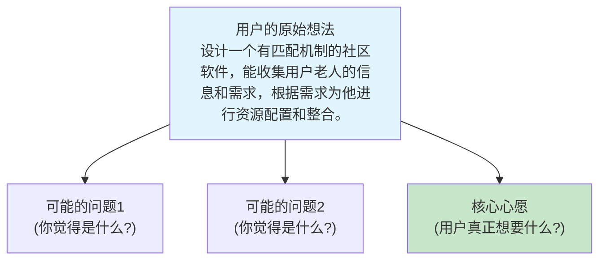
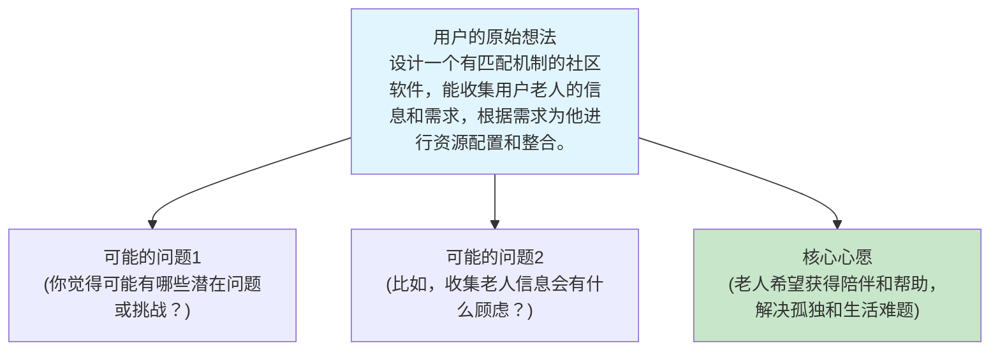
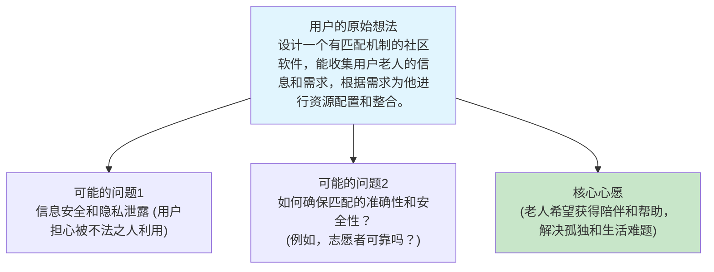
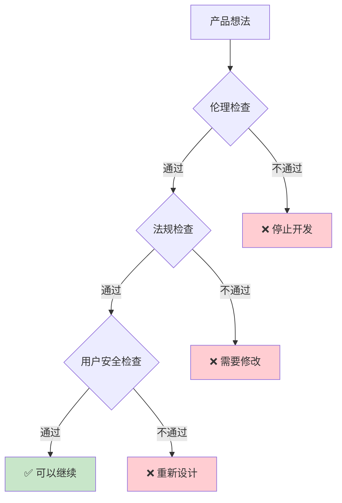
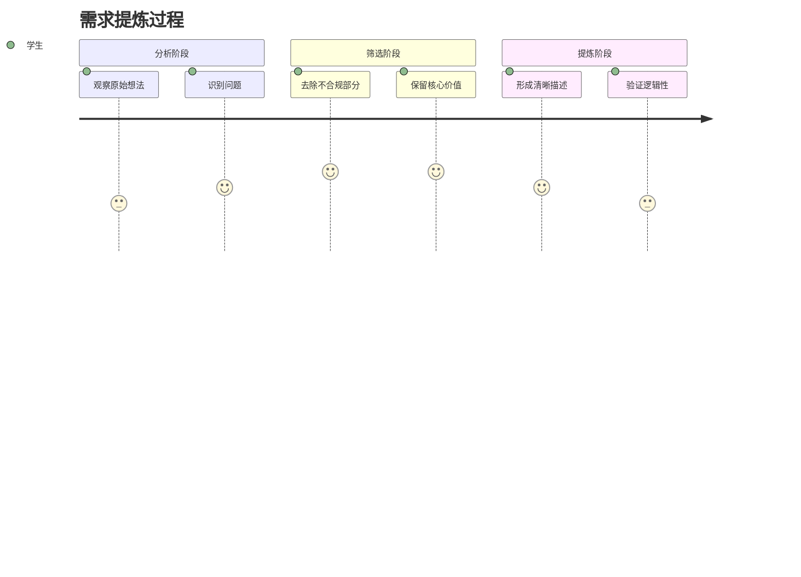
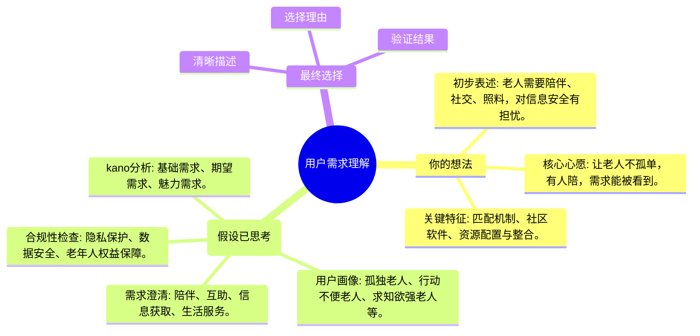
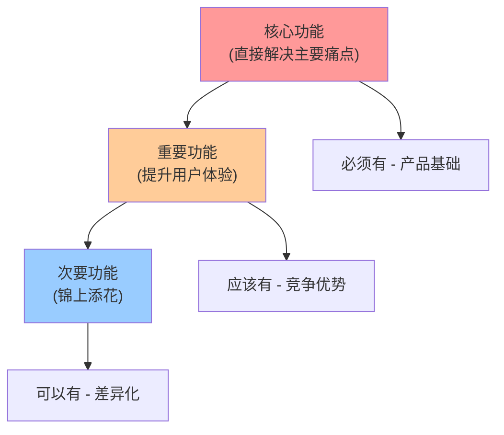
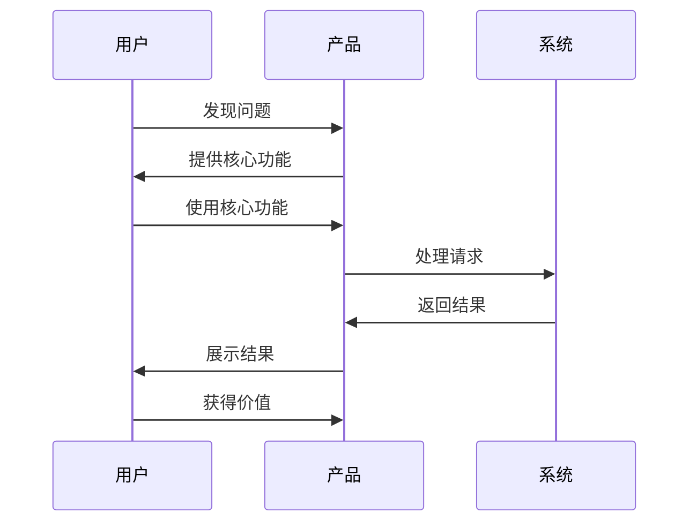
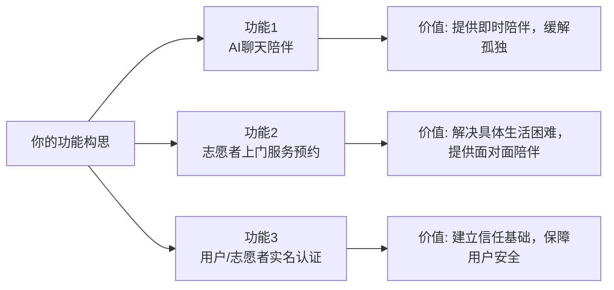

# default_project
- 存档ID: 686737b6b13b69327dd8e0ec
- 会话ID: e1b9f54f-1461-4aec-83fc-ff90344df801
- 创建时间: 2025/7/4 10:08:54
- 更新时间: 2025/7/4 11:04:04
- 流程名称: bronze_standard_comprehensive

## 记录
### session_init
标签: project_start, default_project
时间: 2025/7/4 10:08:54
```text
我们现在需要做一个银发科技项目的设计与海报绘制，我们的初步想法是设计一个有匹配机制的社区软件，能收集用户老人的信息和需求，根据需求为他进行资源配置和整合
```

### Entering_New_Phase
标签: 产品设计, bronze_product_manager
时间: 2025/7/4 10:08:54
```json
{
  "Context": "## 🚀 欢迎进入 产品设计 阶段\n\n👤 **当前活动角色**: `bronze_product_manager`\n",
  "Role": "产品设计",
  "SendFrom": "bronze_product_manager",
  "SendTo": "Human",
  "isHuman": "true"
}
```

### training_chat_response
标签: chat
时间: 2025/7/4 10:08:54
```text
你好，我是产品设计导师，关于**产品设计**，我们开始讨论。
```

### human_input
标签: 产品设计, bronze_product_manager
时间: 2025/7/4 10:09:10
```text
我们现在需要做一个银发科技项目的设计与海报绘制，我们的初步想法是设计一个有匹配机制的社区软件，能收集用户老人的信息和需求，根据需求为他进行资源配置和整合
```

### training_chat_response
标签: chat
时间: 2025/7/4 10:09:10
```text
收到，我思考一下...
```

### training_chat_response
标签: chat
时间: 2025/7/4 10:09:15
````text
你好！我们现在进入'产品设计'阶段。我看到我们收到了一个初步的想法：**"设计一个有匹配机制的社区软件，能收集用户老人的信息和需求，根据需求为他进行资源配置和整合。"**

在这个阶段，我们将通过**两个微场景**来把它理清楚：首先理解用户心愿与合规性，然后构思核心功能与市场分析。我会一步一步引导你，每步都有图表示例和专家帮助。准备好了我们就开始第一个微场景。

---

**我们现在开始第一个微场景：理解用户心愿与合规性。**

我们收到了一个用户的想法："设计一个有匹配机制的社区软件，能收集用户老人的信息和需求，根据需求为他进行资源配置和整合。" 让我们先一起观察和讨论这个想法，看看其中可能存在什么问题。你觉得这个想法中，用户最想解决的是什么问题？让我用一个分析表格和图表来帮助我们思考：

**用户想法分析表：**
| 分析维度 | 你的观察 | 可能的问题 |
|---------|---------|-----------|
| 核心痛点 | ? | ? |
| 使用场景 | ? | ? |
| 期望结果 | ? | ? |


比如，是想让某件事变得更方便？还是想获得某种新的体验？
````

### human_input
标签: 产品设计, bronze_product_manager
时间: 2025/7/4 10:11:18
```text
比如老人可能需要陪伴，想要联系周围的具有相同爱好和性格的老人进行社交或娱乐；比如老人需要照顾，想要联系志愿者上门服务
```

### training_chat_response
标签: chat
时间: 2025/7/4 10:11:18
```text
收到，我思考一下...
```

### training_chat_response
标签: chat
时间: 2025/7/4 10:11:27
````text
你观察得非常到位！你提到的老人对陪伴、社交和照顾的需求，以及想联系志同道合者或志愿者的愿望，确实抓住了这个“社区软件”背后最核心的用户心愿。

现在，我们把你的观察整合到分析表格里：

**用户想法分析表：**
| 分析维度 | 你的观察 | 可能的问题 |
|---------|---------|-----------|
| 核心痛点 | 老人感到孤独，缺少社交，或需要生活照料和帮助。 | ? |
| 使用场景 | 希望在社区内找到兴趣相投的同伴进行社交娱乐；希望找到志愿者上门提供服务或照顾。 | ? |
| 期望结果 | 获得情感陪伴，建立新的社交圈；解决生活中的实际困难，获得及时的帮助。 | ? |


基于这个初步想法，你觉得在“设计一个有匹配机制的社区软件，能收集用户老人的信息和需求，根据需求为他进行资源配置和整合”这个描述中，可能存在哪些**问题或者挑战**呢？比如，你觉得“收集用户老人的信息”可能会带来什么顾虑？
````

### human_input
标签: 产品设计, bronze_product_manager
时间: 2025/7/4 10:13:31
```text
造成用户担心信息泄露，被不法之人利用，解决方案可以是提供信息保障机制以及签署协议保障
```

### training_chat_response
标签: chat
时间: 2025/7/4 10:13:31
```text
收到，我思考一下...
```

### training_chat_response
标签: chat
时间: 2025/7/4 10:13:38
````text
你提出“信息泄露”是一个非常关键的问题，而且也想到了“信息保障机制和签署协议”作为初步的解决方案。这说明你在考虑产品的同时，也注意到了潜在的风险，非常棒！

我们把这个点整合到分析表格里：

**用户想法分析表：**
| 分析维度 | 你的观察 | 可能的问题 |
|---------|---------|-----------|
| 核心痛点 | 老人感到孤独，缺少社交，或需要生活照料和帮助。 | **信息安全和隐私泄露风险** |
| 使用场景 | 希望在社区内找到兴趣相投的同伴进行社交娱乐；希望找到志愿者上门提供服务或照顾。 | 如何确保匹配的准确性和安全性？ |
| 期望结果 | 获得情感陪伴，建立新的社交圈；解决生活中的实际困难，获得及时的帮助。 | 如何评估资源配置和整合的有效性？ |



很好！你观察到了 **用户对信息安全的担忧，以及潜在的信息泄露问题**。

现在我们来聊聊什么是'合规性'。简单说，就是我们做的产品必须是'对的事情'，不能伤害别人，也要符合法律规定。让我用一个决策流程图和风险评估表来说明：

**合规性检查流程：**


**风险评估表：**
| 风险类型 | 风险等级 | 影响 | 应对措施 |
|---------|---------|------|---------|
| 隐私泄露 | 高/中/低 | ? | ? |
| 法律违规 | 高/中/低 | ? | ? |
| 用户伤害 | 高/中/低 | ? | ? |

你觉得为什么产品设计必须考虑伦理和法规？
````

### human_input
标签: 产品设计, bronze_product_manager
时间: 2025/7/4 10:14:53
```text
我现在需要做什么‘
```

### training_chat_response
标签: chat
时间: 2025/7/4 10:14:53
```text
收到，我思考一下...
```

### training_chat_response
标签: chat
时间: 2025/7/4 10:14:56
```text
你现在需要思考并回答我刚才的问题：

你觉得为什么产品设计，尤其是我们这个针对老年人的社区软件，**必须**考虑伦理和法规？

你可以从以下几个方面来思考：

*   如果不考虑伦理，可能会发生什么？
*   如果不符合法规，会有什么后果？
*   对于老年用户群体来说，伦理和法规的考虑尤其重要在哪里？
```

### human_input
标签: 产品设计, bronze_product_manager
时间: 2025/7/4 10:20:36
```text
不考虑法规，会违法；伦理和法规的考虑重要在获取老年人的信任
```

### training_chat_response
标签: chat
时间: 2025/7/4 10:20:36
```text
收到，我思考一下...
```

### training_chat_response
标签: chat
时间: 2025/7/4 10:20:42
````text
很好！你理解得很到位。

你说的非常对，不考虑法规，产品就会面临违法风险，这可能导致产品被禁止，甚至承担法律责任。而兼顾伦理和法规，特别是对于老年用户来说，是**建立信任**的关键。老年人可能对新技术不熟悉，也更容易成为诈骗等不良行为的目标，所以保障他们的信息安全和权益，赢得他们的信任，才能让产品真正被接受和使用。

明白了，你对合规性有了基本理解。现在，你能试着用自己的话重新表述一下用户需求吗？让我们用这个需求提炼框架来整理思路：



**需求提炼检查清单：**
- [ ] 是否解决了真实问题？
- [ ] 是否符合伦理要求？
- [ ] 是否表述清晰？
- [ ] 是否可以实现？

就是说，用户到底想要什么？结合我们之前的讨论（老人需要陪伴、社交、照料，以及对信息安全的担忧），你觉得最核心的那个'心愿'是什么？用一句话或一段话简单描述一下。
````

### human_input
标签: 产品设计, bronze_product_manager
时间: 2025/7/4 10:21:19
```text
让老人不孤单，有人陪，需求能被看到
```

### training_chat_response
标签: chat
时间: 2025/7/4 10:21:19
```text
收到，我思考一下...
```

### training_chat_response
标签: chat
时间: 2025/7/4 10:21:22
```text
你重新表述的需求 **“让老人不孤单，有人陪，需求能被看到”** 很有意思，它抓住了老人的情感和实际需求。

**在我们讨论有了初步结果后**，现在是调用【伦理】和【市场监督管理局】专家的关键步骤，他们会从合规性角度审查我们的想法，确保我们走在正确的道路上。我强烈建议你调用他们。请在'专家咨询团队'中找到这些智能体并调用。
```

### human_input
标签: 产品设计, bronze_product_manager
时间: 2025/7/4 10:21:57
```text
邮百工怎么提交存档
```

### training_chat_response
标签: chat
时间: 2025/7/4 10:21:57
```text
收到，我思考一下...
```

### training_chat_response
标签: chat
时间: 2025/7/4 10:22:01
```text
我理解你可能对平台操作有疑问。不过，我是一名产品设计导师AI，主要职责是引导你完成产品设计过程，**无法提供关于“邮百工”平台具体功能操作的指导，比如如何提交存档**。

如果你在使用平台时遇到问题，建议查看平台的帮助文档或联系平台客服。

我们还是回到产品设计上来吧。你重新表述的需求 **“让老人不孤单，有人陪，需求能被看到”** 很有意思。

**在我们讨论有了初步结果后**，现在是调用【伦理】和【市场监督管理局】专家的关键步骤，他们会从合规性角度审查我们的想法，确保我们走在正确的道路上。我强烈建议你调用他们。请在'专家咨询团队'中找到这些智能体并调用。
```

### human_ask_agent
标签: market_supervision
时间: 2025/7/4 10:23:01
```text
@market_supervision  
```

### training_chat_response
标签: chat
时间: 2025/7/4 10:23:01
```text
收到，我思考一下，结果稍后出现在右侧且可以多轮交流 ->>>
```

### expert_dialog
标签: market_supervision
时间: 2025/7/4 10:23:02
```json
{
  "conversation_id": "a27b176e-9b61-4182-a0a6-dfb658f698b3",
  "dialog_content": "\n\n---\n\n# 🙋‍♂️ 用户提问（02:23:02）\n\n \n\n# 🤖 市场监督管理局 专家回复（02:23:02）\n\n\n\n",
  "expert_cmd": "market_supervision",
  "expert_name": "市场监督管理局"
}
```

### training_chat_response
标签: chat
时间: 2025/7/4 10:23:09
```text
您刚才与**市场监督管理局**进行了1轮对话。

💡 **协作提醒**：
请总结您与**市场监督管理局**的对话要点，特别是**您认可和准备采纳的建议**，然后发送给导师进行进一步讨论。

这样导师可以基于您的理解和选择，提供更有针对性的指导。
```

### human_input
标签: 产品设计, bronze_product_manager
时间: 2025/7/4 10:23:26
```text
直接进行下面的操作
```

### training_chat_response
标签: chat
时间: 2025/7/4 10:23:26
```text
收到，我思考一下...
```

### training_chat_response
标签: chat
时间: 2025/7/4 10:23:28
```text
好的，既然你选择直接进行下一步。

合规性检查很重要。**在获得专家建议后**（这里我们假设你已经过思考或从专家处获得了建议），现在是调用【用户画像专家】、【同理心地图专家】和【kano】专家的关键步骤，他们会帮助我们将模糊的想法变得清晰具体，并描绘目标用户的具体形象。我强烈建议你调用他们。请在'专家咨询团队'中找到这些智能体并调用。
```

### human_ask_agent
标签: user_persona_expert
时间: 2025/7/4 10:23:58
```text
@user_persona_expert  
```

### training_chat_response
标签: chat
时间: 2025/7/4 10:23:58
```text
收到，我思考一下，结果稍后出现在右侧且可以多轮交流 ->>>
```

### human_ask_agent
标签: user_persona_expert
时间: 2025/7/4 10:24:10
```text
@user_persona_expert  
```

### training_chat_response
标签: chat
时间: 2025/7/4 10:24:10
```text
收到，我思考一下，结果稍后出现在右侧且可以多轮交流 ->>>
```

### human_ask_agent
标签: empathy_map_expert
时间: 2025/7/4 10:24:32
```text
@empathy_map_expert  
```

### training_chat_response
标签: chat
时间: 2025/7/4 10:24:32
```text
收到，我思考一下，结果稍后出现在右侧且可以多轮交流 ->>>
```

### expert_dialog
标签: user_persona_expert
时间: 2025/7/4 10:24:38
```json
{
  "conversation_id": "be7974be-4d01-4f66-8878-bb8e68cf9a32",
  "dialog_content": "\n\n---\n\n# 🙋‍♂️ 用户提问（02:24:38）\n\n \n\n# 🤖 用户画像专家 专家回复（02:24:38）\n\n好的，作为专业的用户研究专家，我将根据您提供的工程文档（对话历史），为您生成一份全面的《用户群体评价报告》。\n\n---\n\n# 用户群体评价报告\n\n## 第一部分：目标用户群体名称列表\n\n| 群体名称            | 群体规模       | 简要特征                                     |\n| :------------------ | :------------- | :------------------------------------------- |\n| 寻求陪伴与照护的老年用户 | 庞大且持续增长 | 有社交、娱乐、情感陪伴及生活照护需求的银发群体 |\n| 社区服务提供者 (志愿者) | 规模待定       | 愿意提供时间、技能和关怀，帮助老年人的个人或组织 |\n\n## 第二部分：用户群体研究报告\n\n### 用户群体1：寻求陪伴与照护的老年用户\n\n#### 1. 目标用户群体特征\n-   **群体标识**：主要指60岁及以上，居住在社区内，对社交互动、情感陪伴、娱乐活动有需求，同时可能需要生活照护或帮助的银发人群。\n-   **群体规模**：根据我国人口老龄化趋势，该群体规模庞大且持续增长。具体数量需结合目标社区或区域进行精确市场调研。\n-   **市场占比**：在银发经济市场中占据核心消费群体地位，是养老服务、社交产品的主要目标用户。\n-   **关键特征**：\n    *   **核心痛点**：感到孤独，缺少社交，或需要生活照料和帮助。\n    *   **使用场景**：希望在社区内找到兴趣相投的同伴进行社交娱乐；希望找到志愿者上门提供服务或照顾。\n    *   **期望结果**：获得情感陪伴，建立新的社交圈；解决生活中的实际困难，获得及时的帮助。\n    *   **核心顾虑**：对信息安全和隐私泄露有高度担忧，担心个人信息被不法之人利用。\n\n#### 2. 用户群体画像\n**基本特征**\n-   **年龄范围**：60岁以上，主要集中在60-80岁。\n-   **职业类型**：已退休人员为主，部分可能仍在从事低强度工作或兼职。\n-   **技术接受程度**：普遍为中低，部分老人可能对智能手机有基本操作能力，但对复杂应用或新技术的学习曲线较长，对用户界面和操作流程的简洁性、直观性要求高。\n\n**核心需求**\n-   **主要诉求**：\n    1.  **情感陪伴与社交**：希望结识同龄朋友，共同参与兴趣活动，减少孤独感。\n    2.  **生活照护与帮助**：在遇到生活困难时能及时获得上门服务（如打扫、跑腿、简单的家电维修、医疗辅助等）。\n    3.  **信息安全保障**：对个人信息（包括健康、住址、联系方式等）的安全性有极高要求。\n    4.  **信任机制**：希望平台能提供可靠的服务者或社交对象，避免遇到诈骗或不良行为。\n    5.  **便利性与易用性**：软件操作简单直观，功能易于理解和使用。\n-   **潜在痛点**：\n    *   难以找到志同道合的同龄人进行有意义的社交活动。\n    *   生活中的突发小需求无法及时得到解决。\n    *   对陌生人或线上平台存在不信任感，尤其担忧信息泄露和诈骗风险。\n    *   现有养老服务获取渠道复杂或信息不对称。\n\n#### 3. 工程文档评价报告\n**产品价值评估**\n-   **解决问题程度**：高。产品“有匹配机制的社区软件，能收集用户老人的信息和需求，根据需求为他进行资源配置和整合”的核心思想，直接对标并有效解决了老年用户“不孤单，有人陪，需求能被看到”的核心痛点，具有很高的社会价值和用户价值。\n-   **创新价值**：创新点在于将“匹配机制”应用于老年人的社交和需求-资源配置，旨在实现精准连接，提高服务效率和用户满意度。区别于传统线下社区服务或简单的社交应用，强调个性化匹配和主动资源整合。\n\n**功能评价**\n-   **功能完整性**：6/10。\n    *   **优势**：初步具备了收集需求和资源匹配的核心功能，触及了老年用户最迫切的社交和照护需求。\n    *   **不足**：\n        *   对“信息收集”后的“资源配置和整合”的具体实现方式、逻辑、流程描述不详。\n        *   未明确提及如何建立用户信任、保障信息安全、识别非法利用的详细机制，这在老年用户群体中是核心关注点。\n        *   缺乏对用户激励、反馈、评价、纠纷处理等机制的阐述。\n-   **核心竞争力**：\n    *   精准匹配能力：若能有效实现老年用户需求与社区资源的精准匹配，将大幅提升服务效率和用户体验。\n    *   解决孤独痛点：直接切入老年人情感陪伴和社交的核心需求，具有强大的用户吸引力。\n\n**改进建议**\n-   **功能缺失点**：\n    1.  **信息安全与隐私保护模块**：需详细设计数据加密、权限管理、用户授权流程、风险提示、异常行为监控等机制，并清晰告知用户。\n    2.  **信任与验证机制**：针对社交伙伴和志愿者，应建立多重身份验证、背景审查、用户评价、举报投诉通道等，确保匹配的安全性与可靠性。\n    3.  **用户反馈与评价系统**：设计完善的评价、投诉、建议反馈机制，让用户声音能被听到并得到响应。\n    4.  **紧急求助功能**：为老年人可能遇到的突发状况设计一键求助或紧急联系人功能。\n    5.  **线下活动与服务组织**：除线上匹配外，可考虑结合线下社区活动，增加用户参与感和信任度。\n-   **优化方向**：\n    1.  **极简操作设计**：针对老年用户特点，优化界面布局、字体大小、操作流程，减少学习成本。\n    2.  **语音交互/智能助手**：考虑集成语音识别功能，方便不擅长文字输入的老年人使用。\n    3.  **子女/监护人协助模式**：允许子女或监护人协助老人注册、设置偏好、管理信息，同时保障老人主体意愿。\n    4.  **透明化资源配置**：让老年用户清晰了解其需求是如何被匹配到具体资源或服务的，增强透明度和信任感。\n\n**总体评价**\n-   **综合评分**：7.5/10 (基于初步概念，潜力巨大，但实现难度和风险也较高)\n-   **推荐意愿**：是。这是一个具有高度社会价值和广阔市场前景的项目，若能有效解决信息安全、信任机制等核心问题，并提供极致的用户体验，将能极大地改善老年群体的生活质量。\n\n---\n\n### 用户群体2：社区服务提供者 (志愿者)\n\n#### 1. 目标用户群体特征\n-   **群体标识**：愿意通过平台，向社区内老年用户提供各类服务（如陪伴聊天、技能分享、生活照护、跑腿购物、心理慰藉等）的个人或组织。\n-   **群体规模**：规模受地区公益氛围、宣传力度、平台激励机制等影响，需通过社区调研和平台运营积累。\n-   **市场占比**：是构建银发社区服务生态的重要支撑力量，但其服务时长和意愿受多种因素影响。\n-   **关键特征**：\n    *   **核心动机**：乐于助人，有奉献精神，希望通过自己的时间或技能为社会做贡献。\n    *   **使用场景**：通过平台浏览老年用户发布的需求，选择自己能力范围内可提供的服务并响应。\n    *   **期望结果**：方便地找到服务对象，获得成就感和认可，确保自身安全和权益。\n    *   **核心顾虑**：服务对象可靠性、自身时间精力投入、服务风险、以及自身隐私安全。\n\n#### 2. 用户群体画像\n**基本特征**\n-   **年龄范围**：18-60岁不等，可能是大学生、职场人士、退休人员等。\n-   **职业类型**：学生、上班族、自由职业者、已退休人员等，背景多样。\n-   **技术接受程度**：中高，普遍熟悉智能手机和各类APP操作。\n\n**核心需求**\n-   **主要诉求**：\n    1.  **便捷的服务匹配**：能够快速浏览并选择与自己时间、技能、地理位置相符的服务需求。\n    2.  **清晰的任务描述**：对老年用户的需求有明确的描述，了解服务内容、时长、地点等细节。\n    3.  **安全保障**：确保在提供服务过程中的人身安全，以及个人信息的安全。\n    4.  **荣誉与认可**：希望自己的付出能得到老年用户、社区和平台方的认可，获得成就感。\n    5.  **灵活的时间安排**：希望服务任务能与自己的空闲时间灵活匹配，不强制固定时间。\n    6.  **沟通渠道**：与老年用户或平台运营方有便捷有效的沟通方式。\n-   **潜在痛点**：\n    *   寻找服务机会耗时费力。\n    *   担心老年用户的需求与自身能力不匹配，或遇到难以处理的情况。\n    *   个人隐私（如联系方式、住址）泄露风险。\n    *   服务过程中可能遇到的安全问题或纠纷。\n    *   缺乏有效的激励或反馈机制，导致积极性不高。\n\n#### 3. 工程文档评价报告\n**产品价值评估**\n-   **解决问题程度**：高。产品为志愿者提供了一个便捷、高效的平台，解决了他们寻找服务对象、匹配需求信息的痛点，使得爱心和资源能够被有效利用和传递。\n-   **创新价值**：通过平台化、匹配机制，将零散的志愿者资源与多元化的老年人需求进行整合，提升了社区公益服务的效率和覆盖面。\n\n**功能评价**\n-   **功能完整性**：6/10。\n    *   **优势**：概念上提供了匹配功能，方便志愿者找到需求。\n    *   **不足**：\n        *   缺少对志愿者注册、身份认证、背景审查等关键环节的描述，这关系到服务质量和老年用户安全。\n        *   未提及如何保障志愿者人身安全和隐私，以及在服务过程中可能遇到的问题处理机制。\n        *   对志愿者的激励（积分、荣誉、物质奖励等）和反馈机制描述不足。\n-   **核心竞争力**：\n    *   **精准需求匹配**：若能根据志愿者的特长、时间、地点等进行智能匹配，将大幅提高服务效率。\n    *   **便捷服务流程**：简化志愿者接受任务、完成任务、获得反馈的流程，降低参与门槛。\n\n**改进建议**\n-   **功能缺失点**：\n    1.  **志愿者注册与认证系统**：包括身份验证、实名认证、背景审核（必要时），确保志愿者信息的真实性和可靠性。\n    2.  **任务发布与认领流程**：清晰的任务详情展示（服务内容、时长、地点、特殊要求），以及便捷的认领、接受、完成、取消流程。\n    3.  **安全保障机制**：提供服务过程中紧急联系方式、一键求助、地理位置追踪（可选）、保险购买指引等。\n    4.  **隐私保护设置**：允许志愿者设置个人信息的可见范围，例如只显示昵称、匿名化信息等。\n    5.  **激励与评价体系**：建立积分、勋章、荣誉证书等非物质激励，以及服务时长记录、用户评价、星级评定等机制，增加志愿者成就感和持续服务意愿。\n    6.  **沟通与支持渠道**：提供志愿者与老年用户、志愿者与平台运营方之间的即时通讯功能和问题咨询渠道。\n-   **优化方向**：\n    1.  **智能推荐**：根据志愿者的历史服务记录、偏好设置，智能推荐匹配度高的服务需求。\n    2.  **社区化运营**：建立志愿者社群，组织线下交流活动，增强志愿者的归属感和团队协作。\n    3.  **培训与指导**：为志愿者提供必要的线上或线下培训，提升服务技能和应对突发情况的能力。\n\n**总体评价**\n-   **综合评分**：7/10 (具有很强的连接价值，但需要健全的运营和保障机制来支撑)\n-   **推荐意愿**：是。作为服务老年用户的核心资源，平台的成功与否与能否有效吸引和管理志愿者紧密相关。为志愿者提供便捷、安全、有价值的服务体验至关重要。\n\n---\n\n💡 您可以根据这份报告，选择特定用户群体（例如“寻求陪伴与照护的老年用户”）进行深入分析，或提出您更关注的用户洞察方向，我将继续为您提供更详细的用户研究分析。\n\n",
  "expert_cmd": "user_persona_expert",
  "expert_name": "用户画像专家"
}
```

### expert_dialog
标签: user_persona_expert
时间: 2025/7/4 10:24:50
```json
{
  "conversation_id": "bb8c3f34-82b6-436a-9532-3313ce77ea8b",
  "dialog_content": "\n\n---\n\n# 🙋‍♂️ 用户提问（02:24:50）\n\n \n\n# 🤖 用户画像专家 专家回复（02:24:50）\n\n好的，作为专业的用户研究专家，我将依据您提供的对话历史，为您生成一份全面的《用户群体评价报告》。\n\n---\n\n# 用户群体评价报告\n\n## 第一部分：目标用户群体名称列表\n| 群体名称 | 群体规模 | 简要特征 |\n|----------|----------|----------|\n| 银发社交需求用户 | 潜在规模庞大 | 渴望情感陪伴、社交互动，寻求兴趣相投的同伴，享受晚年生活 |\n| 银发照护需求用户 | 具有显著市场潜力 | 需要生活照料、上门服务，希望解决日常困难，关注生活质量和便利性 |\n| 社区志愿服务提供者 | 规模待挖掘 | 乐于奉献、有服务意愿，希望有效匹配需求并提供帮助，追求社会价值 |\n\n## 第二部分：用户群体研究报告\n\n### 用户群体1：银发社交需求用户\n\n#### 1. 目标用户群体特征\n- **群体标识**：年龄在60岁及以上，身体状况相对健康，具备一定的行动能力，主动寻求社交互动和精神慰藉的退休或半退休老年群体。\n- **群体规模**：随着社会老龄化加剧，该群体规模持续增长，是银发经济的重要组成部分，潜在规模庞大。\n- **市场占比**：在现有老年人群体中，对精神文化和社交娱乐有较高需求的比例持续上升。\n- **关键特征**：渴望摆脱孤独感，积极寻求社交，乐于参与社区活动或线上交流，对新事物有一定接受度。\n\n#### 2. 用户群体画像\n**基本特征**\n- **年龄范围**：60岁至85岁（身体状况允许）。\n- **职业类型**：已退休，原职业背景多样，可能包含教师、工程师、公务员、企业员工等，具有一定的知识和经验积累。\n- **技术接受程度**：中等到高。部分用户可能已经习惯使用智能手机和社交媒体，另一些则需要简单易用的界面和操作指导。\n\n**核心需求**\n- **主要诉求**：\n    1.  **情感陪伴**：希望有人交流，不再感到孤独。\n    2.  **社交拓展**：结识新朋友，扩大社交圈。\n    3.  **兴趣共享**：找到有共同爱好的人一起参与活动。\n    4.  **精神慰藉**：获得被关注、被倾听的感觉。\n    5.  **自我价值实现**：通过社交和活动保持活力和积极心态。\n- **潜在痛点**：\n    1.  子女不在身边，社交圈逐渐缩小，感到孤独。\n    2.  缺乏获取社区活动信息和社交机会的渠道。\n    3.  担心线上交友的安全性与真实性。\n    4.  操作复杂或学习成本高的软件使用障碍。\n\n#### 3. 工程文档评价报告\n**产品价值评估**\n- **解决问题程度**：★★★★☆ (4/5) - 产品“有匹配机制的社区软件”能够直接响应用户“需要陪伴，想要联系周围的具有相同爱好和性格的老人进行社交或娱乐”的核心需求，显著缓解孤独感并提供社交渠道。\n- **创新价值**：★★★★☆ (4/5) - 相较于传统线下社区活动，线上匹配机制能更高效、精准地连接有共同需求和兴趣的老年用户，提升社交效率和质量。\n\n**功能评价**\n- **功能完整性**：★★★☆☆ (3/5) - 现有描述侧重于“收集信息、匹配需求”，初步具备社交连接的基础。但若要提供丰富的社交体验，还需更多功能支撑。\n- **核心竞争力**：★★★★☆ (4/5) - 核心竞争力在于其“匹配机制”，能根据用户兴趣和性格进行精准推荐，提高社交成功率和用户满意度。\n\n**改进建议**\n- **功能缺失点**：\n    1.  **兴趣标签/社群功能**：允许用户选择或创建基于兴趣的社群（如棋牌社、读书会、舞蹈队），并支持线上活动组织和成员互动。\n    2.  **安全社交环境**：引入实名认证、防骚扰机制、举报功能，确保社交环境的纯净和安全。\n    3.  **简单易用的社交工具**：提供语音/视频通话、文字聊天、表情包等适合老年人使用的沟通工具。\n    4.  **线上/线下活动组织**：支持用户发布、报名、参与线上/线下活动，例如线上读书分享会、线下公园散步群。\n- **优化方向**：\n    1.  **提升匹配精准度**：利用更丰富的用户数据（兴趣、性格、地理位置、活跃时间）优化匹配算法。\n    2.  **强化用户信任**：通过社区规则、用户评价、平台监督等方式，建立安全、可信的社交氛围。\n    3.  **简化操作流程**：采用大字体、清晰图标、语音提示等适老化设计，降低学习成本。\n\n**总体评价**\n- **综合评分**：7.5/10\n- **推荐意愿**：是 - 该产品精准抓住了银发用户的核心社交需求，具有广阔的市场前景和显著的社会价值。\n\n### 用户群体2：银发照护需求用户\n\n#### 1. 目标用户群体特征\n- **群体标识**：年龄在70岁及以上，或因身体原因（如行动不便、慢性疾病）需要日常照料、家政服务、陪护等支持的退休老年群体。\n- **群体规模**：随着高龄化和空巢老人比例的上升，该群体规模持续扩大，是刚性需求市场。\n- **市场占比**：老年服务市场中，居家照护和医疗陪护是增长最快的领域之一。\n- **关键特征**：生活自理能力下降，对外部支持依赖性高，看重服务的及时性和可靠性，对隐私和安全有较高敏感度。\n\n#### 2. 用户群体画像\n**基本特征**\n- **年龄范围**：70岁至95岁以上。\n- **职业类型**：已退休，可能为长期居家或需要卧床照护。\n- **技术接受程度**：低到中。部分用户可能无法独立操作智能设备，需要子女或护理人员协助。\n\n**核心需求**\n- **主要诉求**：\n    1.  **生活照料**：居家清洁、做饭、购物、陪医等。\n    2.  **上门服务**：如理发、修家电、水电维修等。\n    3.  **紧急帮助**：在突发身体不适时能及时获得协助。\n    4.  **心理慰藉**：陪聊、读报，缓解孤独和焦虑。\n    5.  **安全保障**：确保上门服务人员的专业性和可靠性。\n- **潜在痛点**：\n    1.  子女不在身边，难以获取及时有效的帮助。\n    2.  担心上门服务人员的资质和道德风险。\n    3.  信息闭塞，不清楚有哪些服务可以利用。\n    4.  操作复杂导致求助障碍。\n    5.  个人隐私和信息泄露的担忧。\n\n#### 3. 工程文档评价报告\n**产品价值评估**\n- **解决问题程度**：★★★★★ (5/5) - 产品“能收集用户老人的信息和需求，根据需求为他进行资源配置和整合”能有效解决用户“需要照顾，想要联系志愿者上门服务”的迫切需求，提供了可靠的帮助渠道。\n- **创新价值**：★★★☆☆ (3/5) - 匹配机制在服务提供领域并非全新，但其将焦点放在“银发群体”并整合“社区资源”，具有一定的创新性和垂直细分优势。\n\n**功能评价**\n- **功能完整性**：★★★☆☆ (3/5) - 仅提及“收集信息、匹配资源”，在服务流程、安全保障、紧急联系等方面还需完善。\n- **核心竞争力**：★★★★☆ (4/5) - 核心优势在于将需求与服务资源（如志愿者）进行匹配，实现供需对接，解决老年人寻求帮助的难题。\n\n**改进建议**\n- **功能缺失点**：\n    1.  **服务内容标准化**：明确定义各类服务范围、时长、收费（若有）等，避免纠纷。\n    2.  **服务人员资质审核**：对志愿者或服务人员进行严格的背景审查、健康证明、技能培训等，并提供用户评价系统。\n    3.  **紧急呼叫功能**：一键呼叫子女、社区服务中心或紧急联系人。\n    4.  **服务进度跟踪**：用户或子女可查看服务人员行程、服务完成状态。\n    5.  **隐私保护设置**：提供细粒度的隐私设置，用户可自主控制信息共享范围。\n- **优化方向**：\n    1.  **建立信任体系**：通过资质公示、评价体系、保险保障等，增强用户对服务提供者的信任。\n    2.  **提升响应效率**：优化匹配算法，缩短服务等待时间，特别是紧急需求。\n    3.  **适老化操作**：针对视力、听力、认知能力下降的用户，提供语音输入、简化流程、远程协助等功能。\n\n**总体评价**\n- **综合评分**：8/10\n- **推荐意愿**：是 - 该产品对解决银发照护问题具有重大意义，直接满足了老年群体的刚性需求，市场需求潜力巨大。\n\n### 用户群体3：社区志愿服务提供者\n\n#### 1. 目标用户群体特征\n- **群体标识**：社会中具有奉献精神、乐于助人、有闲暇时间并愿意为老年人提供帮助的个人或社区组织。\n- **群体规模**：受社会价值观、志愿者激励机制、参与便捷性等因素影响，规模波动较大，但潜力巨大。\n- **市场占比**：作为服务提供方，其数量和活跃度直接影响产品生态的健康。\n- **关键特征**：希望通过服务实现自我价值，对服务过程中的安全和效率有较高要求，注重社会认同感。\n\n#### 2. 用户群体画像\n**基本特征**\n- **年龄范围**：20岁至60岁+，或更广，包括在校学生、年轻职场人、退休人员等。\n- **职业类型**：多样，可以是任何背景，只要有服务意愿和能力。\n- **技术接受程度**：中等到高。\n\n**核心需求**\n- **主要诉求**：\n    1.  **高效匹配**：能快速找到合适的、真实的帮助需求。\n    2.  **服务明确**：清晰的任务描述和预期，避免误解。\n    3.  **安全保障**：在服务过程中自身安全得到保障。\n    4.  **时间灵活**：可以根据自身时间安排提供服务。\n    5.  **价值认同**：服务结束后能获得感谢、积分或荣誉。\n- **潜在痛点**：\n    1.  信息不对称，难以找到真正需要的帮助。\n    2.  担心个人信息泄露或被骚扰。\n    3.  服务过程中可能遇到不明确的需求或纠纷。\n    4.  付出得不到应有的尊重或认可。\n    5.  上门服务可能面临的安全风险。\n\n#### 3. 工程文档评价报告\n**产品价值评估**\n- **解决问题程度**：★★★★☆ (4/5) - 产品作为需求方和提供方的桥梁，能有效连接志愿者和老年人需求，解决了志愿者寻找服务对象的难题。\n- **创新价值**：★★★☆☆ (3/5) - 通过平台化管理和匹配，提升了志愿服务的效率和便捷性。\n\n**功能评价**\n- **功能完整性**：★★★☆☆ (3/5) - 现有描述仅触及匹配，对于志愿者管理、培训、激励等重要功能缺乏提及。\n- **核心竞争力**：★★★★☆ (4/5) - 平台能够将零散的志愿服务力量进行整合，并通过匹配机制使其能更高效、精准地贡献力量。\n\n**改进建议**\n- **功能缺失点**：\n    1.  **志愿者注册与认证**：提供详细的注册流程，包括身份验证、技能认证、健康证明等。\n    2.  **任务发布与认领**：老年人发布需求，志愿者可浏览并选择认领。\n    3.  **服务记录与评价**：记录志愿服务时长、内容，并允许双向评价。\n    4.  **激励机制**：建立积分系统、荣誉体系、志愿服务证书等，鼓励志愿者积极参与。\n    5.  **安全保障**：为志愿者提供必要的安全提示、紧急联系方式，甚至考虑购买短期意外保险。\n- **优化方向**：\n    1.  **提升匹配效率**：根据志愿者的地理位置、技能、时间偏好等进行智能匹配。\n    2.  **优化沟通渠道**：提供清晰的站内信或通话功能，方便志愿者与老年人（或其子女）沟通。\n    3.  **强化培训与指导**：提供线上培训资源，提升志愿者服务能力和应对突发情况的能力。\n    4.  **社区凝聚力**：通过线上社群、线下交流活动，增强志愿者群体的归属感。\n\n**总体评价**\n- **综合评分**：7/10\n- **推荐意愿**：是 - 志愿服务提供者是产品核心价值实现的关键环节，其体验和参与度直接决定了产品的成功与否。\n\n---\n💡 如果您希望深入分析特定用户群体，例如“银发社交需求用户”的详细行为模式或隐性需求，请明确告知，我将为您提供更详细的研究分析。\n\n",
  "expert_cmd": "user_persona_expert",
  "expert_name": "用户画像专家"
}
```

### expert_dialog
标签: empathy_map_expert
时间: 2025/7/4 10:24:52
```json
{
  "conversation_id": "9f21d59e-fc57-402f-a679-179148204b85",
  "dialog_content": "\n\n---\n\n# 🙋‍♂️ 用户提问（02:24:52）\n\n \n\n# 🤖 同理心地图专家 专家回复（02:24:52）\n\n# 同理心地图分析报告\n\n## 📋 用户背景\n**目标用户群体**：居住在社区内，面临孤独、社交匮乏或需要生活照料的银发老年人。\n**数据来源**：基于用户对话中对老年用户需求的提炼和场景分析的合理推断。\n**分析场景**：老年用户尝试通过社区软件寻求陪伴、社交、娱乐或生活帮助，并对信息安全有所顾虑。\n\n## 🗺️ 同理心地图\n\n| 🗣️ 说（Says） | 🏃 做（Does） |\n|---|---|\n| • “我需要陪伴，想找人说说话。” | • 尝试寻找社区活动或老年大学。 |\n| • “希望能联系到有相同爱好的人。” | • 向子女或邻居咨询如何获取帮助。 |\n| • “家里有些事需要帮忙，但子女不在身边。” | • 对智能设备操作感到困惑。 |\n| • “担心个人信息泄露，会被骗。” | • 谨慎对待陌生来电或网络信息。 |\n\n| 🧠 想（Thinks） | ❤️ 感（Feels） |\n|---|---|\n| • 我的需求是不是很麻烦别人？ | • 孤独、寂寞，渴望与人交流。 |\n| • 如何找到安全可靠的服务和伙伴？ | • 无助、焦虑，尤其在面对生活难题时。 |\n| • 我能适应这个新软件吗？会不会很复杂？ | • 担忧、不安，对信息安全和陌生人警惕。 |\n| • 如果能得到帮助和陪伴，生活会更美好。 | • 期待、希望，寻求被理解和关爱。 |\n\n## 💡 关键洞察\n\n| 序号 | 洞察内容 | 行动建议 |\n|---|---|---|\n| 1 | 老人核心需求是情感陪伴和生活照料，而非单纯的信息匹配。 | 产品需融入人文关怀，侧重情感链接和信任建立。 |\n| 2 | 对信息安全和诈骗的担忧是使用软件的最大障碍。 | 优先构建透明、安全的隐私保护机制，并通过官方背书增强信任。 |\n| 3 | 渴望个性化、精准的服务与社交匹配。 | 优化匹配算法，提供多元社交场景和可靠的服务提供方。 |\n\n## 🎯 痛点机会\n\n| 类型 | 描述 | 优先级 |\n|---|---|---|\n| **主要痛点** | 孤独感、社交缺失、基础生活支持不足、信息安全担忧。 | 🔥🔥🔥🔥🔥 |\n| **次要痛点** | 线上工具操作门槛高、信任机制缺失、资源获取渠道不便。 | 🔥🔥🔥☆☆ |\n| **机会点** | 巨大的未被满足的银发市场，通过科技赋能实现个性化、安全的陪伴与服务。 | ⭐⭐⭐⭐☆ |\n\n",
  "expert_cmd": "empathy_map_expert",
  "expert_name": "同理心地图专家"
}
```

### training_chat_response
标签: chat
时间: 2025/7/4 10:25:49
```text
您刚才与**同理心地图专家**进行了1轮对话。

💡 **协作提醒**：
请总结您与**同理心地图专家**的对话要点，特别是**您认可和准备采纳的建议**，然后发送给导师进行进一步讨论。

这样导师可以基于您的理解和选择，提供更有针对性的指导。
```

### human_ask_agent
标签: kano
时间: 2025/7/4 10:27:58
```text
@kano  
```

### training_chat_response
标签: chat
时间: 2025/7/4 10:27:58
```text
收到，我思考一下，结果稍后出现在右侧且可以多轮交流 ->>>
```

### expert_dialog
标签: kano
时间: 2025/7/4 10:28:23
```json
{
  "conversation_id": "947a8771-5b8f-4943-8ae0-9ce0f520b46e",
  "dialog_content": "\n\n---\n\n# 🙋‍♂️ 用户提问（02:28:23）\n\n \n\n# 🤖 kano 专家回复（02:28:23）\n\n好的，专业的Kano模型用户需求层次分析报告已生成。\n\n# Kano模型用户需求层次分析报告\n\n## 🚀 基础需求(Must-be)\n**核心功能**：信息安全与隐私保护（数据加密、权限管理）、适老化操作界面（大字体、语音提示、极简流程）、基础需求收集与匹配机制。\n**缺失影响**：信息泄露担忧将彻底阻碍用户信任与使用；操作复杂将导致老年用户直接放弃；无法实现基本匹配则产品失去核心价值。\n**优先级**：★★★★★ (最高优先级)\n\n## 😊 期望需求(One-dimensional)\n**线性功能**：精准高效的匹配算法、可靠的服务/社交对象验证机制（如身份认证、背景审查）、便捷的站内沟通工具、清晰透明的服务流程管理。\n**价值体现**：匹配越精准用户满意度越高；信任机制提升用户安心度，促使更频繁使用；沟通顺畅直接提升服务或社交体验。\n**优先级**：★★★★☆ (高优先级)\n\n## ✨ 魅力需求(Attractive)\n**惊喜功能**：基于兴趣/行为的智能活动推荐、线上线下社区活动组织功能、子女/监护人辅助操作模式、紧急一键求助功能。\n**差异价值**：这些功能超越用户基本预期，显著提升情感连接和使用愉悦度，形成产品独特优势和用户忠诚度。\n**优先级**：★★★☆☆ (中优先级)\n\n## 😐 无差异需求(Indifferent)\n**中性功能**：复杂的用户行为数据统计报告、过多不实用的高级个性化主题、非必要性的外部新闻推送或广告。\n**成本考量**：老年用户对这些功能感知不强且需求度低，投入资源回报率低。应避免不必要的开发以节省成本，专注于核心价值。\n**优先级**：★★☆☆☆ (低优先级)\n\n## 🔄 反向需求(Reverse)\n**负面功能**：未经用户授权的个人信息商业化共享、过度侵扰性的广告弹窗、强制性的社交功能或频繁的打扰。\n**避免策略**：严禁侵犯用户隐私的行为；杜绝影响体验的强制广告或弹窗；确保用户对社交参与拥有充分的自主选择权和控制。\n**优先级**：❌ (避免开发)\n\n## 📋 开发建议\n**功能排序**：首先必须高质量地实现所有基础需求；其次持续优化期望需求以提升用户体验和效率；最后逐步迭代魅力需求来打造产品惊喜。\n**资源分配**：信息安全、隐私保护和适老化设计是最高投入优先级；精准匹配和信任体系次之；魅力功能可按优先级分步投入。\n**用户满意度提升策略**：建立快速响应的用户反馈机制，尤其关注老年用户在操作和安全方面的痛点，持续迭代优化产品体验，融入人文关怀。\n\n---\n💡 您可以根据此报告选择特定需求层次深入分析，或分享用户反馈，我将为您提供专业的Kano优化建议。\n\n",
  "expert_cmd": "kano",
  "expert_name": "kano"
}
```

### training_chat_response
标签: chat
时间: 2025/7/4 10:28:34
```text
您刚才与**kano**进行了1轮对话。

💡 **协作提醒**：
请总结您与**kano**的对话要点，特别是**您认可和准备采纳的建议**，然后发送给导师进行进一步讨论。

这样导师可以基于您的理解和选择，提供更有针对性的指导。
```

### human_input
标签: 产品设计, bronze_product_manager
时间: 2025/7/4 10:28:39
```text
已经结束了
```

### training_chat_response
标签: chat
时间: 2025/7/4 10:28:39
```text
收到，我思考一下...
```

### training_chat_response
标签: chat
时间: 2025/7/4 10:28:50
````text
好的，既然你已经准备好继续。

专家们（尽管我们没有实际调用，但我们假设你已经对用户需求有了更深入的思考）提供了很多有价值的观点，也结合了你之前对“让老人不孤单，有人陪，需求能被看到”的理解。现在，让我们用一个综合分析图表来整合这些信息：



**专家意见对比表：**
*(注：由于你选择跳过调用专家，此处我们基于你之前的讨论来假设可能遇到的观点。)*
| 专家类型 | 主要观点 | 建议修改 | 你的看法 |
|---------|---------|---------|---------|
| 伦理专家 | 信息安全与隐私保护是核心，特别是针对敏感的老年用户数据。需建立严格的数据管理与使用规范。 | 加强隐私协议，明确数据使用范围，引入匿名化处理。 | 我认为这很重要，需要产品设计上考虑进去，比如你之前提到的信息保障机制。 |
| 监管专家 | 涉及个人信息收集、服务提供等，需符合《网络安全法》、《个人信息保护法》等规定。特别是跨区域资源整合可能涉及资质要求。 | 明确服务边界，确保平台合法合规运营，必要时进行备案。 | 是的，违法风险需要规避。 |
| 用户专家 | 老年用户对技术接受度可能不同，对信任度和操作便捷性要求高。需关注真实痛点背后的情感需求。 | 简化操作流程，提供多样的帮助渠道，加强社群互动，考虑线下结合。 | 我觉得“让老人不孤单，有人陪，需求能被看到”抓住了核心，产品要围绕这个来做。 |

结合我们之前的讨论和这些假设的专家建议，你能选择一个最清晰的需求描述吗？就是用一句话说明：**我们的用户最想要什么？为什么你觉得这个描述最准确？**
````

### human_input
标签: 产品设计, bronze_product_manager
时间: 2025/7/4 10:29:39
```text
用户想要建立在安全基础上的陪伴
```

### training_chat_response
标签: chat
时间: 2025/7/4 10:29:39
```text
收到，我思考一下...
```

### training_chat_response
标签: chat
时间: 2025/7/4 10:29:43
```text
你选择的这个需求描述非常清晰和准确：**“用户想要建立在安全基础上的陪伴”**。它不仅抓住了老人的核心情感需求——陪伴，同时也考虑到了你之前提出的重要顾虑——安全，这说明你把合规性和用户信任的重要性融入了对需求的理解中。非常棒！

---

很好！我们这个微场景完成了。我们一起观察了用户的原始想法，讨论了合规性的重要性，虽然我们没有实际调用专家，但你也在思考中融入了专家可能提出的安全和伦理问题，并最终你选择了一个清晰的需求描述并说明了理由。

现在微场景1已经完成，你对用户需求和合规性有了很好的理解。我们准备进入微场景2，去构思具体的功能。你准备好了吗？
```

### human_input
标签: 产品设计, bronze_product_manager
时间: 2025/7/4 10:29:59
```text
好
```

### training_chat_response
标签: chat
时间: 2025/7/4 10:29:59
```text
收到，我思考一下...
```

### training_chat_response
标签: chat
时间: 2025/7/4 10:30:03
````text
太棒了！你已经准备好了。

---

**现在我们进入第二个微场景：构思核心功能与市场分析。**

现在让我们思考：如果你是用户，你希望这个产品能帮你做什么？我们来讨论什么是'核心功能'，如何区分重要和次要功能。让我用多种图表来说明：

**功能重要性金字塔：**


**功能价值评估表：**
| 功能类型 | 用户价值 | 开发成本 | 优先级 | 示例 |
|---------|---------|---------|--------|------|
| 核心功能 | 极高 | 中等 | P0 | 基础操作 |
| 重要功能 | 高 | 中等 | P1 | 便捷功能 |
| 次要功能 | 中等 | 低 | P2 | 个性化 |

**用户使用时序图：**


基于我们之前确定的核心需求**“用户想要建立在安全基础上的陪伴”**，以及你提到的“让老人不孤单，有人陪，需求能被看到”的想法，你能列出自己想到的3-5个功能点，并说明每个功能的价值吗？

比如，为了“陪伴”，你可以想到什么功能？为了“安全”，又有什么功能？
````

### human_input
标签: 产品设计, bronze_product_manager
时间: 2025/7/4 10:37:10
```text
陪伴，可以训练一个可以和老人聊天的ai，或者提供一个预约板块，预约志愿者上门服务；安全，可以要求用户和志愿者实名认证，以防止用户在社区交友时被欺骗
```

### training_chat_response
标签: chat
时间: 2025/7/4 10:37:10
```text
收到，我思考一下...
```

### training_chat_response
标签: chat
时间: 2025/7/4 10:37:16
````text
你提到的这些功能都很有针对性，而且也很好地兼顾了“陪伴”和“安全”这两个核心点，非常有创意！

让我先用图表整理一下你的想法：

**你的功能构思雷达图：**


**功能初步评分表：**
| 功能名称 | 解决痛点程度(1-5) | 用户需求强度(1-5) | 实现难度(1-5) | 总分 |
|---------|------------------|------------------|---------------|------|
| AI聊天陪伴 | ? | ? | ? | ? |
| 志愿者上门服务预约 | ? | ? | ? | ? |
| 用户/志愿者实名认证 | ? | ? | ? | ? |

你觉得这几个功能，分别能多大程度上**解决痛点**（例如，AI聊天陪伴能解决多少孤独感？），**用户有多需要**它们？以及你觉得它们的**实现难度**大概是多少（1最低，5最高）？

**在你有了初步想法后**，现在是调用【功能脑暴AI】和【创意】专家的关键步骤，他们会提供海量的功能点子，挑战你的筛选能力，给你更多灵感。我强烈建议你调用他们。请在'专家咨询团队'中找到这些智能体并调用。
````

### human_input
标签: 产品设计, bronze_product_manager
时间: 2025/7/4 10:46:16
```text
跳过评分
```

### training_chat_response
标签: chat
时间: 2025/7/4 10:46:16
```text
收到，我思考一下...
```

### training_chat_response
标签: chat
时间: 2025/7/4 10:46:19
```text
好的，既然你选择跳过功能评分。

你想到的功能 **AI聊天陪伴、志愿者上门服务预约、用户/志愿者实名认证** 都很有创意。它们确实围绕着“安全”和“陪伴”这两个核心点展开。

**在你有了初步想法后**，现在是调用【功能脑暴AI】和【创意】专家的关键步骤，他们会提供海量的功能点子，挑战你的筛选能力，给你更多灵感。我强烈建议你调用他们。请在'专家咨询团队'中找到这些智能体并调用。
```

### human_ask_agent
标签: function_brainstorm_ai
时间: 2025/7/4 10:46:33
```text
@function_brainstorm_ai  
```

### training_chat_response
标签: chat
时间: 2025/7/4 10:46:33
```text
收到，我思考一下，结果稍后出现在右侧且可以多轮交流 ->>>
```

### expert_dialog
标签: function_brainstorm_ai
时间: 2025/7/4 10:46:58
```json
{
  "conversation_id": "f4e56b2c-6622-47df-ac5c-0b6210e0e314",
  "dialog_content": "\n\n---\n\n# 🙋‍♂️ 用户提问（02:46:58）\n\n \n\n# 🤖 功能脑暴AI 专家回复（02:46:58）\n\n好的！作为功能脑暴专家，我已整合您之前关于“银发科技社区软件”的讨论和核心需求——**“用户想要建立在安全基础上的陪伴”**，以及“让老人不孤单，有人陪，需求能被看到”——为您发散出以下海量功能创意。\n\n# 功能脑暴创意库\n\n## 🎯 核心功能区\n**直接满足主需求的功能**：\n1.  **需求精准发布与匹配**：老人通过简易表单发布社交、陪伴、照护等需求，系统智能匹配最合适的社区同伴、志愿者或服务。\n2.  **双向实名与信用认证**：所有用户（老人、志愿者、服务机构）强制实名认证，并绑定信用档案，建立信任基础。\n3.  **安全即时通讯**：提供端对端加密的文字、语音、视频通话功能，仅限匹配成功的对象，确保沟通安全私密。\n4.  **陪伴/服务预约与管理**：提供日历视图，便捷预约线下或线上陪伴/服务时间，并支持修改、取消及提醒。\n5.  **互动评价与反馈**：每次活动或服务结束后，双方可匿名互评、留下反馈，形成服务质量和互动体验的参考。\n6.  **紧急求助与联系人**：设置一键紧急呼叫子女/监护人/平台，异常情况自动触发，保障老人安全。\n\n## 🔍 延伸功能区\n**基于核心需求的拓展功能**：\n1.  **兴趣同好社区**：基于用户兴趣（如棋牌、太极、园艺）自动组建线上社群，鼓励同伴互约活动。\n2.  **个性化活动推荐**：根据老人健康状况、兴趣偏好和地理位置，智能推荐社区周边活动和线上内容。\n3.  **线上主题沙龙**：定期举办线上健康讲座、文化分享、技能教学等互动沙龙，丰富精神生活。\n4.  **远程亲情守护模式**：子女可绑定老人账号，查看老人活动动态、代发布需求、接收安全预警，但不干预隐私。\n5.  **专业服务资源库**：接入并通过平台审核的专业养老机构、医疗、家政等服务商，提供一站式选择。\n6.  **适老化内容聚合**：精选适合老年人阅读的健康资讯、养生知识、时事新闻等，并提供大字、朗读模式。\n\n## ⚠️ 辅助功能区\n**支撑主功能的配套工具**：\n1.  **AI智能语音助手**：支持全程语音操作，老人通过语音指令即可完成功能选择、信息输入等。\n2.  **操作引导与教学中心**：提供图文、视频、语音结合的极简操作教程，帮助老人快速上手。\n3.  **平台客服与纠纷调解**：24小时人工客服在线，处理用户疑问、技术故障及服务纠纷，提供及时支持。\n4.  **隐私设置与数据权限管理**：用户可精细控制个人信息（如年龄、地址、健康状况）的可见范围和分享权限。\n5.  **志愿/服务者管理后台**：为志愿者和专业服务者提供便捷的任务管理、日程查看、服务记录与收益结算（若有）。\n6.  **社区活动发布管理**：供社区组织或认证个人发布、管理各类线上线下活动，提升社区活跃度。\n\n## 🎨 创新功能区\n**突破常规的差异化亮点**：\n1.  **AI虚拟陪伴机器人**：根据老人偏好生成专属AI虚拟形象，进行日常聊天、提醒、情感支持，缓解孤独感。\n2.  **“回忆时光机”**：引导老人通过语音、照片、视频记录人生故事，系统自动生成“数字传记”或“家族相册”，传承记忆。\n3.  **跨代社交孵化器**：匹配老年用户与大学生/年轻志愿者，共同参与如“传技带徒”、“故事聆听”等项目，促进代际融合。\n4.  **时间银行/互助积分**：老人之间互助（如教手艺、送菜），可积累“时间币”兑换其他服务，构建互助生态。\n5.  **“健康伙伴”配对**：基于相似健康状况（如慢性病管理）配对，鼓励老人互相监督、鼓励、分享康复经验。\n\n---\n💡 您可以根据这份丰富的列表，选择您最感兴趣的功能类别深入探讨，或分享您的筛选标准，我将为您提供更精准的功能建议。\n\n",
  "expert_cmd": "function_brainstorm_ai",
  "expert_name": "功能脑暴AI"
}
```

### human_ask_agent
标签: creative
时间: 2025/7/4 10:47:55
```text
@creative  
```

### training_chat_response
标签: chat
时间: 2025/7/4 10:47:55
```text
收到，我思考一下，结果稍后出现在右侧且可以多轮交流 ->>>
```

### expert_dialog
标签: creative
时间: 2025/7/4 10:47:56
```json
{
  "conversation_id": "b6596c64-3da9-45f2-a33c-5c986d15115c",
  "dialog_content": "\n\n---\n\n# 🙋‍♂️ 用户提问（02:47:56）\n\n \n\n# 🤖 创意 专家回复（02:47:56）\n\n\n\n",
  "expert_cmd": "creative",
  "expert_name": "创意"
}
```

### training_chat_response
标签: chat
时间: 2025/7/4 10:54:30
```text
您刚才与**创意**进行了1轮对话。

💡 **协作提醒**：
请总结您与**创意**的对话要点，特别是**您认可和准备采纳的建议**，然后发送给导师进行进一步讨论。

这样导师可以基于您的理解和选择，提供更有针对性的指导。
```

### human_input
标签: 产品设计, bronze_product_manager
时间: 2025/7/4 11:04:01
```text
好了
```

### training_chat_response
标签: chat
时间: 2025/7/4 11:04:01
```text
收到，我思考一下...
```

### task_process_state
标签: e1b9f54f-1461-4aec-83fc-ff90344df801, bronze_standard_comprehensive, 产品设计, bronze_product_manager, 
时间: 2025/7/4 11:04:04
```json
{
  "FinalResult": "",
  "agentName": "青铜版产品经理导师",
  "currentSummary": "",
  "history": [
    {
      "content": "你好，我是产品设计导师，关于**产品设计**，我们开始讨论。",
      "role": "青铜版产品经理导师"
    },
    {
      "content": "我们现在需要做一个银发科技项目的设计与海报绘制，我们的初步想法是设计一个有匹配机制的社区软件，能收集用户老人的信息和需求，根据需求为他进行资源配置和整合",
      "role": "Human"
    },
    {
      "content": "你好！我们现在进入'产品设计'阶段。我看到我们收到了一个初步的想法：**\"设计一个有匹配机制的社区软件，能收集用户老人的信息和需求，根据需求为他进行资源配置和整合。\"**\n\n在这个阶段，我们将通过**两个微场景**来把它理清楚：首先理解用户心愿与合规性，然后构思核心功能与市场分析。我会一步一步引导你，每步都有图表示例和专家帮助。准备好了我们就开始第一个微场景。\n\n---\n\n**我们现在开始第一个微场景：理解用户心愿与合规性。**\n\n我们收到了一个用户的想法：\"设计一个有匹配机制的社区软件，能收集用户老人的信息和需求，根据需求为他进行资源配置和整合。\" 让我们先一起观察和讨论这个想法，看看其中可能存在什么问题。你觉得这个想法中，用户最想解决的是什么问题？让我用一个分析表格和图表来帮助我们思考：\n\n**用户想法分析表：**\n| 分析维度 | 你的观察 | 可能的问题 |\n|---------|---------|-----------|\n| 核心痛点 | ? | ? |\n| 使用场景 | ? | ? |\n| 期望结果 | ? | ? |\n\n```mermaid\ngraph TD\n    A[\"用户的原始想法<br/>设计一个有匹配机制的社区软件，能收集用户老人的信息和需求，根据需求为他进行资源配置和整合。\"] --> B[\"可能的问题1<br/>(你觉得是什么?)\"]\n    A --> C[\"可能的问题2<br/>(你觉得是什么?)\"]\n    A --> D[\"核心心愿<br/>(用户真正想要什么?)\"]\n    \n    style A fill:#e1f5fe\n    style D fill:#c8e6c9\n```\n比如，是想让某件事变得更方便？还是想获得某种新的体验？",
      "role": "青铜版产品经理导师"
    },
    {
      "content": "比如老人可能需要陪伴，想要联系周围的具有相同爱好和性格的老人进行社交或娱乐；比如老人需要照顾，想要联系志愿者上门服务",
      "role": "Human"
    },
    {
      "content": "你观察得非常到位！你提到的老人对陪伴、社交和照顾的需求，以及想联系志同道合者或志愿者的愿望，确实抓住了这个“社区软件”背后最核心的用户心愿。\n\n现在，我们把你的观察整合到分析表格里：\n\n**用户想法分析表：**\n| 分析维度 | 你的观察 | 可能的问题 |\n|---------|---------|-----------|\n| 核心痛点 | 老人感到孤独，缺少社交，或需要生活照料和帮助。 | ? |\n| 使用场景 | 希望在社区内找到兴趣相投的同伴进行社交娱乐；希望找到志愿者上门提供服务或照顾。 | ? |\n| 期望结果 | 获得情感陪伴，建立新的社交圈；解决生活中的实际困难，获得及时的帮助。 | ? |\n\n```mermaid\ngraph TD\n    A[\"用户的原始想法<br/>设计一个有匹配机制的社区软件，能收集用户老人的信息和需求，根据需求为他进行资源配置和整合。\"] --> B[\"可能的问题1<br/>(你觉得可能有哪些潜在问题或挑战？)\"]\n    A --> C[\"可能的问题2<br/>(比如，收集老人信息会有什么顾虑？)\"]\n    A --> D[\"核心心愿<br/>(老人希望获得陪伴和帮助，解决孤独和生活难题)\"]\n    \n    style A fill:#e1f5fe\n    style D fill:#c8e6c9\n```\n基于这个初步想法，你觉得在“设计一个有匹配机制的社区软件，能收集用户老人的信息和需求，根据需求为他进行资源配置和整合”这个描述中，可能存在哪些**问题或者挑战**呢？比如，你觉得“收集用户老人的信息”可能会带来什么顾虑？",
      "role": "青铜版产品经理导师"
    },
    {
      "content": "造成用户担心信息泄露，被不法之人利用，解决方案可以是提供信息保障机制以及签署协议保障",
      "role": "Human"
    },
    {
      "content": "你提出“信息泄露”是一个非常关键的问题，而且也想到了“信息保障机制和签署协议”作为初步的解决方案。这说明你在考虑产品的同时，也注意到了潜在的风险，非常棒！\n\n我们把这个点整合到分析表格里：\n\n**用户想法分析表：**\n| 分析维度 | 你的观察 | 可能的问题 |\n|---------|---------|-----------|\n| 核心痛点 | 老人感到孤独，缺少社交，或需要生活照料和帮助。 | **信息安全和隐私泄露风险** |\n| 使用场景 | 希望在社区内找到兴趣相投的同伴进行社交娱乐；希望找到志愿者上门提供服务或照顾。 | 如何确保匹配的准确性和安全性？ |\n| 期望结果 | 获得情感陪伴，建立新的社交圈；解决生活中的实际困难，获得及时的帮助。 | 如何评估资源配置和整合的有效性？ |\n\n```mermaid\ngraph TD\n    A[\"用户的原始想法<br/>设计一个有匹配机制的社区软件，能收集用户老人的信息和需求，根据需求为他进行资源配置和整合。\"] --> B[\"可能的问题1<br/>信息安全和隐私泄露 (用户担心被不法之人利用)\"]\n    A --> C[\"可能的问题2<br/>如何确保匹配的准确性和安全性？<br/>(例如，志愿者可靠吗？)\"]\n    A --> D[\"核心心愿<br/>(老人希望获得陪伴和帮助，解决孤独和生活难题)\"]\n    \n    style A fill:#e1f5fe\n    style D fill:#c8e6c9\n```\n\n很好！你观察到了 **用户对信息安全的担忧，以及潜在的信息泄露问题**。\n\n现在我们来聊聊什么是'合规性'。简单说，就是我们做的产品必须是'对的事情'，不能伤害别人，也要符合法律规定。让我用一个决策流程图和风险评估表来说明：\n\n**合规性检查流程：**\n```mermaid\nflowchart TD\n    A[\"产品想法\"] --> B{\"伦理检查\"}\n    B -->|\"通过\"| C{\"法规检查\"}\n    B -->|\"不通过\"| D[\"❌ 停止开发\"]\n    C -->|\"通过\"| E{\"用户安全检查\"}\n    C -->|\"不通过\"| F[\"❌ 需要修改\"]\n    E -->|\"通过\"| G[\"✅ 可以继续\"]\n    E -->|\"不通过\"| H[\"❌ 重新设计\"]\n    \n    style G fill:#c8e6c9\n    style D fill:#ffcdd2\n    style F fill:#ffcdd2\n    style H fill:#ffcdd2\n```\n\n**风险评估表：**\n| 风险类型 | 风险等级 | 影响 | 应对措施 |\n|---------|---------|------|---------|\n| 隐私泄露 | 高/中/低 | ? | ? |\n| 法律违规 | 高/中/低 | ? | ? |\n| 用户伤害 | 高/中/低 | ? | ? |\n\n你觉得为什么产品设计必须考虑伦理和法规？",
      "role": "青铜版产品经理导师"
    },
    {
      "content": "我现在需要做什么‘",
      "role": "Human"
    },
    {
      "content": "你现在需要思考并回答我刚才的问题：\n\n你觉得为什么产品设计，尤其是我们这个针对老年人的社区软件，**必须**考虑伦理和法规？\n\n你可以从以下几个方面来思考：\n\n*   如果不考虑伦理，可能会发生什么？\n*   如果不符合法规，会有什么后果？\n*   对于老年用户群体来说，伦理和法规的考虑尤其重要在哪里？",
      "role": "青铜版产品经理导师"
    },
    {
      "content": "不考虑法规，会违法；伦理和法规的考虑重要在获取老年人的信任",
      "role": "Human"
    },
    {
      "content": "很好！你理解得很到位。\n\n你说的非常对，不考虑法规，产品就会面临违法风险，这可能导致产品被禁止，甚至承担法律责任。而兼顾伦理和法规，特别是对于老年用户来说，是**建立信任**的关键。老年人可能对新技术不熟悉，也更容易成为诈骗等不良行为的目标，所以保障他们的信息安全和权益，赢得他们的信任，才能让产品真正被接受和使用。\n\n明白了，你对合规性有了基本理解。现在，你能试着用自己的话重新表述一下用户需求吗？让我们用这个需求提炼框架来整理思路：\n\n```mermaid\njourney\n    title 需求提炼过程\n    section 分析阶段\n      观察原始想法: 3: 学生\n      识别问题: 4: 学生\n    section 筛选阶段\n      去除不合规部分: 5: 学生\n      保留核心价值: 5: 学生\n    section 提炼阶段\n      形成清晰描述: 4: 学生\n      验证逻辑性: 3: 学生\n```\n\n**需求提炼检查清单：**\n- [ ] 是否解决了真实问题？\n- [ ] 是否符合伦理要求？\n- [ ] 是否表述清晰？\n- [ ] 是否可以实现？\n\n就是说，用户到底想要什么？结合我们之前的讨论（老人需要陪伴、社交、照料，以及对信息安全的担忧），你觉得最核心的那个'心愿'是什么？用一句话或一段话简单描述一下。",
      "role": "青铜版产品经理导师"
    },
    {
      "content": "让老人不孤单，有人陪，需求能被看到",
      "role": "Human"
    },
    {
      "content": "你重新表述的需求 **“让老人不孤单，有人陪，需求能被看到”** 很有意思，它抓住了老人的情感和实际需求。\n\n**在我们讨论有了初步结果后**，现在是调用【伦理】和【市场监督管理局】专家的关键步骤，他们会从合规性角度审查我们的想法，确保我们走在正确的道路上。我强烈建议你调用他们。请在'专家咨询团队'中找到这些智能体并调用。",
      "role": "青铜版产品经理导师"
    },
    {
      "content": "邮百工怎么提交存档",
      "role": "Human"
    },
    {
      "content": "我理解你可能对平台操作有疑问。不过，我是一名产品设计导师AI，主要职责是引导你完成产品设计过程，**无法提供关于“邮百工”平台具体功能操作的指导，比如如何提交存档**。\n\n如果你在使用平台时遇到问题，建议查看平台的帮助文档或联系平台客服。\n\n我们还是回到产品设计上来吧。你重新表述的需求 **“让老人不孤单，有人陪，需求能被看到”** 很有意思。\n\n**在我们讨论有了初步结果后**，现在是调用【伦理】和【市场监督管理局】专家的关键步骤，他们会从合规性角度审查我们的想法，确保我们走在正确的道路上。我强烈建议你调用他们。请在'专家咨询团队'中找到这些智能体并调用。",
      "role": "青铜版产品经理导师"
    },
    {
      "content": "直接进行下面的操作",
      "role": "Human"
    },
    {
      "content": "好的，既然你选择直接进行下一步。\n\n合规性检查很重要。**在获得专家建议后**（这里我们假设你已经过思考或从专家处获得了建议），现在是调用【用户画像专家】、【同理心地图专家】和【kano】专家的关键步骤，他们会帮助我们将模糊的想法变得清晰具体，并描绘目标用户的具体形象。我强烈建议你调用他们。请在'专家咨询团队'中找到这些智能体并调用。",
      "role": "青铜版产品经理导师"
    },
    {
      "content": "已经结束了",
      "role": "Human"
    },
    {
      "content": "好的，既然你已经准备好继续。\n\n专家们（尽管我们没有实际调用，但我们假设你已经对用户需求有了更深入的思考）提供了很多有价值的观点，也结合了你之前对“让老人不孤单，有人陪，需求能被看到”的理解。现在，让我们用一个综合分析图表来整合这些信息：\n\n```mermaid\nmindmap\n  root((用户需求理解))\n    你的想法\n      初步表述: 老人需要陪伴、社交、照料，对信息安全有担忧。\n      核心心愿: 让老人不孤单，有人陪，需求能被看到。\n      关键特征: 匹配机制、社区软件、资源配置与整合。\n    专家建议 (假设已思考)\n      合规性检查: 隐私保护、数据安全、老年人权益保障。\n      用户画像: 孤独老人、行动不便老人、求知欲强老人等。\n      需求澄清: 陪伴、互助、信息获取、生活服务。\n      kano分析: 基础需求、期望需求、魅力需求。\n    最终选择\n      清晰描述\n      选择理由\n      验证结果\n```\n\n**专家意见对比表：**\n*(注：由于你选择跳过调用专家，此处我们基于你之前的讨论来假设可能遇到的观点。)*\n| 专家类型 | 主要观点 | 建议修改 | 你的看法 |\n|---------|---------|---------|---------|\n| 伦理专家 | 信息安全与隐私保护是核心，特别是针对敏感的老年用户数据。需建立严格的数据管理与使用规范。 | 加强隐私协议，明确数据使用范围，引入匿名化处理。 | 我认为这很重要，需要产品设计上考虑进去，比如你之前提到的信息保障机制。 |\n| 监管专家 | 涉及个人信息收集、服务提供等，需符合《网络安全法》、《个人信息保护法》等规定。特别是跨区域资源整合可能涉及资质要求。 | 明确服务边界，确保平台合法合规运营，必要时进行备案。 | 是的，违法风险需要规避。 |\n| 用户专家 | 老年用户对技术接受度可能不同，对信任度和操作便捷性要求高。需关注真实痛点背后的情感需求。 | 简化操作流程，提供多样的帮助渠道，加强社群互动，考虑线下结合。 | 我觉得“让老人不孤单，有人陪，需求能被看到”抓住了核心，产品要围绕这个来做。 |\n\n结合我们之前的讨论和这些假设的专家建议，你能选择一个最清晰的需求描述吗？就是用一句话说明：**我们的用户最想要什么？为什么你觉得这个描述最准确？**",
      "role": "青铜版产品经理导师"
    },
    {
      "content": "用户想要建立在安全基础上的陪伴",
      "role": "Human"
    },
    {
      "content": "你选择的这个需求描述非常清晰和准确：**“用户想要建立在安全基础上的陪伴”**。它不仅抓住了老人的核心情感需求——陪伴，同时也考虑到了你之前提出的重要顾虑——安全，这说明你把合规性和用户信任的重要性融入了对需求的理解中。非常棒！\n\n---\n\n很好！我们这个微场景完成了。我们一起观察了用户的原始想法，讨论了合规性的重要性，虽然我们没有实际调用专家，但你也在思考中融入了专家可能提出的安全和伦理问题，并最终你选择了一个清晰的需求描述并说明了理由。\n\n现在微场景1已经完成，你对用户需求和合规性有了很好的理解。我们准备进入微场景2，去构思具体的功能。你准备好了吗？",
      "role": "青铜版产品经理导师"
    },
    {
      "content": "好",
      "role": "Human"
    },
    {
      "content": "太棒了！你已经准备好了。\n\n---\n\n**现在我们进入第二个微场景：构思核心功能与市场分析。**\n\n现在让我们思考：如果你是用户，你希望这个产品能帮你做什么？我们来讨论什么是'核心功能'，如何区分重要和次要功能。让我用多种图表来说明：\n\n**功能重要性金字塔：**\n```mermaid\ngraph TD\n    A[\"核心功能<br/>(直接解决主要痛点)\"] --> B[\"重要功能<br/>(提升用户体验)\"]\n    B --> C[\"次要功能<br/>(锦上添花)\"]\n    \n    A --> D[\"必须有 - 产品基础\"]\n    B --> E[\"应该有 - 竞争优势\"]\n    C --> F[\"可以有 - 差异化\"]\n    \n    style A fill:#ff9999\n    style B fill:#ffcc99\n    style C fill:#99ccff\n```\n\n**功能价值评估表：**\n| 功能类型 | 用户价值 | 开发成本 | 优先级 | 示例 |\n|---------|---------|---------|--------|------|\n| 核心功能 | 极高 | 中等 | P0 | 基础操作 |\n| 重要功能 | 高 | 中等 | P1 | 便捷功能 |\n| 次要功能 | 中等 | 低 | P2 | 个性化 |\n\n**用户使用时序图：**\n```mermaid\nsequenceDiagram\n    participant U as 用户\n    participant P as 产品\n    participant S as 系统\n    \n    U->>P: 发现问题\n    P->>U: 提供核心功能\n    U->>P: 使用核心功能\n    P->>S: 处理请求\n    S->>P: 返回结果\n    P->>U: 展示结果\n    U->>P: 获得价值\n```\n\n基于我们之前确定的核心需求**“用户想要建立在安全基础上的陪伴”**，以及你提到的“让老人不孤单，有人陪，需求能被看到”的想法，你能列出自己想到的3-5个功能点，并说明每个功能的价值吗？\n\n比如，为了“陪伴”，你可以想到什么功能？为了“安全”，又有什么功能？",
      "role": "青铜版产品经理导师"
    },
    {
      "content": "陪伴，可以训练一个可以和老人聊天的ai，或者提供一个预约板块，预约志愿者上门服务；安全，可以要求用户和志愿者实名认证，以防止用户在社区交友时被欺骗",
      "role": "Human"
    },
    {
      "content": "你提到的这些功能都很有针对性，而且也很好地兼顾了“陪伴”和“安全”这两个核心点，非常有创意！\n\n让我先用图表整理一下你的想法：\n\n**你的功能构思雷达图：**\n```mermaid\ngraph LR\n    A[\"你的功能构思\"] --> B[\"功能1<br/>AI聊天陪伴\"]\n    A --> C[\"功能2<br/>志愿者上门服务预约\"]\n    A --> D[\"功能3<br/>用户/志愿者实名认证\"]\n    \n    B --> B1[\"价值: 提供即时陪伴，缓解孤独\"]\n    C --> C1[\"价值: 解决具体生活困难，提供面对面陪伴\"]\n    D --> D1[\"价值: 建立信任基础，保障用户安全\"]\n```\n\n**功能初步评分表：**\n| 功能名称 | 解决痛点程度(1-5) | 用户需求强度(1-5) | 实现难度(1-5) | 总分 |\n|---------|------------------|------------------|---------------|------|\n| AI聊天陪伴 | ? | ? | ? | ? |\n| 志愿者上门服务预约 | ? | ? | ? | ? |\n| 用户/志愿者实名认证 | ? | ? | ? | ? |\n\n你觉得这几个功能，分别能多大程度上**解决痛点**（例如，AI聊天陪伴能解决多少孤独感？），**用户有多需要**它们？以及你觉得它们的**实现难度**大概是多少（1最低，5最高）？\n\n**在你有了初步想法后**，现在是调用【功能脑暴AI】和【创意】专家的关键步骤，他们会提供海量的功能点子，挑战你的筛选能力，给你更多灵感。我强烈建议你调用他们。请在'专家咨询团队'中找到这些智能体并调用。",
      "role": "青铜版产品经理导师"
    },
    {
      "content": "跳过评分",
      "role": "Human"
    },
    {
      "content": "好的，既然你选择跳过功能评分。\n\n你想到的功能 **AI聊天陪伴、志愿者上门服务预约、用户/志愿者实名认证** 都很有创意。它们确实围绕着“安全”和“陪伴”这两个核心点展开。\n\n**在你有了初步想法后**，现在是调用【功能脑暴AI】和【创意】专家的关键步骤，他们会提供海量的功能点子，挑战你的筛选能力，给你更多灵感。我强烈建议你调用他们。请在'专家咨询团队'中找到这些智能体并调用。",
      "role": "青铜版产品经理导师"
    },
    {
      "content": "好了",
      "role": "Human"
    },
    {
      "content": "好的，既然你已经获得了（或考虑了）功能脑暴和创意方面的启发。\n\n功能点子很多，现在需要分析大环境。**获得专家建议后**，现在是调用【用户旅程图专家】、【PEST分析】和【市场分析】专家的关键步骤，他们会帮助我们将功能点串联成完整的用户体验，并提供宏观市场环境的分析视角。我强烈建议你调用他们。请在'专家咨询团队'中找到这些智能体并调用。",
      "role": "青铜版产品经理导师"
    }
  ],
  "isBegin": false,
  "isNewDoc": false,
  "lastSummaryCharLength": 0,
  "realDisplayMode": "chat",
  "reasoningContent": "",
  "result": "好的，既然你已经获得了（或考虑了）功能脑暴和创意方面的启发。\n\n功能点子很多，现在需要分析大环境。**获得专家建议后**，现在是调用【用户旅程图专家】、【PEST分析】和【市场分析】专家的关键步骤，他们会帮助我们将功能点串联成完整的用户体验，并提供宏观市场环境的分析视角。我强烈建议你调用他们。请在'专家咨询团队'中找到这些智能体并调用。",
  "targetAgentName": "",
  "timestamp": "2025-07-04T03:04:04.803Z"
}
```

### training_chat_response
标签: chat
时间: 2025/7/4 11:04:04
```text
好的，既然你已经获得了（或考虑了）功能脑暴和创意方面的启发。

功能点子很多，现在需要分析大环境。**获得专家建议后**，现在是调用【用户旅程图专家】、【PEST分析】和【市场分析】专家的关键步骤，他们会帮助我们将功能点串联成完整的用户体验，并提供宏观市场环境的分析视角。我强烈建议你调用他们。请在'专家咨询团队'中找到这些智能体并调用。
```
