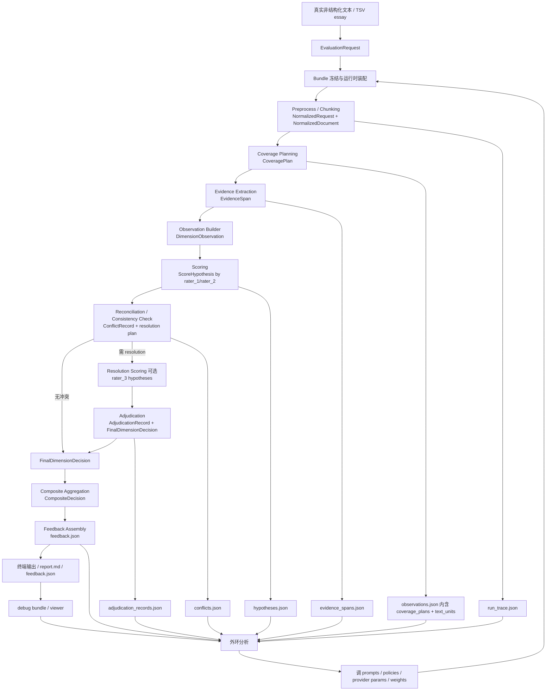

# 系统数据流与内外环交互报告

基于当前代码快照（2026-03-31）梳理，范围覆盖真实运行入口、内环主链路、最终交付物，以及外环可利用的数据与可调策略。

本报告对应的真实运行主入口是 `scripts/eval.py`，核心编排器是 `src/pipeline/runner.py`，默认 bundle 是 `configs/bundles/asap_set8_baseline.bundle.yaml`。

## 0. 先给出一句总览

一段真实非结构化文本进入系统后，会先被封装为 `EvaluationRequest`，随后在冻结后的 bundle 配置约束下，依次经历：

1. 文本标准化与分块
2. 按维度做 coverage 规划
3. 按维度抽取证据
4. 证据整理为 observation
5. 多评审员独立打分
6. 一致性检查与冲突升级
7. 可选的 resolution 复评分 / 裁决
8. 生成最终维度决策与 composite 总分
9. 组装成学生/教师可读的 feedback
10. 写出 trace、artifact、debug bundle，供外环分析与后续优化

系统真正“流动”的不是散乱 dict，而是一组显式 contract 对象：

| 层级 | 核心对象 | 定义文件 | 作用 |
|---|---|---|---|
| 请求边界 | `EvaluationRequest` | `src/contracts/request_models.py` | 原始文本进入系统的边界对象 |
| 预处理后 | `NormalizedRequest` / `NormalizedDocument` / `TextUnit` | `src/contracts/request_models.py` | 规范化文本与分块结果 |
| coverage | `CoveragePlan` | `src/contracts/request_models.py` | 每个维度该看哪些 chunk、要覆盖哪些 facet |
| 证据层 | `EvidenceSpan` | `src/contracts/evidence.py` | 带 quote / offset / facet 的证据单元 |
| 观察层 | `DimensionObservation` | `src/contracts/evidence.py` | 某维度的结构化证据摘要 |
| 评分层 | `ScoreHypothesis` | `src/contracts/scoring.py` | 某评审员对某维度的打分假设 |
| 冲突层 | `ConflictRecord` / `AdjudicationRecord` | `src/contracts/scoring.py` | 分歧检测与裁决记录 |
| 决策层 | `FinalDimensionDecision` / `CompositeDecision` | `src/contracts/scoring.py` | 最终维度分数与总分 |
| 交付层 | `feedback` dict / `RunTrace` | `src/agents/feedback.py`, `src/contracts/trace.py` | 用户反馈与可回放运行轨迹 |

## 1. 文本流转全链路解析

### 阶段 0：运行时装配与配置冻结

- 阶段目标
  - 把 bundle、rubric、policy、provider、prompt 模板装配成一次可重放的运行环境。
- 关键代码
  - `scripts/eval.py`
  - `src/agents/config_resolver.py`
  - `src/config/compiler.py`
  - `src/providers/factory.py`
  - `src/providers/prompt_loader.py`
- 输入
  - CLI 从 TSV 读取 essay 文本，并构造 `EvaluationRequest`。
  - bundle 路径，默认是 `configs/bundles/asap_set8_baseline.bundle.yaml`。
- 输入示例
```json
{
  "raw_text": "Softball has to be one of the single most greatest sports alive...",
  "bundle_ref": "asap_set8_baseline@2026-03-12",
  "request_id": null,
  "metadata": {
    "essay_id": "20717",
    "source": "artifacts/eval/20717",
    "has_human_scores": true
  }
}
```
- 输出
  - `ResolvedArtifactBundle`
  - `provider` / `rater_providers` / `stage_providers`
  - `prompt_templates`
- 输出示例
```json
{
  "bundle_id": "asap_set8_baseline",
  "bundle_version": "2026-03-12",
  "rubric_version": "v1",
  "policy_version": "adj:v1|agg:v1|exp:v1",
  "provider_config": {
    "default": "...",
    "rater_providers": {
      "rater_2": {
        "model": "qwen3.5-plus",
        "params": {
          "temperature": 0.0,
          "max_tokens": 2048,
          "extra_body": {
            "enable_thinking": true,
            "thinking_budget": 512
          }
        }
      }
    },
    "stage_providers": {
      "chunking": "...",
      "coverage_planning": "...",
      "evidence_extraction": "...",
      "feedback": "..."
    }
  }
}
```
- 说明
  - `ConfigCompiler` 会把 rubric、adjudication、aggregation、explanation、chunking、scoring_context 全部冻结成快照。
  - 当前真正用于运行的 prompt 模板，是 `scripts/eval.py` 里的 `_load_prompt_templates()` 加载出来的 `PromptTemplate` 对象，而不是直接拿 `ResolvedArtifactBundle.prompt_templates` 的原始字符串。

### 阶段 1：预处理与智能分块

- 阶段目标
  - 把原始长文本变成标准化文档，并切成可追踪 offset 的 `TextUnit[]`。
- 关键代码
  - `src/pipeline/runner.py`
  - `src/agents/chunker.py`
  - `src/agents/deterministic_chunker.py`
- 输入
  - `EvaluationRequest`
  - `chunking` stage provider
  - `chunking.yaml`
  - `chunking_policy.document_processing.token_threshold`
- 输出
  - `NormalizedRequest`
  - `NormalizedDocument`
- 输入示例
```json
{
  "raw_text": "student essay text...",
  "bundle_ref": "asap_set8_baseline@2026-03-12",
  "metadata": {
    "essay_id": "20717"
  }
}
```
- 输出示例
```json
{
  "normalized_request": {
    "request_id": "req-e7a1a548e8d3",
    "raw_text": "student essay text...",
    "bundle_ref": "asap_set8_baseline@2026-03-12",
    "normalization_notes": [
      "strip_whitespace"
    ]
  },
  "document": {
    "document_id": "doc-00bfe0e4b101",
    "normalized_text": "student essay text...",
    "document_type": "unknown",
    "token_estimate": 1512,
    "text_units": [
      {
        "unit_id": "unit-d5d353ae0c53",
        "text": "Softball has to be one of the single most greatest sports alive...",
        "start_offset": 0,
        "end_offset": 692,
        "unit_type": "chunk",
        "sequence_index": 0,
        "chunk_title": "Introduction to Softball Passion",
        "chunk_method": "llm_semantic"
      }
    ]
  }
}
```
- 说明
  - 短文走 `llm_semantic`，长文走 `llm_hierarchical`，失败时自动回退到规则分句。
  - 真实 run 里后续所有 quote 对齐、offset、chunk coverage 都依赖这里产出的 `TextUnit.start_offset/end_offset`。

### 阶段 2：按维度做 coverage 规划

- 阶段目标
  - 对每个 rubric 维度生成一个 `CoveragePlan`，决定后续抽证据时该优先看哪些 chunk。
- 关键代码
  - `src/agents/coverage.py`
  - `src/policies/rubric_core.py`
  - `configs/prompts/dimension_relevance.yaml`
  - `configs/policies/chunking/asap_set8_chunking.yaml`
- 输入
  - `NormalizedDocument`
  - `RubricSnapshot`
  - `chunking_policy.coverage`
- 输出
  - `CoveragePlan[]`
- 输出示例
```json
[
  {
    "plan_id": "plan-3e55a5234cb9",
    "document_id": "doc-00bfe0e4b101",
    "dimension_id": "ideas_content",
    "target_unit_ids": [
      "unit-d5d353ae0c53",
      "unit-e2e1eee7ca46",
      "unit-59b94fdf22f4"
    ],
    "required_facets": [
      "clarity_focus",
      "main_idea_salience",
      "support_relevance",
      "development_depth",
      "audience_purpose_fit"
    ],
    "minimum_evidence_units": 2,
    "allowed_evidence_scopes": [
      "span",
      "global"
    ],
    "coverage_strategy": "targeted",
    "relevance_scores": {
      "unit-d5d353ae0c53": 1.0,
      "unit-e2e1eee7ca46": 0.5,
      "unit-59b94fdf22f4": 0.3333333333
    }
  }
]
```
- 说明
  - mock 或 provider 缺失时，coverage 直接退化为 `full_scan`。
  - 真实模式下是“每个维度各自挑 top-k chunk”，所以这一步已经在做第一层成本控制和召回/精度折中。

### 阶段 3：按维度抽取证据

- 阶段目标
  - 从 coverage 选中的 chunk 中，抽出带 quote、facet、support_type、offset 的 `EvidenceSpan`。
- 关键代码
  - `src/agents/extractor.py`
  - `src/agents/prompt_builders.py`
  - `src/utils/quote_matcher.py`
  - `configs/prompts/evidence_extraction.yaml`
- 输入
  - 单个 `CoveragePlan`
  - `NormalizedDocument`
  - `RubricSnapshot`
  - `evidence_extraction` stage provider
- 输出
  - `List[EvidenceSpan]`，按维度收集后形成 `Dict[dimension_id, List[EvidenceSpan]]`
- 输出示例
```json
[
  {
    "span_id": "span-ext-de750c7be931",
    "document_id": "doc-00bfe0e4b101",
    "unit_id": "unit-d5d353ae0c53",
    "text_quote": "playing softball in college has always been a goal of mine",
    "start_offset": 84,
    "end_offset": 139,
    "scope": "span",
    "dimension_id": "ideas_content",
    "facet_ids": [
      "clarity_focus",
      "main_idea_salience"
    ],
    "extraction_note": "provider:exact:supporting",
    "support_type": "supporting"
  }
]
```
- 说明
  - 这里不是只拿“整段相关文本”，而是把 LLM 产出的 `quote` 再次回贴到原文，得到真实 offset。
  - 如果某个 required facet 没抽到证据，extractor 会补一个 `GLOBAL` fallback span，保证下游 coverage validation 不会直接断掉。

### 阶段 4：证据整理为 observation

- 阶段目标
  - 把零散 `EvidenceSpan` 组织成“维度级观察结果”，供 scorer 使用。
- 关键代码
  - `src/agents/observer.py`
- 输入
  - 某维度的 `EvidenceSpan[]`
  - 对应 `CoveragePlan`
- 输出
  - `DimensionObservation`
- 输出示例
```json
{
  "observation_id": "obs-280894b43735",
  "document_id": "doc-00bfe0e4b101",
  "dimension_id": "ideas_content",
  "supporting_span_ids": [
    "span-ext-de750c7be931",
    "span-ext-9d30ddb2d448"
  ],
  "counter_span_ids": [],
  "facet_findings": [
    {
      "facet_id": "clarity_focus",
      "supporting_span_ids": [
        "span-ext-de750c7be931"
      ],
      "counter_span_ids": [],
      "finding_note": "1 supporting, 0 counter"
    }
  ],
  "observation_confidence": "high",
  "uncertainty_notes": [],
  "coverage_miss_span_ids": []
}
```
- 说明
  - 评分阶段拿到的不是原文全文，而是 `facet_findings + supporting/counter evidence + observation_confidence` 这个结构化摘要。
  - 也就是说，系统已经把“找证据”和“判分”拆成了两个不同认知步骤。

### 阶段 5：多评审员独立打分

- 阶段目标
  - 每个维度让多个 scorer 独立输出 `ScoreHypothesis`。
- 关键代码
  - `src/agents/scorer.py`
  - `src/agents/prompt_builders.py`
  - `configs/prompts/scoring.yaml`
  - `configs/prompts/scoring_context.yaml`
- 输入
  - `DimensionObservation`
  - 全量 `EvidenceSpan[]`
  - `RubricSnapshot`
  - 某个 rater provider
  - `scoring_context`
- 输出
  - `ScoreHypothesis`
- 输出示例
```json
{
  "hypothesis_id": "hyp-score-903a3994ca35",
  "observation_id": "obs-280894b43735",
  "dimension_id": "ideas_content",
  "rater_id": "rater_1",
  "score": {
    "canonical_score": 5,
    "display_score": "5",
    "display_annotation": null,
    "scale_ref": "ordinal_6"
  },
  "descriptor_refs": [
    "clarity, focus, and control",
    "main ideas stand out",
    "supporting, relevant, carefully selected details"
  ],
  "evidence_span_ids": [
    "span-ext-de750c7be931",
    "span-ext-9d30ddb2d448"
  ],
  "rationale": "The essay demonstrates clear, focused, and interesting ideas with strong support...",
  "confidence": 0.9
}
```
- 说明
  - 当前真实链路是双评审基础上可选第三评审，rater id 来自 adjudication policy 的 `rater_labels` 和 `resolution_rater_label`。
  - scorer 的输入 prompt 已经包含：
    - rubric levels
    - facet evidence
    - observation confidence
    - dataset notes
    - calibration notes
    - score anchors
  - 这一步是“内环最贵的阶段”，因为它既长上下文，又要结构化 JSON。
  - 当前实现支持 provider-default params，因此外环可以直接在 bundle 里调模型、`max_tokens`、thinking budget 等参数。

### 阶段 6：一致性检查与冲突升级

- 阶段目标
  - 检查多个 `ScoreHypothesis` 是否出现需要升级处理的分歧。
- 关键代码
  - `src/agents/reconciliation.py`
  - `src/policies/adjudication.py`
  - `src/orchestrator/router.py`
  - `configs/policies/adjudication/asap_set8_default.yaml`
- 输入
  - `ScoreHypothesis[]`
  - `PolicySnapshot.adjudication_policy`
- 输出
  - `ReconciliationResult`
  - 其中核心是 `ConflictRecord[]`
- 输出示例
```json
{
  "conflicts": [
    {
      "conflict_id": "conflict-adjacent-abc123",
      "dimension_id": "organization",
      "hypothesis_ids": [
        "hyp-score-a",
        "hyp-score-b"
      ],
      "conflict_type": "adjacent_drift",
      "trigger_rule_id": "systematic_adjacent_drift",
      "conflict_detail": "Systematic adjacent drift: rater_2 is higher than rater_1 on 3 dimensions ...",
      "recommended_path": "third_rater"
    }
  ],
  "needs_resolution_scoring": true,
  "resolution_dimension_ids": [
    "ideas_content",
    "organization",
    "sentence_fluency"
  ],
  "resolution_rater_label": "rater_3"
}
```
- 说明
  - 当前 policy 支持三类 trigger：
    - `score_distance`
    - `pattern_match`（cusp）
    - `adjacent_drift`
  - 这是 Stage L 的关键改造之一：冲突检测和 resolution 策略不再散落，而是统一由 `reconciliation` 和 policy 驱动。

### 阶段 7：可选的 resolution 复评分

- 阶段目标
  - 若 policy 指定需要 `resolution_rater`，则对冲突维度或全维度补打第三评审分。
- 关键代码
  - `src/pipeline/runner.py`
  - `src/agents/scorer.py`
- 输入
  - 被 `ReconciliationResult` 选中的 `DimensionObservation[]`
  - `resolution_rater_label`
- 输出
  - 额外的 `ScoreHypothesis[]`
- 说明
  - 是否只重打冲突维度，取决于 adjudication policy 中的 `resolution_strategy.re_score_scope`。
  - 当前默认 policy 是 `all_dimensions`。

### 阶段 8：裁决并生成最终维度决策

- 阶段目标
  - 把冲突维度统一收束成一个权威结果，同时为无冲突维度也生成最终决策对象。
- 关键代码
  - `src/agents/reconciliation.py`
  - `src/orchestrator/router.py`
- 输入
  - `ConflictRecord[]`
  - 全量 `ScoreHypothesis[]`
  - adjudication policy
- 输出
  - `AdjudicationRecord[]`
  - `FinalDimensionDecision[]`
- 输出示例
```json
{
  "decision_id": "dec-6062bd1f7cf4",
  "dimension_id": "ideas_content",
  "final_score": {
    "canonical_score": 5,
    "display_score": "5",
    "display_annotation": null,
    "scale_ref": "ordinal_6"
  },
  "primary_hypothesis_id": "hyp-score-903a3994ca35",
  "adjudication_id": null,
  "evidence_span_ids": [
    "span-ext-de750c7be931",
    "span-ext-9d30ddb2d448"
  ],
  "descriptor_refs": [
    "clarity, focus, and control",
    "main ideas stand out"
  ],
  "decision_confidence": 0.9,
  "decision_note": "no conflict, rater_1 score used (raters converged)"
}
```
- 说明
  - 即使没有冲突，也会统一生成 `FinalDimensionDecision`，这样 feedback 和 composite 只消费一种最终对象。
  - 当前 real path 的默认策略是 `use_resolution_rater_as_authoritative`，fallback 是 `average_of_raters`。

### 阶段 9：综合分计算

- 阶段目标
  - 把维度级 `FinalDimensionDecision` 或指定 rater 的 hypothesis 聚合成 ASAP composite 总分。
- 关键代码
  - `src/policies/aggregation.py`
  - `configs/policies/aggregation/asap_set8_composite.yaml`
- 输入
  - `FinalDimensionDecision[]`
  - `ScoreHypothesis[]`
  - `AdjudicationRecord[]`
  - aggregation policy
- 输出
  - `CompositeDecision | null`
- 输出示例
```json
{
  "composite_id": "composite-c618a0a5c1d0",
  "composite_score": {
    "canonical_score": 35,
    "display_score": "35",
    "display_annotation": null,
    "scale_ref": "composite:asap_set8_composite"
  },
  "aggregation_detail": {
    "variant_id": "without_resolution",
    "aggregation_method": "average_per_trait_then_weighted_sum",
    "source_raters": [
      "rater_1",
      "rater_2"
    ],
    "weights": {
      "ideas_content": 2,
      "organization": 2,
      "voice": 0,
      "word_choice": 0,
      "sentence_fluency": 2,
      "conventions": 4
    },
    "resolution_used": false
  }
}
```
- 说明
  - 当前 ASAP Set 8 的 composite 不包含 `voice` 和 `word_choice`，`conventions` 权重最高。
  - 若使用了 resolution，policy 会切换到 `with_resolution` 变体。

### 阶段 10：反馈生成

- 阶段目标
  - 把最终分数和证据链转成稳定 schema 的反馈结果；真实模式下再生成学生可读 commentary。
- 关键代码
  - `src/agents/feedback.py`
  - `src/policies/explanation.py`
  - `src/agents/prompt_builders.py`
  - `configs/prompts/explanation.yaml`
  - `configs/policies/explanation/evidence_grounded_v1.yaml`
- 输入
  - `FinalDimensionDecision[]`
  - `DimensionObservation[]`
  - `EvidenceSpan[]`
  - `ScoreHypothesis[]`
  - `RubricSnapshot`
  - `PolicySnapshot`
- 输出
  - `feedback: Dict[str, Any]`
- 输出示例
```json
{
  "dimensions": {
    "ideas_content": {
      "dimension_name": "Ideas and Content",
      "canonical_score": 5,
      "final_score": 5,
      "display_score": "5",
      "display_annotation": null,
      "descriptor_refs": [
        "clarity, focus, and control",
        "main ideas stand out"
      ],
      "evidence_span_ids": [
        "span-ext-de750c7be931",
        "span-ext-9d30ddb2d448"
      ],
      "evidence_count": 2,
      "feedback_text": "Your essay shows clear, focused ideas and uses relevant details to make the main point stand out...",
      "commentary": "same as feedback_text",
      "uncertainty_note": null,
      "decision_confidence": 0.9,
      "confidence": 0.9,
      "rationale": "no conflict, rater_1 score used (raters converged)",
      "scorer_rationale": "The essay demonstrates clear, focused, and interesting ideas...",
      "was_adjudicated": false
    }
  },
  "violations": [],
  "generated_at": "2026-03-31T10:00:00+00:00",
  "summary": "LLM-generated feedback for 6 dimension(s).",
  "provider": "openai_compatible",
  "composite": {
    "composite_score": {
      "canonical_score": 35
    }
  }
}
```
- 说明
  - 这是 Stage M 的关键改造之一：
    - explanation prompt 已明确注入 `facet_evidence`
    - `observation_confidence`
    - `scorer_rationale`
    - `was_adjudicated`
    - `decision_note`
  - 因此最终 feedback 不再只是“分数 + 短评”，而是带有可追溯证据链和裁决上下文的解释结果。

### 阶段 11：终端验证、落盘与开发可视化

- 阶段目标
  - 验证输出完整性，并把内环全过程沉淀为运行工件。
- 关键代码
  - `src/pipeline/runner.py`
  - `src/pipeline/validators.py`
  - `scripts/eval.py`
  - `src/debug/bundle.py`
  - `src/providers/logging_provider.py`
- 输入
  - `feedback`
  - `RunTrace`
  - `runner.last_*` 中间状态
- 输出
  - `run_trace.json`
  - `feedback.json`
  - `hypotheses.json`
  - `evidence_spans.json`
  - `observations.json`
  - `conflicts.json`
  - `adjudication_records.json`
  - `report.md`
  - debug bundle（可选）
- 说明
  - `RunTrace` 记录节点时序、输入输出引用、checkpoint、fallback history。
  - debug bundle 额外记录：
    - `events.jsonl`
    - node 输入输出快照
    - 每次 LLM 调用的 prompt / schema / response / structured output
    - `summary.json`
    - `viewer/index.html`

## 2. 最终输出与用户反馈

### 2.1 内环最终产出的评价内容有哪些维度

当前 rubric 是 ASAP Set 8 的 6 个写作维度：

1. `ideas_content`
2. `organization`
3. `voice`
4. `word_choice`
5. `sentence_fluency`
6. `conventions`

另外还会产出一个 `composite` 总分，但该总分只聚合：

1. `ideas_content`
2. `organization`
3. `sentence_fluency`
4. `conventions`

其中 `voice` 和 `word_choice` 当前不参与 composite。

### 2.2 终端用户最终会看到什么

从“当前已经落地的代码”来看，真正的用户可见交付物有三层：

#### 第一层：终端即时输出

`scripts/eval.py --verbose` 会打印：

1. 节点执行时间线
2. 双评审原始分数
3. LLM 调用统计
4. 每个维度的最终分数与等级
5. composite 总分
6. 每个维度的详细文字反馈

#### 第二层：`report.md`

它是当前最接近教师/学生可直接阅读的交付物，包含：

1. 运行时间、run_id、bundle 版本
2. 执行过程摘要
3. 每维分数表
4. composite 总分
5. 每维度 1 段反馈文字

#### 第三层：`feedback.json`

它是当前最标准、最适合前端消费的结构化结果。一个维度下至少包含：

1. 分数
2. 展示分数字符串
3. rubric descriptor 引用
4. evidence span 引用
5. 学生可读反馈文本
6. decision confidence
7. scorer rationale
8. 是否发生 adjudication

### 2.3 从“学生/教师视角”理解，这个系统最后给了什么

如果忽略开发期的 trace 和 debug artifact，用户真正得到的是：

1. 每个写作维度一个最终分数
2. 每个分数对应的 rubric 描述依据
3. 基于文本证据的解释性反馈
4. 可能的低置信度或裁决说明
5. 一个 ASAP 规则下的加权 composite 总分

所以它不是一个单纯“打分器”，而是一个：

- 评分结果
- 评分证据
- 评分解释
- 评分过程可追溯记录

合在一起的评价系统。

## 3. 外环机制与系统演进

### 3.1 外环目前能沉淀哪些数据

按价值高低，可以分成 6 类。

#### A. 最终监督信号

来自：

1. `feedback.json`
2. `run_trace.json`
3. TSV 中的人类分数
4. `scripts/compute_qwk.py`

可得到：

1. 每维最终分数
2. composite 总分
3. MAS vs human 的 per-dimension QWK
4. composite QWK
5. agent vs agent 一致性

#### B. 中间推理产物

来自：

1. `hypotheses.json`
2. `evidence_spans.json`
3. `observations.json`
4. `conflicts.json`
5. `adjudication_records.json`

可得到：

1. 每个 rater 的分数假设
2. 每个维度抽到了哪些 quote
3. facet 级证据覆盖情况
4. 观察置信度
5. 哪些维度触发了 conflict
6. conflict 属于哪种类型
7. 最终是如何 adjudicate 的

#### C. coverage 与抽证据质量数据

来自：

1. `observations.json`
2. `evidence_spans.json`
3. `scripts/compute_coverage_metrics.py`

可得到：

1. `coverage_recall_rate`
2. `coverage_precision_rate`
3. `chunk_boundary_quality`
4. `coverage_miss_span_ids`
5. `target_unit_ids` 与真实 span 落点之间的偏差

#### D. 成本与时延数据

来自：

1. `RunTrace.node_traces`
2. `LoggingProvider`
3. debug bundle 的 `llm_calls/*.json`

可得到：

1. 每节点耗时
2. 每角色调用次数
3. prompt/completion/total token
4. model_id
5. 每次 LLM 调用的 call params
6. 慢尾阶段、重试情况、解析失败情况

#### E. 可解释性与反馈质量数据

来自：

1. `feedback.json`
2. `violations`
3. explanation prompt / response

可得到：

1. 最终 feedback 文本
2. descriptor-evidence-score 链是否闭合
3. feedback 是否过长/过短/空泛
4. `was_adjudicated` 和 `uncertainty_note` 是否合理

#### F. 全链路开发可视化数据

来自 debug bundle：

1. `events.jsonl`
2. `summary.json`
3. `node_artifacts/*`
4. `llm_calls/blobs/*`

可得到：

1. 某一步开始偏了
2. 偏在 prompt、model、structured parse，还是 policy
3. 哪个维度、哪个 rater、哪个模型最不稳定

### 3.2 外环可以调哪些内容

这里最重要的是区分“已配置化”与“仍需改代码”。

#### 一类：已经配置化，外环可以直接调

#### 1. 模型绑定与推理预算

位置：

1. `configs/bundles/asap_set8_baseline.bundle.yaml`
2. `src/providers/factory.py`
3. `src/providers/openai_compatible.py`

可调：

1. default model
2. 某个 rater 使用哪个模型
3. 某个 stage 使用哪个模型
4. `temperature`
5. `max_tokens`
6. provider-specific thinking / reasoning budget

适用目标：

1. 降成本
2. 降慢尾
3. 提升某一 stage 的准确率

#### 2. 分块与 coverage 收窄策略

位置：

1. `configs/policies/chunking/asap_set8_chunking.yaml`

可调：

1. `token_threshold`
2. `default_top_k`
3. `per_dimension_top_k`
4. fallback 策略

适用目标：

1. 提高证据召回
2. 降低 extractor 成本
3. 提高 quote 对齐质量

#### 3. evidence extraction prompt 与维度 override

位置：

1. `configs/prompts/evidence_extraction.yaml`
2. `configs/prompts/evidence_extraction_overrides/*.yaml`

可调：

1. facet 引导方式
2. quote 抽取保守度
3. supporting / counter evidence 的平衡
4. 某个维度专用指令

#### 4. scoring prompt 与 scoring context

位置：

1. `configs/prompts/scoring.yaml`
2. `configs/prompts/scoring_overrides/*.yaml`
3. `configs/prompts/scoring_context.yaml`

可调：

1. scorer 角色描述
2. dataset notes
3. calibration notes
4. score anchors
5. justification 约束
6. per-dimension override

适用目标：

1. 提高分数校准
2. 减少系统性高/低打
3. 减少相邻分漂移

#### 5. adjudication policy

位置：

1. `configs/policies/adjudication/asap_set8_default.yaml`

可调：

1. `score_distance` 阈值
2. cusp rule
3. `adjacent_drift` 的 `score_gap`
4. `min_matching_dimensions`
5. `require_same_direction`
6. trigger priority
7. `re_score_scope`
8. `fallback_if_no_resolution`

适用目标：

1. 提高最终一致性
2. 决定何时要三评
3. 决定冲突是否放行

#### 6. explanation policy 与 feedback prompt

位置：

1. `configs/policies/explanation/evidence_grounded_v1.yaml`
2. `configs/prompts/explanation.yaml`
3. `configs/prompts/explanation_overrides/*.yaml`

可调：

1. `min_citations_per_dimension`
2. `low_confidence_threshold`
3. `max_commentary_length_per_dimension`
4. 学生反馈的措辞风格
5. 行动建议强度
6. 是否强调 adjudication / uncertainty

适用目标：

1. 提升反馈可读性
2. 提升反馈可追溯性
3. 避免“空泛表扬/空泛批评”

#### 7. composite 聚合策略

位置：

1. `configs/policies/aggregation/asap_set8_composite.yaml`

可调：

1. 哪些维度进入总分
2. 每个维度权重
3. 无裁决/有裁决时分别用什么聚合变体

#### 8. rubric 定义本身

位置：

1. `configs/rubrics/asap_set8_baseline.yaml`
2. `src/policies/rubric_core.py`

可调：

1. 维度集合
2. 每个维度的 `required_facets`
3. `minimum_evidence_units`
4. `allowed_evidence_scope`
5. score level 的 `summary` 与 `descriptors`
6. scale 范围

适用目标：

1. 任务迁移到新数据集/新评分标准
2. 修正 rubric 与人工标注定义不一致的问题
3. 强化某维度的证据要求

注意：

- 这一层不是普通 prompt 调优，而是“评价任务定义”本身。
- 一旦修改，历史 run 的可比性、QWK 口径、外环回放基线都会受影响。

#### 二类：目前还不是完全配置化，需要代码改造后外环才能调

#### 1. retry 限额

当前 `CheckpointManager(max_retries=2)` 还写死在 `src/pipeline/runner.py`。

#### 2. 独立的 system prompt 通道

provider 接口支持 `LLMRequest.system`，但当前主要 agent 调用基本都只传 `prompt`，没有真正把 system prompt 拆成可单独调优的层。

这意味着外环当前能调的是 prompt template 文本，而不是严格意义上的“system prompt”。

#### 3. 更细粒度的路由策略

当前 router 只基于 `ConflictRecord.recommended_path` 和 `AdjudicationRecord.is_resolved` 做状态路由；如果未来要让外环直接学习更复杂的路由策略，还需要额外暴露接口。

### 3.3 如果外环以“提升评估准确率”为目标，最值得调什么

优先级建议如下。

#### 优先级 P1：scoring

因为最终分数误差最直接来自 scorer。

优先调：

1. rater 模型选择
2. reasoning budget
3. scoring context 中的 calibration notes
4. score anchors
5. per-dimension scoring override

#### 优先级 P2：coverage + extraction

因为很多评分错误其实是证据没被送进 scorer。

优先调：

1. `per_dimension_top_k`
2. dimension relevance prompt
3. evidence extraction prompt
4. quote 对齐失败样本

#### 优先级 P3：adjudication

因为它决定“哪些分歧会被放大成 resolution”。

优先调：

1. 相邻分漂移触发条件
2. cusp rule 的适用面
3. `re_score_scope`
4. fallback strategy

#### 优先级 P4：feedback

它不直接改变分数，但会显著影响系统可用性和教师信任度。

优先调：

1. explanation prompt
2. evidence citation policy
3. 低置信度提示方式
4. actionable next-step suggestion 模式

## 4. 架构可视化



## 5. 最后的架构判断

从当前代码看，这个系统已经不是“一个 prompt 串起来的打分脚本”，而是一个分层很清楚的 MAS 评估流水线：

1. 文本理解层：chunking + coverage + extraction
2. 证据结构化层：observation
3. 多评审推断层：scoring hypotheses
4. 冲突治理层：reconciliation + adjudication
5. 结果生成层：composite + feedback
6. 观测与优化层：trace + artifacts + debug bundle + offline metrics

对外，它产出的是“带证据链的评价反馈”。

对内，它已经具备了外环优化所需的大部分可观测数据，只差把这些数据进一步系统化地接到实验框架、指标看板和自动调参回路上。
