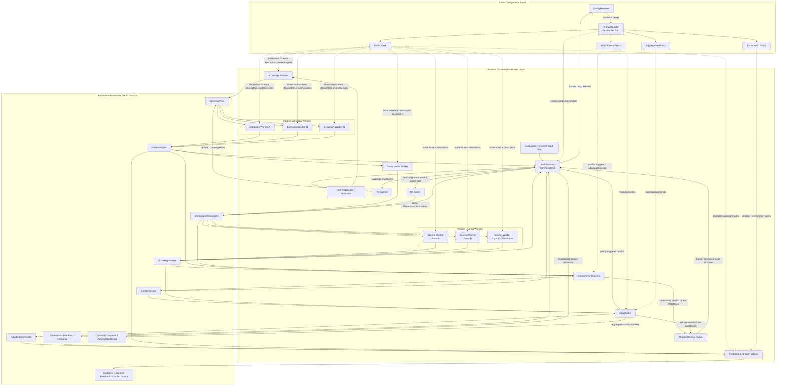

# Rubric-Grounded Text Evaluation MAS Architecture

## Part 1. 角色映射与职责定义表

| Agent Name | MAS Role Type | Primary Responsibility | Inputs | Outputs | Why It Must Exist | Failure / Escalation Trigger |
| --- | --- | --- | --- | --- | --- | --- |
| Lead Evaluator (Orchestrator) | Orchestrator | 冻结单次运行的 `Artifact Bundle`，驱动状态机，拆分维度任务，调度并行 workers，聚合中间态，决定 `Re-Extract` / `Re-Score` / `Adjudicate` / `Human Review` 路径。 | `EvaluationRequest`，bundle refs/defaults，`ResolvedArtifactBundle`，各节点回流的中间对象 | 运行态 checkpoint，worker dispatch 指令，`FinalDimensionDecision[]`，可选 aggregated result routing，terminal output routing | 它是控制平面而不是评分器；没有它，系统会退化成单 Agent 长链路 prompt，无法做局部回退、并行调度与审计。 | bundle 冻结失败；任一关键中间态缺失；`ConflictRecord` 未收敛；低置信或人工规则命中 |
| ConfigResolver | Worker | 解析并冻结运行时配置，把 `Rubric Core`、`Adjudication Policy`、`Aggregation Policy`、`Explanation Policy` 组装成可回放的 `Artifact Bundle`。 | `NormalizedRequest`，bundle refs/defaults | `ResolvedArtifactBundle`，`RubricSnapshot`，`PolicySnapshot` | 这是“零硬编码”的入口；如果配置不在这里冻结，后续所有评分与解释都不可重放。 | ref 不可解；schema 不兼容；rubric/policy/explanation 版本不闭合 |
| Coverage Planner | Worker | 按 rubric 维度、facet 与证据要求生成维度级/维度组级 `CoveragePlan`，限定每个 extraction worker 的观察范围。 | `NormalizedDocument`，`TextUnit[]`，`RubricSnapshot` | `CoveragePlan[]` | 该层把“抽什么证据”与“如何评分”分离，避免 scoring 阶段自行搜证导致不可审计。 | 无法为某维度生成合法覆盖策略；facet 覆盖不足；文本窗口设计不满足 evidence requirements |
| Extraction Subagents | Worker | 并行按维度或维度组执行证据抽取，生成带偏移和引用能力的 `EvidenceSpan`，并显式报告 coverage 缺口。 | `CoveragePlan[]`，`TextUnit[]`，`RubricSnapshot` | `EvidenceSpan[]`，coverage status / insufficiency notes | 证据抽取是最易与评分混淆的高风险环节，必须并行且独立，以隔离长文本搜索成本和抽取误差。 | coverage insufficient；quote 与原文偏移不一致；关键 facet 无证据支撑 |
| Observation Builder | Worker | 将 `EvidenceSpan` 组织为结构化 `DimensionObservation`，显式记录 supporting / counter evidence、facet findings 与 observation confidence。可与 extraction 共部署，但逻辑上必须单独建模。 | `EvidenceSpan[]`，`RubricSnapshot` | `DimensionObservation[]`，可选 uncertainty notes | 它把“找到证据”与“如何解释证据”分开，保证后续 `Re-Score` 不必重新抽取全文。 | observation 缺少必填 facets；evidence refs 断链；observation 与 rubric facet schema 不匹配 |
| Scoring Subagents | Worker | 独立执行双评/三评等多路评分，基于 `DimensionObservation` 输出引用 descriptor 与 evidence 的 `ScoreHypothesis`。 | `DimensionObservation[]`，`RubricSnapshot` | `ScoreHypothesis[]` | 多路独立评分是后续一致性评估、QWK 分析、分歧定位和 policy adjudication 的前提。 | 分数越界；未引用 descriptor/evidence；confidence 过低；与 observation 明显冲突 |
| Consistency Checker | Worker | 对 `ScoreHypothesis`、`DimensionObservation`、`EvidenceSpan` 做一致性与政策前检查，生成 `ConflictRecord` 并推荐下一步动作。 | `ScoreHypothesis[]`，`DimensionObservation[]`，`EvidenceSpan[]`，`PolicySnapshot` | `ConflictRecord[]`，consistency status | 它把“评分是否可接受”显式化，否则系统只能盲目平均或直接出分。 | 非邻接冲突；policy trigger 命中；coverage 缺口；低置信或解释链不闭合 |
| Adjudicator | Worker | 按 `Adjudication Policy` 处理冲突、执行 resolution 路径，并按 `Aggregation Policy` 产出维度最终决定及可选 composite。 | `ScoreHypothesis[]`，`ConflictRecord[]`，`PolicySnapshot` | `AdjudicationRecord[]`，`FinalDimensionDecision[]`，optional composite / aggregated result | 它保证“裁决”是可审计政策执行，而不是 orchestrator 的隐式主观判断。 | 冲突经 resolution 后仍未收敛；policy 无法决断；aggregated result 缺少必要维度；置信度仍低 |
| Feedback & Citation Subagent | Terminal Worker | 基于 final decisions、descriptor refs、evidence ids 组装证据绑定反馈，强制说明与 rubric descriptor、evidence 引用和维度分数一一对应。 | `FinalDimensionDecision[]`，`AdjudicationRecord[]`，`EvidenceSpan[]`，`RubricSnapshot`，`PolicySnapshot` | evidence-grounded feedback / citation output | 解释生成的约束与评分不同，必须作为末端单独工位，专门负责“禁止无引用主张”。 | 缺 descriptor alignment；缺 evidence links；生成了未被最终决定支持的自由评语 |
| Human Review Queue | Human | 接收 unresolved conflict、持续低置信、规则无法闭合或高风险案例，做人工裁定、退回重跑或确认发布。 | `ConflictRecord[]`，`AdjudicationRecord[]`，完整 trace bundle | human decision / override / rerun directive | 该系统追求的是诚实与一致，而不是强行自动化；人工复核是治理闭环的一部分。 | unresolved conflict；多轮回退后仍低置信；高价值场景要求人工签核 |

## Part 2. Mermaid 系统架构图

## Part 3. 架构设计说明

### A. 为什么它符合 `research.md`

该方案把 `Rubric Core`、`Adjudication Policy`、`Aggregation Policy`、`Explanation Policy` 明确建模为独立、可版本化、可注入的配置工件，并通过 `ConfigResolver` 在单次运行开始时冻结为 `Artifact Bundle`。因此 agent 不携带写死的维度名称、分档范围、裁决阈值、聚合公式或解释模板，满足“极致解耦 / 零硬编码”要求。

它同时把 `CoveragePlan`、`EvidenceSpan`、`DimensionObservation`、`ScoreHypothesis`、`ConflictRecord`、`AdjudicationRecord` 作为一等中间态，而不是隐含在 prompt 内部。每个对象都对应明确的生产者、消费者和重试入口，因此系统不仅能输出最终分数，还能回答“抽了哪些证据”“证据如何形成 observation”“为什么触发裁决”“为什么这次结果与上次不同”，满足可审计与可回放要求。

解释层被末端 `Feedback & Citation Worker` 严格约束为“final decision + descriptor refs + evidence ids”的函数，而不是自由文本生成，因此最终反馈天然与 rubric descriptor、evidence 引用和维度分数绑定，满足 research 中的证据绑定解释约束。

由于系统保留了 worker 级 `ScoreHypothesis`、节点级 `ConflictRecord`、policy 执行级 `AdjudicationRecord` 以及 bundle version，后续可以直接做 inter-agent disagreement analysis、节点级归因、replay、版本对比和 QWK/一致性评估。换言之，这个架构不只产出“结果”，还产出“结果形成路径”。

### B. 为什么它符合 Orchestrator-Worker 模式

`Lead Evaluator` 被设计成控制平面，而不是“全能单 Agent”。它只负责冻结配置、维护状态机、分发任务、汇总结果和路由异常，不负责亲自抽证据、做 observation、直接评分或直接写评语。这样可以防止一个超长上下文 Agent 同时承担检索、判断、裁决和解释，从而降低上下文污染与职责耦合。

Extraction 与 Scoring 被拆成两个并行 worker 池。Extraction workers 只处理“哪里有证据、证据是否足够”，Scoring workers 只处理“基于 observation 可给出什么候选分数”。这种切分显著降低单次调用所需上下文长度，也允许按维度或维度组扩展并发，从而缓解长文本场景下的 token 消耗、长上下文迷失和单模型吞吐瓶颈。

末端 `Feedback & Citation Worker` 是必要的 terminal worker，因为解释任务与评分任务的约束完全不同。评分阶段追求的是候选分数与 policy 可裁决性；解释阶段追求的是 descriptor-evidence-score 的严格对齐。如果把两者合并，模型极易在“已经知道最终分数”的情况下补写未经证据支持的评语，破坏可审计性。

### C. 为什么它更适合后续做 implementation plan

该架构天然对应独立模块边界：`ConfigResolver`、状态存储与 checkpoint 管理、`Coverage Planner`、Extraction workers、`Observation Builder`、Scoring workers、`Consistency Checker`、`Adjudicator`、`Feedback & Citation Worker`、`Human Review Queue Adapter` 都可以分别实现、替换和测试。

它的核心中间对象天然就是后续的数据契约与 schema：`CoveragePlan`、`EvidenceSpan`、`DimensionObservation`、`ScoreHypothesis`、`ConflictRecord`、`AdjudicationRecord`。这些对象既是节点间接口，也是审计存证单元，还直接决定数据库表、事件日志和 replay harness 的输入输出结构。

它的状态转换也天然适合任务拆解与测试设计。一个最小可执行状态机可以直接定义为：`CONFIG_FROZEN -> COVERAGE_PLANNED -> EVIDENCE_READY -> OBSERVATION_READY -> SCORED -> CONSISTENCY_CHECKED -> ADJUDICATED | RE_EXTRACT | RE_SCORE | HUMAN_REVIEW -> FEEDBACK_RENDERED -> VALIDATED`。每个状态转换都能独立设计 schema 校验、局部重试、回滚条件、集成测试和回归基准。

## Part 4. 架构优势总结

- 该架构通过 orchestrator 拆分维度覆盖、并行 extraction、并行 scoring，把“全文 + 全量 rubric + 多路评分 + 解释生成”的超长链路切成多个短上下文工位，直接缓解 token 消耗、长上下文迷失和单模型吞吐瓶颈问题。
- 该架构强制保留 `CoveragePlan`、`EvidenceSpan`、`DimensionObservation`、`ScoreHypothesis`、`ConflictRecord`、`AdjudicationRecord`，因此任何分歧都能被定位到具体节点：是覆盖不足、证据冲突、observation 漂移、评分分歧，还是 policy 裁决导致的结果变化，而不是只看到一个无法解释的最终分数。
- 该架构通过独立评分 worker + `Consistency Checker` + `Adjudicator` 实现“先多路假设、再策略裁决”，避免单模型一次性拍板；非邻接冲突、低置信与 policy trigger 都不会被静默吞掉，从而提升评分准确性和稳定性。
- 该架构把解释生成放到 terminal worker，并用 `Explanation Policy` 强制 descriptor、evidence、score 三者绑定，解决“结果不可解释、评语脱离证据、无法做节点级归因”的核心问题。
- 该架构分离 canonical score 与 display/output layer，同时保存 bundle version、resolution path 和 human-review 痕迹，使系统可以稳定接入 QWK、inter-agent agreement、slice analysis 与人机一致性校准流程，持续逼近人类专家评分的一致性。
