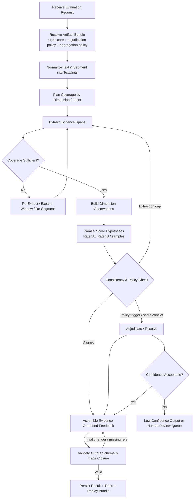

# Executive Summary

在新的文件结构下，这个系统更清晰地暴露出三个彼此独立但必须协同的层次：**Rubric Core**、**Adjudication/Aggregation Policy**、**Evidence-Grounded Explanation**。`Zen.md` 定义系统宪法，`Rubric_Guidelines.md` 定义维度与分档本体，`Adjudication_Rules.md` 定义双评审/三评审与 composite 规则，`Example.md` 只说明“解释性输出应长什么样”，而不是规则来源。[Zen][Rubric][Adj][Example]

这次改动本身就说明了一件对架构非常关键的事：**Prompt 内容不是当前业务本体的一部分，Adjudication 也不应与 Rubric Core 混存。** 因此后续 MAS 设计不应围绕“单份大配置”展开，而应围绕一组可组合、可冻结、可分别版本化的配置工件展开。[Inference]

从工程角度看，系统依然不能退化成“单轮 LLM 评分器”。因为无论 rubric core 与 adjudication policy 如何拆分，真正决定系统是否可审计、可回退、可做 QWK 的，仍然是中间态：`EvidenceSpan`、`DimensionObservation`、`ScoreHypothesis`、`ConflictRecord`、`AdjudicationRecord`。没有这些对象，系统无法解释“为何这个分数成立”“为何两个 Agent 分歧”“为何这次版本与上次不同”。[Zen][Adj][Example][Inference]

改动后的最重要结论有三点：

1. `Rubric_Guidelines.md` 现在应被视为纯粹的 rubric core，不应再承载 prompt、resolution、composite 等异质规则。[Rubric][Inference]
2. `Adjudication_Rules.md` 已经把“如何从多个评分结果得到正式输出”单独抽出来，这要求架构把 `adjudication_policy` 与 `aggregation_policy` 作为一等公民，而不是 rubric 的附属字段。[Adj][Inference]
3. `Example.md` 依然出现 `4-`、`3-` 这种展示性记号，说明系统必须显式区分 **canonical ordinal score** 与 **display annotation**，否则评测层会被展示层污染。[Rubric][Example][Inference]

因此，更新后的推荐蓝图仍是图式流程，但 source-of-truth 映射更干净：`输入归一化 -> Rubric Core 解析 -> 证据抽取 -> 维度观察 -> 多路候选评分 -> Adjudication Policy 裁决 -> Explanation 组装 -> 结果校验 -> 评测输出`。[Zen][Rubric][Adj][Inference]

# Source-of-Truth Understanding & Invariants

## Source-of-Truth Understanding

- `Zen.md`：项目宪法，定义业务目标、零硬编码、LLM-Agnostic、状态机、Fallback、QWK 与一致性要求。[Zen]
- `Rubric_Guidelines.md`：Rubric Core，本体只负责维度、分档、描述符与维度级判断边界。[Rubric]
- `Adjudication_Rules.md`：评分政策层，负责双评审/三评审触发规则与 composite 公式。[Adj]
- `Example.md`：示例输出层，帮助理解“证据化解释 + trait 分数评论”的表现形式，但不能反向推导业务规则。[Example]

## System Invariants

1. 系统的核心目标是 **对非结构化文本做基于量规的自动化评价与反馈**，而不是做主题识别、摘要或情感判断。[Zen]
2. 最终输出至少要支持 **维度级 canonical score + 证据化反馈**；若启用政策层，则还应支持 adjudication 痕迹与 composite 输出。[Zen][Adj][Inference]
3. Rubric Core、Adjudication Policy、Aggregation Policy、Explanation Policy 都必须外置配置化，不能嵌入代码逻辑。[Zen][Rubric][Adj][Inference]
4. 上层节点必须对模型供应商无感，模型替换不应要求修改 rubric schema、状态机结构或中间态契约。[Zen]
5. 编排必须是 **有向图/状态机**，且每个节点都可记录输入、输出、异常与回退指针。[Zen]
6. 长文本场景下必须允许证据缺失后重抽取、局部重算与回滚，不能把失败处理寄托在“让模型再试一次”。[Zen][Inference]
7. 任何最终分数都必须能够追溯到对应 evidence、descriptor 对齐和 adjudication 链路，否则不满足可审计性。[Zen][Example][Adj][Inference]
8. 当前正式评分尺度仍是六个 trait 的 1-6 有序分数；`High/Medium/Low`、`4-`、`3-` 只能视为展示层附加标记。[Rubric][Example][Inference]
9. composite score 不是 rubric core 的天然组成部分，而是一个下游 aggregation 结果；它当前只依赖四个 trait，且 `Conventions` 权重更高。[Adj]
10. `Example.md` 只能说明“解释如何引用 rubric 语言与文本证据”，不能定义维度、分值范围、聚合规则或裁决阈值。[Example][Inference]
11. 多智能体一致性与人机一致性是系统内建目标，因此运行时必须保存能支持 QWK 和冲突归因的数据。[Zen][Inference]
12. 任何架构若不能回答“为什么这次输出和上次不同”，就不符合本项目的治理目标。[Zen][Inference]

## Explicit / Inference / Open Questions

| Explicit | Inference | Open Questions |
| --- | --- | --- |
| 系统必须做基于量规的自动化评价与反馈。[Zen] | 输出对象不能只有分数，还必须包含证据与解释链路。[Inference] | 面向终端用户的最终自然语言总评是否是必须产物，还是可选导出？ |
| 系统必须零硬编码、配置驱动。[Zen] | 配置至少要拆成 rubric core、adjudication policy、aggregation policy、explanation policy 四类工件。[Inference] | 这些工件是独立版本发布，还是用 bundle 统一发布？ |
| 系统必须 LLM-Agnostic。[Zen] | 上层节点应依赖能力接口而非供应商接口习惯。[Inference] | 不同模型 capability 差异用静态 profile 还是运行时探测表达？ |
| 必须用有向图/状态机并支持 fallback/revert。[Zen] | 每个节点都需要 checkpoint 与 node I/O snapshot。[Inference] | 各类异常的最大 retry 次数与人工复核阈值尚未定义。 |
| Rubric 采用六个 traits、1-6 档评分。[Rubric] | 节点应按 `dimensions[]` 遍历，不能把当前六维写死在流程里。[Inference] | 未来是否会出现 4 档、8 档或不同维度不同 scale 的 rubric？ |
| `Adjudication_Rules.md` 定义双评审、第三评审触发和 composite 公式。[Adj] | MAS 更应建模为多路评分器 + adjudicator，而不是单点评分器。[Inference] | 线上是否必须严格执行双评审/三评审，还是只要保留能力即可？ |
| `Adjudication_Rules.md` 的 composite 只使用 I/O/S/C 四维。[Adj] | “维度级评分输出”和“最终 composite 输出”必须是两个不同对象层级。[Inference] | 下游是否永远需要 composite，还是 trait-level 即可满足部分场景？ |
| `Example.md` 展示 trait commentary 会引用 rubric 短语和文本证据。[Example] | explanation assembler 应从 descriptor refs + evidence ids 组合输出，而不是自由生成。[Inference] | 评论模板是否需要进一步标准化，以便自动评测？ |
| `Example.md` 出现 `4-`、`3-`。[Example] | 系统需要 canonical score 与 display annotation 的双层表示。[Inference] | 这些附加标记未来是否需要进入 benchmark 导出？ |

## Generalizable vs Absolutely Must Not Be Hardcoded

| 可泛化部分 | 绝不可硬编码部分 |
| --- | --- |
| 维度数量、名称、代码、顺序 | 当前六个 trait 名称和简称 `I/O/V/W/S/C` |
| 各维度的分档数量、标签、描述符 | 当前固定 1-6 档与英文描述文本 |
| 维度级 evidence 要求与 observation facets | 从 Example 倒推的“某维度必须引用几句样例文本” |
| Adjudication triggers、resolution 规则 | 当前非邻接规则与 cusp 规则具体阈值 |
| Aggregation 公式、维度权重、输出类型 | 当前只使用 I/O/S/C 且 `C` 双倍权重 |
| Explanation 渲染模板、引用风格、输出段落结构 | Example 中具体短语、句式、标题与例文内容 |
| 展示层附加标签体系 | `High/Medium/Low`、`4-`、`3-` 等当前展示记号 |

## Source Tensions That Must Be Preserved

- `Rubric_Guidelines.md` 只定义六维度与分档描述，而 `Adjudication_Rules.md` 额外定义 resolution 与 composite，说明 rubric core 与 scoring policy 必须分层建模。[Rubric][Adj][Inference]
- `Example.md` 仍然使用 `4-`、`3-` 等展示型标记，而正式 rubric 是整数有序尺度，说明展示层和评测层必须分开。[Rubric][Example][Inference]
- 所有六个 trait 都会被评分，但当前 composite 只使用四个 trait，说明“最终报告对象”不能简单等同于“维度评分对象”。[Rubric][Adj][Inference]

# Dynamic Configuration Meta-Schema

## Meta-Schema Draft

```yaml
schema_version: "2.0"

artifact_bundle:
  bundle_id: "rubric_eval_bundle_v2"
  bundle_version: "2026-03-10"
  rubric_core_ref: "rubric://writing_traits_core/v1"
  adjudication_policy_ref: "policy://double_score_resolution/v1"
  aggregation_policy_ref: "policy://composite_score/v1"
  explanation_policy_ref: "explain://evidence_grounded/default/v1"
  operational_prompt_recipe_ref: "ops://agent_instructions/default/v1"

rubric_core:
  rubric_id: "writing_traits_core"
  rubric_version: "v1"
  scales:
    - scale_id: "ordinal_6"
      type: "ordinal"
      min: 1
      max: 6
      canonical_score_type: "integer"
      display_overlays_allowed: true
  dimensions:
    - dimension_id: "ideas_content"
      code: "I"
      name: "Ideas and Content"
      scale_ref: "ordinal_6"
      description: "Clarity, focus, idea development, relevance, depth."
      observation_schema:
        required_facets:
          - "clarity_focus"
          - "main_idea_salience"
          - "support_relevance"
          - "development_depth"
          - "audience_purpose_fit"
      evidence_requirements:
        minimum_evidence_units: 2
        allowed_evidence_scope: ["span", "global"]
        require_textual_grounding: true
      levels:
        - rank: 1
          summary: "Lacks central idea or purpose."
          descriptors:
            - "ideas are extremely limited or unclear"
            - "development is minimal or nonexistent"
        - rank: 2
          summary: "Main ideas somewhat unclear; minimal development."
          descriptors: ["..."]
        - rank: 3
          summary: "Understandable but simplistic; support often limited."
          descriptors: ["..."]
        - rank: 4
          summary: "Clear main ideas with relevant but limited support."
          descriptors: ["..."]
        - rank: 5
          summary: "Clear, focused, interesting with strong support."
          descriptors: ["..."]
        - rank: 6
          summary: "Exceptionally clear, rich, focused, well-supported."
          descriptors: ["..."]
      validation_rules:
        - rule_id: "level_order_monotonic"
          type: "descriptor_order"
        - rule_id: "facet_coverage_required"
          type: "requires_observation_facets"

    - dimension_id: "organization"
      code: "O"
      name: "Organization"
      scale_ref: "ordinal_6"
      observation_schema:
        required_facets:
          - "sequencing"
          - "beginning_closure"
          - "transitions"
          - "detail_placement"
      evidence_requirements:
        minimum_evidence_units: 2
        allowed_evidence_scope: ["span", "global"]
      levels: ["..."]

    - dimension_id: "voice"
      code: "V"
      name: "Voice"
      scale_ref: "ordinal_6"
      observation_schema:
        required_facets:
          - "audience_awareness"
          - "commitment"
          - "expressiveness"
      evidence_requirements:
        minimum_evidence_units: 1
        allowed_evidence_scope: ["span", "global"]
      levels: ["..."]

    - dimension_id: "word_choice"
      code: "W"
      name: "Word Choice"
      scale_ref: "ordinal_6"
      observation_schema:
        required_facets:
          - "precision"
          - "variety"
          - "imagery"
          - "appropriateness"
      evidence_requirements:
        minimum_evidence_units: 2
        allowed_evidence_scope: ["span"]
      levels: ["..."]

    - dimension_id: "sentence_fluency"
      code: "S"
      name: "Sentence Fluency"
      scale_ref: "ordinal_6"
      observation_schema:
        required_facets:
          - "flow_rhythm"
          - "sentence_variety"
          - "structural_control"
      evidence_requirements:
        minimum_evidence_units: 2
        allowed_evidence_scope: ["span", "global"]
      levels: ["..."]

    - dimension_id: "conventions"
      code: "C"
      name: "Conventions"
      scale_ref: "ordinal_6"
      observation_schema:
        required_facets:
          - "punctuation"
          - "spelling"
          - "capitalization"
          - "grammar_usage"
          - "readability_impact"
      evidence_requirements:
        minimum_evidence_units: 3
        allowed_evidence_scope: ["span"]
      levels: ["..."]

adjudication_policy:
  policy_id: "double_score_resolution_v1"
  raters:
    required_independent_scores: 2
    optional_resolution_rater: 1
  triggers:
    - trigger_id: "non_adjacent_trait_scores"
      type: "score_distance"
      applies_to: ["*"]
      threshold:
        operator: ">"
        value: 1
      action: "invoke_resolution"
    - trigger_id: "cusp_rule"
      type: "pattern_match"
      applies_to: ["ideas_content", "organization", "sentence_fluency", "conventions"]
      pattern:
        one_rater_all: [4, 4, 4, 4]
        other_rater_any_permutation_of: [3, 4, 4, 4]
      exclusions: ["voice", "word_choice"]
      action: "invoke_resolution"
  output_policy:
    preserve_all_candidates: true
    preserve_trigger_reason: true
    preserve_resolution_path: true

aggregation_policy:
  policy_id: "composite_score_v1"
  outputs:
    - output_id: "trait_scores"
      type: "dimension_scores"
    - output_id: "composite_score"
      type: "weighted_sum"
      formula_variants:
        - variant_id: "without_resolution"
          when: "resolution_not_used"
          source_scores: ["rater_1", "rater_2"]
          weights:
            ideas_content: 2
            organization: 2
            sentence_fluency: 2
            conventions: 4
        - variant_id: "with_resolution"
          when: "resolution_used"
          source_scores: ["resolution_rater"]
          weights:
            ideas_content: 2
            organization: 2
            sentence_fluency: 2
            conventions: 4

explanation_policy:
  policy_id: "evidence_grounded_default_v1"
  require_descriptor_alignment: true
  require_evidence_links: true
  forbid_unreferenced_claims: true
  render_sections:
    - "dimension_score"
    - "rubric_alignment"
    - "evidence_summary"
    - "uncertainty_note_if_needed"

export_policy:
  canonical_score_field: "final_score"
  display_annotation_field: "display_annotation"
  include_trace_fields: true
  benchmark_join_keys_required: true
```

## Why Each Key Field Exists

| 字段 | 设计动机 | 解决的系统风险 / 演进需求 |
| --- | --- | --- |
| `artifact_bundle` | 固定一次运行实际解析到的 rubric/policy/explanation 组合 | 避免版本漂移导致结果不可重放 |
| `rubric_core` | 单独承载维度、分档、描述符和证据要求 | 防止 rubric 语义与评分政策混杂 |
| `scales` + `scale_ref` | 把评分尺度抽象为独立对象 | 支持 4 档/6 档/8 档切换而不改节点代码 |
| `dimensions[]` | 让节点按配置遍历维度 | 避免把当前六个 traits 硬编码成流程常量 |
| `observation_schema` | 声明评分前必须形成哪些结构化观察 | 避免模型跳过可审计判断直接给分 |
| `evidence_requirements` | 定义每维度最低证据要求与证据作用域 | 解决 holistic trait 与局部 trait 的差异 |
| `adjudication_policy` | 明确定义 resolution 触发条件与输出保留要求 | 让多评分者流程变成可审计政策，而非隐式流程 |
| `aggregation_policy` | 单独建模 composite 公式 | 避免把 trait 分数和下游 composite 混为一体 |
| `explanation_policy` | 约束 comment 必须绑定 descriptor 与 evidence | 防止评语和分数断链 |
| `export_policy` | 分离 canonical output 与展示层附加标记 | 解决 `4-` / `3-` 与正式整数评分的冲突 |

## Why This Supports Zero Hardcoding

- 评分节点只遍历 `rubric_core.dimensions[]`，而不关心当前是否恰好六维。[Inference]
- 分数合法性来自 `scale_ref`，而不来自代码里的 `1..6` 常量。[Inference]
- 裁决逻辑来自 `adjudication_policy.triggers`，而不来自写死的 if/else。[Adj][Inference]
- composite 公式来自 `aggregation_policy.formula_variants`，而不是嵌在 exporter 或 scorer 中。[Adj][Inference]
- 解释生成来自 `explanation_policy` + `descriptor_refs` + `evidence_ids`，而不是自由生成整段评论。[Example][Inference]

## Architecture Evolution Stress Test for the Schema

- **维度增删**：只需更新 `rubric_core.dimensions[]` 与相关 policy 引用；节点代码无需感知具体 trait 名称。[Inference]
- **分档数量变化**：只需更新 `scales` 与 `levels[]`，schema 仍成立。[Inference]
- **裁决政策变化**：只替换 `adjudication_policy` 或 `aggregation_policy`，不应修改 rubric core 版本。[Adj][Inference]
- **展示层变化**：`display_annotation_field` 可变化，但不应影响 canonical score 与 benchmark 导出。[Example][Inference]
- **未来不需要 composite**：可以只导出 `trait_scores`，不影响 rubric core 与 explanation 流程。[Adj][Inference]

# Intermediate Data Contracts

## Node Input / Output Data Contract Table

| Node | 主要输入 | 主要输出 | 进入条件 | 退出条件 |
| --- | --- | --- | --- | --- |
| `RequestIngestor` | `EvaluationRequest` | `NormalizedRequest` | 收到原始文本与导出要求 | 请求通过 schema 校验并生成 `evaluation_id` |
| `ConfigResolver` | `NormalizedRequest` | `ResolvedArtifactBundle`, `RubricSnapshot`, `PolicySnapshot` | 请求包含 bundle refs 或默认版本 | rubric core / adjudication / aggregation / explanation 全部冻结 |
| `TextPreprocessor` | `NormalizedRequest`, `RubricSnapshot` | `NormalizedDocument`, `TextUnit[]` | 文本可读取且编码正常 | 生成稳定切分与偏移映射 |
| `CoveragePlanner` | `TextUnit[]`, `RubricSnapshot` | `CoveragePlan[]` | 文本切分完成 | 每维度形成抽取覆盖计划 |
| `EvidenceExtractor` | `CoveragePlan[]`, `TextUnit[]`, `RubricSnapshot` | `EvidenceSpan[]`, `CoverageReport[]` | 已有覆盖计划 | 每维度获得足量证据或明确缺口 |
| `ObservationBuilder` | `EvidenceSpan[]`, `RubricSnapshot` | `DimensionObservation[]`, `UncertaintyRecord[]` | 证据抽取完成 | 每维度形成结构化 observation 或缺证说明 |
| `ParallelScorers` | `DimensionObservation[]`, `RubricSnapshot` | `ScoreHypothesis[]` | observation 可用 | 每维度获得多路候选分数 |
| `ConsistencyChecker` | `ScoreHypothesis[]`, `EvidenceSpan[]`, `PolicySnapshot` | `ConflictRecord[]`, `ConsistencyReport` | 多路候选评分完成 | 判定是否收敛、需重抽取、需裁决或需低置信升级 |
| `Adjudicator` | `ScoreHypothesis[]`, `ConflictRecord[]`, `PolicySnapshot` | `AdjudicationRecord[]`, `FinalDimensionDecision[]`, `CompositeDecisionOptional` | 命中 policy trigger 或需要最终确认 | 得到最终维度级决定与可选 composite |
| `ExplanationAssembler` | `FinalDimensionDecision[]`, `EvidenceSpan[]`, `RubricSnapshot`, `PolicySnapshot` | `DimensionFeedback[]`, `DraftEvaluationResult` | 最终分数已确定 | 每条反馈都绑定 evidence 与 descriptor |
| `ResultValidator` | `DraftEvaluationResult`, `ResolvedArtifactBundle` | `ValidatedEvaluationResult`, `ExportPayload` | 草稿结果生成完毕 | 输出 schema、trace closure 与 benchmark keys 全部合法 |

## Structured Object Inventory

| 对象 | Producer | Consumer | 必填字段 | 校验条件 | Replay Value |
| --- | --- | --- | --- | --- | --- |
| `EvaluationRequest` | 调用方 | `RequestIngestor` | `request_id`, `input_text`, `requested_outputs` | 文本非空；请求结构完整 | 定义原始输入基线 |
| `NormalizedRequest` | `RequestIngestor` | `ConfigResolver`, `TextPreprocessor` | `evaluation_id`, `input_text_normalized`, `input_hash`, `locale` | 规范化可追溯 | 判断差异是否来自预处理 |
| `ResolvedArtifactBundle` | `ConfigResolver` | 全部后续节点 | `bundle_id`, `rubric_version`, `policy_versions`, `explanation_policy_version`, `ops_recipe_version` | 所有 refs 可解；版本冻结 | 没有它就无法解释版本差异 |
| `RubricSnapshot` | `ConfigResolver` | 评分相关节点 | `dimensions[]`, `scales[]`, `validation_rules` | 维度、尺度与描述符引用闭合 | 重放 rubric core |
| `PolicySnapshot` | `ConfigResolver` | `ConsistencyChecker`, `Adjudicator`, `ResultValidator` | `adjudication_policy`, `aggregation_policy`, `explanation_policy` | trigger、公式、导出规则可编译 | 重放评分政策与输出政策 |
| `NormalizedDocument` | `TextPreprocessor` | `CoveragePlanner`, `EvidenceExtractor` | `document_id`, `paragraphs`, `char_offsets`, `language` | 偏移可回指原文 | 支持证据精确定位 |
| `TextUnit` | `TextPreprocessor` | `CoveragePlanner`, `EvidenceExtractor` | `text_unit_id`, `text`, `start_offset`, `end_offset`, `sequence_index` | 偏移合法；顺序稳定 | 支持局部重抽取 |
| `CoveragePlan` | `CoveragePlanner` | `EvidenceExtractor` | `dimension_id`, `target_facets`, `text_unit_scope`, `windowing_strategy` | 每维度至少一个计划；范围合法 | 说明“为何抽这些段落” |
| `EvidenceSpan` | `EvidenceExtractor` | `ObservationBuilder`, `ConsistencyChecker`, `ExplanationAssembler` | `evidence_id`, `dimension_id`, `text_unit_id`, `quote`, `start_offset`, `end_offset`, `evidence_scope`, `support_type` | quote 与原文一致；偏移可映射 | 无它就无法审计证据 |
| `CoverageReport` | `EvidenceExtractor` | `ConsistencyChecker`, `FallbackRouter` | `dimension_id`, `coverage_status`, `missing_facets`, `insufficient_reason` | 状态枚举合法 | 区分“抽取失败”与“评分分歧” |
| `DimensionObservation` | `ObservationBuilder` | `ParallelScorers`, `ConsistencyChecker` | `observation_id`, `dimension_id`, `facet_findings[]`, `supporting_evidence_ids[]`, `counter_evidence_ids[]`, `observation_confidence` | evidence refs 存在；facet 完整度可算 | 局部重算的核心对象 |
| `UncertaintyRecord` | `ObservationBuilder`, `ParallelScorers`, `Adjudicator` | `ConsistencyChecker`, `ExplanationAssembler`, `Exporter` | `dimension_id`, `stage`, `uncertainty_type`, `severity`, `message` | 枚举合法 | 解释低置信根因 |
| `ScoreHypothesis` | `ParallelScorers` | `ConsistencyChecker`, `Adjudicator` | `hypothesis_id`, `dimension_id`, `rater_id`, `proposed_score`, `descriptor_refs[]`, `evidence_ids[]`, `confidence` | 分数在 scale 范围内；refs 存在 | 用于多 Agent 一致性与分歧定位 |
| `ConflictRecord` | `ConsistencyChecker` | `Adjudicator`, `FallbackRouter` | `conflict_id`, `dimension_id`, `conflict_type`, `trigger_rule`, `involved_hypothesis_ids[]`, `recommended_action` | 至少包含两个候选或一个 coverage 缺口 | 定义为何需要回退或裁决 |
| `ConsistencyReport` | `ConsistencyChecker` | `Adjudicator`, `Exporter` | `dimension_summaries[]`, `global_status`, `requires_resolution`, `requires_reextract` | 与 `ConflictRecord` 一致 | 统计系统稳定性 |
| `AdjudicationRecord` | `Adjudicator` | `ExplanationAssembler`, `Exporter`, `ReplayHarness` | `adjudication_id`, `dimension_id`, `used_policy_rule`, `selected_hypothesis_ids[]`, `discarded_hypothesis_ids[]`, `final_score`, `resolution_path` | 引用对象存在；分数合法 | 没有它就不能解释为何选这个分数 |
| `FinalDimensionDecision` | `Adjudicator` | `ExplanationAssembler`, `AggregationEngine`, `Exporter` | `dimension_id`, `canonical_score`, `display_annotation_optional`, `confidence`, `descriptor_refs[]`, `evidence_ids[]` | 每维度唯一；score 与 scale 一致 | 是最终输出与中间态的桥梁 |
| `CompositeDecisionOptional` | `Adjudicator` / `AggregationEngine` | `Exporter`, `BenchmarkRunner` | `composite_score`, `formula_variant_id`, `source_dimension_ids[]`, `source_score_refs[]` | 公式来源可回溯 | 解释 composite 是如何得出的 |
| `DimensionFeedback` | `ExplanationAssembler` | `Exporter`, `UI` | `dimension_id`, `score`, `commentary`, `descriptor_refs[]`, `evidence_ids[]`, `uncertainty_note_optional` | commentary 中所有事实判断可回指 refs | 无它就不能做解释审计 |
| `ValidatedEvaluationResult` | `ResultValidator` | `Exporter`, `BenchmarkRunner` | `evaluation_id`, `dimension_results[]`, `composite_result_optional`, `artifact_versions`, `trace_refs` | 输出 schema 闭合 | 线上结果与 benchmark 共用接口 |

## Why These Intermediate States Are Non-Negotiable

- 没有 `EvidenceSpan`，系统无法知道分歧来自“看到了不同文本”还是“看同样文本得出不同结论”。[Inference]
- 没有 `DimensionObservation`，评分将直接跳过可审计判断层，回退时也无法只重算局部节点。[Inference]
- 没有 `ScoreHypothesis` 与 `ConflictRecord`，多 Agent 一致性只能看最终结果，无法定位分歧节点。[Zen][Inference]
- 没有 `AdjudicationRecord`，`Adjudication_Rules.md` 中的 resolution 规则就无法被真正执行、复现与审计。[Adj][Inference]
- 没有 `CompositeDecisionOptional`，系统无法解释“为什么最终 composite 只依赖四个 trait，且 C 权重不同”。[Adj][Inference]
- 没有 `ResolvedArtifactBundle`，QWK 与版本对照会混入规则漂移，结果不可解释。[Zen][Inference]

# MAS Workflow / State Machine

## Workflow Graph



## Core Nodes with Entry / Exit Logic

| 节点 | 进入条件 | 退出条件 | 最易出现的问题 |
| --- | --- | --- | --- |
| `Resolve Artifact Bundle` | 请求中有 bundle refs 或默认策略 | rubric core、adjudication policy、aggregation policy 全部冻结 | 版本漂移、policy 引用断裂、bundle 不闭合 |
| `Normalize & Segment` | 原始文本可用 | 形成稳定 `TextUnit[]` | 长文本切分失真、对话/段落结构丢失 |
| `Plan Coverage` | 已有 `TextUnit[]` 与维度定义 | 每维度有抽取覆盖计划 | holistic 维度被误当成局部维度处理 |
| `Extract Evidence` | 已有 coverage plan | 每维度有证据或缺口说明 | 抽取遗漏、引用偏移错误、证据不足 |
| `Build Observations` | 证据已抽取 | 形成 facet-level observation | 证据与 facet 对齐偏差、反证缺失 |
| `Parallel Score Hypotheses` | observation 可用 | 多路候选分数生成 | rubric 对齐偏差、印象流评分 |
| `Consistency & Policy Check` | 多路候选结果可比较 | 判定收敛、冲突、是否触发 adjudication | 多 Agent 分歧、政策命中未识别 |
| `Adjudicate` | 冲突或 policy trigger 存在 | 输出最终维度决定与可选 composite | resolution 路径未保留、公式误用 |
| `Assemble Feedback` | 最终维度决定可用 | 每条反馈绑定 evidence + descriptor | 评语与分数不一致、解释脱离证据 |
| `Validate Output` | 草稿结果生成完毕 | 输出 schema 闭环且 benchmark 字段齐全 | canonical/display 混淆、引用缺失 |

## Where the Major Failure Modes Concentrate

- **信息抽取遗漏**：最高风险在 `Normalize & Segment` 与 `Extract Evidence`，尤其是长文本、跨段转折与叙事结构场景。[Zen][Inference]
- **Rubric 对齐偏差**：最高风险在 `Build Observations` 到 `Parallel Score Hypotheses` 之间，因为模型最容易跳过 facet-level 判断直接给分。[Rubric][Inference]
- **多 Agent 结论不一致**：最高风险在 `Parallel Score Hypotheses` 与 `Consistency & Policy Check`，因此必须保留 agent-level hypothesis。[Zen][Inference]
- **评语与分数不一致**：最高风险在 `Assemble Feedback`，如果解释层不受 `descriptor_refs` 与 `evidence_ids` 约束，最容易漂移。[Example][Inference]
- **聚合层误解释**：最高风险在 `Adjudicate` 之后；因为 composite 不是所有 trait 的简单总和，而是一个政策定义的派生结果。[Adj][Inference]

# Fallback & Exception Matrix

| 异常类型 | 触发条件 | 回退节点 | 恢复策略 |
| --- | --- | --- | --- |
| 输入 schema 异常 | 文本为空、导出要求不完整、bundle ref 缺失 | `RequestIngestor` | 阻断执行，返回可诊断错误 |
| Bundle 解析失败 | rubric core / policy / explanation 任一 ref 不可解 | `ConfigResolver` | 阻断执行，修复配置后再运行 |
| Rubric 编译失败 | 维度缺档、scale 无效、descriptor 引用断裂 | `ConfigResolver` | 阻断执行，不进入评分流程 |
| Policy 编译失败 | adjudication trigger 非法、aggregation 公式不闭合 | `ConfigResolver` | 阻断执行，修复政策定义 |
| 文本切分失真 | 偏移不连续、超长 unit、段落结构异常 | `TextPreprocessor` | 重新切分；必要时切换 paragraph/sentence 双层切分 |
| 证据覆盖不足 | 某维度未达到最低 evidence units 或缺关键 facet | `EvidenceExtractor` | `Re-Extract`：扩大窗口、增补 facet-aware pass |
| 证据与原文不一致 | evidence quote 无法映射原文偏移 | `EvidenceExtractor` | 丢弃坏证据并重抽取；多次失败后升级低置信 |
| Observation 不完整 | 必填 facet 缺失或 evidence 断链 | `ObservationBuilder` | `Re-Extract` 或 `Re-Observe`；禁止直接评分 |
| Rubric 对齐偏差 | justification 未引用 descriptor 或与 observation 冲突 | `ParallelScorers` | `Re-Score`：强制 score-to-descriptor alignment |
| 非邻接冲突 | 任一维度 `|score_a - score_b| > 1` | `Adjudicator` | 触发 resolution，保留全部 hypotheses 与触发原因。[Adj] |
| Cusp 规则命中 | 指定四维出现 `4-4-4-4` 对 `3-4-4-4` 模式 | `Adjudicator` | 按 policy 强制 resolution，记录规则命中痕迹。[Adj] |
| composite 计算异常 | 公式引用了缺失维度或错误 source score | `Adjudicator` / `AggregationEngine` | 回退到 policy 校验或输出 trait-only 结果 |
| 评语与分数不一致 | comment 提到的 descriptor 与 final score 不匹配 | `ExplanationAssembler` | `Reconcile`：重新绑定 descriptor/evidence，必要时回退到 adjudication |
| 输出格式错误 | canonical score 超范围、display 标记覆盖 canonical、trace 缺失 | `ResultValidator` | `Re-render`；禁止发布不闭环结果 |
| 模型调用失败 / 超时 | 单节点调用失败但上下文仍可继续 | 当前节点 | 节点级 retry；超过阈值则切模型或输出低置信结果 |
| 低置信未收敛 | 多轮回退后仍高冲突、高不确定 | `Adjudicator` 之后 | 入人工复核队列并保留完整裁决链 |

## Fallback Policy Notes

- **Retry**：处理超时、结构化格式轻微损坏等瞬时故障。[Inference]
- **Re-Extract**：处理 evidence recall 不足、偏移错误、长文本截断。[Zen][Inference]
- **Re-Score**：处理 rubric 对齐偏差，前提是 observation 足够。[Rubric][Inference]
- **Reconcile**：处理 final score 已确定，但 explanation 漂移的问题。[Example][Inference]
- **Fallback to Prior State**：应回退到最近 checkpoint，而不是整图重跑；否则无法控制成本，也无法定位根因。[Zen][Inference]
- **Escalate to Review**：是治理机制，不是失败标签；它用来诚实暴露“当前证据或模型稳定性不足”。[Inference]

# Consistency Metrics & Evaluation Harness

## Online Consistency Checks

### A. 多智能体间一致性

在线阶段至少要做五类检查：

1. **候选分数收敛检查**：同一维度多路 `ScoreHypothesis` 的最大距离、是否非邻接、是否命中 cusp 或其他 policy trigger。[Adj][Inference]
2. **证据重叠/冲突检查**：不同 Agent 是否依赖相同证据、互斥证据或几乎无重叠证据。[Inference]
3. **descriptor 对齐检查**：候选评分是否引用了正确 `descriptor_refs`，并与 observation 一致。[Rubric][Inference]
4. **评语支持检查**：最终 feedback 中的关键判断是否都有 `evidence_ids` 和 `descriptor_refs` 支撑。[Example][Inference]
5. **不确定性阈值检查**：若 observation coverage 不足或 uncertainty severity 高，即使分数接近也不能视为稳定收敛。[Inference]

### B. 与人类专家一致性

在线运行本身不计算 QWK，但必须输出能与人工标注对齐的 canonical 字段：

- `evaluation_id`
- `item_id / benchmark_key`
- `dimension_id`
- `final_canonical_score`
- `score_scale_id`
- `resolution_used`
- `rubric_version`
- `policy_version`

否则离线评测只能做模糊比对，无法形成可信 benchmark。[Zen][Inference]

## Offline Evaluation Harness Draft

离线评测框架建议拆成四层：

1. **Benchmark Registry**
   - 存 `benchmark_set_id`、样本版本、人工标注版本、slice tags。
2. **Replay Runner**
   - 固定输入与 artifact bundle 批量重跑，输出 canonical 结果与 node traces。
3. **Metrics Engine**
   - 计算 per-trait QWK、composite QWK、inter-agent agreement rate、non-adjacent rate、resolution rate、coverage rate。
4. **Slice Analyzer**
   - 按文本长度、对话密度、错误密度、人工分歧度等 slice 归因偏差。[Inference]

## Minimum Structured Fields Required for QWK

| 字段 | 为什么必须保留 |
| --- | --- |
| `benchmark_set_id` | 对应固定基准集 |
| `item_id` | 逐样本对齐人工标注 |
| `dimension_id` | QWK 通常按维度计算 |
| `final_canonical_score` | 必须是规范整数评分，而非展示标签 |
| `human_reference_score` 或 join key | 没有人工参考值无法计算 QWK |
| `score_scale_id` 或 `scale_min/max` | QWK 需要知道有序尺度范围 |
| `rubric_version` | 防止不同 rubric core 版本结果混算 |
| `policy_version` | 防止不同 adjudication / aggregation 结果混算 |
| `run_version_bundle` | 标识本次结果来自哪个完整版本组合 |

## Data the System Must Retain to Enable These Evaluations

1. 每维度 `ScoreHypothesis[]`，否则无法测 inter-agent convergence。
2. `EvidenceSpan[]` 与 `CoverageReport[]`，否则无法分析分歧根因。
3. `AdjudicationRecord[]`，否则不知道结果是天然收敛还是被裁决选出的。
4. `CompositeDecisionOptional`，否则无法解释 composite 与 trait-level 差异。
5. `UncertaintyRecord[]`，否则低置信输出与稳定输出无法区分。
6. `artifact bundle versions`，否则不同运行结果无法做公平对比。
7. `benchmark join keys`、人工标注版本与 `slice tags`，否则无法做 QWK 与切片分析。

## How to Distinguish Model Inconsistency from Rubric Ambiguity

- **模型不一致**：同一 rubric/policy 下，多模型或多次采样高分歧，而人工标注高度一致。[Inference]
- **量规歧义**：系统分歧高，人类专家之间也分歧高，且通常集中在相邻档位边界。[Inference]
- **抽取问题伪装成评分问题**：候选分数差异大，但 `EvidenceSpan` 几乎不重叠，此时根因在 extraction。[Inference]
- **政策层问题**：trait-level 结果稳定，但 resolution/composite 经常变化，此时根因在 adjudication/aggregation policy，而非 rubric core。[Adj][Inference]
- **解释层问题**：分数稳定但 commentary 漂移，根因在 explanation assembler。[Example][Inference]

# LLM-Agnostic Adapter & Observability / Governance

## LLM Capability Adapter Responsibilities

### Adapter Should Own

- 能力路由：为“结构化抽取”“候选评分”“冲突比较”“解释渲染”选择合适模型能力，而不是暴露厂商原始接口。[Zen][Inference]
- 请求标准化：把上层统一请求对象转换成各模型调用格式。
- 结构化输出归一化：把不同模型的返回统一成 schema-valid objects。
- 瞬时故障恢复：超时、格式轻微损坏、速率限制的节点级 retry。
- 模型元信息采集：记录模型家族、版本、参数、token、延迟和 capability profile。

### Adapter Must Not Own

- Rubric 语义解释权：descriptor 含义由 rubric core 定义，不由 adapter 决定。
- 裁决与聚合规则：resolution 与 composite 属于 policy 层，不属于模型接入层。
- 状态机路由权：是否回退、重抽取、重评分或升级人工复核由图控制。
- 最终解释模板：adapter 不应决定最终 comment 的业务风格。

## Minimal Observability / Audit Log Field Set

| 字段 | 用途 |
| --- | --- |
| `trace_id`, `evaluation_id`, `node_execution_id`, `parent_node_execution_id` | 还原完整执行链 |
| `node_type`, `node_version`, `graph_version` | 定位行为变化来自哪个节点/图版本 |
| `artifact_bundle_id`, `rubric_version`, `policy_versions`, `explanation_policy_version`, `ops_recipe_version` | 解释规则侧变化 |
| `model_provider`, `model_family`, `model_version`, `capability_profile_id` | 解释模型侧变化 |
| `request_hash`, `normalized_input_hash`, `input_snapshot_ref` | 判断输入是否一致 |
| `output_hash`, `output_snapshot_ref` | 做 node-level diff 与重放 |
| `selected_evidence_ids`, `selected_descriptor_refs`, `hypothesis_ids`, `adjudication_ids`, `composite_decision_id` | 把最终输出与中间态串起来 |
| `latency_ms`, `token_in`, `token_out`, `retry_count` | 做成本与稳定性分析 |
| `exception_code`, `fallback_from`, `fallback_to`, `recovery_action` | 还原异常与恢复链 |
| `confidence_summary`, `uncertainty_counts` | 解释低置信来源 |
| `benchmark_set_id`, `item_id`, `slice_tags`, `annotation_version` | 支持离线评测与切片分析 |

## Version Governance & Result Replay

建议把重放最小单元定义为 **Replay Bundle**：

- `input_snapshot`
- `artifact_bundle`
- `graph_version`
- `node_versions`
- `model_capability_profile`
- `runtime_params`
- `all_node_io_snapshots`

重放策略分两类：

1. **Strict Replay**
   - 固定同一输入、同一 artifact bundle、同一模型版本，用于排查工程回归。
2. **Comparative Replay**
   - 固定输入与多数工件，只替换一个变量，例如模型版本、adjudication policy 版本或 explanation policy 版本，用于 A/B 与归因分析。

差异定位顺序应是：

1. 输入是否变化
2. rubric core 是否变化
3. adjudication / aggregation policy 是否变化
4. 模型 / 采样参数是否变化
5. evidence extraction 是否变化
6. observation 是否变化
7. score hypotheses 是否变化
8. adjudication / composite 是否变化
9. explanation render 是否变化

如果系统不能按这个顺序做 node-level diff，就无法回答“为什么同一文本这次分数变了”。[Zen][Inference]

# Additional Findings

## 1. Rubric Core and Policy Layer Must Stay Split

这次文件拆分不是文档整理，而是架构层信号：`Rubric_Guidelines.md` 和 `Adjudication_Rules.md` 现在已经把“怎么判断维度”与“怎么从多个判断得到正式结果”分开了。[Rubric][Adj]

为什么重要：

- rubric core 的变更不应自动意味着 composite 公式变更。
- adjudication policy 的变更不应污染 descriptor 版本历史。
- 只有拆层，回放时我们才能说明差异来自“规则本体变了”还是“裁决政策变了”。

## 2. Composite Is a Derived Product, Not the Rubric Itself

当前所有六个 trait 都被评分，但 composite 只使用 I/O/S/C 四维，且 `Conventions` 权重更高。[Adj]

为什么重要：

- trait-level 输出与 composite 输出必须是两个对象层级。
- benchmark 评估也应支持 trait-level 与 composite-level 分开统计。
- 如果未来换一套 aggregation 公式，不应要求重建 rubric core。

## 3. Canonical Score Normalization Is Still Required

`Example.md` 依然出现 `4-`、`3-`，而正式 rubric 仍是整数 1-6。[Rubric][Example]

为什么重要：

- QWK 与所有离线评测都应只看 canonical ordinal score。
- 展示层附加标记只能放在 `display_annotation` 或 uncertainty overlay。
- 否则 UI 展示习惯会污染 benchmark 与统计口径。

# Risk Register & Open Questions

| 风险 / 未决点 | 影响 | 当前判断 |
| --- | --- | --- |
| `Voice`、`Organization` 这类 trait 依赖全篇感知，不一定能完全局部化成短 span | 若只支持局部证据，会系统性低估这些维度 | 需要 `span + global` 混合证据模型。[Inference] |
| `4-`、`3-` 是否只是示例展示，还是未来真实标注也会用到 | 若处理错误，会污染 canonical score 与 QWK | 目前应视为展示层；需后续确认标注规范。[Example][Open] |
| 当前是否必须严格线上执行双评审/三评审 | 直接影响运行成本和图结构复杂度 | 现有材料强烈暗示“至少要支持”，但默认启用策略仍未明确。[Adj][Open] |
| QWK 需要按 trait、按 composite、还是二者都算 | 影响输出字段与 benchmark 结构 | 建议二者都支持，但材料未明示。[Zen][Open] |
| 低置信阈值与人工复核 SLA 未定义 | 决定 fallback 终止条件 | 需要后续业务治理输入。[Open] |
| 长文本切分策略未定义 | 直接决定 evidence recall 与成本 | 应先固定 `TextUnit` 与 coverage policy 抽象。[Zen][Inference] |
| 不同模型的结构化输出能力差异大 | 若上层依赖某家模型强 schema 能力，LLM-Agnostic 会失真 | 适配层必须承担归一化与兜底解析。[Zen][Inference] |
| 供应商版本漂移会削弱严格重放 | 同一模型名不代表同一行为 | 必须记录模型版本与 capability profile，接受“近似重放”的现实边界。[Inference] |
| 当前材料未给出人工标注数据 schema | benchmark join 设计可能与真实数据不匹配 | 下一阶段要尽快锁定标注结果格式。[Open] |

# Architecture Implications for Next Phase

在新的文件拆分下，下一阶段更适合按下面顺序推进：

1. 先实现 **配置编译器**，把 `rubric core`、`adjudication policy`、`aggregation policy`、`explanation policy` 编译成冻结的 `artifact bundle`。
2. 再实现 **中间态数据契约**，优先稳定 `EvidenceSpan`、`DimensionObservation`、`ScoreHypothesis`、`ConflictRecord`、`AdjudicationRecord`、`CompositeDecisionOptional`。
3. 然后实现 **图式主流程**，优先打通 `Extract -> Observe -> Score -> Check -> Adjudicate -> Explain`。
4. 最后接入 **benchmark/QWK harness**，确保每次规则、模型或政策变更都能被离线验证。

如果这四步顺序颠倒，后续最容易出现的不是“模型效果差”，而是“结果变化无法归因”。这会同时损害可审计性、回归分析和团队对系统的信任。[Zen][Inference]

## Stress Test

1. **如果量规从 6 档变成 4 档或 8 档，当前 schema 是否仍成立？**  
   成立。前提是节点只依赖 `scale_ref` 与 `levels[]`，不写死 `1..6`。需要同步更新的是 rubric core 校验与 benchmark 口径，而不是流程代码。[Inference]

2. **如果两个 Agent 对同一维度分数分歧很大，系统能否定位分歧发生在哪个节点？**  
   能。只要保留 `EvidenceSpan`、`DimensionObservation`、`ScoreHypothesis` 与 `ConflictRecord`，就能区分分歧是发生在证据层、观察层、评分层还是裁决层。[Inference]

3. **如果同一文本在不同模型版本下得分不同，系统能否解释差异来自哪里？**  
   能做有边界的解释。通过固定输入与 artifact bundle，对比不同模型版本下的 node snapshots，可以看到差异先出现在 extraction、observation、scoring、adjudication 还是 explanation。[Zen][Inference]

4. **如果未来替换底层 LLM 供应商，哪些层需要改，哪些层不该改？**  
   应该改的是 adapter 内的 capability mapping、请求整形与输出归一化；不该改的是 rubric core、policy 配置、状态机图与中间态契约。[Zen][Inference]

5. **如果人类审核员质疑某一维度评分，系统能否追溯到证据与裁决链？**  
   可以，前提是系统保留 `selected_evidence_ids`、`descriptor_refs`、`ScoreHypothesis`、`ConflictRecord`、`AdjudicationRecord`；若只保留最终分数和评语，则仍然不满足审计要求。[Zen][Example][Adj][Inference]
